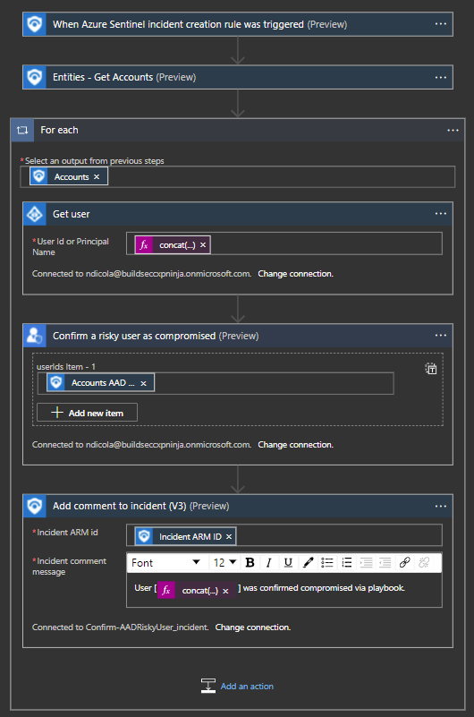
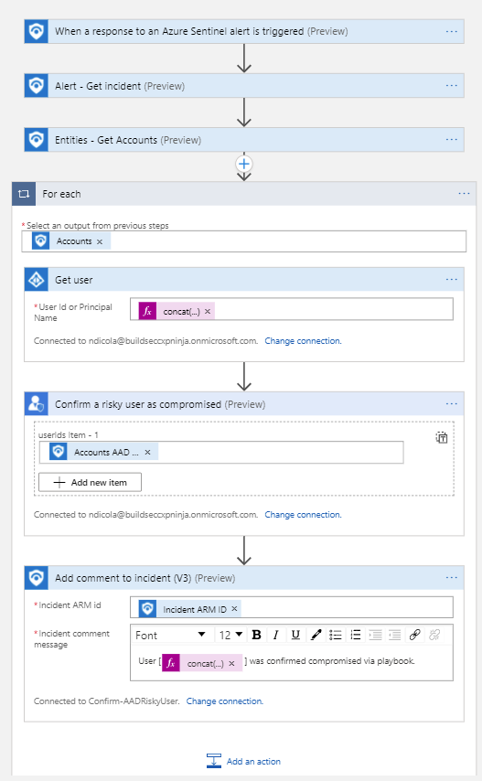

# Confirm-EntraIDRiskyUser

#### Author
Nicholas DiCola, Microsoft

## Summary
This playbook sets the Risky User property in Microsoft Entra ID using Graph API. For more details, visit the [Microsoft Graph API documentation](https://learn.microsoft.com/en-us/graph/api/resources-riskyuser?view=graph-rest-beta).

## Prerequisites
- Microsoft Entra ID Premium P2 license is required for Entra ID Protection.
- User must have permissions on Entra ID Identity Protection API to authorize Playbook connections. [Learn more](https://docs.microsoft.com/graph/api/riskyuser-confirmcompromised?view=graph-rest-1.0#permissions)

## Quick Deployment
### Deploy with Incident Trigger (Recommended)
Deploy this playbook and attach it to an automation rule to ensure it runs automatically whenever an incident is created.

[Learn more about automation rules](https://docs.microsoft.com/azure/sentinel/automate-incident-handling-with-automation-rules#creating-and-managing-automation-rules)

### Deploy with Alert Trigger
Deploy this playbook manually on alerts or attach it to an analytics rule to execute automatically when an alert is generated.

## Post Deployment Instructions
1. **Authorize Connections**
   - After deployment, authorize all connections:
     1. Navigate to the Microsoft Sentinel connection resource in the Azure portal.
     2. Click "Edit API connection".
     3. Click "Authorize" and sign in.
     4. Click "Save".
     5. Repeat these steps for all connections.

2. **Assign Microsoft Sentinel Responder Role to Playbook**
   - Assign the Microsoft Sentinel Responder role to the playbook's managed identity:
     1. Select the playbook resource in the Azure portal.
     2. In the left menu, click "Identity".
     3. Under "Permissions", click "Azure role assignments".
     4. Click "Add role assignment".
     5. Use the drop-down lists to select the resource group containing your Sentinel Workspace.
     6. In the "Role" drop-down list, select "Microsoft Sentinel Responder".
     7. Click "Save" to assign the role.

3. **Only for Alert Triggered Playbooks - Assign the Log Analytics Reader Role**
   - Assign the Log Analytics Reader role to the playbook's managed identity:
     1. Navigate to your Log Analytics Workspace in the Azure portal.
     2. In the left menu, select "Access control (IAM)".
     3. Click "Add > Add role assignment".
     4. In the "Role" drop-down, select "Log Analytics Reader".
     5. In the "Members" tab, select "Managed identity" and choose the playbook's managed identity.
     6. Click "Review + assign" to complete.

4. **Attach the Alert Triggered Playbook to an Automation Rule**
   - Create an automation rule in Microsoft Sentinel to run the playbook automatically:
     1. In Microsoft Sentinel, go to "Automation > Automation rules".
     2. Click "+ Add new" to create a new automation rule.
     3. Set the rule conditions (e.g., when an alert/incident is created, or based on alert/incident details).
     4. In the "Actions" section, select "Run playbook" and choose your Alert Triggered Playbook.
     5. Save the automation rule.

5. **Configure Analytics Rules to Run Playbook**
   - Map entities in analytics rules to ensure the playbook is triggered by alerts/incidents containing Account entities:
     1. In Microsoft Sentinel, go to "Analytics" and create a new scheduled query rule or edit an existing one.
     2. In the rule creation workflow, go to the "Set rule logic" tab.
     3. In the "Alert enhancement" section, expand "Entity mapping".
     4. Click "Add new entity":
        - For Account entities, select "Account" as the entity type, then map the Account identifier to the field in your query that contains the Account value.
     5. You can map up to 10 entities per rule and up to 3 identifiers per entity.
     6. Complete the rest of the rule configuration and save.

For more details, see the [official documentation on automation rules](https://docs.microsoft.com/azure/sentinel/automate-incident-handling-with-automation-rules#creating-and-managing-automation-rules).

## Screenshots
### Incident Trigger

### Alert Trigger

## Additional Links
- [Microsoft Graph API Documentation](https://learn.microsoft.com/en-us/graph/api/resources-riskyuser?view=graph-rest-beta)
- [Azure Sentinel Documentation](https://docs.microsoft.com/azure/sentinel/)