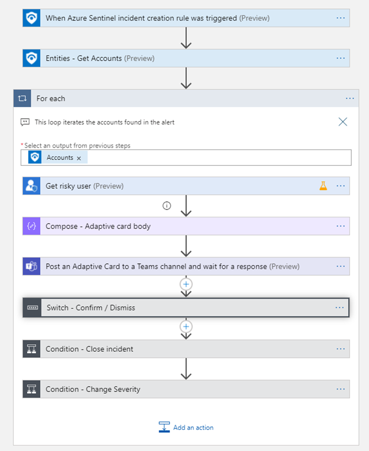

# Identity Protection - Response from Teams

#### Author
Lior Tamir, Rahul Kumar

## Summary
This playbook is designed to run on incidents containing suspicious Microsoft Entra ID identities. When a new incident is created, the playbook iterates over the accounts and posts an adaptive card in the SOC Microsoft Teams channel. The card includes potential risky user information provided by Microsoft Entra ID Protection and offers options to confirm the user as compromised or dismiss the compromised user in Microsoft Entra ID Protection. Additionally, it allows configuration of the Microsoft Sentinel incident. A summary comment is posted to document the action taken and user information.

For more details, visit the [Microsoft Entra ID Protection documentation](https://docs.microsoft.com/azure/active-directory/identity-protection/overview-identity-protection).

## Prerequisites
1. **Microsoft Entra ID Premium P2 License**: Required for Entra ID Protection.
2. **Permissions on Entra ID Identity Protection API**: Ensure the user has the necessary permissions to authorize Playbook connections. [Learn more](https://docs.microsoft.com/graph/api/riskyuser-confirmcompromised?view=graph-rest-1.0#permissions)
3. **Microsoft Teams Team Group Id and Channel ID**: [Steps to Obtain](#steps-to-obtain-microsoft-teams-group-id-and-channel-id)
4. **(Optional) Policies**: Create policies in Microsoft Entra ID Identity Protection to run when users are confirmed as compromised. [Learn more](https://docs.microsoft.com/azure/active-directory/identity-protection/concept-identity-protection-policies).

## Deployment
### Quick Deployment
[](https://portal.azure.com/#create/Microsoft.Template/uri/https%3A%2F%2Fraw.githubusercontent.com%2FAzure%2FAzure-Sentinel%2Fmaster%2FSolutions%2FMicrosoft%20Entra%20ID%20Protection%2FPlaybooks%2FIdentityProtection-TeamsBotResponse%2Fazuredeploy.json)
[](https://portal.azure.us/#create/Microsoft.Template/uri/https%3A%2F%2Fraw.githubusercontent.com%2FAzure%2FAzure-Sentinel%2Fmaster%2FSolutions%2FMicrosoft%20Entra%20ID%20Protection%2FPlaybooks%2FIdentityProtection-TeamsBotResponse%2Fazuredeploy.json)

## Post Deployment Instructions
1. **Authorize Connections**:
   - Navigate to the Microsoft Sentinel connection resource in the Azure portal.
   - Click "Edit API connection".
   - Click "Authorize" and sign in.
   - Click "Save".
   - Repeat these steps for all connections.

2. **Assign Microsoft Sentinel Responder Role**:
   - Assign the Microsoft Sentinel Responder role to the playbook's managed identity:
     - Select the playbook resource in the Azure portal.
     - In the left menu, click "Identity".
     - Under "Permissions", click "Azure role assignments".
     - Click "Add role assignment".
     - Use the drop-down lists to select the resource group containing your Sentinel Workspace.
     - In the "Role" drop-down list, select "Microsoft Sentinel Responder".
     - Click "Save" to assign the role.

3. **Attach Playbook to Automation Rule**:
   - Create an automation rule in Microsoft Sentinel to run the playbook automatically:
     - In Microsoft Sentinel, go to "Automation > Automation rules".
     - Click "+ Add new" to create a new automation rule.
     - Set the rule conditions (e.g., when an alert/incident is created, or based on alert/incident details).
     - In the "Actions" section, select "Run playbook" and choose your playbook.
     - Save the automation rule.

## Steps to Obtain Microsoft Teams Group ID and Channel ID

1. **Obtain the Group ID**:
   - Open Microsoft Teams and navigate to the desired team.
   - Click on the three dots (ellipsis) next to the team name and select "Manage team".
   - In the browser, open the Microsoft Graph Explorer tool: [Graph Explorer](https://developer.microsoft.com/en-us/graph/graph-explorer).
   - Run the following query to list all teams:
     ```
     GET https://graph.microsoft.com/v1.0/me/joinedTeams
     ```
   - Locate the desired team in the response and copy its `id` field. This is the Group ID.

2. **Obtain the Channel ID**:
   - Navigate to the desired channel within the team.
   - Click on the three dots (ellipsis) next to the channel name and select "Get link to channel".
   - Copy the URL provided. It will look like:
     ```
     https://teams.microsoft.com/l/channel/<ChannelID>/<ChannelName>?groupId=<GroupID>&tenantId=<TenantID>
     ```
   - Extract the `<ChannelID>` from the URL. This is the Channel ID.

Ensure you have the necessary permissions to access Microsoft Graph API and Teams resources.

## Screenshots
### Overall


### Card Sent by Microsoft Teams Bot


### Response Part


## Additional Links
- [Microsoft Entra ID Protection Documentation](https://docs.microsoft.com/azure/active-directory/identity-protection/overview-identity-protection)
- [Microsoft Graph API Documentation](https://docs.microsoft.com/graph/api/resources-riskyuser?view=graph-rest-beta)
- [Azure Sentinel Documentation](https://docs.microsoft.com/azure/sentinel/)
