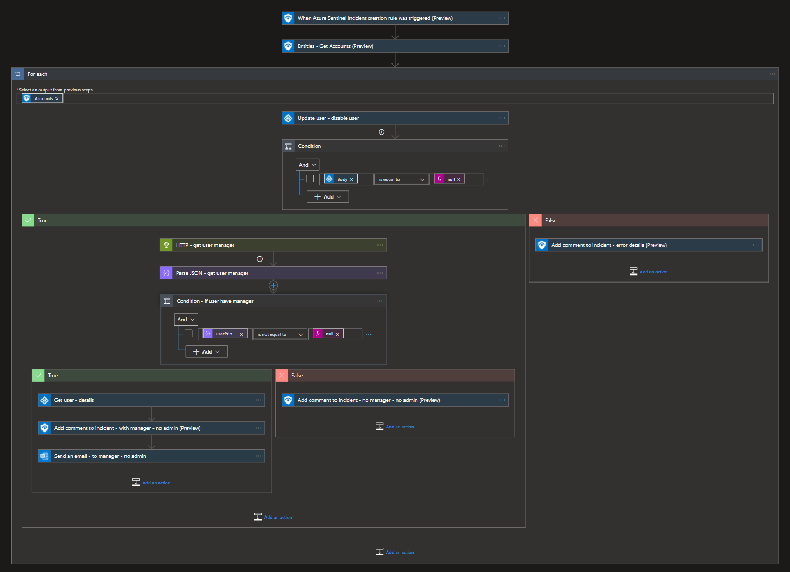
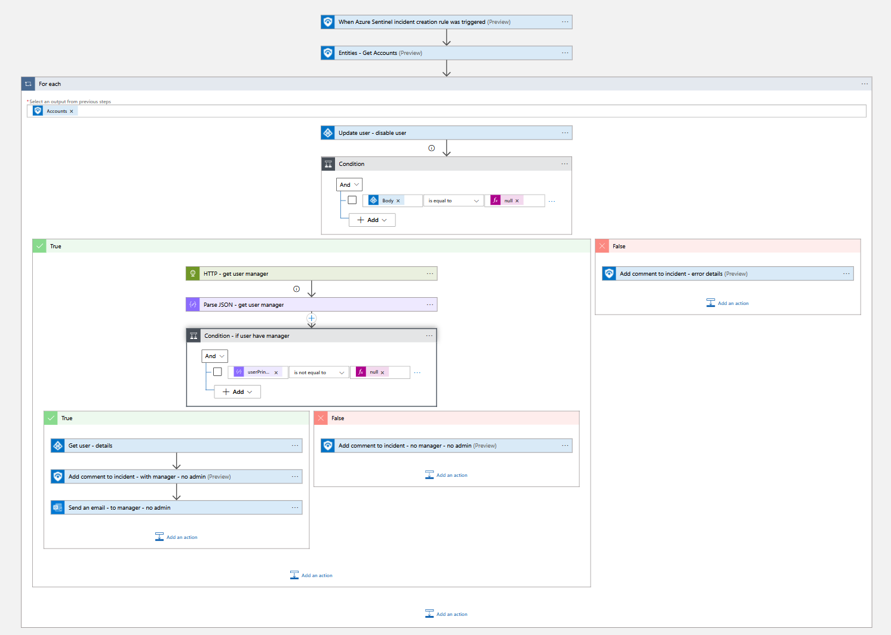
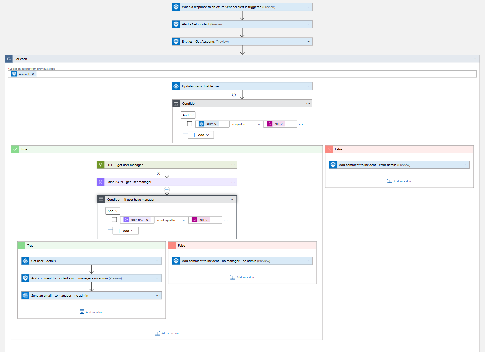
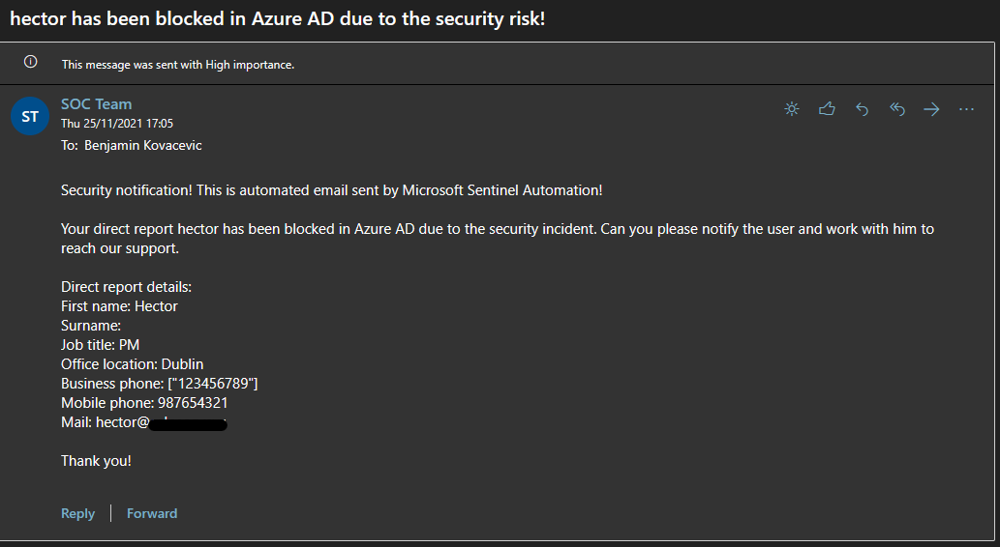
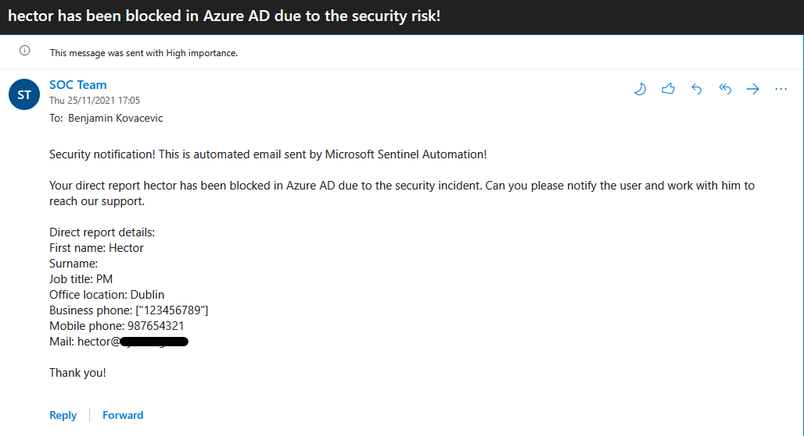

# Block-AADUser
author: Nicholas DiCola

This playbook will disable the user in Microsoft Entra ID and add a comment to the incident. There is an option for incident and alert trigger below.<br>
Note: This playbook will not be able to disable users if they are eligible or have active admin roles. To be able to disable admin users as well, please deploy playbook - Block-AADUserOrAdmin.<br>
If user have manager, manager will be notified that the user have been disabled in Microsoft Entra ID.

## Quick Deployment
**Deploy with incident trigger** (recommended)

After deployment, attach this playbook to an **automation rule** so it runs when the incident is created.

[Learn more about automation rules](https://docs.microsoft.com/azure/sentinel/automate-incident-handling-with-automation-rules#creating-and-managing-automation-rules)

[](https://portal.azure.com/#create/Microsoft.Template/uri/https%3A%2F%2Fraw.githubusercontent.com%2FAzure%2FAzure-Sentinel%2Fmaster%2FPlaybooks%2FBlock-AADUser%2Fincident-trigger%2Fazuredeploy.json)
[](https://portal.azure.us/#create/Microsoft.Template/uri/https%3A%2F%2Fraw.githubusercontent.com%2FAzure%2FAzure-Sentinel%2Fmaster%2FPlaybooks%2FBlock-AADUser%2Fincident-trigger%2Fazuredeploy.json)

**Deploy with alert trigger**

After deployment, you can run this playbook manually on an alert or attach it to an **analytics rule** so it will rune when an alert is created.

[](https://portal.azure.com/#create/Microsoft.Template/uri/https%3A%2F%2Fraw.githubusercontent.com%2FAzure%2FAzure-Sentinel%2Fmaster%2FPlaybooks%2FBlock-AADUser%2Falert-trigger%2Fazuredeploy.json)
[](https://portal.azure.us/#create/Microsoft.Template/uri/https%3A%2F%2Fraw.githubusercontent.com%2FAzure%2FAzure-Sentinel%2Fmaster%2FPlaybooks%2FBlock-AADUser%2Falert-trigger%2Fazuredeploy.json)<br><br>

## Prerequisites
None<br><br>

## Post-deployment
1. Assign Microsoft Sentinel Responder role to the Playbook's managed identity - https://docs.microsoft.com/azure/logic-apps/create-managed-service-identity?tabs=consumption#assign-managed-identity-role-based-access-in-the-azure-portal
2. Assign API permissions to the managed identity so that we can search for user's manager. You can find the managed identity object ID on the Identity blade under Settings for the Logic App. If you don't have Microsoft Entra ID PowerShell module, you will have to install it and connect to Microsoft Entra ID PowerShell module. https://docs.microsoft.com/powershell/azure/active-directory/install-adv2?view=azureadps-2.0
```powershell
$MIGuid = "<Enter your managed identity guid here>"
$MI = Get-AzureADServicePrincipal -ObjectId $MIGuid

$GraphAppId = "00000003-0000-0000-c000-000000000000"
$PermissionName1 = "User.Read.All"
$PermissionName2 = "User.ReadWrite.All"
$PermissionName3 = "Directory.Read.All"
$PermissionName4 = "Directory.ReadWrite.All"

$GraphServicePrincipal = Get-AzureADServicePrincipal -Filter "appId eq '$GraphAppId'"
$AppRole1 = $GraphServicePrincipal.AppRoles | Where-Object {$_.Value -eq $PermissionName1 -and $_.AllowedMemberTypes -contains "Application"}
New-AzureAdServiceAppRoleAssignment -ObjectId $MI.ObjectId -PrincipalId $MI.ObjectId `
-ResourceId $GraphServicePrincipal.ObjectId -Id $AppRole1.Id

$AppRole2 = $GraphServicePrincipal.AppRoles | Where-Object {$_.Value -eq $PermissionName2 -and $_.AllowedMemberTypes -contains "Application"}
New-AzureAdServiceAppRoleAssignment -ObjectId $MI.ObjectId -PrincipalId $MI.ObjectId `
-ResourceId $GraphServicePrincipal.ObjectId -Id $AppRole2.Id

$AppRole3 = $GraphServicePrincipal.AppRoles | Where-Object {$_.Value -eq $PermissionName3 -and $_.AllowedMemberTypes -contains "Application"}
New-AzureAdServiceAppRoleAssignment -ObjectId $MI.ObjectId -PrincipalId $MI.ObjectId `
-ResourceId $GraphServicePrincipal.ObjectId -Id $AppRole3.Id

$AppRole4 = $GraphServicePrincipal.AppRoles | Where-Object {$_.Value -eq $PermissionName4 -and $_.AllowedMemberTypes -contains "Application"}
New-AzureAdServiceAppRoleAssignment -ObjectId $MI.ObjectId -PrincipalId $MI.ObjectId `
-ResourceId $GraphServicePrincipal.ObjectId -Id $AppRole4.Id
```

3. Open the playbook in the Logic App Designer and authorize Microsoft Entra ID and Office 365 Outlook Logic App connections<br><br>

## Screenshots
**Incident Trigger**<br>

<br><br>
**Alert Trigger**<br>

<br><br>
**Email notification to manager**<br>

