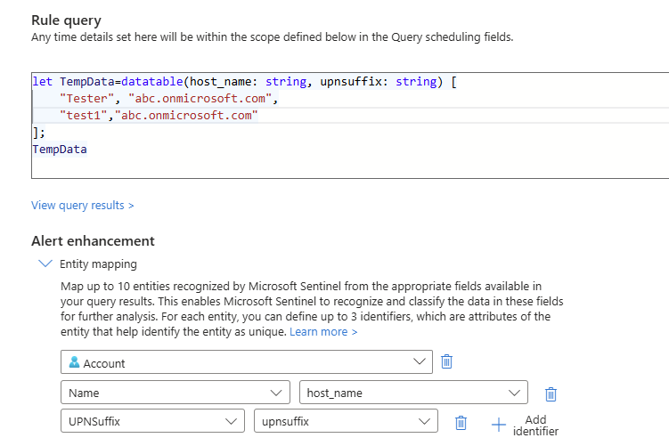
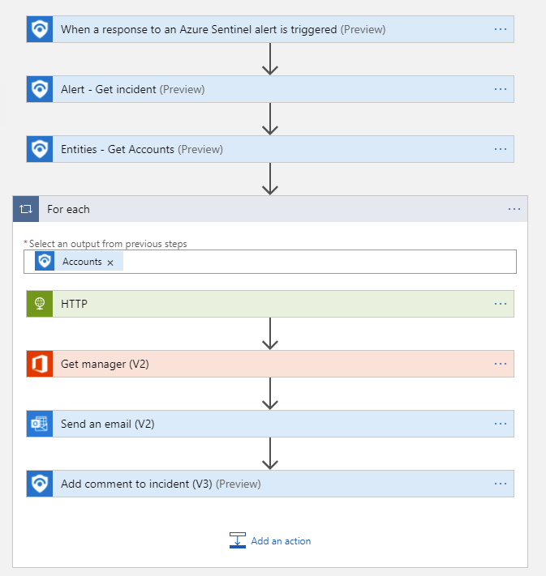

# Revoke-AADSignInSessions

This playbook will revoke all signin sessions for the user using Graph API. It will send and email to the user's manager. 

## Quick Deployment
**Deploy with entity trigger** (recommended)

After deployment, you can run this playbook manually on an entity.

[](https://portal.azure.com/#create/Microsoft.Template/uri/https%3A%2F%2Fraw.githubusercontent.com%2FAzure%2FAzure-Sentinel%2Fmaster%2FSolutions%2FMicrosoft%20Entra%20ID%2FPlaybooks%2FRevoke-AADSignInSessions%2Fentity-trigger%2Fazuredeploy.json)
[](https://portal.azure.us/#create/Microsoft.Template/uri/https%3A%2F%2Fraw.githubusercontent.com%2FAzure%2FAzure-Sentinel%2Fmaster%2FSolutions%2FMicrosoft%20Entra%20ID%2FPlaybooks%2FRevoke-AADSignInSessions%2Fentity-trigger%2Fazuredeploy.json)

**Deploy with incident trigger**

After deployment, you can run this playbook manually on an incident or attach this playbook to an **automation rule** so it runs when the incident is created.

[Learn more about automation rules](https://docs.microsoft.com/azure/sentinel/automate-incident-handling-with-automation-rules#creating-and-managing-automation-rules)

[](https://portal.azure.com/#create/Microsoft.Template/uri/https%3A%2F%2Fraw.githubusercontent.com%2FAzure%2FAzure-Sentinel%2Fmaster%2FSolutions%2FMicrosoft%20Entra%20ID%2FPlaybooks%2FRevoke-AADSignInSessions%2Fincident-trigger%2Fazuredeploy.json)
[](https://portal.azure.us/#create/Microsoft.Template/uri/https%3A%2F%2Fraw.githubusercontent.com%2FAzure%2FAzure-Sentinel%2Fmaster%2FSolutions%2FMicrosoft%20Entra%20ID%2FPlaybooks%2FRevoke-AADSignInSessions%2Fincident-trigger%2Fazuredeploy.json)


**Deploy with alert trigger**

After deployment, you can run this playbook manually on an alert or attach it to an **automation rule** so it will rune when an alert is created.

[](https://portal.azure.com/#create/Microsoft.Template/uri/https%3A%2F%2Fraw.githubusercontent.com%2FAzure%2FAzure-Sentinel%2Fmaster%2FSolutions%2FMicrosoft%20Entra%20ID%2FPlaybooks%2FRevoke-AADSignInSessions%2Falert-trigger%2Fazuredeploy.json)
[](https://portal.azure.us/#create/Microsoft.Template/uri/https%3A%2F%2Fraw.githubusercontent.com%2FAzure%2FAzure-Sentinel%2Fmaster%2FSolutions%2FMicrosoft%20Entra%20ID%2FPlaybooks%2FRevoke-AADSignInSessions%2Falert-trigger%2Fazuredeploy.json)


## Post deployment
1. Assign Microsoft Sentinel Responder role to the managed identity. To do so, choose Identity blade under Settings of the Logic App.
    - Open Playbook
    - Click on Identity Blade under Settings
    - Click on Add role assignments
    - Select Scope - Resource group
    - Select Subscription - where Playbook has been created
    - Select Resource group - where Playbook has been created
    - Select Role - Microsoft Sentinel Responder
    - Click Save (It takes 3-5 minutes to show the added role.)
3. You will need to grant User.ReadWrite.All permissions to the managed identity.  Run the following code replacing the managed identity object id.  You find the managed identity object id on the Identity blade under Settings for the Logic App.
```powershell
$MIGuid = "<Enter your managed identity guid here>"
$MI = Get-AzureADServicePrincipal -ObjectId $MIGuid

$GraphAppId = "00000003-0000-0000-c000-000000000000"
$PermissionName = "User.ReadWrite.All" 

$GraphServicePrincipal = Get-AzureADServicePrincipal -Filter "appId eq '$GraphAppId'"
$AppRole = $GraphServicePrincipal.AppRoles | Where-Object {$_.Value -eq $PermissionName -and $_.AllowedMemberTypes -contains "Application"}
New-AzureAdServiceAppRoleAssignment -ObjectId $MI.ObjectId -PrincipalId $MI.ObjectId `
-ResourceId $GraphServicePrincipal.ObjectId -Id $AppRole.Id
```
## Configurations in Sentinel (Recommended step)<br>
   - While creating analytical rule , kindly take care of proper mapping beacuse these playbooks require Name and UPNsuffix identifier to be mapped properly under account entity .
   for example if you want the jhon@abc.company.com to be blocked/reset/revoke-session then , kindly map the column having jhon to Name identifier and abc.company.com to UPNsuffix identifier
   <br>

## Screenshots
**Incident Trigger**<br>
<br>
**Alert Trigger**<br>
<br>
**Enityt Trigger**<br>
<br>

