# Deployment Microsoft Exchange Security for Exchange On-Premises

- [Deployment Microsoft Exchange Security for Exchange On-Premises](#deployment-microsoft-exchange-security-for-exchange-on-premises)
  - [Install the solution](#install-the-solution)
  - [Options deployment](#options-deployment)
  - [Configuration of the Mandatory data Connector : Exchange Security Insights On-Premise Collector](#configuration-of-the-mandatory-data-connector--exchange-security-insights-on-premise-collector)
    - [Prerequisites](#prerequisites)
    - [Configuration](#configuration)
      - [Parser deployment](#parser-deployment)
      - [Script Deployment](#script-deployment)
        - [Download the latest version of ESI Collector](#download-the-latest-version-of-esi-collector)
        - [On the serveur that will run the collect](#on-the-serveur-that-will-run-the-collect)
        - [Find the information configured by the scripts](#find-the-information-configured-by-the-scripts)
  - [Deploy Optional Connector : Microsoft Exchange Logs and Events](#deploy-optional-connector--microsoft-exchange-logs-and-events)
  - [To configure each options](#to-configure-each-options)
  - [Prerequisites](#prerequisites-1)
  - [Parser deployment](#parser-deployment-1)
  - [Deployment considerations](#deployment-considerations)
  - [Azure Arc-enabled servers, Azure Monitor Agent and DCR Deployment](#azure-arc-enabled-servers-azure-monitor-agent-and-dcr-deployment)
    - [Agents Deployment](#agents-deployment)
      - [Deployment of the Azure Arc-enabled servers](#deployment-of-the-azure-arc-enabled-servers)
      - [Deployment Azure Monitor Agent](#deployment-azure-monitor-agent)
    - [Option 1  -  MSExchange Management Log collection](#option-1-----msexchange-management-log-collection)
      - [DCR Creation](#dcr-creation)
      - [Assign DCR to all Exchange servers](#assign-dcr-to-all-exchange-servers)
    - [Option 2 - Security, Application, System for Exchange Servers](#option-2---security-application-system-for-exchange-servers)
      - [Security logs](#security-logs)
      - [Application and System Event logs](#application-and-system-event-logs)
      - [Assign DCR to all Exchange servers](#assign-dcr-to-all-exchange-servers-1)
    - [Option 3 and 4 Security logs of Domain Controllers](#option-3-and-4-security-logs-of-domain-controllers)
      - [Security logs](#security-logs-1)
    - [Option 5 - IIS logs for Exchange servers](#option-5---iis-logs-for-exchange-servers)
      - [DCE Creation](#dce-creation)
      - [DCR Creation](#dcr-creation-1)
      - [Assign DCR to all Exchange servers](#assign-dcr-to-all-exchange-servers-2)
    - [Option 6 - Message tracking logs for Exchange Servers](#option-6---message-tracking-logs-for-exchange-servers)
      - [DCE Creation](#dce-creation-1)
      - [DCR Creation](#dcr-creation-2)
      - [Assign DCR to all Exchange servers](#assign-dcr-to-all-exchange-servers-3)
    - [Option 7 - HTTPProxy logs for Exchange servers](#option-7---httpproxy-logs-for-exchange-servers)
      - [DCE Creation](#dce-creation-2)
      - [Assign DCR to all Exchange servers](#assign-dcr-to-all-exchange-servers-4)
  - [Legacy Agent Deployment for Options 1-2-3-4-5-6-7](#legacy-agent-deployment-for-options-1-2-3-4-5-6-7)
    - [Download and install the agents needed to collect logs for Microsoft Sentinel](#download-and-install-the-agents-needed-to-collect-logs-for-microsoft-sentinel)
    - [Option 1  -  MSExchange Management Log collection](#option-1-----msexchange-management-log-collection-1)
    - [Option 2 - Security, Application, System for Exchange Servers](#option-2---security-application-system-for-exchange-servers-1)
    - [Option 3 - Security for Domain controllers located in the Exchange AD sites](#option-3---security-for-domain-controllers-located-in-the-exchange-ad-sites)
    - [Option 4 - Security for ALL Domain controllers](#option-4---security-for-all-domain-controllers)
    - [Option 5 - IIS logs for Exchange servers](#option-5---iis-logs-for-exchange-servers-1)
    - [Option 6 - Message tracking logs for Exchange Servers](#option-6---message-tracking-logs-for-exchange-servers-1)
    - [Option 7 - HTTPProxy logs for Exchange servers](#option-7---httpproxy-logs-for-exchange-servers-1)


## Install the solution

1. In Microsoft Sentinel
2. Select Content Hub
3. In the search zone, type Microsoft exchange Security
4. Select Microsoft Exchange Security for Exchange On-Premises
5. Click Install
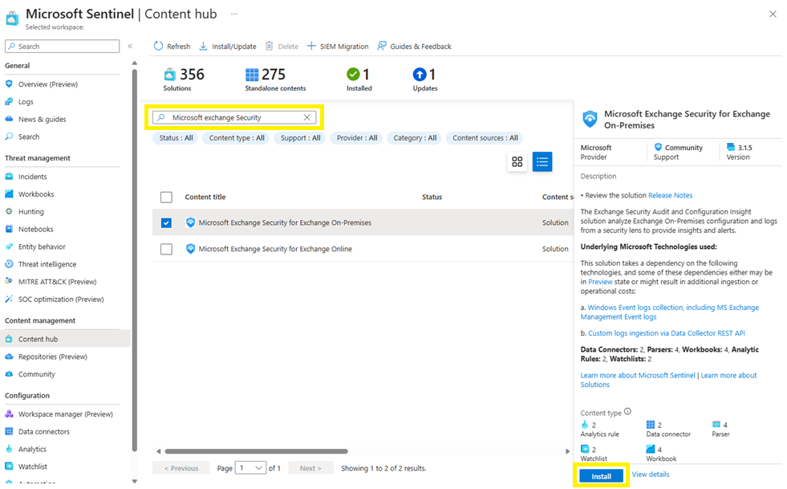
6. Wait for the end of the installation

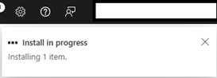

**The solution will deploy :**

* Two connectors
  * Exchange Security Insights On-Premise Collector
  * Microsoft Exchange Logs and Events
* 4 Functions also called Parsers
  * ExchangeAdminAuditLogs
  * ExchangeConfiguration
  * ExchangeEnvironmentList
  * MESCheckVIP
* 4 Workbooks template
  * Microsoft Exchange Admin Activity
  * Microsoft Exchange Least Privilege with RBAC
  * Microsoft Exchange Search AdminAuditLog
  * Microsoft Exchange Security Review

## Options deployment

Remember, this solution is based on one mandadoty data connector and one optionnal.
All the steps in the section Exchange Security Insights On-Premise Collector are mandatoty.

For the step in the section Microsoft Exchange Logs and Events, you will have to choose which logs you want to ingest.
As we do not want to force you to deploy all the capabilities provided with this solution, we choose to divide them in something we decided to call Options.
After the solution installation, you will be able to choose which data will be ingest in Microsoft Sentinel.
Indeed as some options can generate a very high volume of data, we let you choose which logs will be ingest.
The choice depend on what :

* You want to collect
* What workbook you want to used
* Analytics Rules, Hunting capabilities you want to be able to use
* Hunting capacities you want

Each options are independant for one from the other.

For more information, for other options please refer to the blog or to the readme located here :
<https://techcommunity.microsoft.com/t5/microsoft-sentinel-blog/help-protect-your-exchange-environment-with-microsoft-sentinel/ba-p/3872527>
[Readme](./../README.md)

## Configuration of the Mandatory data Connector : Exchange Security Insights On-Premise Collector

The configurations associated with this connector are mandatory and will be used by the following workbooks :

* Microsoft Exchange Security Review
* Microsoft Exchange Least Privilege with RBAC

For details on how to configure this connector, you have two possibilities

1. Go to the Connector Page and follow the steps
2. Follow this documentation

> We strongly recommended to follow this documentation as the information are more detailed.

If you choose to use the information provide in the Connector page :

1. Go to Data connectors in the configuration section
2. Select Exchange Security Insights On-Premise Collector
3. Click on Open connector page

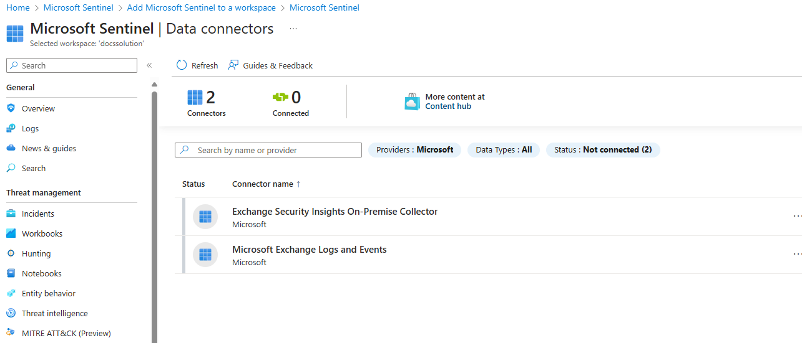

### Prerequisites

To integrate with Exchange Security Insights On-Premise Collector make sure you have:

✅ **Workspace:** read and write permissions are required

✅ **Keys:** read permissions to shared keys for the workspace are required. See the documentation to learn more about workspace keys

> The connector page is useful to retrieve the Worspace ID and the Key.

 ℹ️ Service Account with Organization Management role: The service Account that launch the script as scheduled task needs to be Organization Management to be able to retrieve all the needed security Information.

### Configuration

#### Parser deployment

>NOTE:  To work as expected, this data connector depends on a parser based on a Kusto Function. **(When standard deployement, Parsers are automatically deployed)**
>List of Parsers that will be automatically deployed :

> * ExchangeAdminAuditLogs
> * ExchangeConfiguration
> * ExchangeEnvironmentList
> * MESCheckVIP

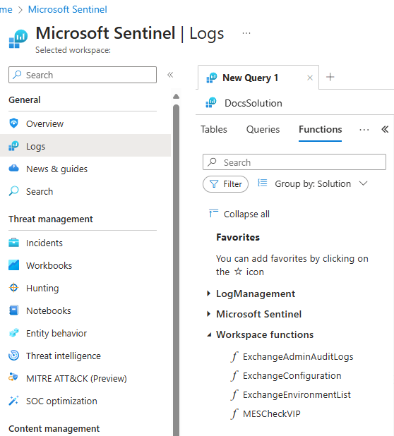

> More detailed information on Parsers can be found in the following documentation
[Parser information](./../../Parsers/README.md)

#### Script Deployment

This connector is based on a script that will run on an On-Premises servers (normally an Admin server).

Here the steps to deploy the script on this server.
The script Setup.ps1 will automatically deploy all the required configurations.

##### Download the latest version of ESI Collector

* The latest version can be found here : <https://aka.ms/ESI-ExchangeCollector-Script>
* Choose CollectExchSecIns.zip (This is the latest version of the script)
* This is the script that will collect Exchange Information to push content in Microsoft Sentinel.
* Install the ESI Collector Script on a server with Exchange Admin PowerShell console

##### On the serveur that will run the collect

> *Remember that the server needs to have Exchange PowerShell Cmdlets*

1. **Copy and unzip** the file CollectExchSecIns.zip
2. **Unblock** the PS1 Scripts
   1. Click right on each PS1 Script and go to Properties tab.
   2. If the script is marked as blocked, unblock it. You can also use the Cmdlet 'Unblock-File . in the unzipped folder using PowerShell
3. **Configure** **Network Access**
   1. Ensure that the script can contact Azure Analytics (*.ods.opinsights.azure.com).
4. Run the **setup.ps1** to configure the ESI Collector Script
   1. Be sure to be **local administrator** of the server
   2. In **'Run as Administrator'** mode, launch the 'setup.ps1' script to configure the collector
   3. **Fill** the Log Analytics (Microsoft Sentinel) Workspace information
      1. To find the **Workspace ID and the Key**, go the **Log Analytics workspace for your Sentinel**
      2. Select **Agents** in the **Settings** section
      3. Extend the **Log Analytics Agent Instructions**
      4. Retrieve the **Workspace ID and Primary Key**
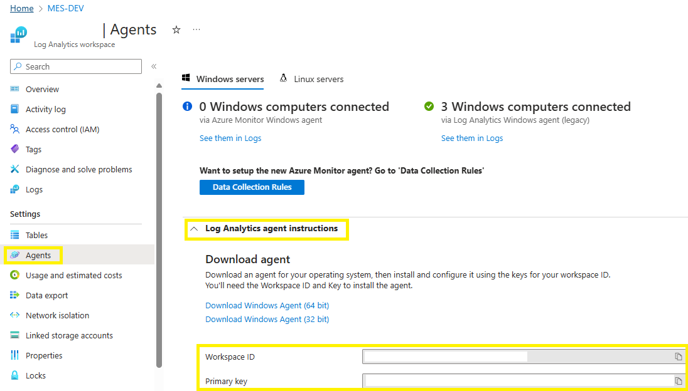
   4. Fill all the required information required by the script
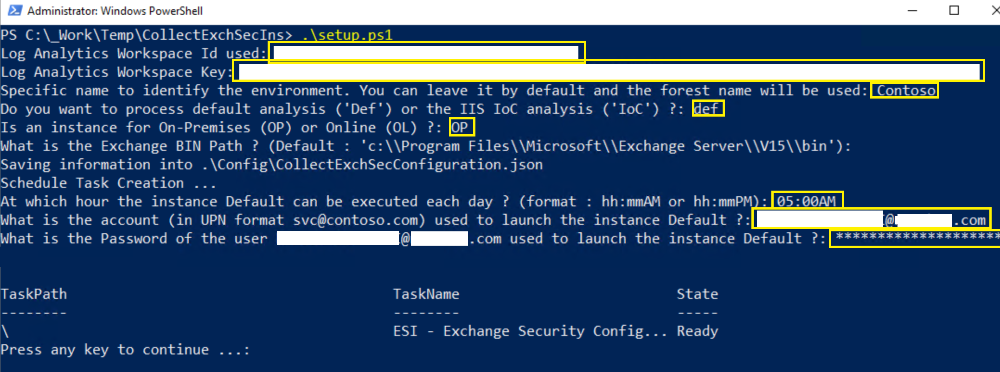
   5. Enter the **Name** of your environement the Environment name. This name will be displayed in your workbook. You should choose the name of your Exchange organization
      1. **This STEP is Critical**
      2. The name can be String or a combination of String and Number Example :
         1. Contoso
         2. Consoto2024
      3. GUID are not allowed
   6. By default, choose '**Def'** as Default analysis. 
   7. Choose **OP** for On-Premises
   8. If necessary, update the path for the location of **Exchange BIN path**
   9.  Enter the **time when you want** the script to run (format : hh:mmAM or hh:mmPM):
   10. Specify the **account** and its password that will be used to run the script in the Scheduled Task (**Remember this account needs to be part of the Organization Management group**)

**Here the scheduled task, after the script completion**
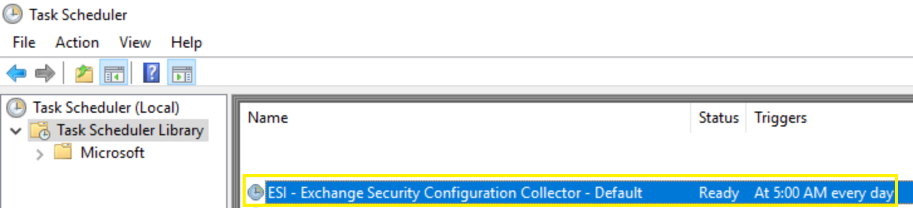

**Schedule the ESI Collector Script**
You need to follow this section only if the script failed due to lack of permission
Steps :

1. Create a Scheluled task
2. Specify the account

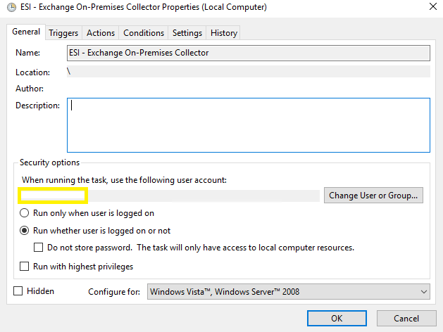

3. Set the schedule

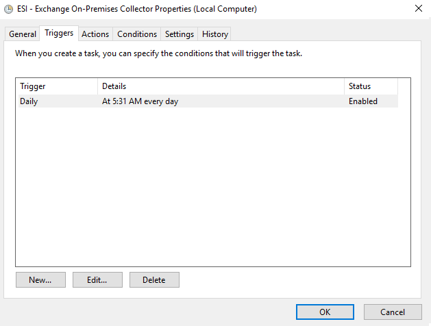

4. Set the script

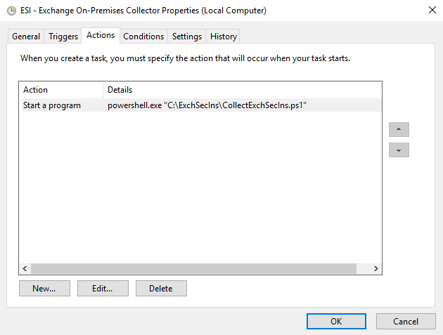

The account used to launch the Script needs to be member of the group **Organization Management**

##### Find the information configured by the scripts

The script will create the Scheluded tasks and fill a configuration file named **CollectExchSecConfiguration.json** with all the provided information.
This file can be found in the **Config** folder. This folder is located in the folder where you unzip the zip.

------------------------
## Deploy Optional Connector : Microsoft Exchange Logs and Events

This connector is used to collect additionals logs :

* MSExchange Management logs from the Event Viewer : Also called Option 1
* Security, Application, System for Exchange Servers : Also called Option 2
* Security for Domain controllers located in the Exchange AD sites : Also called Option 3
* Security for ALL Domain controllers : Also called Option 4
* IIS logs for Exchange servers : Also called Option 5
* Message tracking logs for Exchange Servers : Also called Option 6
* HTTPProxy logs for Exchange servers : Also called Option 7

## To configure each options

For details on how to configure the options, you have two possibilities

1. Go to the Connector Page and follow the steps
2. Follow this documentation

> We strongly recommended to follow this documentation as the information are more detailed.

If you choose to use the information provide in the Connector page :

1. Go to **Data connectors** in the configuration section
2. Select **Exchange Security Insights On-Premise Collector**
3. Click on **Open connector page**


## Prerequisites

To integrate with Exchange Security Insights On-Premise Collector make sure you have:

✅ **Workspace:** read and write permissions are required

✅ **Keys:** read permissions to shared keys for the workspace are required. See the documentation to learn more about workspace keys

> The connector page is useful to retrieve the Worspace ID and the Key.

## Parser deployment

> Note :  To work as expected, this data connector depends on a parser based on a Kusto Function. **(When standard deployement, Parsers are automatically deployed)**
List of Parsers that will be automatically deployed :
> * ExchangeAdminAuditLogs
> * ExchangeConfiguration
> * ExchangeEnvironmentList
> * MESCheckVIP


> More detailed information on Parsers can be found in the following documentation
[Parser information](./../../Parsers/README.md)

## Deployment considerations

To ingest the events logs or log files, you have two components :

* Use Azure Monitor Agent and DCR : Recommanded solution
* Use the legacy Agent : This agent will be depreceated in August 2024

## Azure Arc-enabled servers, Azure Monitor Agent and DCR Deployment

The deployment is in 3 steps :

1. Deployment of Azure Arc-enabled servers
2. Deployment of Azure Monitor Agent
3. DCR configurations : These step will be detailed in each Option sections

### Agents Deployment
The reference document is : [Manage Azure Monitor Agent](https://learn.microsoft.com/en-us/azure/azure-monitor/agents/azure-monitor-agent-manage?tabs=azure-powershell#virtual-machine-extension-details)

The following steps are just a summary, please review closely the documentation or your internal document for Azure Arc deployment.
Azure Arc deployment are most of the part managed by the Azure team.

#### Deployment of the Azure Arc-enabled servers

To install the Azure Arc-enabled servers :

* On Azure VM : Follow this article : [Click Here](https://learn.microsoft.com/en-us/azure/azure-monitor/agents/azure-monitor-agent-manage?tabs=azure-portal&WT.mc_id=Portal-fx)
* On physical servers and virtual machines hosted outside of Azure : 

  * Here an overview of available deployment method [Click Here](https://learn.microsoft.com/en-us/azure/azure-arc/servers/deployment-options)
    * [Preferred Method](https://learn.microsoft.com/en-us/azure/azure-arc/servers/onboard-portal)

After the Deployment, the servers can be found in **Azure Arc/Azure Arc resources/Machines**
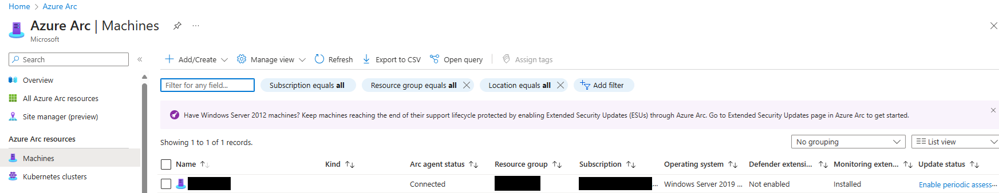
These steps needs to be done on all servers.

####  Deployment Azure Monitor Agent
The agent will be deployment by the first DCR

After the Deployment, the extension can be view **Azure Arc/Azure Arc resources/Machines**, click on the **Machine Name** and go to **Settings/Extension**
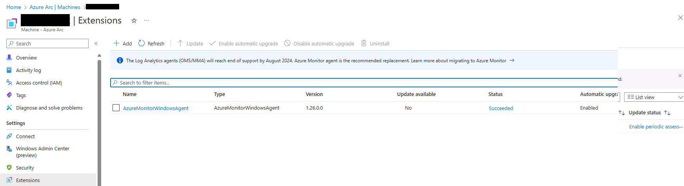


### Option 1  -  MSExchange Management Log collection

Option 1 is necessary for the following Workbooks :

* Microsoft Exchange Admin Activity
* Microsoft Exchange Search AdminAuditLog

#### DCR Creation
All the Exchange Servers with the DCR deployed will upload the MSExchange Management log.
There are 2 methods to deploy the DCR :

1. Method 1 - Azure Resource Manager (ARM) Template. Use this method for automated deployment of the DCR
   1. Go the **Microsoft Exchange Logs and Events** data connector Page
   2. Extend the section **[Option 1] MSExchange Management Log collection / Data Collection Rules - When Azure Monitor Agent is used / Option 1 - Azure Resource Manager (ARM) Template**
   3. Click on **Deploy to Azure**
   4. Select the preferred **Subscription**, **Resource Group**, **Region**
   5. Enter **Workspace Name**

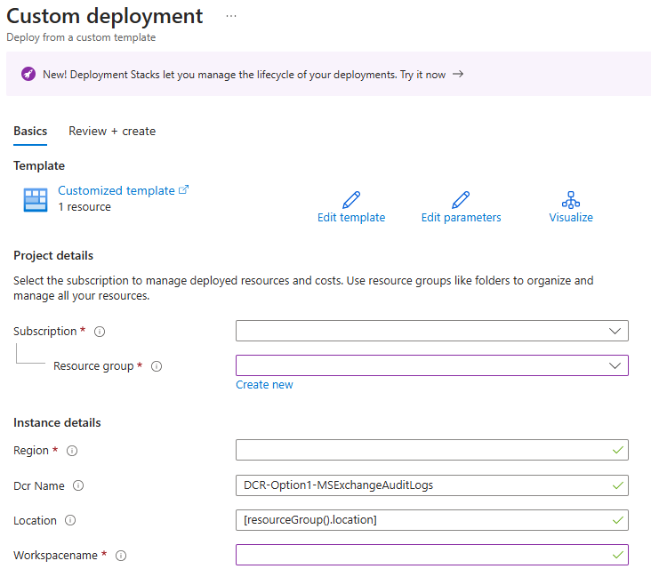
   6. Click **Next** and **Create**

2. Method 2 - Manual Deployment of Azure DCR

   1. From the **Azure Portal**, navigate to **Azure Data collection rules**
   2. Click **+ Create** at the top
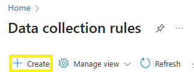
   3. In the Basics tab, fill the required fields, Select Windows as platform type and give a name to the DCR
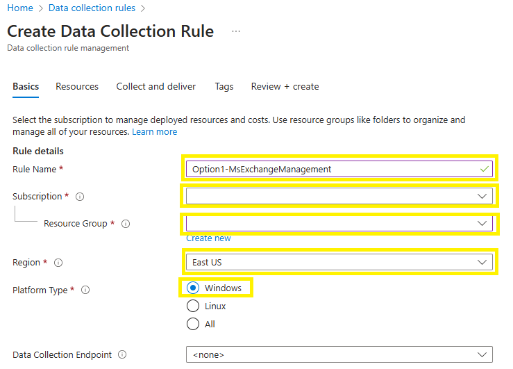
   4. In the **Resources** tab, click **+ Add Resources** and select  your **Exchange Servers**
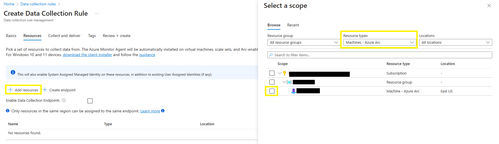
   5. In **'Collect and deliver'**, add a Data Source type 'Windows Event logs' and select 'Custom' option, enter '**MSExchange Management**' as expression and Add it
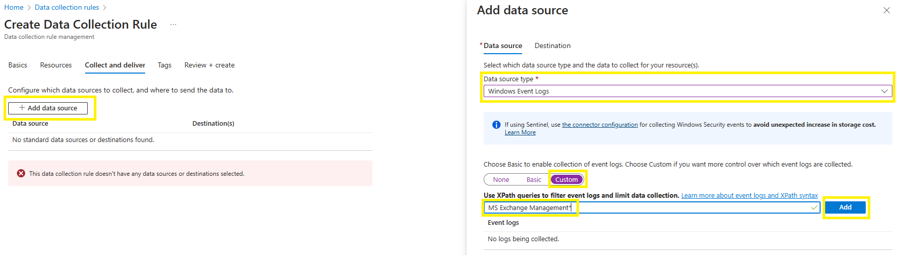
   6. Click **Add data source** and click **Next Destination**
   7. In destination Type select **Azure Monitor Logs** and in **Desitnation Details** select the appropriate **Sentinel workspace**
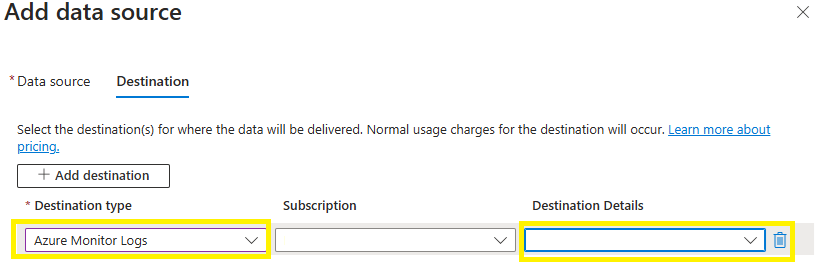
   8. and Click **Review + Create**
   9. Click **Create**

#### Assign DCR to all Exchange servers
1. From the **Azure Portal**, navigate to **Azure Data collection rules**
2. Select the DCR
3. Click **Settings / Resources**
4. Select all Exchange Servers


### Option 2 - Security, Application, System for Exchange Servers

#### Security logs
1. Go the **Microsoft Exchange Logs and Events** data connector Page
2. Extend the section **[Option 2] Security/Application/System logs of Exchange Servers/Security Event Log collection / Data Collection Rules- Security Logs**
3. Click **Create Data collection Rule**
4. In **Basic** tabs, enter a **Name** for the DCR

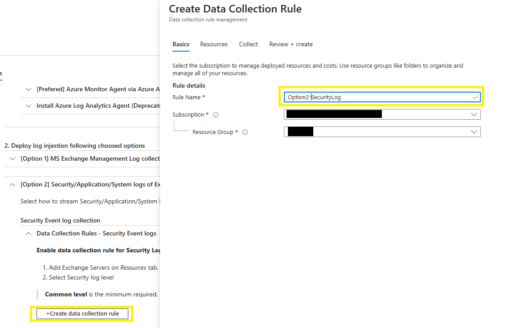
5. Click **Resources** tab, click **+Add ressource(s)**

6. Add the Exchange Servers
7. Click **Next : Collect**
8. In **Collect** tab, **Common** level is the minimum required. Please select **Common** or **All Security Events**
9. Click **Review + Create**

#### Application and System Event logs
1. Go the **Microsoft Exchange Logs and Events** data connector Page
2. Extend the section **[Option 2] Security/Application/System logs of Exchange Servers / Security Event Log collection / Data Collection Rules- Security Logs**

There are 2 methods to deploy the DCR :

1. Method 1 - Azure Resource Manager (ARM) Template. Use this method for automated deployment of the DCR
   1. Go the **Microsoft Exchange Logs and Events** data connector Page
   2. Extend the section **[Option 2] Security/Application/System logs of Exchange Servers / Application and System Event log collection / Data Collection Rules - When Azure Monitor Agent is used / Option 1 - Azure Resource Manager (ARM) Template**
   3. Click on Deploy to Azure
   4. Select the preferred **Subscription**, **Resource Group**, **Region**
   5. Enter **Workspace Name**


   6. Click **Next** and **Create**

2. Method 2 - Manual Deployment of Azure DCR

   1. From the **Azure Portal**, navigate to **Azure Data collection rules**
   2. Click **+ Create** at the top

   3. In the Basics tab, fill the required fields, Select Windows as platform type and give a name to the DCR

   4. In the **Resources** tab, click **+ Add Resources** and select  your **Exchange Servers**

   5. In **'Collect and deliver'**, add a Data Source type '**Windows Event logs**' and select **Basic** option
   6. For **Application**, select **Critical**, **Error** and **Warning**. For **System**, select **Critical/Error/Warning/Information**
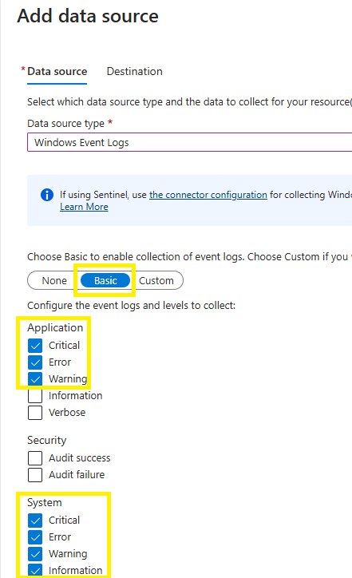
   1. Click **Add data source** and click **Next Destination**
   2. In destination Type select **Azure Monitor Logs** and in **Desitnation Details** select the appropriate **Sentinel workspace**

   1. and Click **Review + Create**
   2. Click **Create**

#### Assign DCR to all Exchange servers
1. From the **Azure Portal**, navigate to **Azure Data collection rules**
2. Select the DCR
3. Click **Settings / Resources**
4. Select all Exchange Servers

### Option 3 and 4 Security logs of Domain Controllers 
#### Security logs
1. Go the **Microsoft Exchange Logs and Events** data connector Page
2. Extend the section **[Option 3 and 4] Security logs of Domain Controllers/Security Event log collection/ Data Collection Rules- Security Logs**
3. Click **Create Data collection Rule**
4. In **Basic** tabs, enter a **Name** for the DCR


5. Click **Resources** tab, click **+Add ressource(s)**

1. Depending on the Options:
   1. Option 3 : Add only Domain Controllers for Exchange AD Sites
   2. Option 4 : Add ALL Domain Controllers 
2. Click **Next : Collect**
3. In **Collect** tab, **Common** level is the minimum required. Please select **Common** or **All Security Events**
4. Click **Review + Create**

### Option 5 - IIS logs for Exchange servers
#### DCE Creation
This option required a DCE (Data connection Endpoint).
**This step needs do be only one time, for other DCR, you'll select this DCE.**
There are 2 methods to deploy the DCE :

1. Method 1 - Azure Resource Manager (ARM) Template. Use this method for automated deployment of the DCR

   1. Go the **Microsoft Exchange Logs and Events** data connector Page
   2. Extend the section **[Option 5] IIS logs of Exchange Servers / Data Collection Rules - When Azure Monitor Agent is used / Option 1 - Azure Resource Manager (ARM) Template**/**Create DCE (If not already created for Exchange Servers)**
   3. Click on **Deploy to Azure**
   4. Select the preferred **Subscription**, **Resource Group**, **Region**


   1. Click **Next** and **Create**

1. Method 2 - Manual Deployment of Azure DCR

   1. From the **Azure Portal**, navigate to **Azure Data collection Endpoint**
   2. Click **+ Create** at the top
   3. In the Basics tab, fill the required fields, Select Windows as platform type and give a name to the DCR
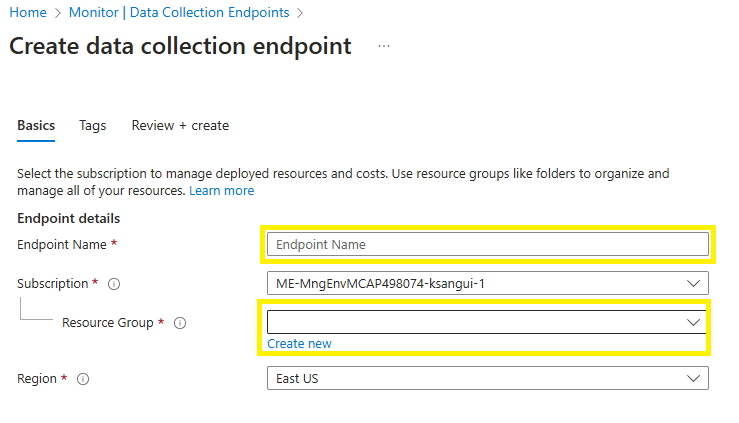
   1. and Click **Review + Create**
   2. Click **Create**

#### DCR Creation
1. Method 1 - Azure Resource Manager (ARM) Template. Use this method for automated deployment of the DCR
   1. Go the **Microsoft Exchange Logs and Events** data connector Page
   2. Extend the section **[Option 5] IIS logs of Exchange Servers / Data Collection Rules - When Azure Monitor Agent is used / Option 1 - Azure Resource Manager (ARM) Template**/**Create DCR (If not already created for Exchange Servers)**
   3. Click on **Deploy to Azure**
   4. Select the preferred **Subscription**, **Resource Group**, **Region**
   5. Enter **Workspace Name**
   6. Enter the **DCE Name** created in the previous steps

2. Method 2 - Manual Deployment of Azure DCR

   1. From the **Azure Portal**, navigate to **Azure Data collection rules**
   2. Click **+ Create** at the top
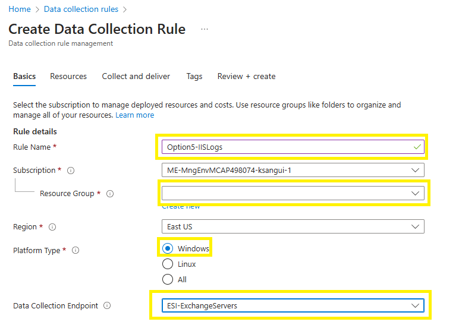
   1. In the Basics tab, fill the required fields, Select Windows as platform type and give a name to the DCR

   1. In the **Resources** tab, click **+ Add Resources** and select  your **Exchange Servers**

   1. In **'Collect and deliver'**, add a Data Source select IIS logs
   2. If IIS logs are not located in their default location, change the path
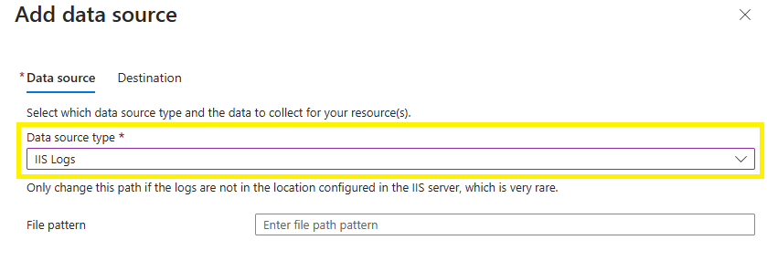
   1. Click **Add data source** and click **Next Destination**
   2. In destination Type select **Azure Monitor Logs** and in **Desitnation Details** select the appropriate **Sentinel workspace**

   1. and Click **Review + Create**
   2. Click **Create**

#### Assign DCR to all Exchange servers
1. From the **Azure Portal**, navigate to **Azure Data collection rules**
2. Select the DCR
3. Click **Settings / Resources**
4. Select all Exchange Servers


### Option 6 - Message tracking logs for Exchange Servers

#### DCE Creation
This option required a DCE (Data connection Endpoint).
**This step needs do be only one time, for other DCR, you'll select this DCE.**
There are 2 methods to deploy the DCE :


1. Method 1 - Azure Resource Manager (ARM) Template. Use this method for automated deployment of the DCR

   1. Go the **Microsoft Exchange Logs and Events** data connector Page
   2. Extend the section **[Option 6] Message Tracking of Exchange Servers / Data Collection Rules - When Azure Monitor Agent is used / Option 1 - Azure Resource Manager (ARM) Template**/**Create DCE (If not already created for Exchange Servers)**
   3. Click on **Deploy to Azure**
   4. Select the preferred **Subscription**, **Resource Group**, **Region**


   1. Click **Next** and **Create**

1. Method 2 - Manual Deployment of Azure DCE

   1. From the **Azure Portal**, navigate to **Azure Data collection Endpoint**
   2. Click **+ Create** at the top
   3. In the Basics tab, fill the required fields, Select Windows as platform type and give a name to the DCR

   1. and Click **Review + Create**
   2. Click **Create**


#### DCR Creation
1. Method 1 - Azure Resource Manager (ARM) Template. Use this method for automated deployment of the DCR
   1. Go the **Microsoft Exchange Logs and Events** data connector Page
   2. Extend the section **[Option 6] Message Tracking of Exchange Servers / Data Collection Rules - When Azure Monitor Agent is used / Option 1 - Azure Resource Manager (ARM) Template**/**Create DCR (If not already created for Exchange Servers)**
   3. Click on **Deploy to Azure**
   4. Select the preferred **Subscription**, **Resource Group**, **Region**
   5. Enter **Workspace Name**
   6. Enter the **DCE Name** created in the previous steps

2. Method 2 - Manual Deployment of Azure DCR

   First of all, we need to create the table in the workspace. The table will be used to ingest the logs. By default we use the table name **MessageTrackingLog_CL**. If you want to use another name, you need to update the DCR with the new table name.

   To create the table, using an ARM templace (the best way). Here the steps to create the table :
   1.  Click on the **Deploy to Azure** button below:
          [](https://aka.ms/sentinel-ESI-HTTPProxyCustomTable)
   2.  Select the preferred **Subscription, Resource Group, Location** and **Analytic Workspace Name**.
   3.  Click **Review + Create** and **Create**

<details>
   <summary>If you want to create the table manually, follow this section</summary>

   To create the table manually, you can follow multiple methods, explained [here](https://learn.microsoft.com/azure/azure-monitor/logs/create-custom-table?tabs=azure-powershell-1%2Cazure-portal-2%2Cazure-portal-3&WT.mc_id=Portal-fx#create-a-custom-table). Here the steps to create the table using the Cloud Shell PowerShell :

   1. Open the **Azure Cloud Shell** and select **PowerShell**
   2. Copy and paste and Execute the following script in the Cloud Shell to create the table.

```PowerShell

$tableParams = @'
 {
     "properties": {
         "schema": {
                "name": "MessageTrackingLog_CL",
                "columns": [
                         {
                             "name": "directionality",
                             "type": "string"
                         },
                         {
                             "name": "reference",
                             "type": "string"
                         },
                         {
                             "name": "source",
                             "type": "string"
                         },
                         {
                             "name": "TimeGenerated",
                             "type": "datetime"
                         },
                         {
                             "name": "clientHostname",
                             "type": "string"
                         },
                         {
                             "name": "clientIP",
                             "type": "string"
                         },
                         {
                             "name": "connectorId",
                             "type": "string"
                         },
                         {
                             "name": "customData",
                             "type": "string"
                         },
                         {
                             "name": "eventId",
                             "type": "string"
                         },
                         {
                             "name": "internalMessageId",
                             "type": "string"
                         },
                         {
                             "name": "logId",
                             "type": "string"
                         },
                         {
                             "name": "messageId",
                             "type": "string"
                         },
                         {
                             "name": "messageInfo",
                             "type": "string"
                         },
                         {
                             "name": "messageSubject",
                             "type": "string"
                         },
                         {
                             "name": "networkMessageId",
                             "type": "string"
                         },
                         {
                             "name": "originalClientIp",
                             "type": "string"
                         },
                         {
                             "name": "originalServerIp",
                             "type": "string"
                         },
                         {
                             "name": "recipientAddress",
                             "type": "string"
                         },
                         {
                             "name": "recipientCount",
                             "type": "string"
                         },
                         {
                             "name": "recipientStatus",
                             "type": "string"
                         },
                         {
                             "name": "relatedRecipientAddress",
                             "type": "string"
                         },
                         {
                             "name": "returnPath",
                             "type": "string"
                         },
                         {
                             "name": "senderAddress",
                             "type": "string"
                         },
                         {
                             "name": "senderHostname",
                             "type": "string"
                         },
                         {
                             "name": "serverIp",
                             "type": "string"
                         },
                         {
                             "name": "sourceContext",
                             "type": "string"
                         },
                         {
                             "name": "schemaVersion",
                             "type": "string"
                         },
                         {
                             "name": "messageTrackingTenantId",
                             "type": "string"
                         },
                         {
                             "name": "totalBytes",
                             "type": "string"
                         },
                         {
                             "name": "transportTrafficType",
                             "type": "string"
                         },
                         {
                             "name": "FilePath",
                             "type": "string"
                         }
                     ]
         }
     }
 }
 '@

```

   3. Copy, Replace, Paste and execute the following parameters with your own values:

```PowerShell
$SubscriptionID = 'YourGUID'
$ResourceGroupName = 'YourResourceGroupName'
$WorkspaceName = 'YourWorkspaceName'

```

   4. Execute the Following Cmdlet to create the table:

```PowerShell
Invoke-AzRestMethod -Path "/subscriptions/$SubscriptionID/resourcegroups/$ResourceGroupName/providers/microsoft.operationalinsights/workspaces/$WorkspaceName/tables/MessageTrackingLog_CL?api-version=2021-12-01-preview" -Method PUT -payload $tableParams

```

</details>

After the table creation, you can create the DCR :

   1. From the Azure Portal, navigate to [Azure Data collection rules](https://portal.azure.com/#view/Microsoft_Azure_Monitoring/AzureMonitoringBrowseBlade/~/dataCollectionRules).
   2. Click **Create new data collection** rule and Enter the name of the rule **DCR-Option6-MessageTrackingLogs**
   3. Select **Endpoint** created in the previous steps
   4. In the Resource Tab, add your Exchange Servers. This can be added after also.
   5. In **Collect and Deliver**, add a Data Source type **Custom Text logs** and enter **C:\Program Files\Microsoft\Exchange Server\V15\TransportRoles\Logs\MessageTracking*.log** in file pattern, **MessageTrackingLog_CL** in Table Name
   6. In Transform field, enter the following KQL request :

```powershell
 source | extend d = split(RawData,',') | extend TimeGenerated =todatetime(d[0]) ,clientIP =tostring(d[1]) ,clientHostname =tostring(d[2]) ,serverIp=tostring(d[3]) ,senderHostname=tostring(d[4]) ,sourceContext=tostring(d[5]) ,connectorId =tostring(d[6]) ,source=tostring(d[7]) ,eventId =tostring(d[8]) ,internalMessageId =tostring(d[9]) ,messageId =tostring(d[10]) ,networkMessageId =tostring(d[11]) ,recipientAddress=tostring(d[12]) ,recipientStatus=tostring(d[13]) ,totalBytes=tostring(d[14]) ,recipientCount=tostring(d[15]) ,relatedRecipientAddress=tostring(d[16]) ,reference=tostring(d[17]) ,messageSubject =tostring(d[18]) ,senderAddress=tostring(d[19]) ,returnPath=tostring(d[20]) ,messageInfo =tostring(d[21]) ,directionality=tostring(d[22]) ,messageTrackingTenantId =tostring(d[23]) ,originalClientIp =tostring(d[24]) ,originalServerIp =tostring(d[25]) ,customData=tostring(d[26]) ,transportTrafficType =tostring(d[27]) ,logId =tostring(d[28]) ,schemaVersion=tostring(d[29]) | project-away d,RawData
```

   7.  In the **destination field**, add a new Destination and select the Workspace where you have previously created the Custom Table
   8.  Click on 'Add data source'
   9.  Fill other optionnal parameters and click **Next : Review + Create**

#### Assign DCR to all Exchange servers

1. From the **Azure Portal**, navigate to **Azure Data collection rules**
2. Select the DCR
3. Click **Settings / Resources**
4. Select all Exchange Servers

### Option 7 - HTTPProxy logs for Exchange servers

#### DCE Creation

This option required a DCE (Data connection Endpoint).
**This step needs do be only one time, for other DCR, you'll select this DCE.**
There are 2 methods to deploy the DCE :

1. Method 1 - Azure Resource Manager (ARM) Template. Use this method for automated deployment of the DCR

   1. Go the **Microsoft Exchange Logs and Events** data connector Page
   2. Extend the section **[Option 7] HTTP Proxy of Exchange Servers / Data Collection Rules - When Azure Monitor Agent is used / Option 1 - Azure Resource Manager (ARM) Template**/**Create DCE (If not already created for Exchange Servers)**
   3. Click on **Deploy to Azure**
   4. Select the preferred **Subscription**, **Resource Group**, **Region**


   1. Click **Next** and **Create**

2. Method 2 - Manual Deployment of Azure DCR

   First of all, we need to create the table in the workspace. The table will be used to ingest the logs. By default we use the table name **MessageTrackingLog_CL**. If you want to use another name, you need to update the DCR with the new table name.

   To create the table, using an ARM templace (the best way). Here the steps to create the table :
   1.  Click on the **Deploy to Azure** button below:
          [](https://aka.ms/sentinel-ESI-MessageTrackingCustomTable)
   2.  Select the preferred **Subscription, Resource Group, Location** and **Analytic Workspace Name**.
   3.  Click **Review + Create** and **Create**

<details>
   <summary>If you want to create the table manually, follow this section</summary>

   To create the table manually, you can follow multiple methods, explained [here](https://learn.microsoft.com/azure/azure-monitor/logs/create-custom-table?tabs=azure-powershell-1%2Cazure-portal-2%2Cazure-portal-3&WT.mc_id=Portal-fx#create-a-custom-table). Here the steps to create the table using the Cloud Shell PowerShell :

   1. Open the **Azure Cloud Shell** and select **PowerShell**
   2. Copy and paste and Execute the following script in the Cloud Shell to create the table.

```PowerShell

$tableParams = @'
 {
     "properties": {
          "schema": {
                 "name": "ExchangeHttpProxy_CL",
                 "columns": [
                         {
                             "name": "AccountForestLatencyBreakup",
                             "type": "string"
                         },
                         {
                             "name": "ActivityContextLifeTime",
                             "type": "string"
                         },
                         {
                             "name": "ADLatency",
                             "type": "string"
                         },
                         {
                             "name": "AnchorMailbox",
                             "type": "string"
                         },
                         {
                             "name": "AuthenticatedUser",
                             "type": "string"
                         },
                         {
                             "name": "AuthenticationType",
                             "type": "string"
                         },
                         {
                             "name": "AuthModulePerfContext",
                             "type": "string"
                         },
                         {
                             "name": "BackEndCookie",
                             "type": "string"
                         },
                         {
                             "name": "BackEndGenericInfo",
                             "type": "string"
                         },
                         {
                             "name": "BackendProcessingLatency",
                             "type": "string"
                         },
                         {
                             "name": "BackendReqInitLatency",
                             "type": "string"
                         },
                         {
                             "name": "BackendReqStreamLatency",
                             "type": "string"
                         },
                         {
                             "name": "BackendRespInitLatency",
                             "type": "string"
                         },
                         {
                             "name": "BackendRespStreamLatency",
                             "type": "string"
                         },
                         {
                             "name": "BackEndStatus",
                             "type": "string"
                         },
                         {
                             "name": "BuildVersion",
                             "type": "string"
                         },
                         {
                             "name": "CalculateTargetBackEndLatency",
                             "type": "string"
                         },
                         {
                             "name": "ClientIpAddress",
                             "type": "string"
                         },
                         {
                             "name": "ClientReqStreamLatency",
                             "type": "string"
                         },
                         {
                             "name": "ClientRequestId",
                             "type": "string"
                         },
                         {
                             "name": "ClientRespStreamLatency",
                             "type": "string"
                         },
                         {
                             "name": "CoreLatency",
                             "type": "string"
                         },
                         {
                             "name": "DatabaseGuid",
                             "type": "string"
                         },
                         {
                             "name": "EdgeTraceId",
                             "type": "string"
                         },
                         {
                             "name": "ErrorCode",
                             "type": "string"
                         },
                         {
                             "name": "GenericErrors",
                             "type": "string"
                         },
                         {
                             "name": "GenericInfo",
                             "type": "string"
                         },
                         {
                             "name": "GlsLatencyBreakup",
                             "type": "string"
                         },
                         {
                             "name": "HandlerCompletionLatency",
                             "type": "string"
                         },
                         {
                             "name": "HandlerToModuleSwitchingLatency",
                             "type": "string"
                         },
                         {
                             "name": "HttpPipelineLatency",
                             "type": "string"
                         },
                         {
                             "name": "HttpProxyOverhead",
                             "type": "string"
                         },
                         {
                             "name": "HttpStatus",
                             "type": "string"
                         },
                         {
                             "name": "IsAuthenticated",
                             "type": "string"
                         },
                         {
                             "name": "KerberosAuthHeaderLatency",
                             "type": "string"
                         },
                         {
                             "name": "MajorVersion",
                             "type": "string"
                         },
                         {
                             "name": "Method",
                             "type": "string"
                         },
                         {
                             "name": "MinorVersion",
                             "type": "string"
                         },
                         {
                             "name": "ModuleToHandlerSwitchingLatency",
                             "type": "string"
                         },
                         {
                             "name": "Organization",
                             "type": "string"
                         },
                         {
                             "name": "PartitionEndpointLookupLatency",
                             "type": "string"
                         },
                         {
                             "name": "Protocol",
                             "type": "string"
                         },
                         {
                             "name": "ProtocolAction",
                             "type": "string"
                         },
                         {
                             "name": "ProxyAction",
                             "type": "string"
                         },
                         {
                             "name": "ProxyTime",
                             "type": "string"
                         },
                         {
                             "name": "RequestBytes",
                             "type": "string"
                         },
                         {
                             "name": "RequestHandlerLatency",
                             "type": "string"
                         },
                         {
                             "name": "RequestId",
                             "type": "string"
                         },
                         {
                             "name": "ResourceForestLatencyBreakup",
                             "type": "string"
                         },
                         {
                             "name": "ResponseBytes",
                             "type": "string"
                         },
                         {
                             "name": "RevisionVersion",
                             "type": "string"
                         },
                         {
                             "name": "RouteRefresherLatency",
                             "type": "string"
                         },
                         {
                             "name": "RoutingHint",
                             "type": "string"
                         },
                         {
                             "name": "RoutingLatency",
                             "type": "string"
                         },
                         {
                             "name": "RoutingStatus",
                             "type": "string"
                         },
                         {
                             "name": "RoutingType",
                             "type": "string"
                         },
                         {
                             "name": "ServerHostName",
                             "type": "string"
                         },
                         {
                             "name": "ServerLocatorHost",
                             "type": "string"
                         },
                         {
                             "name": "ServerLocatorLatency",
                             "type": "string"
                         },
                         {
                             "name": "SharedCacheLatencyBreakup",
                             "type": "string"
                         },
                         {
                             "name": "TargetOutstandingRequests",
                             "type": "string"
                         },
                         {
                             "name": "TargetServer",
                             "type": "string"
                         },
                         {
                             "name": "TargetServerVersion",
                             "type": "string"
                         },
                         {
                             "name": "TotalAccountForestLatency",
                             "type": "string"
                         },
                         {
                             "name": "TotalGlsLatency",
                             "type": "string"
                         },
                         {
                             "name": "TotalRequestTime",
                             "type": "string"
                         },
                         {
                             "name": "TotalResourceForestLatency",
                             "type": "string"
                         },
                         {
                             "name": "TotalSharedCacheLatency",
                             "type": "string"
                         },
                         {
                             "name": "UrlHost",
                             "type": "string"
                         },
                         {
                             "name": "UrlQuery",
                             "type": "string"
                         },
                         {
                             "name": "UrlStem",
                             "type": "string"
                         },
                         {
                             "name": "UserADObjectGuid",
                             "type": "string"
                         },
                         {
                             "name": "UserAgent",
                             "type": "string"
                         },
                         {
                             "name": "TimeGenerated",
                             "type": "datetime"
                         },
                         {
                             "name": "FilePath",
                             "type": "string"
                         }
                     ]
          }
      }
  }
  '@

```

   3. Copy, Replace, Paste and execute the following parameters with your own values:

```PowerShell
$SubscriptionID = 'YourGUID'
$ResourceGroupName = 'YourResourceGroupName'
$WorkspaceName = 'YourWorkspaceName'

```

   4. Execute the Following Cmdlet to create the table:

```PowerShell
Invoke-AzRestMethod -Path "/subscriptions/$SubscriptionID/resourcegroups/$ResourceGroupName/providers/microsoft.operationalinsights/workspaces/$WorkspaceName/tables/ExchangeHttpProxy_CL?api-version=2021-12-01-preview" -Method PUT -payload $tableParams

```

</details>

After the table creation, you can create the DCR :

   1. From the Azure Portal, navigate to [Azure Data collection rules](https://portal.azure.com/#view/Microsoft_Azure_Monitoring/AzureMonitoringBrowseBlade/~/dataCollectionRules).
   2. Click **Create new data collection** rule and Enter the name of the rule **DCR-Option7-HTTPProxyLogs**
   3. Select **Endpoint** created in the previous steps
   4. In the Resource Tab, add your Exchange Servers. This can be added after also.
   5. In **Collect and Deliver**, add a Data Source type **Custom Text logs** 
   6. In File Pattern, add the following pattern:

```Text
'C:\Program Files\Microsoft\Exchange Server\V15\Logging\HttpProxy\Autodiscover\*.log','C:\Program Files\Microsoft\Exchange Server\V15\Logging\HttpProxy\Eas\*.log','C:\Program Files\Microsoft\Exchange Server\V15\Logging\HttpProxy\Ecp\*.log','C:\Program Files\Microsoft\Exchange Server\V15\Logging\HttpProxy\Ews\*.log','C:\Program Files\Microsoft\Exchange Server\V15\Logging\HttpProxy\Mapi\*.log','C:\Program Files\Microsoft\Exchange Server\V15\Logging\HttpProxy\Oab\*.log','C:\Program Files\Microsoft\Exchange Server\V15\Logging\HttpProxy\Owa\*.log','C:\Program Files\Microsoft\Exchange Server\V15\Logging\HttpProxy\OwaCalendar\*.log','C:\Program Files\Microsoft\Exchange Server\V15\Logging\HttpProxy\PowerShell\*.log','C:\Program Files\Microsoft\Exchange Server\V15\Logging\HttpProxy\RpcHttp\*.log'
```

   7. In Table Name, enter **ExchangeHttpProxy_CL**
   8. In Transform field, enter the following KQL request :

```powershell
  source | extend d = split(RawData,',') | extend DateTime=todatetime(d[0]),RequestId=tostring(d[1]) ,MajorVersion=tostring(d[2]) ,MinorVersion=tostring(d[3]) ,BuildVersion=tostring(d[4]) ,RevisionVersion=tostring(d[5]) ,ClientRequestId=tostring(d[6]) ,Protocol=tostring(d[7]) ,UrlHost=tostring(d[8]) ,UrlStem=tostring(d[9]) ,ProtocolAction=tostring(d[10]) ,AuthenticationType=tostring(d[11]) ,IsAuthenticated=tostring(d[12]) ,AuthenticatedUser=tostring(d[13]) ,Organization=tostring(d[14]) ,AnchorMailbox=tostring(d[15]) ,UserAgent=tostring(d[16]) ,ClientIpAddress=tostring(d[17]) ,ServerHostName=tostring(d[18]) ,HttpStatus=tostring(d[19]) ,BackEndStatus=tostring(d[20]) ,ErrorCode=tostring(d[21]) ,Method=tostring(d[22]) ,ProxyAction=tostring(d[23]) ,TargetServer=tostring(d[24]) ,TargetServerVersion=tostring(d[25]) ,RoutingType=tostring(d[26]) ,RoutingHint=tostring(d[27]) ,BackEndCookie=tostring(d[28]) ,ServerLocatorHost=tostring(d[29]) ,ServerLocatorLatency=tostring(d[30]) ,RequestBytes=tostring(d[31]) ,ResponseBytes=tostring(d[32]) ,TargetOutstandingRequests=tostring(d[33]) ,AuthModulePerfContext=tostring(d[34]) ,HttpPipelineLatency=tostring(d[35]) ,CalculateTargetBackEndLatency=tostring(d[36]) ,GlsLatencyBreakup=tostring(d[37]) ,TotalGlsLatency=tostring(d[38]) ,AccountForestLatencyBreakup=tostring(d[39]) ,TotalAccountForestLatency=tostring(d[40]) ,ResourceForestLatencyBreakup=tostring(d[41]) ,TotalResourceForestLatency=tostring(d[42]) ,ADLatency=tostring(d[43]) ,SharedCacheLatencyBreakup=tostring(d[44]) ,TotalSharedCacheLatency=tostring(d[45]) ,ActivityContextLifeTime=tostring(d[46]) ,ModuleToHandlerSwitchingLatency=tostring(d[47]) ,ClientReqStreamLatency=tostring(d[48]) ,BackendReqInitLatency=tostring(d[49]) ,BackendReqStreamLatency=tostring(d[50]) ,BackendProcessingLatency=tostring(d[51]) ,BackendRespInitLatency=tostring(d[52]) ,BackendRespStreamLatency=tostring(d[53]) ,ClientRespStreamLatency=tostring(d[54]) ,KerberosAuthHeaderLatency=tostring(d[55]) ,HandlerCompletionLatency=tostring(d[56]) ,RequestHandlerLatency=tostring(d[57]) ,HandlerToModuleSwitchingLatency=tostring(d[58]) ,ProxyTime=tostring(d[59]) ,CoreLatency=tostring(d[60]) ,RoutingLatency=tostring(d[61]) ,HttpProxyOverhead=tostring(d[62]) ,TotalRequestTime=tostring(d[63]) ,RouteRefresherLatency=tostring(d[64]) ,UrlQuery=tostring(d[65]) ,BackEndGenericInfo=tostring(d[66]) ,GenericInfo=tostring(d[67]) ,GenericErrors=tostring(d[68]) ,EdgeTraceId=tostring(d[69]) ,DatabaseGuid=tostring(d[70]) ,UserADObjectGuid=tostring(d[71]) ,PartitionEndpointLookupLatency=tostring(d[72]) ,RoutingStatus=tostring(d[73]) | extend TimeGenerated = DateTime  | project-away d,RawData,DateTime | project-away d,RawData,DateTime
```

   7.  In the **destination field**, add a new Destination and select the Workspace where you have previously created the Custom Table
   8.  Click on 'Add data source'
   9.  Fill other optionnal parameters and click **Next : Review + Create**


#### Assign DCR to all Exchange servers

1. From the **Azure Portal**, navigate to **Azure Data collection rules**
2. Select the DCR
3. Click **Settings / Resources**
4. Select all Exchange Servers

--------------------------------

## Legacy Agent Deployment for Options 1-2-3-4-5-6-7

The agent is used to collect Event log like MSExchange Management, Security logs, IIS log files...
If you plan to collect information: 

* For Options 1-2-5-6-7, the agent needs to be deployed on every Exchange servers
* For Options 3, the agent needs to be deployed on Domains Controllers located in the Exchange AD sites. This option is still in Beta.
* For Options 4, the agent needs to be deployed on ALL Domains Controllers. This option is still in Beta.

### Download and install the agents needed to collect logs for Microsoft Sentinel

This section needs to be be executed only once per server.

1. This step is required only if it's the first time you onboard your Exchange Servers/Domain Controllers
2. Install Azure Log Analytics Agent (Deprecated on 31/08/2024)
    [Download the Azure Log Analytics Agent and choose the deployment method in the below link](https://go.microsoft.com/fwlink/?LinkId=828603)
   1. Or go the **Log Analytics workspace for your Sentinel**
   2. Select **Agents** in the **Settings** section
   3. Extend the **Log Analytics Agent Instructions**
   4. Click on **Download Windows Agent (64 bit)**
   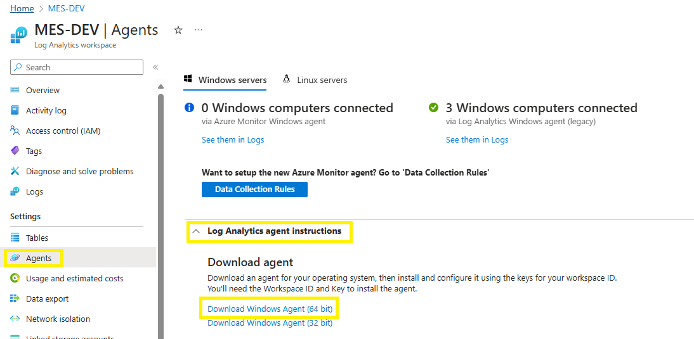

### Option 1  -  MSExchange Management Log collection

Option 1 is necessary for the following Workbooks :

* Microsoft Exchange Admin Activity
* Microsoft Exchange Search AdminAuditLog

Configure the logs to be collected - Configure the Events you want to collect and their severities.

1. Go the **Log Analytics workspace for your Sentinel**
2. Click **Legacy agents management**
3. Select **Windows Event logs**
4. Click **Add Windows event log**
5. Enter **MSExchange Management** as log name
6. Collect **Error**, **Warning** and **Information** types
7. Click **Apply**
   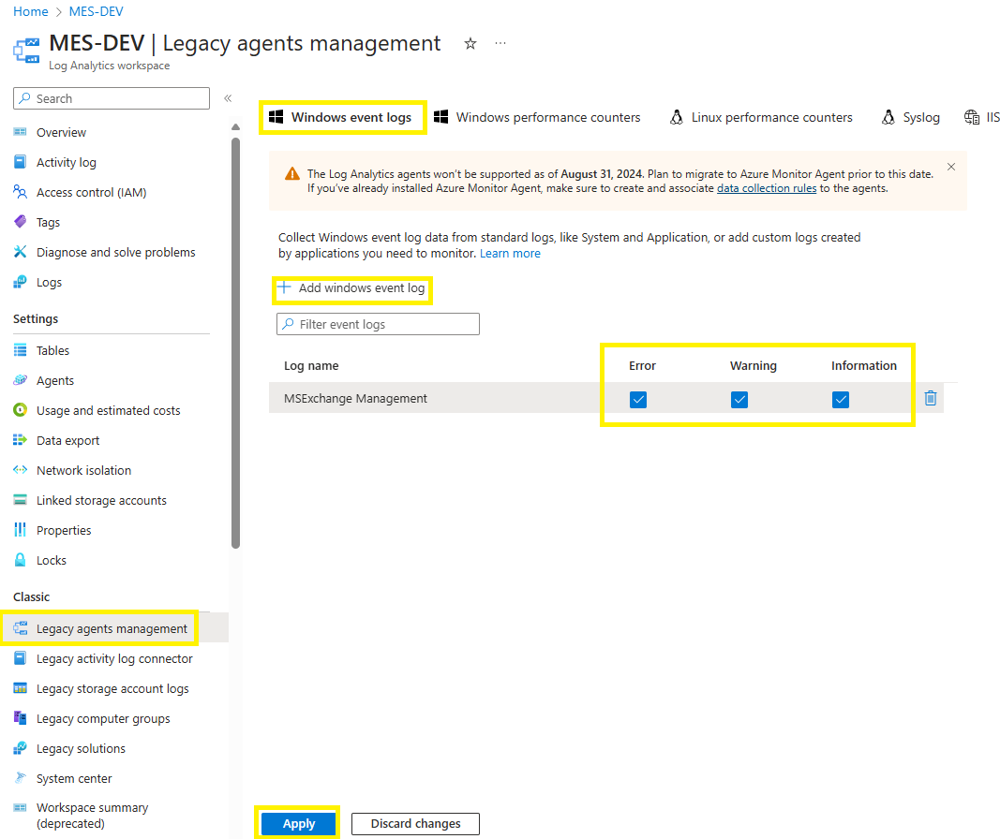

All the Exchange Servers with the Agent installed will upload the MSExchange Management log

### Option 2 - Security, Application, System for Exchange Servers

Configure the logs to be collected - Configure the Events you want to collect and their severities.

1. Go the **Log Analytics workspace for your Sentinel**
2. Click **Legacy agents management**
3. Select **Windows Event logs**
4. Click **Add Windows event log**
5. Enter **System** as log name
6. Collect **Error**, **Warning** and **Information** types
7. Enter **Application** as log name
8. Collect **Error**and  **Warning** types
9. Click **Apply**

Security logs are only avaialble with the Azure Monitor Agent

### Option 3 - Security for Domain controllers located in the Exchange AD sites

Only avaialble with the Azure Monitor Agent

### Option 4 - Security for ALL Domain controllers

Only avaialble with the Azure Monitor Agent

### Option 5 - IIS logs for Exchange servers

1. Go the **Log Analytics workspace for your Sentinel**
2. Click **Legacy agents management**
3. Select **IIS logs**
4. Ckeck **Collect W3C format IIS log files**

> Remember that depending on the number of Exchange servers and their activities, this configuration can lead to the ingestion of a huge amount af data

### Option 6 - Message tracking logs for Exchange Servers

1. Go the **Log Analytics workspace for your Sentinel**
2. Select **Tables**, click **+ Create** and click on **New custom log (MMA-Based)**
  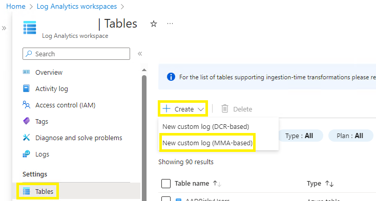

3. Go to the folder enter the path **C:\Program Files\Microsoft\Exchange Server\V15\TransportRoles\Logs\MessageTracking**. Select **any Message Tracking log file**, click **Open** and click **Next**
  
  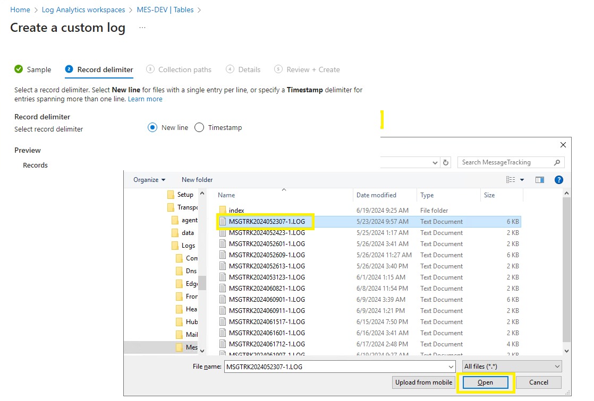
4. In **Record Delimeter**, ensure that **New line** is selected and click **Next**
5. Select type **Windows** and enter the path **C:\Program Files\Microsoft\Exchange Server\V15\TransportRoles\Logs\MessageTracking\*.log**. Click **Next**
 
  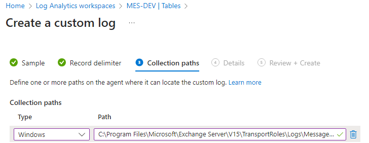
1. Enter **MessageTrackingLog** In **Custom log name** and click **Next**.

  
1. Click **Create**

### Option 7 - HTTPProxy logs for Exchange servers

1. Go the **Log Analytics workspace for your Sentinel**
2. Select **Tables**, click **+ Create** and click on **New custom log (MMA-Based)**
  

3. To provide a sample, go to the folder enter the path **C:\Program Files\Microsoft\Exchange Server\V15\Logging\HttpProxy\Mapi**. Select **any log file**, click **Open** and click **Next**
  
  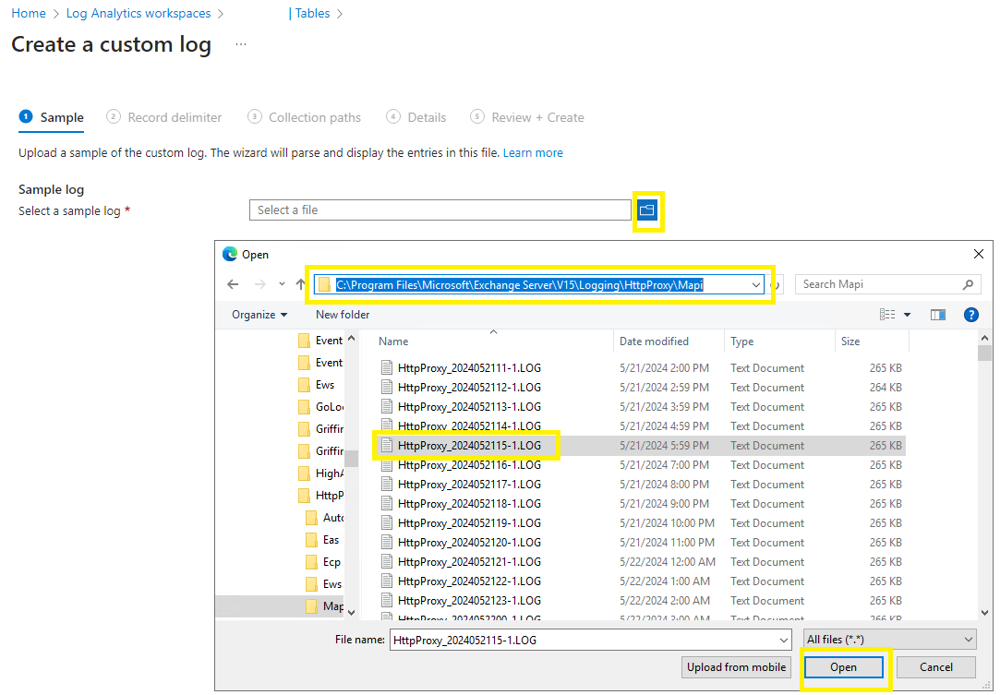
4. In **Record Delimeter**, ensure that **New line** is selected and click **Next**
5. Select type **Windows** and enter the following path and Click **Next**

   1. C:\Program Files\Microsoft\Exchange Server\V15\Logging\HttpProxy\Autodiscover*.log
   2. C:\Program Files\Microsoft\Exchange Server\V15\Logging\HttpProxy\Eas*.log
   3. C:\Program Files\Microsoft\Exchange Server\V15\Logging\HttpProxy\Ecp*.log
   4. C:\Program Files\Microsoft\Exchange Server\V15\Logging\HttpProxy\Ews*.log
   5. C:\Program Files\Microsoft\Exchange Server\V15\Logging\HttpProxy\Mapi*.log
   6. C:\Program Files\Microsoft\Exchange Server\V15\Logging\HttpProxy\Oab*.log
   7. C:\Program Files\Microsoft\Exchange Server\V15\Logging\HttpProxy\Owa*.log
   8. C:\Program Files\Microsoft\Exchange Server\V15\Logging\HttpProxy\OwaCalendar*.log
   9. C:\Program Files\Microsoft\Exchange Server\V15\Logging\HttpProxy\PowerShell*.log
   10. C:\Program Files\Microsoft\Exchange Server\V15\Logging\HttpProxy\RpcHttp*.log
 
  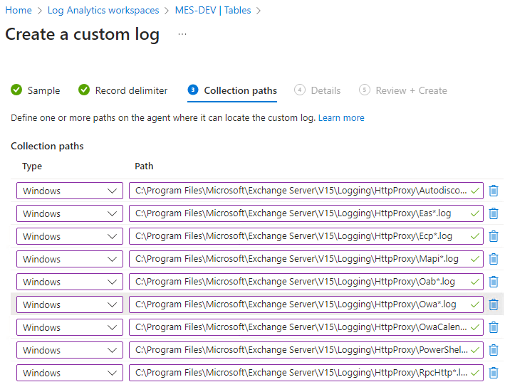
  
6. Enter **ExchangeHttpProxy** In **Custom log name** and click **Next**.

  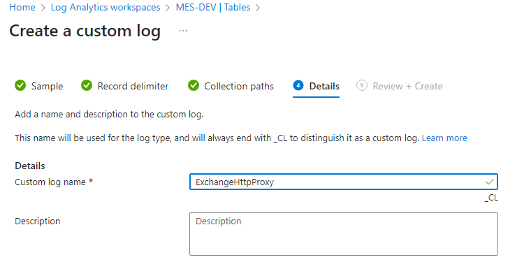
  
7. Click **Create**