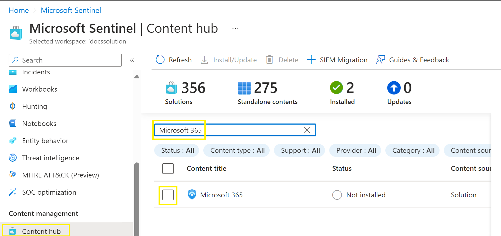
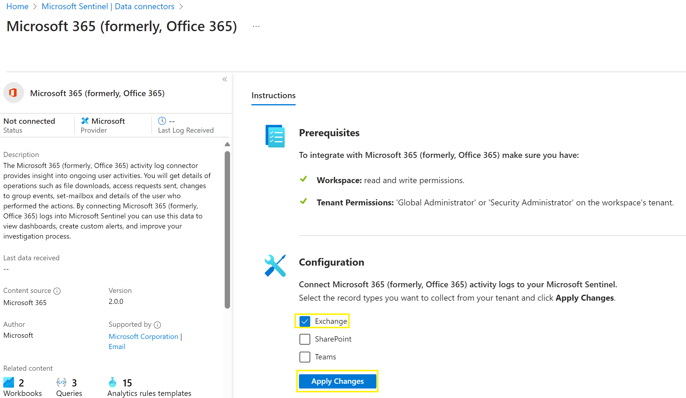
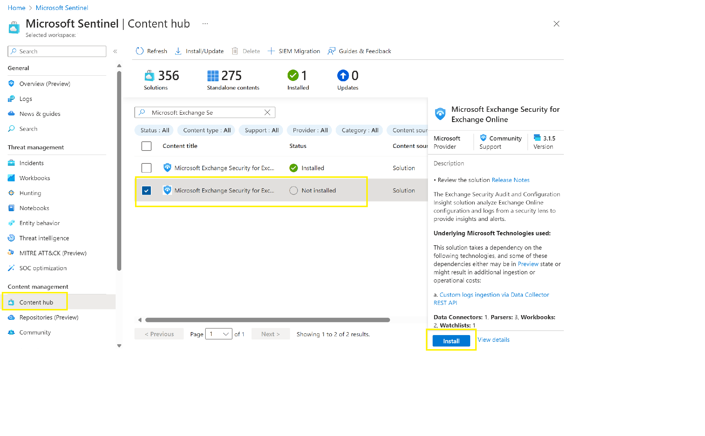
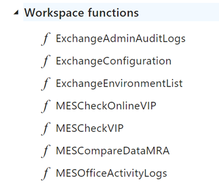
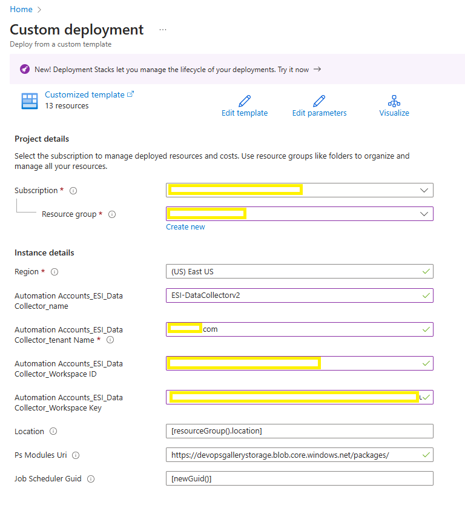
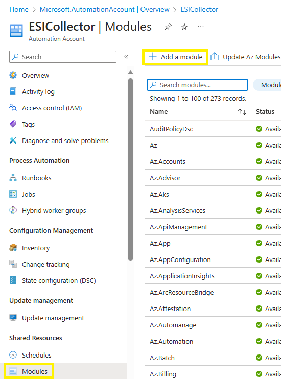
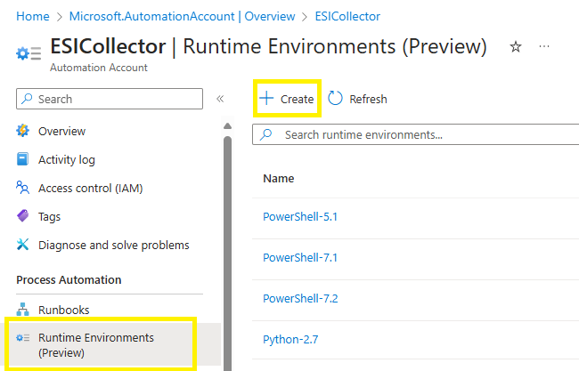
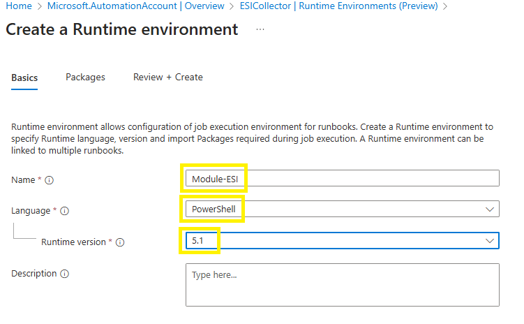
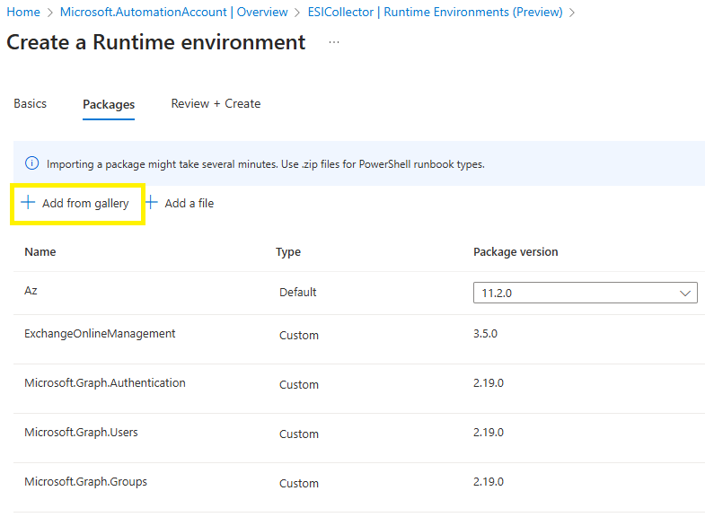

# Deployment Microsoft Exchange Security for Exchange Online

- [Deployment Microsoft Exchange Security for Exchange Online](#deployment-microsoft-exchange-security-for-exchange-online)
  - [Microsoft 365 Solution](#microsoft-365-solution)
    - [Solution Installation](#solution-installation)
    - [Solution configuration](#solution-configuration)
  - [Microsoft Exchange Security for Exchange Online Solution](#microsoft-exchange-security-for-exchange-online-solution)
  - [Prerequisites](#prerequisites)
  - [Configuration](#configuration)
    - [Parser deployment](#parser-deployment)
    - [Connector and Azure Automation deployment](#connector-and-azure-automation-deployment)
      - [Method 1 - Azure Resource Manager (ARM) Template](#method-1---azure-resource-manager-arm-template)
      - [Method 2 - Manual Deployment of Azure Automation](#method-2---manual-deployment-of-azure-automation)
    - [Assign Microsoft Graph Permission and Exchange Online Permission to Managed Identity Account](#assign-microsoft-graph-permission-and-exchange-online-permission-to-managed-identity-account)

You need de deploy two solution :
* Microsoft Exchange Security for Exchange Online : Our solutions
* Microsoft 365 : Microsoft Offical solution to ingest M365 log in Sentinel. This solution is required for the AdminAuditlog and Admin activity Workbook

## Microsoft 365 Solution

### Solution Installation
This solution needs also the the Microsoft 365 solution to ingest OfficeActivity logs in Microsoft Sentinel
1. In Microsoft Sentinel
2. Select Content Hub
3. In the search zone, type Microsoft e365
4. Select Microsoft Exchange Security for Exchange Online
5. Click Install

1. Wait for the end of the installation

### Solution configuration
1. Go to the Connector page
2. Select Microsoft 365 (formerly, Office 365)
3. Click **Open Connector Page**
4. Select **Exchange**
5. Click **Apply Change**

## Microsoft Exchange Security for Exchange Online Solution

1. In Microsoft Sentinel
2. Select Content Hub
3. In the search zone, type Microsoft exchange Security
4. Select Microsoft Exchange Security for Exchange Online
5. Click Install

1. Wait for the end of the installation

**The solution will deploy :**

* Two connectors
  * Exchange Security Insights Online Collector (using Azure Functions)
* 4 Functions also called Parsers
  * ExchangeAdminAuditLogs
  * ExchangeConfiguration
  * ExchangeEnvironmentList
  * MESCheckOnlineVIP
  * MESCompareDataMRA
  * MESOfficeActivityLogs

* 4 Workbooks template
  * Microsoft Exchange Admin Activity - Online
  * Microsoft Exchange Least Privilege with RBAC - Online
  * Microsoft Exchange Search AdminAuditLog - Online
  * Microsoft Exchange Security Review - Online

## Prerequisites

To integrate with Exchange Security Insights Online Collector (using Azure Functions) make sure you have:

* Workspace: read and write permissions on the workspace are required.
* Keys: read permissions to shared keys for the workspace are required. [See the documentation to learn more about workspace keys](https://learn.microsoft.com/en-us/azure/azure-monitor/agents/agent-windows?tabs=setup-wizard#obtain-workspace-id-and-key)
* Microsoft.Web/sites permissions: Read and write permissions to Azure Functions to create a Function App is required. [See the documentation to learn more about Azure Functions](https://learn.microsoft.com/en-us/azure/azure-functions/)
* Microsoft.automation/automationaccounts permissions: Read and write permissions to create an Azure Automation with a Runbook is required. [See the documentation to learn more about Automation Account](https://learn.microsoft.com/en-us/azure/automation/overview)
* Microsoft.Graph permissions: Groups.Read, Users.Read and Auditing.Read permissions are required to retrieve user/group information linked to Exchange Online assignments. [See the documentation to learn more](./ESICollector.md#online-collector)
* Exchange Online permissions: Exchange.ManageAsApp permission and Global Reader or Security Reader Role are needed to retrieve the Exchange Online Security Configuration.[See the documentation to learn more](./ESICollector.md#online-collector)
* (Optional) Log Storage permissions: Storage Blob Data Contributor to a storage account linked to the Automation Account Managed identity or an Application ID is mandatory to store logs.[See the documentation to learn more](./ESICollector.md#online-collector)

## Configuration

> NOTE - UPDATE: We recommend to Update the Collector to Version 7.6.0.0 or highier.
> The Collector Script Update procedure could be found here : ESI Online Collector Update.

> NOTE: This connector uses Azure Automation to connect to 'Exchange Online' to pull its Security analysis into Microsoft Sentinel. This might result in additional data ingestion costs. Check the Azure Automation pricing page for details.

### Parser deployment

>NOTE:  To work as expected, this data connector depends on a parser based on a Kusto Function. **(When standard deployement, Parsers are automatically deployed)**
>List of Parsers that will be automatically deployed :

* ExchangeAdminAuditLogs
* ExchangeConfiguration
* ExchangeEnvironmentList
* MESCheckOnlineVIP
* MESCompareDataMRA
* MESOfficeActivityLogs

> More detailed information on Parsers can be found in the following documentation
[Parser information](./../../Parsers/README.md)

### Connector and Azure Automation deployment

Before deploying the 'ESI Exchange Online Security Configuration' connector,  you need the Workspace ID and Workspace Primary Key.
Two methods to find the Workspace ID and the Key: 

1. Go to the connector and copy the Workspace ID and the Key
2. Go to the Log Analytics Workspace
   1. To find the **Workspace ID and the Key**, go the **Log Analytics workspace for your Sentinel**
   2. Select **Agents** in the **Settings** section
   3. Extend the **Log Analytics Agent Instructions**
   4. Retrieve the **Workspace ID and Primary Key**
   

Choose ONE from the following two deployment options to deploy the connector and the associated Azure Automation

#### Method 1 - Azure Resource Manager (ARM) Template
   1. Go the **Exchange Security Insights Online Collector (using Azure Functions)** data connector Page
   2. **Option 1 - Azure Resource Manager (ARM) Template**
   3. Click on **Deploy to Azure**
   4. Select the preferred **Subscription**, **Resource Group**, **Region**
   5. Automation **Account_ESI-DataCollector_name**
   6. Automation **Account_ESI-DataCollector_tenant name** - Enter the FQDN of your primary domain
   7. Enter **Workspace Name**
   8. Click **Next** and **Create**
   
   

#### Method 2 - Manual Deployment of Azure Automation
1. Create the Azure Automation Account
   1. From the Azure Portal, navigate to **Azure Automation Account**.
   2. Click **+ Add** at the top
   3. In the **Basics** tab, fill the required fields and give a **Name** to the Azure Automation
   4. In the **Advanced** and **Networking** and Tags Tabs, leave fields as default if you don't need to customize them
   5. 'Make other preferable configuration changes', if needed, then click **Create**.
2. Add **Exchange Online Management Module**, **Microsoft Graph Authentication**,**Microsoft Graph  User** and **Microsoft Graph Group** Modules
3. Depending of you GUI Experience, it can be at two different places
   1. Method 1:  On the **Automation Account** page, select **Modules**

  
      1. Click on **Browse** gallery and search the **ExchangeOnlineManagement** module
      2. Select it and click on **Select**
      3. Choose **Version 5.1** on Runtime version field and click on **Import** button
      4. Repeat the step for the following modules : **Microsoft.Graph.Authentication, Microsoft.Graph.Users and Microsoft.Graph.Groups**
   1. Method 2 : Go to in **Runbook Environments(Preview)**
      1. Click on **Create**
   

      2. Give a **name** for the Runtime environment
      3. **Language**, select **Powershell**
      4.  **Version**, select **5.1**

   
   
      5. Click **Next**
      6. Clcik **+ Add from Gallery**
      7. Add the following module : **Exchange Online Management Module**, **Microsoft Graph (Authentication, User and Group)**

   
       
       8. Click **Create**

> **Attention, you need to wait for Microsoft.Graph.Authentication installation before processing next modules**
3. Download the Runbook Content
   1. Download the latest version of ESI Collector. The latest version can be found here : [Script Location](https://aka.ms/ESI-ExchangeCollector-Script)
   2. Unzip the file to find the JSON file and the PS1 file for next step
4. Create Runbook
   1. On the **Automation Account page**, select the **Runbooks** button
   2. Click on **Create** a runbook and name it like **ESI-Collector** with a runbook type **PowerShell**
   3. New GUI experience
      1. Runtime **Version 5.1** and click **Create**
      2. Click **Select from existin**g and choose the Runtime environment create in the Previous steps and click **Create**
   4. Classic GUI
      1. Import the **content of the PS1** in the Runbook window
      2. Open the file CollectExchSecIns.ps1 in the folder that unzip in the previous step
   5. Click on **Publish** and **Yes**
5. Create GlobalConfiguration Variable
   1. On the **Automation Account page**, select the **Variables** button
   2. Click on **Add a Variable** and name it exaclty '**GlobalConfiguration**' with a type **String**
   3. On **Value** field, copy the content of JSON file extract from the zip file
      1. Open the file CollectExchSecConfiguration.json in the folder that unzip in the previous step
   4. Inside the content, replace the values of **WorkspaceID** and **WorkspaceKey**
   5. Click on **Create** button
6. Create TenantName Variable
   1. On the **Automation Account page**, select the **Variables** button
   2. Click on **Add a Variable** and name it exaclty '**TenantName**' with a type String
   3. On **Value** field, **write the tenant name** of your Exchange Online
   4. Click on **Create** button
7.  Create LastDateTracking Variable
    1.  On the **Automation Account page**, select the **Variables** button
    2.  Click on **Add a Variable** and name it exaclty **LastDateTracking** with a type String
    3.  On **Value** field, write **Never**
    4.  Click on **Create** button
8.  Create a Runbook Schedule
    1.  On the **Automation Account page**, select the **Runbook** button and click on your runbook you create in the previous steps
    2.  Click on **Schedules** and **Add** a schedule button, chosse Link a Schedule to your Workbook
    3.  Click on **Schedule**, **Add a Schedule** and name it. Choose the time, Select **Recurring** value with a reccurence of every **1 day**, click **Create**
    4.  Click on **Configure parameters and run settings**. Leave all empty and click on OK and OK again

### Assign Microsoft Graph Permission and Exchange Online Permission to Managed Identity Account

> The following steps are not part of the automatic deployment. They need to be perform whenever you choose manual or automatic deployment for the Azure Automation account.

To be able to collect Exchange Online information and to be able to retrieve User information and memberlist of admin groups, the automation account need multiple permission.
1. Download Permission Script
   1. [Permission Update script](./../Solutions/ESICollector/OnlineDeployment/ExchangeOnlinePermSetup.ps1)
2. Retrieve the Azure Automation Managed Identity GUID and insert it in the downloaded script
   1. Go to your **Automation Account**
   2. In the **Account Settings / Identity** Section. You can find the **Guid** of your Managed Identity
   3. Replace the GUID in **$MI_ID** = "XXXXXXXXXXX" with the GUID of your Managed Identity
3. Launch the script with a **Global-Administrator** account
> Attention this script requires **MSGraph Modules and Admin Consent** to access to your tenant with Microsoft Graph.
>If you want to check, The script will add 3 permissions to the Managed identity: 
   - **Exchange Online ManageAsApp permission**
   - **User.Read.All on Microsoft Graph API**
   - **Group.Read.All on Microsoft Graph API**
1. Exchange Online Role Assignment
   1. In **Entra**, as a **Global Administrator**, go to **Roles and Administrators**
   2. Select **Global Reader** role and click to **Add assignments**
   3. Click on **No member selected** and search your **Managed Identity account Name** beginning by the name of your automation account like **ESI-Collector**. Select it and click on **Select**
   4. Click **Next** and validate the assignment by clicking **Assign**
