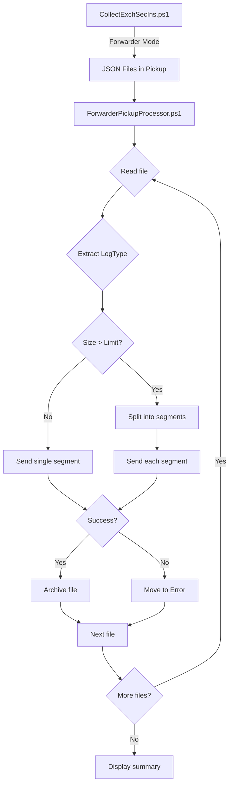

# Forwarder Pickup Processor

## 📋 Overview

The **Forwarder Pickup Processor** is a standalone PowerShell script that processes JSON files generated by `CollectExchSecIns.ps1` (forwarder mode) and injects them into Microsoft Sentinel.

### Main Features

- ✅ **Support for both APIs**: Log Analytics API (classic) and Log Ingestion API (DCR-based)
- ✅ **Batch processing**: Processes multiple files in a single execution
- ✅ **Automatic segmentation**: Splits large files into segments compliant with API limits
- ✅ **Robust error handling**: Archives successful files, isolates error files
- ✅ **Complete logging**: Detailed trace of all operations
- ✅ **Flexible authentication**: Managed Identity, Service Principal, or Interactive
- ✅ **Proxy support**: Proxy configuration for secure environments
- ✅ **Intelligent table name extraction**: Deduces log type from filename

---

## 🚀 Installation and Configuration

### 1. Prerequisites

#### Required PowerShell modules:
```powershell
# Azure Az module (for Log Ingestion API)
Install-Module -Name Az.Accounts -Force -Scope CurrentUser
Install-Module -Name Az.Monitor -Force -Scope CurrentUser

# Verify installation
Get-Module -Name Az.Accounts -ListAvailable
```

#### Required Azure permissions:

**For Log Ingestion API (DCR-based):**
- Role: **Monitoring Metrics Publisher** on the Data Collection Rule (DCR)
- Service Principal or Managed Identity configured

**For Log Analytics API (classic):**
- Workspace ID and Primary/Secondary Key from Log Analytics Workspace

### 2. JSON File Configuration

Edit `Config\ForwarderPickupConfig.json`:

```json
{
    "PickupFolder": "C:\\ESI\\ForwarderPickup",
    "ArchiveFolder": "C:\\ESI\\Archive",
    "ErrorFolder": "C:\\ESI\\Error",
    "LogFolder": "C:\\ESI\\Logs",
    "DeleteAfterProcessing": false,
    "MaxFilesPerRun": 0,
    "FilePattern": "*.json",
    "SentinelConnection": {
        "UseManagedIdentity": false,
        "UseLogIngestionAPI": true,
        "DataCollectionEndpointURI": "https://your-dce.ingest.monitor.azure.com",
        "DCRImmutableId": "dcr-xxxxxxxxxxxxxxxxxxxxxxxxxxxxxxxx",
        "TenantID": "your-tenant-id",
        "ApplicationId": "your-app-id",
        "CertificateThumbprint": "THUMBPRINT",
        "DefaultLogType": "ESIExchangeConfig",
        "MaxSegmentSizeMb": 0.9
    }
}
```

### 3. CollectExchSecIns.ps1 Configuration

In your `CollectExchSecConfiguration.json` configuration, enable forwarder mode:

```json
{
    "SentinelLogCollector": {
        "ActivateLogUpdloadToSentinel": true,
        "UseForwarder": true,
        "ForwarderPickupPath": "C:\\ESI\\ForwarderPickup",
        "TogetherMode": false
    }
}
```

---

## 📖 Usage

### Manual Execution

#### With default configuration:
```powershell
.\ForwarderPickupProcessor.ps1
```

#### With command-line parameters:
```powershell
.\ForwarderPickupProcessor.ps1 `
    -PickupFolder "C:\ESI\ForwarderPickup" `
    -ArchiveFolder "C:\ESI\Archive" `
    -MaxFilesPerRun 50
```

#### Delete files after processing:
```powershell
.\ForwarderPickupProcessor.ps1 -DeleteAfterProcessing
```

#### With proxy:
```powershell
.\ForwarderPickupProcessor.ps1 `
    -UseProxy `
    -ProxyUrl "http://proxy.contoso.com:8080"
```

### Scheduling

#### With Windows Task Scheduler:

1. **Create task**:
```powershell
$action = New-ScheduledTaskAction `
    -Execute "PowerShell.exe" `
    -Argument "-NoProfile -ExecutionPolicy Bypass -File `"C:\ESI\ForwarderPickupProcessor.ps1`""

$trigger = New-ScheduledTaskTrigger -Once -At (Get-Date) -RepetitionInterval (New-TimeSpan -Minutes 15) -RepetitionDuration ([TimeSpan]::MaxValue)

$principal = New-ScheduledTaskPrincipal -UserId "DOMAIN\ServiceAccount" -LogonType Password

$settings = New-ScheduledTaskSettingsSet `
    -AllowStartIfOnBatteries `
    -DontStopIfGoingOnBatteries `
    -StartWhenAvailable `
    -RunOnlyIfNetworkAvailable

Register-ScheduledTask `
    -TaskName "ESI Forwarder Processor" `
    -Action $action `
    -Trigger $trigger `
    -Principal $principal `
    -Settings $settings `
    -Description "Processes pickup files and sends to Sentinel every 15 minutes"
```

2. **With Managed Identity (Azure VM)**:
```powershell
# Task runs under SYSTEM account which has access to Managed Identity
$principal = New-ScheduledTaskPrincipal -UserId "SYSTEM" -LogonType ServiceAccount
```

#### With Azure Automation (Runbook):

```powershell
# Import script to Azure Automation
$AutomationAccountName = "YourAutomationAccount"
$ResourceGroupName = "YourResourceGroup"
$RunbookName = "ForwarderPickupProcessor"

Import-AzAutomationRunbook `
    -Name $RunbookName `
    -Path ".\ForwarderPickupProcessor.ps1" `
    -ResourceGroupName $ResourceGroupName `
    -AutomationAccountName $AutomationAccountName `
    -Type PowerShell

# Publish runbook
Publish-AzAutomationRunbook `
    -Name $RunbookName `
    -ResourceGroupName $ResourceGroupName `
    -AutomationAccountName $AutomationAccountName

# Create schedule
$Schedule = New-AzAutomationSchedule `
    -Name "Every15Minutes" `
    -StartTime (Get-Date).AddMinutes(5) `
    -DayInterval 1 `
    -ResourceGroupName $ResourceGroupName `
    -AutomationAccountName $AutomationAccountName `
    -TimeZone "Romance Standard Time"

# Associate with runbook
Register-AzAutomationScheduledRunbook `
    -Name $RunbookName `
    -ScheduleName "Every15Minutes" `
    -ResourceGroupName $ResourceGroupName `
    -AutomationAccountName $AutomationAccountName
```

---

## 🔧 Script Parameters

| Parameter | Type | Description | Default |
|-----------|------|-------------|---------|
|-----------|------|-------------|--------|
| `ConfigurationFile` | string | Path to JSON configuration file | `.\Config\ForwarderPickupConfig.json` |
| `PickupFolder` | string | Folder containing files to process | Value from config file |
| `ArchiveFolder` | string | Archive folder for successful files | Value from config file |
| `ErrorFolder` | string | Folder for error files | Value from config file |
| `MaxFilesPerRun` | int | Max files per execution (0=unlimited) | 0 |
| `DeleteAfterProcessing` | switch | Delete instead of archive | false |
| `UseProxy` | switch | Enable proxy usage | false |
| `ProxyUrl` | string | Proxy URL | "" |

---

## 📁 Folder Structure

```
C:\ESI\
├── ForwarderPickup\          # JSON files deposited by CollectExchSecIns.ps1
│   ├── ESIExchangeConfig-2026-03-24-10-30-00.json
│   └── ESIExchangeConfig-Page_1-2026-03-24-10-30-00.json
├── Archive\                  # Successfully processed files
│   └── ESIExchangeConfig-2026-03-24-10-30-00.json
├── Error\                    # Error files
│   └── ESIExchangeConfig-corrupted.json
└── Logs\                     # Forwarder execution logs
    └── ForwarderProcessor_20260324_103000.log
```

---

## 🏷️ Table Name Extraction

The script intelligently extracts the Sentinel table name from the filename:

| Filename | Sentinel Table |
|----------------|----------------|
|----------------|----------------|
| `ESIExchangeConfig-2026-03-24.json` | `ESIExchangeConfig_CL` |
| `ESIExchangeConfig-Page_1-2026-03-24.json` | `ESIExchangeConfig_CL` |
| `MyCustomTable-abc123.json` | `MyCustomTable_CL` |
| `data.json` | `ESIExchangeConfig_CL` (default) |

> **Note**: The `_CL` suffix (Custom Log) is automatically added by Azure

---

## 🔐 Authentication Configuration

### 1. Managed Identity (recommended for Azure VM/Automation)

```json
{
    "SentinelConnection": {
        "UseManagedIdentity": true,
        "UseLogIngestionAPI": true,
        "DataCollectionEndpointURI": "https://xxx.ingest.monitor.azure.com",
        "DCRImmutableId": "dcr-xxx"
    }
}
```

**Role assignment**:
```powershell
# Get Managed Identity Object ID
$vmName = "YourVMName"
$rgName = "YourResourceGroup"
$vm = Get-AzVM -Name $vmName -ResourceGroupName $rgName
$principalId = $vm.Identity.PrincipalId

# Assign role on DCR
$dcrResourceId = "/subscriptions/{sub-id}/resourceGroups/{rg}/providers/Microsoft.Insights/dataCollectionRules/{dcr-name}"
New-AzRoleAssignment `
    -ObjectId $principalId `
    -RoleDefinitionName "Monitoring Metrics Publisher" `
    -Scope $dcrResourceId
```

### 2. Service Principal with certificate

```json
{
    "SentinelConnection": {
        "UseManagedIdentity": false,
        "UseLogIngestionAPI": true,
        "TenantID": "your-tenant-id",
        "ApplicationId": "your-app-id",
        "CertificateThumbprint": "ABC123...",
        "DataCollectionEndpointURI": "https://xxx.ingest.monitor.azure.com",
        "DCRImmutableId": "dcr-xxx"
    }
}
```

**Certificate installation**:
```powershell
# Import certificate to local store
$certPath = "C:\Certs\SentinelApp.pfx"
$certPassword = ConvertTo-SecureString "YourPassword" -AsPlainText -Force
Import-PfxCertificate -FilePath $certPath -CertStoreLocation Cert:\LocalMachine\My -Password $certPassword
```

### 3. Log Analytics API classic

```json
{
    "SentinelConnection": {
        "UseLogIngestionAPI": false,
        "WorkspaceId": "12345678-1234-1234-1234-123456789012",
        "WorkspaceKey": "YourPrimaryOrSecondaryKey==",
        "MaxSegmentSizeMb": 31.9
    }
}
```

---

## 📊 Monitoring and Diagnostics

### Execution Logs

Logs are stored in the configured folder (`LogFolder`):

```
[2026-03-24 10:30:00] [Info] === Forwarder Pickup Processor v1.0.0 ===
[2026-03-24 10:30:00] [Info] Started at: 2026-03-24 10:30:00
[2026-03-24 10:30:01] [Info] Found 5 file(s) to process
[2026-03-24 10:30:05] [Success] Data successfully uploaded to Log Ingestion API
[2026-03-24 10:30:05] [Success] Successfully processed file: ESIExchangeConfig.json
[2026-03-24 10:30:10] [Success] === Processing Summary ===
[2026-03-24 10:30:10] [Success] Total files processed: 5
[2026-03-24 10:30:10] [Success] Failed files: 0
[2026-03-24 10:30:10] [Success] Total data processed: 12.5 MB
```

### Verification in Sentinel

```kql
// Check ingested data
ESIExchangeConfig_CL
| where TimeGenerated > ago(1h)
| summarize count() by bin(TimeGenerated, 5m)
| render timechart

// Check data by environment
ESIExchangeConfig_CL
| where TimeGenerated > ago(24h)
| summarize RecordCount=count(), LastSeen=max(TimeGenerated) by ESIEnvironment
```

---

## ⚠️ Troubleshooting

### Error: "Failed to connect to Azure"

**Cause**: Authentication problem

**Solution**:
- Check that certificate is installed and accessible
- Check Managed Identity permissions
- Test manually: `Connect-AzAccount`

### Error: "Upload payload is too big"

**Cause**: File too large for a segment

**Solution**:
- Script automatically segments
- Check `MaxSegmentSizeMb` in config (0.9 for DCR, 31.9 for Log Analytics)

### Files remain in Pickup folder

**Cause**: Unhandled errors or script not scheduled

**Solution**:
- Check logs in `LogFolder`
- Check files in `ErrorFolder`
- Execute manually to diagnose

### Data doesn't appear in Sentinel

**Cause**: Table doesn't exist or DCR misconfigured

**Solution**:
- For DCR: Check that stream is configured in DCR
- For Log Analytics: Table creates automatically (wait 10-15 min)
- Check permissions on DCR/Workspace

---

## 🔄 Complete Workflow



---

## 📝 Best Practices

1. **Scheduling**: Execute every 5-15 minutes for regular flow
2. **Cleanup**: Archive and purge old files periodically
3. **Monitoring**: Monitor logs and Error folder
4. **Testing**: Test first with `MaxFilesPerRun=1` before production
5. **Security**: Use Managed Identity when possible
6. **Performance**: Adjust `MaxSegmentSizeMb` according to API used

---

## 📞 Support

For questions or issues:
- Check logs in `LogFolder` folder
- Consult Microsoft Sentinel documentation
- Contact ESI team: nilepagn@microsoft.com

---

## 📜 Version History

### v1.0.0 (2026-03-24)
- ✨ Initial version
- ✅ Log Analytics API and Log Ingestion API support
- ✅ Automatic segment management
- ✅ Archiving and error handling
- ✅ Complete logging
- ✅ Managed Identity and Service Principal support
