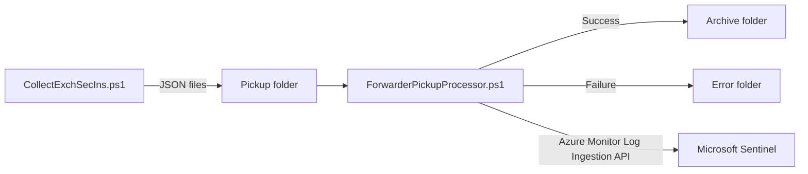

# Forwarder Pickup Processor

## Overview

The Forwarder Pickup Processor is a PowerShell component included with the Exchange Security Insights Collector package. It processes JSON files written by `CollectExchSecIns.ps1` and sends them to Microsoft Sentinel.

Use the Forwarder when the Exchange collector cannot connect directly to the Azure Monitor ingestion endpoint but can write files to a location accessible by another Windows server.

For a short installation path, see [Forwarder Pickup Processor quick start](./QUICKSTART-Forwarder.md).

## Architecture



The processor:

- Reads JSON files from `PickupFolder`.
- Extracts the log type from each filename.
- Splits payloads that exceed `MaxSegmentSizeMb`.
- Sends data to the DCR stream.
- Archives successful files or moves failed files to `ErrorFolder`.
- Writes execution logs to `LogFolder`.

## Package contents

The collector package provides:

```text
Forwarder\
|-- ForwarderPickupProcessor.ps1
|-- Install-ForwarderScheduledTask.ps1
|-- QUICKSTART-Forwarder.md
|-- README-ForwarderPickup.md
`-- Config\
    `-- ForwarderPickupConfig.json
```

## Prerequisites

### PowerShell

- Windows PowerShell 5.1.
- `Az.Accounts` for Azure Monitor authentication.
- An elevated session for scheduled-task installation.

```powershell
Install-Module -Name Az.Accounts -Repository PSGallery -Scope AllUsers -Force
Get-Module -Name Az.Accounts -ListAvailable
```

`Az.Monitor` is optional and is needed only for commands that inspect DCR resources.

### Azure Monitor

- The DCE and DCR created by the Microsoft Sentinel data connector.
- The DCR immutable ID.
- The identity used by the Forwarder must have **Monitoring Metrics Publisher** on the DCR.
- The configured stream must match the DCR. For the on-premises collector, the expected stream is `Custom-ESIExchangeConfig`.

### Authentication

Use one of the following unattended authentication methods:

- **Certificate authentication:** Recommended for a non-Azure Windows server. Install the certificate and private key in a certificate store accessible to the scheduled-task service account.
- **Managed identity:** Supported when the Forwarder runs on an Azure VM with a system-assigned managed identity. Run the task as `SYSTEM`.

Interactive authentication is suitable only for manual testing and must not be used by a scheduled task.

## Configure the Exchange collector

In `Config\CollectExchSecConfiguration.json`, configure `LogCollection`:

```json
{
  "LogCollection": {
    "ActivateLogUpdloadToSentinel": "true",
    "UseForwarder": "true",
    "ForwarderPickupPath": "C:\\ESI\\ForwarderPickup",
    "LogTypeName": "ESIExchangeConfig"
  }
}
```

`ForwarderPickupPath` must match the Forwarder's `PickupFolder`.

When forwarder mode is enabled, `CollectExchSecIns.ps1` writes the collected output to this folder instead of sending it directly.

## Configure ForwarderPickupConfig.json

Edit `Forwarder\Config\ForwarderPickupConfig.json`.

### Folder and processing settings

| Setting | Description | Default |
|---------|-------------|---------|
| `PickupFolder` | Folder containing JSON files to process | `C:\ESI\ForwarderPickup` |
| `ArchiveFolder` | Destination for successfully processed files | `C:\ESI\Archive` |
| `ErrorFolder` | Destination for failed files | `C:\ESI\Error` |
| `LogFolder` | Folder containing processor logs | `C:\ESI\Logs` |
| `DeleteAfterProcessing` | Delete successful files instead of archiving | `false` |
| `MaxFilesPerRun` | Maximum files processed per execution; `0` means unlimited | `0` |
| `FilePattern` | File selection pattern | `*.json` |

The processor creates missing folders automatically.

### Azure Monitor settings

| Setting | Description |
|---------|-------------|
| `UseManagedIdentity` | Use the Azure VM managed identity |
| `UseLogIngestionAPI` | Keep set to `true` for Azure Monitor ingestion |
| `DataCollectionEndpointURI` | DCE ingestion URI |
| `DCRImmutableId` | DCR immutable ID |
| `TenantID` | Microsoft Entra tenant ID for certificate authentication |
| `ApplicationId` | Application ID for certificate authentication |
| `CertificateThumbprint` | Certificate thumbprint for certificate authentication |
| `DefaultLogType` | Fallback stream name without the `Custom-` prefix |
| `MaxSegmentSizeMb` | Maximum payload size; use `0.9` for the Log Ingestion API |

The processor automatically adds the `Custom-` prefix before calling the Log Ingestion API.

### Proxy settings

```json
{
  "Proxy": {
    "UseProxy": true,
    "ProxyUrl": "http://proxy.contoso.com:8080"
  }
}
```

The current implementation supports a proxy URL without explicit proxy credentials.

## Authentication examples

### Certificate authentication

```json
{
  "SentinelConnection": {
    "UseManagedIdentity": false,
    "UseLogIngestionAPI": true,
    "DataCollectionEndpointURI": "https://your-dce.ingest.monitor.azure.com",
    "DCRImmutableId": "dcr-xxxxxxxxxxxxxxxxxxxxxxxxxxxxxxxx",
    "TenantID": "your-tenant-id",
    "ApplicationId": "your-application-id",
    "CertificateThumbprint": "your-certificate-thumbprint",
    "DefaultLogType": "ESIExchangeConfig",
    "MaxSegmentSizeMb": 0.9
  }
}
```

Grant the scheduled-task service account read access to the certificate private key.

### Azure VM managed identity

```json
{
  "SentinelConnection": {
    "UseManagedIdentity": true,
    "UseLogIngestionAPI": true,
    "DataCollectionEndpointURI": "https://your-dce.ingest.monitor.azure.com",
    "DCRImmutableId": "dcr-xxxxxxxxxxxxxxxxxxxxxxxxxxxxxxxx",
    "DefaultLogType": "ESIExchangeConfig",
    "MaxSegmentSizeMb": 0.9
  }
}
```

Assign **Monitoring Metrics Publisher** to the VM managed identity on the DCR.

## Test the processor

Run the collector once and confirm that it creates JSON files in `PickupFolder`.

Then run:

```powershell
.\ForwarderPickupProcessor.ps1 `
    -ConfigurationFile ".\Config\ForwarderPickupConfig.json" `
    -MaxFilesPerRun 1
```

## Install the scheduled task

Run PowerShell as administrator from the `Forwarder` folder.

### Service account

```powershell
.\Install-ForwarderScheduledTask.ps1 `
    -ServiceAccount "CONTOSO\svc-esi" `
    -IntervalMinutes 15
```

The installer prompts for the service account password.

### Azure VM managed identity

```powershell
.\Install-ForwarderScheduledTask.ps1 `
    -UseSystemAccount `
    -IntervalMinutes 15
```

### Custom paths

```powershell
.\Install-ForwarderScheduledTask.ps1 `
    -TaskName "ESI Forwarder Processor" `
    -ScriptPath "C:\ESI\Forwarder\ForwarderPickupProcessor.ps1" `
    -ConfigPath "C:\ESI\Forwarder\Config\ForwarderPickupConfig.json" `
    -IntervalMinutes 10
```

The installer:

- Requires administrator privileges.
- Creates a task that repeats at the selected interval.
- Prevents overlapping executions.
- Uses an execution time limit of one hour.
- Can replace an existing task after confirmation.
- Can start the task immediately for testing.

## Script parameters

### ForwarderPickupProcessor.ps1

| Parameter | Description | Default |
|-----------|-------------|---------|
| `ConfigurationFile` | Path to the JSON configuration | `Config\ForwarderPickupConfig.json` |
| `PickupFolder` | Override `PickupFolder` | Configuration value |
| `ArchiveFolder` | Override `ArchiveFolder` | Configuration value |
| `ErrorFolder` | Override `ErrorFolder` | Configuration value |
| `MaxFilesPerRun` | Override the maximum files per execution | `0` |
| `DeleteAfterProcessing` | Delete successful files instead of archiving | `false` |
| `UseProxy` | Enable the configured proxy | `false` |
| `ProxyUrl` | Override the proxy URL | Empty |

### Install-ForwarderScheduledTask.ps1

| Parameter | Description | Default |
|-----------|-------------|---------|
| `TaskName` | Scheduled-task name | `ESI Forwarder Processor` |
| `ScriptPath` | Path to the processor script | Script in the current Forwarder folder |
| `IntervalMinutes` | Repetition interval | `15` |
| `ServiceAccount` | Service account used by the task | Current account |
| `UseSystemAccount` | Run as `SYSTEM` for Azure VM managed identity | `false` |
| `ConfigPath` | Path to the Forwarder configuration | `Config\ForwarderPickupConfig.json` |

## File naming and streams

The processor derives the log type from the JSON filename by removing:

- A `-YYYY-MM-DD-HH-mm-ss` timestamp.
- A GUID suffix.
- A `-Page_<number>` suffix.

If no log type can be determined, it uses `DefaultLogType`.

For Azure Monitor ingestion, the processor prefixes the log type with `Custom-`. For example:

| Filename | Extracted log type | DCR stream |
|----------|--------------------|------------|
| `ESIExchangeConfig-2026-03-24-10-30-00.json` | `ESIExchangeConfig` | `Custom-ESIExchangeConfig` |
| `ESIExchangeConfig-Page_1-2026-03-24.json` | `ESIExchangeConfig` | `Custom-ESIExchangeConfig` |

## Monitoring

### Processor logs

Logs are written to `LogFolder` with names such as:

```text
ForwarderProcessor_20260324_103000.log
```

### Scheduled task

```powershell
Get-ScheduledTask -TaskName "ESI Forwarder Processor" |
    Get-ScheduledTaskInfo
```

### Microsoft Sentinel

```kql
ESIAPIExchangeOnPremConfig_CL
| where TimeGenerated > ago(1h)
| summarize Records = count(), LastIngestion = max(TimeGenerated)
```

## Troubleshooting

### Files remain in PickupFolder

- Confirm that the scheduled task is enabled.
- Run the processor manually.
- Review the latest log in `LogFolder`.
- Check whether failed files were moved to `ErrorFolder`.

### Authentication fails

- Confirm that `Az.Accounts` is installed.
- For certificate authentication, verify the tenant ID, application ID, thumbprint, certificate location, and private-key permissions.
- For managed identity, verify that the process runs on an Azure VM with an enabled system-assigned identity.
- Confirm that the identity has **Monitoring Metrics Publisher** on the DCR.

### HTTP 400 or InvalidPayload

- Confirm that `DCRImmutableId` targets the correct DCR.
- Confirm that `DefaultLogType` and the filename produce the stream expected by the DCR.
- Keep `MaxSegmentSizeMb` at `0.9`.

### No data appears

- Verify the DCE URI and DCR immutable ID.
- Confirm that the file was archived, which indicates a successful request.
- Query `ESIAPIExchangeOnPremConfig_CL`.
- Review the processor log for HTTP errors.

### Scheduled-task creation fails

- Run PowerShell as administrator.
- Confirm that the processor and configuration paths exist.
- Confirm that the task account credentials are valid.
- Remove or replace an existing task with the same name.

## Related documentation

- [Forwarder quick start](./QUICKSTART-Forwarder.md)
- [Configure the on-premises collector with Azure Monitor](../Documentations/README_LogIngestionAPI.md)
- [Collector prerequisites](../Documentations/ESICollector.md)
- [Configure the collector with WinformConfig](../Documentations/WinformConfigReadme.md)
