# Workbooks

- [Workbooks](#workbooks)
  - [Group creation in Entra ID](#group-creation-in-entra-id)
  - [Creation of the custom role to access Log Analytics](#creation-of-the-custom-role-to-access-log-analytics)
  - [Create a dédicated workspace for the workbook](#create-a-dédicated-workspace-for-the-workbook)
  - [Set Permissions on the Resource Group](#set-permissions-on-the-resource-group)
  - [Set Permissions in Log Analytics](#set-permissions-in-log-analytics)
  - [Save the Workbook in the dedicated Resource Group](#save-the-workbook-in-the-dedicated-resource-group)
  - [Access to the workbook](#access-to-the-workbook)

If the teams that needs to review the Workbook are not part of the Sentinel Team, delegation should be set.
There are several solution to reach this goal, here a solution that also could be adapted.
The solution is to create a separate **Resource Group** for storing the Workbook and delegate the appropriate permission to a group.

It is recommended to do the delegation on a group rather than a user.

## Group creation in Entra ID
1. Create the group in EntraID
   1. Example ESI_Workbook_Delegation
   2. Add appropriate Entra ID account in the group

## Creation of the custom role to access Log Analytics
1. In Azure Portal, go to the **Subscription**
2. Select Access Control (IAM)
3. Click Add and Choose Add custom Role
   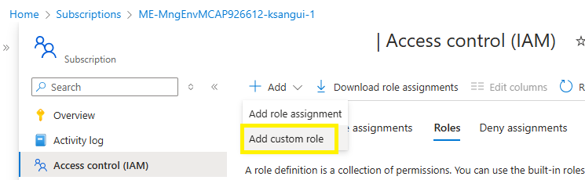
4. Name your role and click **Next**
   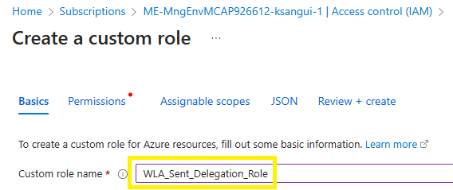
6. Click **Next** twice until you are on the JSON Tab
7. Click **Edit**
   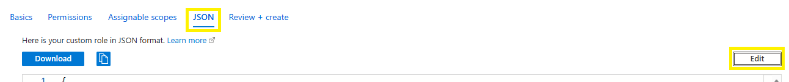
8. Between the **"actions": []**, paste the following lines
      "Microsoft.OperationalInsights/workspaces/read",
      "Microsoft.OperationalInsights/workspaces/query/read"
         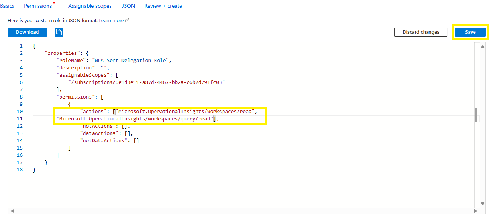
9. Click **Next** and click **Create**

## Create a dédicated workspace for the workbook
By using this procedure, the Workbook won't be upadted when the solution is updated.
A manual update by copyingg the Workbook code will be necessary.
1. In Azure Portal, go to Resource
2. Click **Create**
   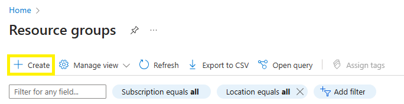
3. Fill the require fields : Resource Group name, Region, Tags...

## Set Permissions on the Resource Group
1. In Azure Portal, go to **Resource Group**
2. Select the Resource Group dedicated to the Workbook
3. Click **Access Control(IAM)**
4. Click **Add** and select **Add Role Assignment**
   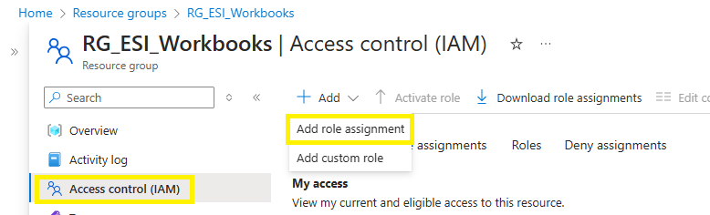
5. In the **Search** Field, type Reader and Select the **Reader** Role
   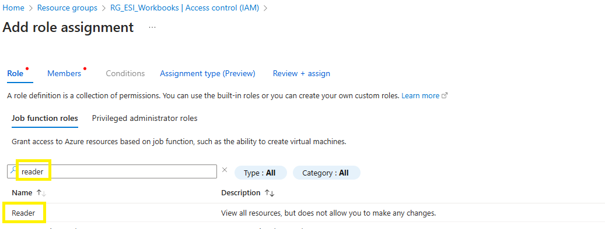
6. Select the Role **Reader**
7. Click **Next**
8. On the **Member** tab
9. Click **Select Members**
10. On the **Search** field, enter the beginning of your group name
11. Select your group and click **Select** and click **Review + assign**
   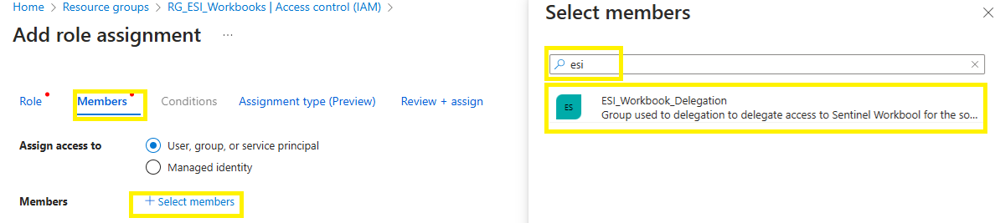
12. click **Review + assign** 

## Set Permissions in Log Analytics
1. In Azure Portal, go to **Log Analytics workspaces**
2. Select the Log Analytics of your Sentinel
3. Click **Setting**  and select **Tables**
4. Select the **Tables**
5. The following operations needs to be repeat for each table
   1. **OfficeActivity** : For Microsoft Exchange Security for Exchange Online
   2. **ESIExchangeOnlineConfig_CL** : For Microsoft Exchange Security for Exchange Online
   3. **ESIExchangeConfig_CL** : For Microsoft Exchange Security for Exchange On-Premises
6. In the **Search** field enter the beginning of the table name
7. Click on **Three dot**
8. Select **Access control (IAM)**
    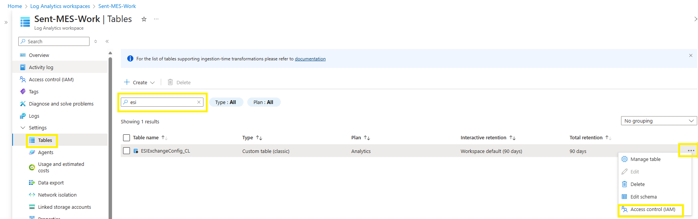
10. 3. Click **Access Control(IAM)**
4. Click **Add** and select **Add Role Assignment**
5. 5. In the **Search** Field, type Reader and Select the **Reader** Role
   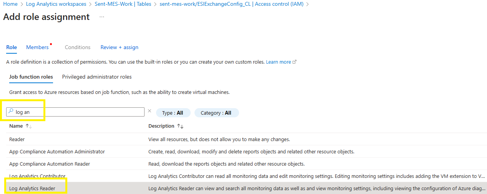
6. Select the Role **Reader**
7. Click **Next**
8. On the **Member** tab
9. Click **Select Members**
10. On the **Search** field, enter the beginning of your group name
11. Select your group and click **Select** and click **Review + assign**
   
12. click **Review + assign** 

## Save the Workbook in the dedicated Resource Group
1. In Azure Portal, go to **Sentinel**
2. Select your Sentinel
3. Click **Workbook**
4. In My workbook or Template (if you did not already savec the Workbook)
5. Select the workbook
6. The following operations need to be repeat for each Workbook
   1. Workbook for the Microsoft Exchange Security for Exchange On-Premises :
     * Microsoft Exchange Admin Activity
     * Microsoft Exchange Least Privilege with RBAC
     * Microsoft Exchange Search AdminAuditLog
     * Microsoft Exchange Security Review
   2. Workbook for the Microsoft Exchange Security for Exchange Online :
     * Microsoft Exchange Admin Activity - Online
     * Microsoft Exchange Least Privilege with RBAC - Online
     * Microsoft Exchange Search AdminAuditLog - Online
     * Microsoft Exchange Security Review - Online
7. Click on View Saved Workbook
   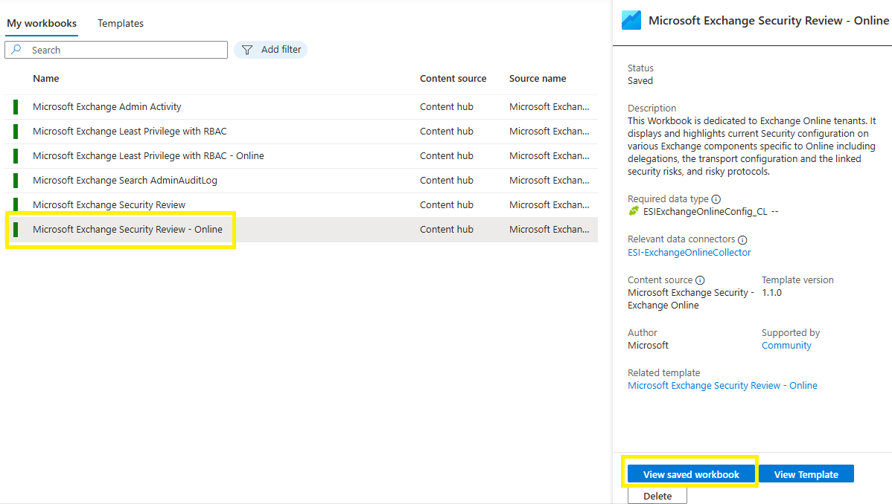
8. Click **Edit**
9.  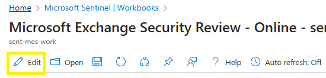
10. Click on the double Floppy
    
11. Select your dedicated Resource Group
12. 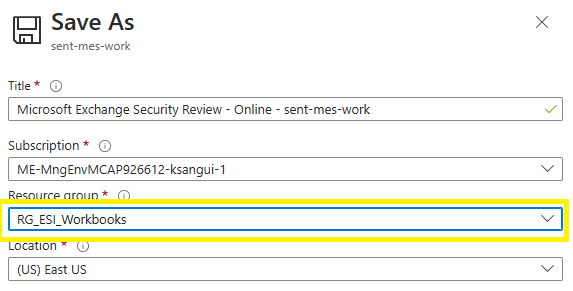
13. Click Apply
    1.  If necessary change the name of the workbook
14. Close Workbook

## Access to the workbook
1. 1. In Azure Portal, go to **Resource Group**
2. Select the Resource Group dedicated to the Workbook
3. All the workbook are available in the Overview section
4. Copy paste the Url of the Overview section
   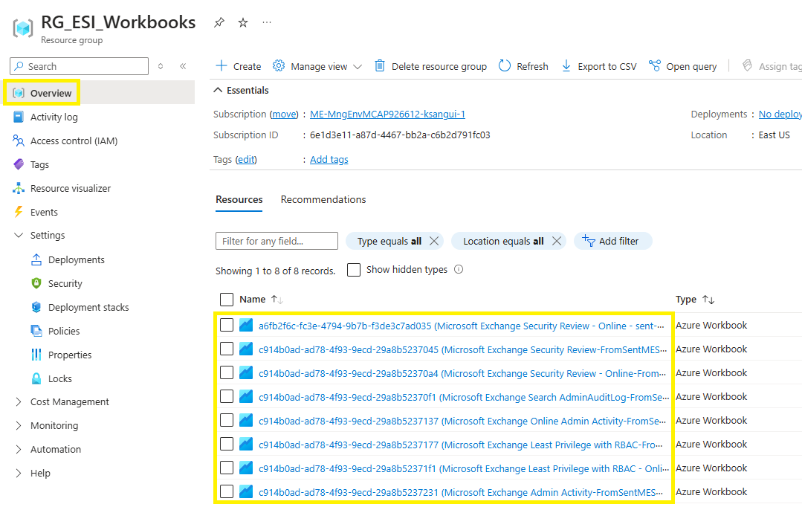

