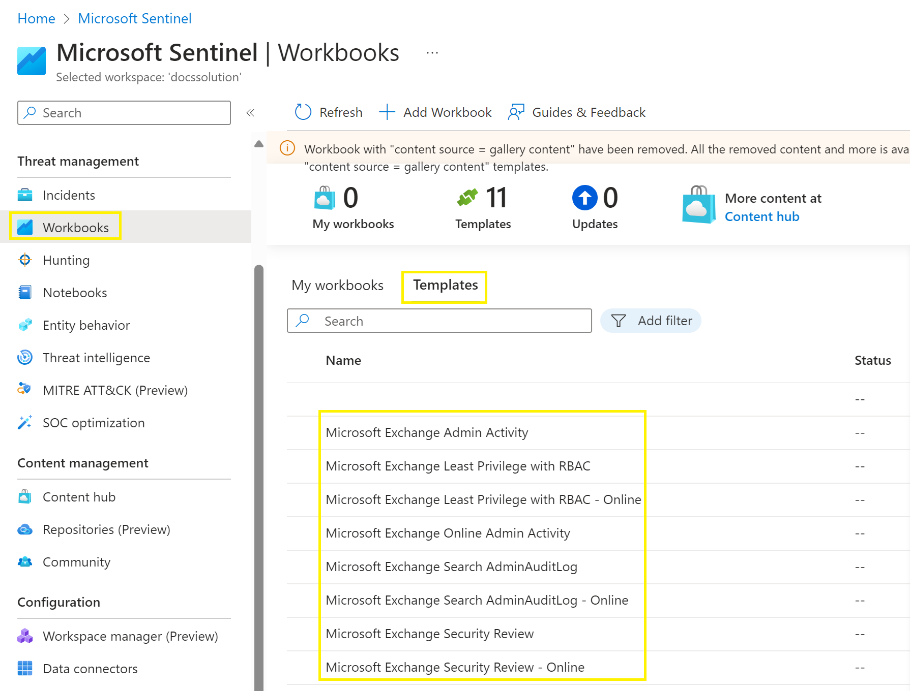
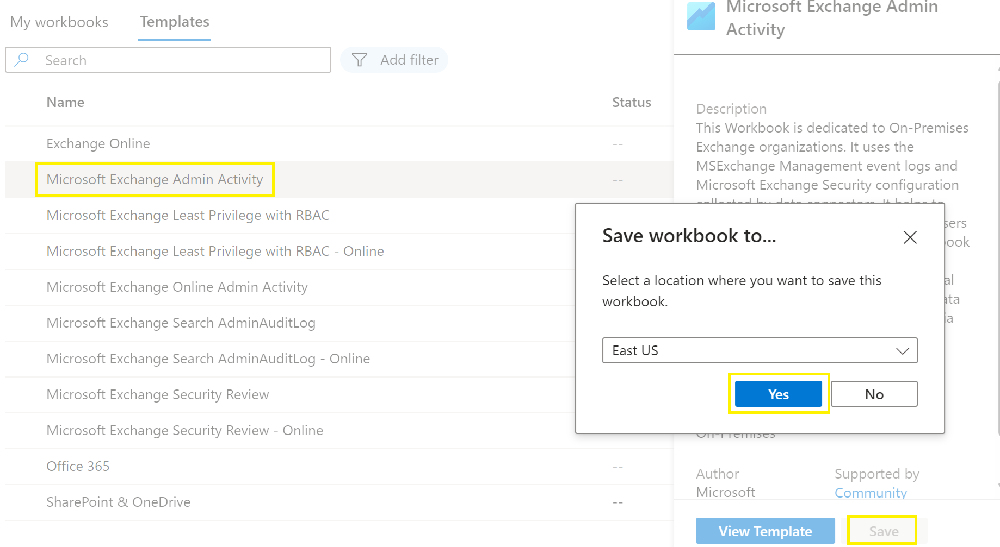

Workbooks

Both solutions are provided with Workbooks.

The template are deployed with the solution.

Workbook for the Microsoft Exchange Security for Exchange On-Premises :
  * Microsoft Exchange Admin Activity
  * Microsoft Exchange Least Privilege with RBAC
  * Microsoft Exchange Search AdminAuditLog
  * Microsoft Exchange Security Review

Workbook for the Microsoft Exchange Security for Exchange Online :
  * Microsoft Exchange Admin Activity - Online
  * Microsoft Exchange Least Privilege with RBAC - Online
  * Microsoft Exchange Search AdminAuditLog - Online
  * Microsoft Exchange Security Review - Online

To add workbook based on templates :
1. Go to **Workbooks**
2. Click on **Template**
   
3. Click on a **Workbook**
4. Click **Save** and choose the **Location**
   