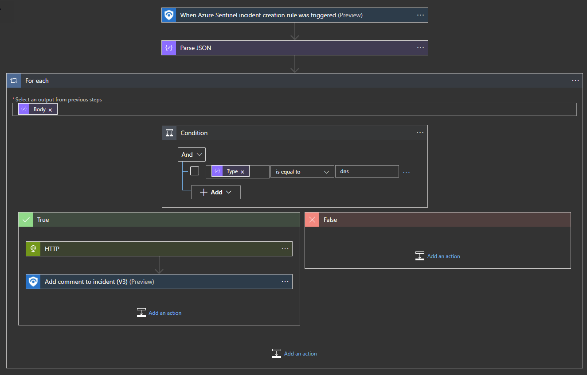
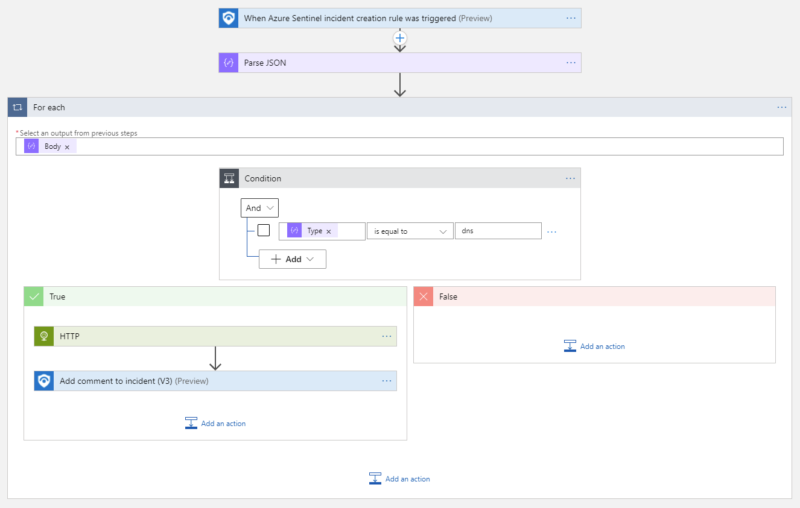
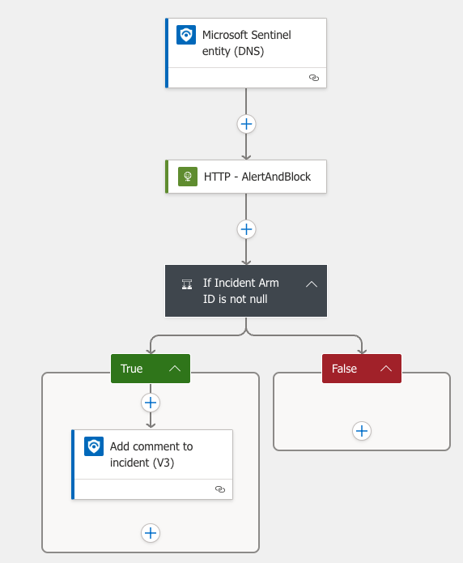
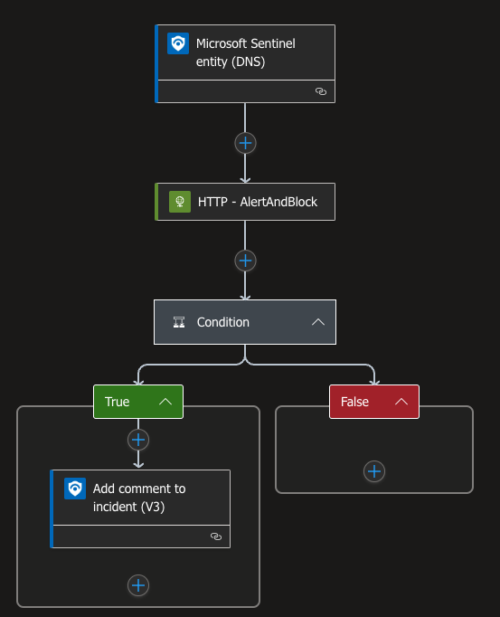

# Restrict-MDEDomain
authors: Nicholas DiCola, Kevin Caballero, Sarah van den Bovenkamp

This playbook will take DNS entities and generate alert and block threat indicators for each domain in MDE for 90 days.

## Quick Deployment
**Deploy with incident trigger** (recommended)

After deployment, attach this playbook to an **automation rule** so it runs when the incident is created.

[Learn more about automation rules](https://docs.microsoft.com/azure/sentinel/automate-incident-handling-with-automation-rules#creating-and-managing-automation-rules)

<a href="https://portal.azure.com/#create/Microsoft.Template/uri/https%3A%2F%2Fraw.githubusercontent.com%2FAzure%2FAzure-Sentinel%2Fmaster%2FSolutions%2FMicrosoftDefenderForEndpoint%2FPlaybooks%2FRestrict-MDEDomain%2FRestrict-MDEDomain-incident-trigger%2Fazuredeploy.json" target="_blank">
    
</a>
<a href="https://portal.azure.us/#create/Microsoft.Template/uri/https%3A%2F%2Fraw.githubusercontent.com%2FAzure%2FAzure-Sentinel%2Fmaster%2FSolutions%2FMicrosoftDefenderForEndpoint%2FPlaybooks%2FRestrict-MDEDomain%2FRestrict-MDEDomain-incident-trigger%2Fazuredeploy.json" target="_blank">

</a>

**Deploy with alert trigger**

After deployment, you can run this playbook manually on an alert or attach it to an **analytics rule** so it will run when an alert is created.

<a href="https://portal.azure.com/#create/Microsoft.Template/uri/https%3A%2F%2Fraw.githubusercontent.com%2FAzure%2FAzure-Sentinel%2Fmaster%2FSolutions%2FMicrosoftDefenderForEndpoint%2FPlaybooks%2FRestrict-MDEDomain%2FRestrict-MDEDomain-alert-trigger%2Fazuredeploy.json" target="_blank">
    
</a>
<a href="https://portal.azure.us/#create/Microsoft.Template/uri/https%3A%2F%2Fraw.githubusercontent.com%2FAzure%2FAzure-Sentinel%2Fmaster%2FSolutions%2FMicrosoftDefenderForEndpoint%2FPlaybooks%2FRestrict-MDEDomain%2FRestrict-MDEDomain-alert-trigger%2Fazuredeploy.json" target="_blank">

</a>

**Deploy with entity trigger**

After deployment, you can run this playbook manually on any Sentinel incident with a Domain entity in it. This will also allow you to restrict only specific domains within an incident, rather than restricting all domains associated with an incident.

<a href="https://portal.azure.com/#create/Microsoft.Template/uri/https%3A%2F%2Fraw.githubusercontent.com%2FAzure%2FAzure-Sentinel%2Fmaster%2FSolutions%2FMicrosoftDefenderForEndpoint%2FPlaybooks%2FRestrict-MDEDomain%2FRestrict-MDEDomain-entity-trigger%2Fazuredeploy.json" target="_blank">
    
</a>
<a href="https://portal.azure.us/#create/Microsoft.Template/uri/https%3A%2F%2Fraw.githubusercontent.com%2FAzure%2FAzure-Sentinel%2Fmaster%2FSolutions%2FMicrosoftDefenderForEndpoint%2FPlaybooks%2FRestrict-MDEDomain%2FRestrict-MDEDomain-entity-trigger%2Fazuredeploy.json" target="_blank">

</a>

## Prerequisites
- **For Gov Only** You will need to update the HTTP action URL to the correct URL documented [here](https://docs.microsoft.com/microsoft-365/security/defender-endpoint/gov?view=o365-worldwide#api)
- You will need to assign Microsoft Sentinel Responder role to the managed identity
- You will need to grant Ti.ReadWrite permissions to the managed identity.  Run the following code replacing the managed identity object id.  You find the managed identity object id on the Identity blade under Settings for the Logic App.
```powershell
$MIGuid = "<Enter your managed identity guid here>"
$MI = Get-AzureADServicePrincipal -ObjectId $MIGuid
$MDEAppId = "fc780465-2017-40d4-a0c5-307022471b92"
$PermissionName = "Ti.ReadWrite" 
$MDEServicePrincipal = Get-AzureADServicePrincipal -Filter "appId eq '$MDEAppId'"
$AppRole = $MDEServicePrincipal.AppRoles | Where-Object {$_.Value -eq $PermissionName -and $_.AllowedMemberTypes -contains "Application"}
New-AzureAdServiceAppRoleAssignment -ObjectId $MI.ObjectId -PrincipalId $MI.ObjectId `
-ResourceId $MDEServicePrincipal.ObjectId -Id $AppRole.Id
```

## Screenshots
**Incident Trigger:**  




**Alert Trigger:**  


**Entity Trigger:**  


