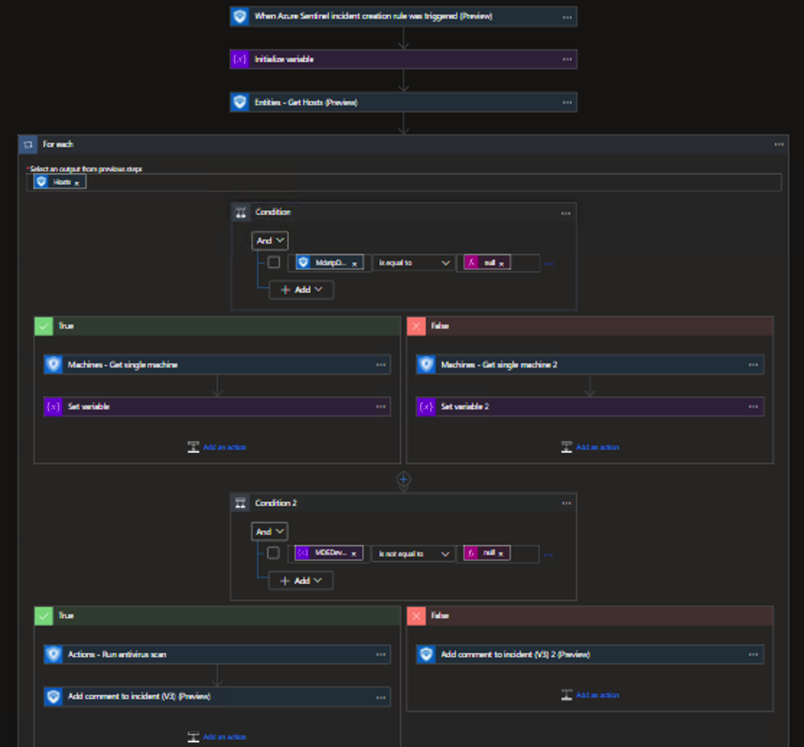

# Run-MDEAntivirus
This playbook will run a antivirus (full) scan on the machine in Microsoft Defender for Endpoint.  The AV scan only works on supported operating systems.  

The template also deploys the permissions required to write comments to Microsoft Sentinel incidents.  The parameters will ask for the Subscription Id and Resource Group name for where the Sentinel workspace resides. If they are left blank, it will use the Subscription Id and Resource Group where the playbook is being deployed.

## Quick Deployment
**Deploy with incident trigger** (recommended)

After deployment, attach this playbook to an **automation rule** so it runs when the incident is created.

[Learn more about automation rules](https://docs.microsoft.com/azure/sentinel/automate-incident-handling-with-automation-rules#creating-and-managing-automation-rules)

[](https://portal.azure.com/#create/Microsoft.Template/uri/https%3A%2F%2Fraw.githubusercontent.com%2FAzure%2FAzure-Sentinel%2Fmaster%2FSolutions%2FMicrosoftDefenderForEndpoint%2FPlaybooks%2FRun-MDEAntivirus%2FRun-MDEAntivirus-incident-trigger%2Fazuredeploy.json)
[](https://portal.azure.us/#create/Microsoft.Template/uri/https%3A%2F%2Fraw.githubusercontent.com%2FAzure%2FAzure-Sentinel%2Fmaster%2FSolutions%2FMicrosoftDefenderForEndpoint%2FPlaybooks%2FRun-MDEAntivirus%2FRun-MDEAntivirus-incident-trigger%2Fazuredeploy.json)

**Deploy with alert trigger**

After deployment, you can run this playbook manually on an alert or attach it to an **analytics rule** so it will rune when an alert is created.

[](https://portal.azure.com/#create/Microsoft.Template/uri/https%3A%2F%2Fraw.githubusercontent.com%2FAzure%2FAzure-Sentinel%2Fmaster%2FSolutions%2FMicrosoftDefenderForEndpoint%2FPlaybooks%2FRun-MDEAntivirus%2FRun-MDEAntivirus-alert-trigger%2Fazuredeploy.json)
[](https://portal.azure.us/#create/Microsoft.Template/uri/https%3A%2F%2Fraw.githubusercontent.com%2FAzure%2FAzure-Sentinel%2Fmaster%2FSolutions%2FMicrosoftDefenderForEndpoint%2FPlaybooks%2FRun-MDEAntivirus%2FRun-MDEAntivirus-alert-trigger%2Fazuredeploy.json)

## Post deployment steps
1. Assign Microsoft Sentinel Responder role to the managed identity. To do so, choose Identity blade under Settings of the Logic App Choose System assigned tab",
   - Click on Azure role assignments,
   - Click on Add role assignments,
   - Select Scope - Resource group,
   - Select Subscription - where Playbook has been created,
   - Select Resource group - where Playbook has been created,
   - Select Role - Microsoft Sentinel Responder,
   - Click Save.

2. You will need to grant Machine.Scan, Machine.Read.All, and Machine.ReadWrite.All permissions to the managed identity.  Run the following code replacing the managed identity object id.  You find the managed identity object id on the Identity blade under Settings for the Logic App.
```powershell
Install-Module Microsoft.Graph -Scope CurrentUser -Force -AllowClobber
Import-Module Microsoft.Graph

# Connect to Microsoft Graph using Managed Identity
Connect-MgGraph -Identity
 
# Get the Managed Identity Service Principal
$MIGuid = "<Enter your managed identity guid here>"
$MI = Get-MgServicePrincipal -ServicePrincipalId $MIGuid
 
# Get the MDE Service Principal
$MDEAppId = "fc780465-2017-40d4-a0c5-307022471b92"
$MDEServicePrincipal = Get-MgServicePrincipal -Filter "appId eq '$MDEAppId'"
 
# Assign "Machine.Scan" permission
$PermissionName = "Machine.Scan"
$AppRole = $MDEServicePrincipal.AppRoles | Where-Object {$_.Value -eq $PermissionName -and $_.AllowedMemberTypes -contains "Application"}
New-MgServicePrincipalAppRoleAssignment -ServicePrincipalId $MI.Id `
    -PrincipalId $MI.Id -ResourceId $MDEServicePrincipal.Id -AppRoleId $AppRole.Id
 
# Assign "Machine.Read.All" permission
$PermissionName = "Machine.Read.All"
$AppRole = $MDEServicePrincipal.AppRoles | Where-Object {$_.Value -eq $PermissionName -and $_.AllowedMemberTypes -contains "Application"}
New-MgServicePrincipalAppRoleAssignment -ServicePrincipalId $MI.Id `
    -PrincipalId $MI.Id -ResourceId $MDEServicePrincipal.Id -AppRoleId $AppRole.Id
 
# Assign "Machine.ReadWrite.All" permission
$PermissionName = "Machine.ReadWrite.All"
$AppRole = $MDEServicePrincipal.AppRoles | Where-Object {$_.Value -eq $PermissionName -and $_.AllowedMemberTypes -contains "Application"}
New-MgServicePrincipalAppRoleAssignment -ServicePrincipalId $MI.Id `
    -PrincipalId $MI.Id -ResourceId $MDEServicePrincipal.Id -AppRoleId $AppRole.Id

```

## Screenshots
**Incident Trigger**


**Alert Trigger**

