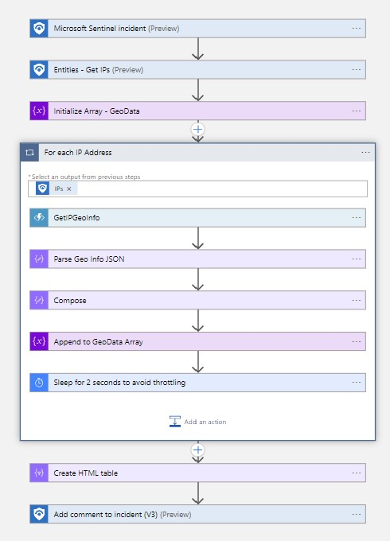
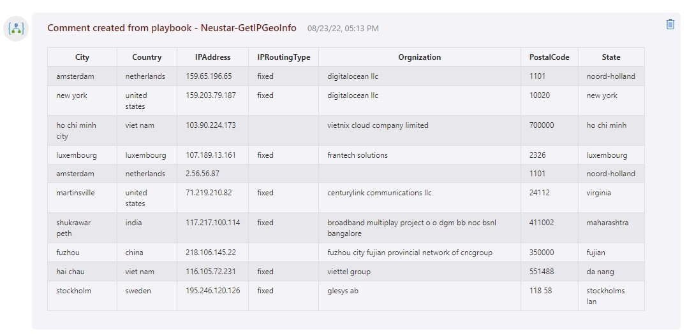

# Neustar-GetIPGeoInfo

## Summary

When a new sentinel incident is created, this playbook gets triggered and performs the following actions:

1. Gets IP Addresses from incident.
2. Gets Geographical location information from Neustart IP GeoPoint API
3. Summarize the details and add as a comment to the incident.

 
 

### Prerequisites

1. Prior to the deployment of this playbook, [Neustar IP GeoPoint API Function App Connector](../NeustarIPGeoPoint_FunctionAppConnector/) needs to be deployed under the same subscription.
2. Refer to [Neustar IP GeoPoint API Function App Connector](../NeustarIPGeoPoint_FunctionAppConnector/readme.md) documentation to obtain Neustar IP GeoPoint API Key and Shared Secret. 

### Deployment instructions

1. To deploy the Playbook, click the Deploy to Azure button. This will launch the ARM Template deployment wizard.
2. Fill in the required parameters:
    * Playbook Name

 

### Post-Deployment instructions

#### a. Authorize connections

Once deployment is complete, authorize each connection.

1. Click the Microsoft Sentinel connection resource
2. Click edit API connection
3. Click Authorize
4. Sign in
5. Click Save
6. Repeat steps for other connections

#### b. Configurations in Sentinel

1. In Microsoft sentinel, analytical rules should be configured to trigger an incident that contains IP Addresses. In the *Entity maping* section of the analytics rule creation workflow, IP Address should be mapped to **Address** identitfier of the **IP** entity type. Check the [documentation](https://docs.microsoft.com/azure/sentinel/map-data-fields-to-entities) to learn more about mapping entities.
2. Configure the automation rules to trigger the playbook. Check the [documentation](https://docs.microsoft.com/azure/sentinel/tutorial-respond-threats-playbook) to learn more about automation rules.

#### c. Function App Settings Update Instrunction
Refer to [Neustar IP GeoPoint API Function App Connector](../NeustarIPGeoPoint_FunctionAppConnector/readme.md) documentation for Function App **Application Settings (API Url, Key and Secret)** update instruction.

#  References
 - [Neustar IP GeoPoint API Guide](https://ipintelligence.neustar.biz/portal/pc/portal/docs/doc_rest_api.html)