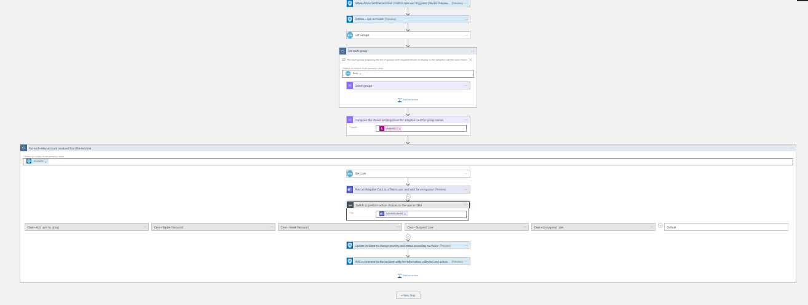
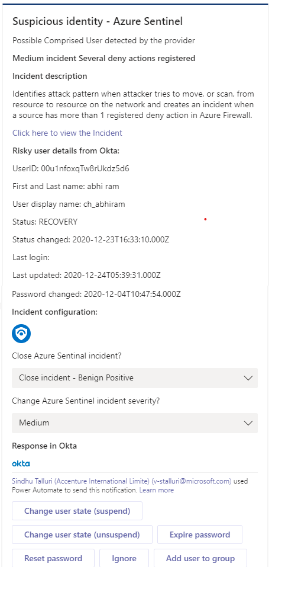

# Okta-Response From Teams Playbook
 ## Summary

When a new sentinal incident is created,this playbook gets triggered and performs below actions
1.  An adaptive card is sent to the SOC Teams channel with information collected from the incident and the risky user information from Okta. 
2.  The SOC is allowed to take action on risky user based on the information provided in the adaptive card.

 

**This is the adaptive card SOC will recieve when playbook is triggered:**  
  

### Prerequisites 
1. Okta Custom Connector needs to be deployed prior to the deployment of this playbook under the same subscription.
2. Generate an API key.Refer this link [ how to generate the API Key](https://developer.okta.com/docs/guides/create-an-api-token/overview/)

### Deployment instructions 
1. Deploy the playbook by clicking on "Deply to Azure" button. This will take you to deplyoing an ARM Template wizard.

2. Fill in the required paramteres:
    * Playbook Name : Enter the playbook name here (ex:Oktaplaybook)
    * Teams GroupId : Enter the Teams channel id to send the adaptive card
    * Teams ChannelId : Enter the Teams Group id to send the adaptive card
     [Refer the below link to get the channel id and group id](https://docs.microsoft.com/powershell/module/teams/get-teamchannel?view=teams-ps)
    
### Post-Deployment instructions 
#### a. Authorize connections
Once deployment is complete, you will need to authorize each connection.
1.	Click the Microsoft Sentinel connection resource
2.	Click edit API connection
3.	Click Authorize
4.	Sign in
5.	Click Save
6.	Repeat steps for other connections such as Teams connection and Okta Api  Connection (For authorizing the Okta API connection, API Key needs to be provided)
#### b. Configurations in Sentinel
1. In Microsoft sentinel analytical rules should be configured to trigger an incident with risky user account 
2. Configure the automation rules to trigger this playbook

## Playbook steps explained
### When Microsoft Sentinel incident creation rule is triggered

Microsoft Sentinel incident is created. The playbook receives the incident as the input.
### Entities - Get Accounts

Get the list of risky/malicious accounts as entities from the Incident
### List groups
Playbook uses "List Groups" action to get all the group details present in the particular Okta domain
This groups list will be used later in the adaptive card dropdown when SOC wants to add user to a group
### For each group
 Select groups-preparing the group name and id from the list of groups to display in the adaptive card for user choice
### Compose group information
Compose the choice set dropdown for adaptive card for group names
### For each-risky account received from the incident
Iterates on the accounts found in this incident (probably one) and performs the following:
 1. For the risky user account, playbook uses "Get User" action to get user details from Okta
 2. Post an Adaptive Card to a SOC admin on teams channel with the incident information and risky user information and admin has a list of choices to perform different user actions on Okta
 3. Switch case to perform action choices on the user in Okta 

     a. Case - Add user to group: When Soc admin chooses to add user to a group in Okta, playbook uses "Add user to group" action to add user to group in okta.SOC admin needs to select a group from the adaptive card

     b. Case - Expire Password: When Soc admin chooses to expire password of the user in Okta, playbook uses "Expire Password" action.

     c. Case - Reset Password : When Soc admin chooses to reset password of the user in Okta,playbook uses "Reset Password" action.

     d. Case - Suspend User: When Soc admin chooses to suspend the user in Okta,playbook uses "Suspend User" action.

     e. Case - Unsuspend User :When Soc admin chooses to unsuspend the user in Okta,playbook uses "UnSuspend User" action.

     f. Ignore

 4. Update incident to change severity and status according to choice of SOC admin through adaptive card  
 5. Add a comment to the incident with the below details:
    * With all the user information collected by "Get User" action from Okta 
       * User id, User name, User login, User email, User status, User created, User activated, User statusChanged, User lastLogin, User lastUpdated, User passwordChanged
    * Actions taken on Sentinel : Incident close reason and action taken on user

