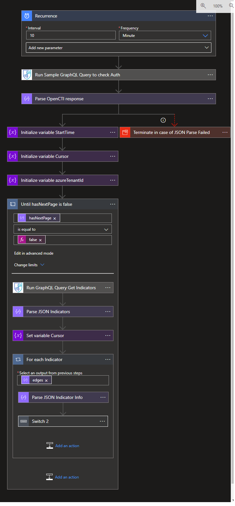

# OpenCTI- Update indicator's confidence score Playbook
 ## Summary
 This playbook fetches indicators from OpenCTI and send to Sentinel. Supported types are Domain, File, IPv4, IPv6, Account, Url.  This runs for every 10 minutes
 
 

### Prerequisites 
1. OpenCTI Custom Connector needs to be deployed prior to the deployment of this playbook under the same subscription.
2. API key. To get API Key, login into your OpenCTI instance dashboard and navigate to User profile page --> API Access.
3. OpenCTI-ImportToSentinel must be installed and keep playbook name and batchname handy

### Deployment instructions 
1. Deploy the playbook by clicking on "Deploy to Azure" button. This will take you to deplyoing an ARM Template wizard.

2. Fill in the required paramteres:
    * Playbook Name: Enter the playbook name here (Ex: OpenCTI-UpdateIndicatorInfo)
    * Custom Connector Name: Enter the OpenCTI custom connector name here (Ex: OpenCTICustomConnector)
    * Import Batch Playbook Name: Enter the Name of the batch import playbook here (Ex: OpenCTI-ImportToSentinel)
    * Batch Name: Enter the batch name that used in OpenCTI-ImportToSentinel playbook here (Ex: OpenCTIToSentinel)
    
### Post-Deployment instructions 
#### a. Authorize connections
Once deployment is complete, you will need to authorize each connection.
1.	Click the Microsoft Sentinel connection resource
2.	Click edit API connection
3.	Click Authorize
4.	Sign in
5.	Click Save
6.	Repeat steps for OpenCTI Connection (For authorizing the OpenCTI GraphQL API connection, API Key needs to be provided)
#### b. Configurations in Sentinel
1. None

