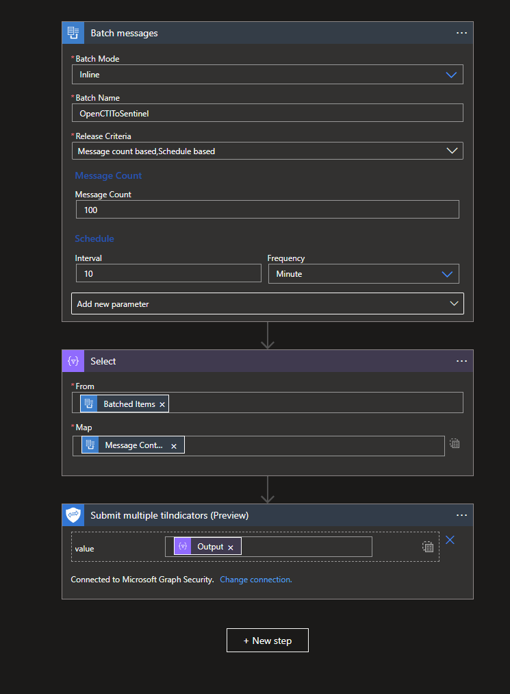
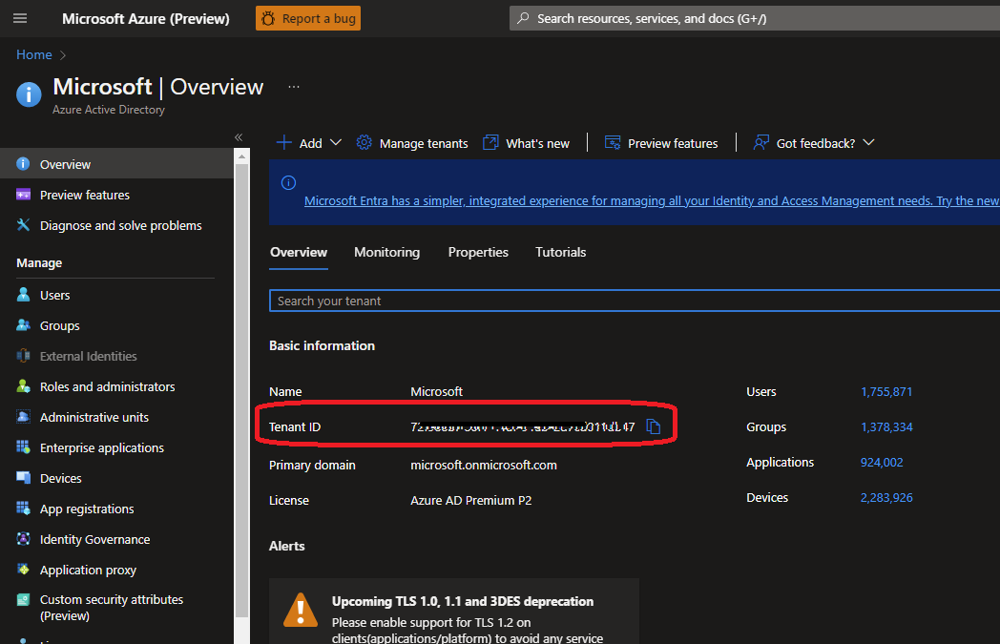
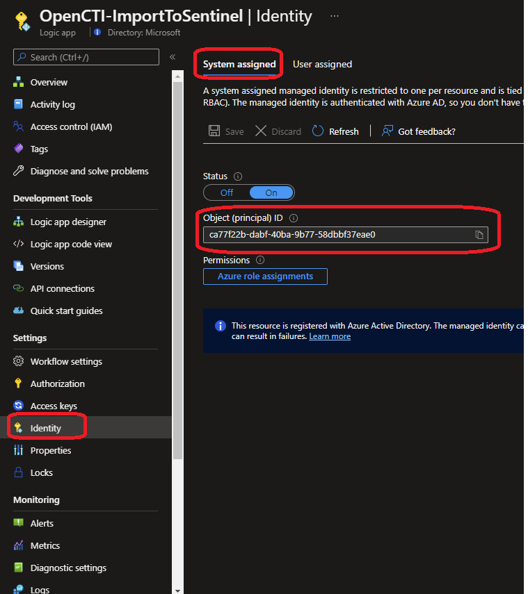

# OpenCTI- Update indicator's confidence score Playbook
 ## Summary
 This playbook sends messages to Security GraphAPI in batches

<br>

### Prerequisites 
1. None

### Deployment instructions 
1. Deploy the playbook by clicking on "Deploy to Azure" button. This will take you to deplyoing an ARM Template wizard.
[](https://portal.azure.com/#create/Microsoft.Template/uri/https%3A%2F%2Fraw.githubusercontent.com%2FAzure%2FAzure-Sentinel%2Fmaster%2FSolutions%2FOpenCTI%2FPlaybooks%2FOpenCTIPlaybooks%2FOpenCTI-ImportToSentinel%2Fazuredeploy.json)
[](https://portal.azure.us/#create/Microsoft.Template/uri/https%3A%2F%2Fraw.githubusercontent.com%2FAzure%2FAzure-Sentinel%2Fmaster%2FSolutions%2FOpenCTI%2FPlaybooks%2F%2FOpenCTIPlaybooks%2FOpenCTI-ImportToSentinel%2Fazuredeploy.json)

2. Fill in the required paramteres:
    * Playbook Name: Enter the playbook name here (Ex: OpenCTI-ImportToSentinel)
    
### Post-Deployment instructions 

1. From your Azure portal navigate to "Azure Activity Directory" and identify your tenantId (this is your azure tenant id, that require while running below commands)

<br>

2. Open Logic app "OpenCTI-ImportToSentinel" and Select "Identity" section and  copy Object (principle) ID  - this is your Logic app system assigned managed identity

<br>

NOTE: Only Azure Tenant admins have permissions to perform below activity. 

```
$AzureTenantId = "< Enter your Azure tenant id here >"
$MIGuid = "< Enter your Logic app system assigned managed identity here >"

Connect-AzureAD -TenantId $AzureTenantId

$MI = Get-AzureADServicePrincipal -ObjectId $MIGuid

$GraphApIAppId = "00000003-0000-0000-c000-000000000000"
$PermissionName = "ThreatIndicators.ReadWrite.OwnedBy" 

$GrphAPIServicePrincipal = Get-AzureADServicePrincipal -Filter "appId eq '$GraphApIAppId'"
$AppRole = $GrphAPIServicePrincipal.AppRoles | Where-Object {$_.Value -eq $PermissionName -and $_.AllowedMemberTypes -contains "Application"}
New-AzureAdServiceAppRoleAssignment -ObjectId $MI.ObjectId -PrincipalId $MI.ObjectId -ResourceId $GrphAPIServicePrincipal.ObjectId -Id $AppRole.Id

```

#### Configurations in Sentinel
None


