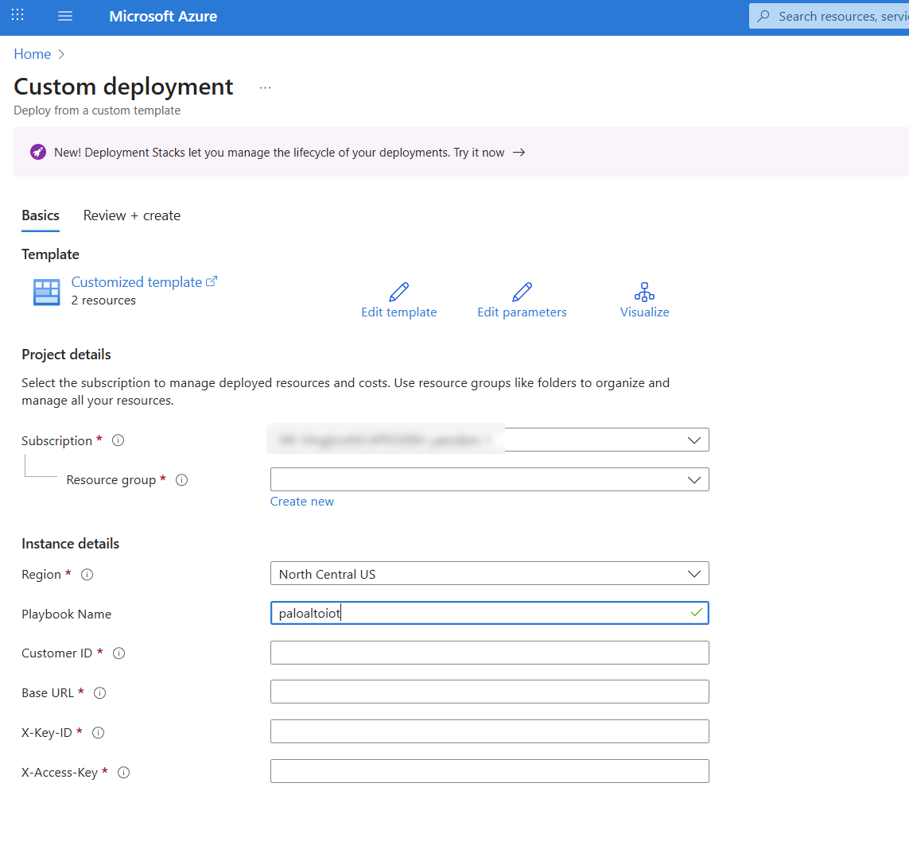
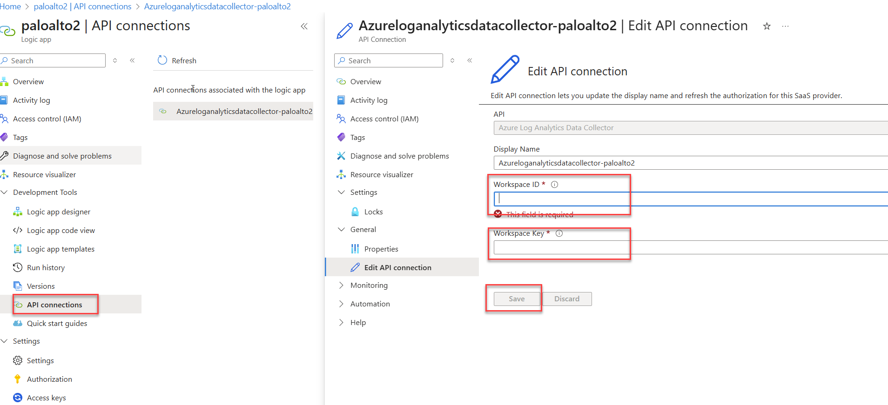
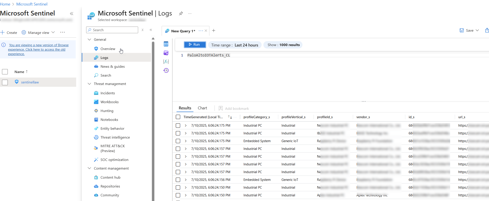

This solution is for the customers who are using Palo Alto IOT solution and want to send alerts to Microsoft Sentinel.

As a solution to this, I've created a logic app to connect one of the
Palo Alto IOT with a customer ID and key, then get the Palo Alto IOT alerts to Microsoft Sentinel table named PaloAltoIOTAlerts

**Deployment Steps**

**Prerequisites**
1. Get log analytics workspace ID an key [this link](https://learn.microsoft.com/en-us/answers/questions/1154380/where-is-azure-is-the-primary-key-and-workspace-id).
2. Get your API key details from Palo Alto IOT [this link](https://pan.dev/iot/api/iot-public-api-headers/).

## Setup

### Deploy Palo Alto IOT Solution

1. Deploy the `Palo Alto IOT Playbook`

    
2. Fill out the information needed:
    * `Playbook Name` (this is Playbook Name whatever you want)
    * `Customer ID` (this is the Customer ID you can get from Palo Alto IOT Solution)
    * `Base URL` (this is the Base URL you can get from Palo Alto IOT Solution-It should be something like this: blalbabla.iot.paloaltonetworks.com)
    * `X-Key-ID` (this is the X-Key-ID which you get from the Prerequisites)
    * `X-Access-Key` (this is the X-Access-Key which you get from the Prerequisites)
3. After the deployment, you should go to the logic app you created and authorize the API connections like below.

    

Playbook runs evey 1 hour and gather the alerts in this timeframe. 

After successful implementaion, you can query your table and create hunting queries and analytics rules based on your needs.

