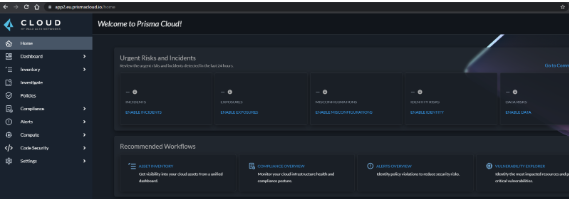
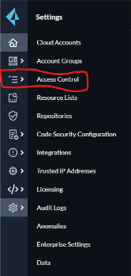
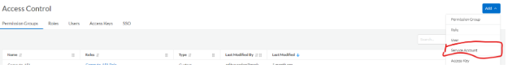
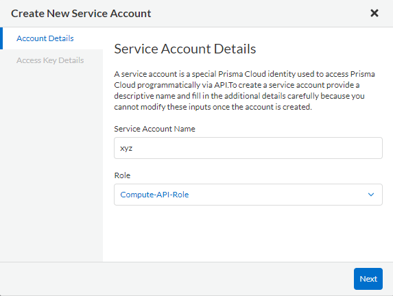
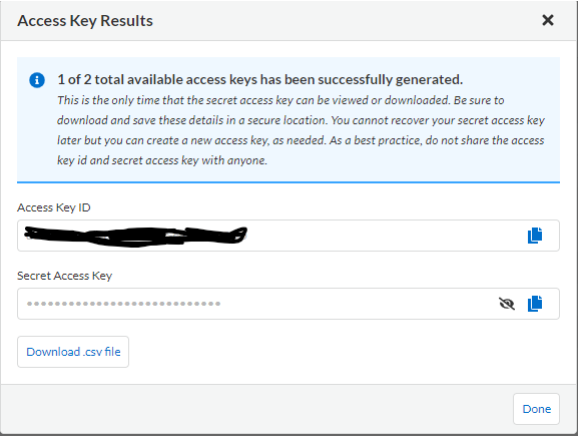

# Prisma API Key Generation using service account 

Step1:- Login to the Prisma console portal

Step2: - Go to settings tab 

Step3: - Click on Access control

Step4: - Click on Add option and select service account as shown below

Step5: - Provide the service account name and assign a role

Step6: - Provide Access Key Name as per your convenience

Step7: - Click on Save and create which will provide you the Access key ID and Secret Key

Step 8: - Use Access Key ID as username and Secret Key as password on the Data connector page