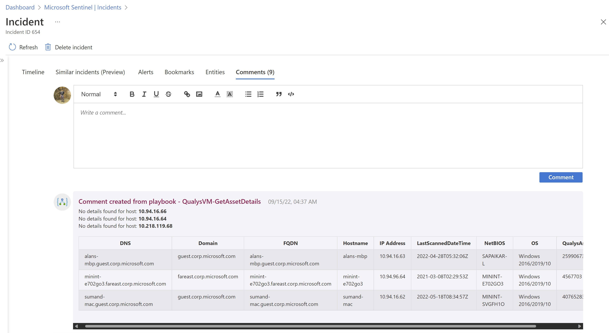

# QualysVM-GetAssetDetails

## Summary

When a new sentinel incident is created, this playbook gets triggered and performs the following actions:

1. Get IP Addresses from incident.
2. Get Asset Details for all IP Addresses.
3. Add asset details as a comment to the incident.

 
 

### Prerequisites

1. Prior to the deployment of this playbook, [Qualys Logic App Custom Connector](../../CustomConnector/QualysCustomConnector/) needs to be deployed under the same subscription.
2. Refer to [Qualys Logic App Custom Connector](../../CustomConnector/QualysCustomConnector/readme.md) documentation for deployment instructions. 

### Deployment instructions

1. To deploy the Playbook, click the Deploy to Azure button. This will launch the ARM Template deployment wizard.
2. Fill in the required parameters:
    * Playbook Name
    * Custom Connector Name

 

### Post-Deployment instructions

#### a. Authorize connections

Once deployment is complete, authorize each connection.

1. Select the Microsoft Sentinel connection resource
2. Click Edit API connection blade
3. Click Authorize/Provide credentianls
4. Click Save
5. Repeat these steps for other connections

#### b. Configurations in Sentinel

1. In Microsoft sentinel, analytical rules should be configured to trigger an incident that contains IP Addresses. In the *Entity maping* section of the analytics rule creation workflow, IP Address should be mapped to **Address** identitfier of the **IP** entity type. 

    Check the [documentation](https://docs.microsoft.com/azure/sentinel/map-data-fields-to-entities) to learn more about mapping entities.
2. Configure the automation rules to trigger the playbook. Check the [documentation](https://docs.microsoft.com/azure/sentinel/tutorial-respond-threats-playbook) to learn more about automation rules.

#### c. Assign Playbook Microsoft Sentinel Responder Role
1. Select the Playbook (Logic App) resource
2. Click on Identity Blade
3. Choose Systen assigned tab
4. Click on Azure role assignments
5. Click on Add role assignments
6. Select Scope - Resource group
7. Select Subscription - where Playbook has been created
8. Select Resource group - where Playbook has been created
9. Select Role - Microsoft Sentinel Responder
10. Click Save (It takes 3-5 minutes to show the added role.)

#  References
 - [Qualys API Quick Reference](https://www.qualys.com/docs/qualys-api-quick-reference.pdf)
 - [Qualys VM API Guide](https://www.qualys.com/docs/qualys-api-vmpc-user-guide.pdf)