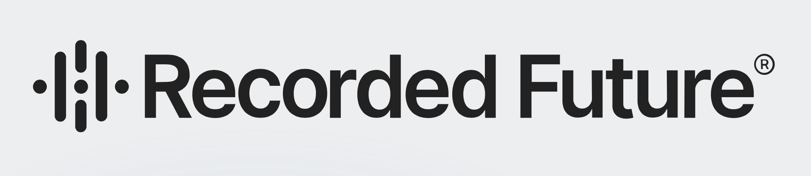

# Recorded Future Identity Solution 

Recorded Future Identity Intelligence enables security and IT teams to detect identity compromises, for both employees and customers. 

To do this, Recorded Future automates the collection, analysis, and production of identity intelligence from a vast range of sources. 

Organizations can incorporate identity intelligence into automated workflows that regularly monitor for compromised credentials and take immediate action with applications such as Azure Active Directory and Microsoft Sentinel.

There are many ways organizations can utilize Recorded Future Identity Intelligence; the playbooks in this Solution are just a quick introduction to some of those ways. 

In particular, these playbooks include several actions that can be coordinated, or used separately. 

They include:

1. searches for compromised workforce or external customer users
2. looking up existing users and saving the compromised user data to a Log file
3. confirming high risk Azure Active Directory (AAD) users
4. adding a compromised user to an AAD security group

 

These playbooks and actions are designed to meet the following use cases:

1. **My Organization ("Workforce" use case)** 

Organizations seeking to proactively protect their own employees from account takeovers and prevent outside third parties from using employee credentials to gain access to sensitive company information can use the Identity Intelligence module in two ways:
- on a periodic basis, query Recorded Future identity intelligence (via "Credential Search" Action) for any "new" employee credentials that may have been exposed.
- when suspicious employee behavior is noticed (e.g. logins from uncommon geographic locations, or large downloads of information during non business hours), query Recorded Future identity intelligence (via "Credential Lookup" Action) to check if that user has had credentials exposed in prior dumps or malware logs.

Possible remediations include password resets, user privilege revocation, and user quarantining.  Advanced teams may also choose to flag users suspected of takeover by a threat actor to track usage through their system.

 
 
2. **Customer ("External" use case)**

Organizations that provide their customers with online services via a web-based login can use the Identity Intelligence module to assess whether their customers are at risk of fraudulent use by a third party.  Suggested work flows include:
- on a periodic basis, query Recorded Future identity intelligence (via "Credential Search" Action) for any compromised credentials that may have been exposed. 
- during account creation, use the Identity Intelligence module (via "Credential Lookup" Action) to check whether the username and/or username/password pair are previously compromised.
- during account login, check the Identity Intelligence module (via "Credential Lookup" Action) for whether the username/password pair is compromised.

Possible remediations include requiring a password reset, or temporarily locking down the account and requesting the user contact customer service for a user re-authentication process.

## Table of Contents

1) [Overview](#overview)
2) [Playbooks](#playbooks)
   1) ["Base" playbooks (Workforce and External)](#base_playbooks)
   2) ["Reactive" playbooks](#reactive_playbooks)
      1) [Add risky user to Active Directory Security Group](#add_risky_user_to_active_directory_security_group)
      2) [Active Directory Identity Protection - confirm user is compromised](#active_directory_identity_protection_confirm_user_is_compromised)
      3) [Lookup risky user and save results](#lookup_risky_user_and_save_results)
3) [Deployment](#deployment)
   1) [Prerequisites](#prerequisites)
   2) [Deployment using Azure Marketplace](#deployment_azure_marketplace)
   3) [Deployment using "Deploy a custom template" service](#deployment_custom_template)
      1) [Deploy the Solution](#deployment_custom_template_solution)
      2) [Deploy Playbooks (Logic Apps) one by one](#deployment_custom_template_playbooks)
         1) [RecordedFutureIdentity-add-AAD-security-group-user](#deployment_custom_template_playbooks_add_AAD_security_group_user)
         2) [RecordedFutureIdentity-confirm-AAD-risky-user](#deployment_custom_template_playbooks_confirm_AAD_risky_user)
         3) [RecordedFutureIdentity-lookup-and-save-user](#deployment_custom_template_playbooks_lookup_and_save_user)
         4) [RecordedFutureIdentity-search-workforce-user](#deployment_custom_template_playbooks_search_workforce_user)
         5) [RecordedFutureIdentity-search-external-user](#deployment_custom_template_playbooks_search_external_user)
4) [How to configure playbooks](#configuration)
   1) [How to find the playbooks (Logic Apps) after deployment](#find_playbooks_after_deployment)
   2) [Configuring Logic Apps Connections](#configuration_connections)
   3) [Configuring Logic Apps Parameters](#configuration_parameters)
5) [Suggestions for advanced users](#suggestions_for_advanced_users)
6) [How to access Log Analytics Custom Logs](#how_to_access_log_analytics_custom_logs)
7) [Useful Azure documentation](#useful_documentation)
8) [How to obtain Recorded Future API token](#how_to_obtain_Recorded_Future_API_token)
9) [How to contact Recorded Future](#how_to_contact_Recorded_Future)

## Overview

This Solution consists of 5 Playbooks (Logic Apps).

"Base" playbooks:

| Playbook Name                                     | Description                               |
|---------------------------------------------------|-------------------------------------------|
| **RecordedFutureIdentity-search-workforce-user**  | Search new exposures for Workforce users. |
| **RecordedFutureIdentity-search-external-user**   | Search new exposures for External users.  |

 

"Reactive" playbooks:

| Playbook Name                                          | Description                                                                            |
|--------------------------------------------------------|----------------------------------------------------------------------------------------|
| **RecordedFutureIdentity-add-AAD-security-group-user** | Add risky user to Active Directory Security Group for users at risk.                   |
| **RecordedFutureIdentity-confirm-AAD-risky-user**      | Confirm to Active Directory Identity Protection that user is compromised.              |
| **RecordedFutureIdentity-lookup-and-save-user**        | Lookup additional information on a compromised user and save results to Log Analytics. |

## Playbooks

### "Base" playbooks (Workforce and External)

 

#### Workflow of Base Logic Apps (both Workforce and External use cases)

Those playbooks search the Recorded Future Identity Intelligence Module for compromised workforce or external (customer) users.

 

| #   | Action                                                                                                                         |
|-----|--------------------------------------------------------------------------------------------------------------------------------|
| 1   | Pull data from Recorded Future Identity API for specified domain and time range (can be "workforce" or "external" use case).   |
| 2   | Pull previously seen/saved leaks data from Log Analytics Custom Log.                                                           |
| 3   | Compare data from step 1 and step 2 - to determine which leaks are new and haven't been seen previously by the Base Logic App. |
| 4   | Save the new leaks from step 3, so on the next run of the Base Logic App we would get that data on step 2.                     |
| 5   | Use "Reactive" Logic Apps to react / take actions on the newly leaked credentials.                                             |

 

If you are using External use case - you will get info on your clients leaks, so probably the most valuable "reactive" Logic App for you will be "Lookup risky user and save results", as "Add risky user to Active Directory Security Group" and "Active Directory Identity Protection - confirm user is compromised" assumes that the leaked email is a user in your organization Azure Active Directory, which is mostly probably not true for External use case.

 

#### Parameters

Logic App Parameters for Base Logic App Workforce use case:

| Parameter                                          | Description                                                                                                                                                                                                                                                                                                                                                                                                                                                                                                                                                                                                                                                                                                                                                                                                       |
|----------------------------------------------------|-------------------------------------------------------------------------------------------------------------------------------------------------------------------------------------------------------------------------------------------------------------------------------------------------------------------------------------------------------------------------------------------------------------------------------------------------------------------------------------------------------------------------------------------------------------------------------------------------------------------------------------------------------------------------------------------------------------------------------------------------------------------------------------------------------------------|
| **organization_domain**                            | Organization domain to search exposures for.                                                                                                                                                                                                                                                                                                                                                                                                                                                                                                                                                                                                                                                                                                                                                                      |
| **search_lookback_days**                           | Time range for Search / number of days before today to search (e.g. input "-14" to search the last 14 days).                                                                                                                                                                                                                                                                                                                                                                                                                                                                                                                                                                                                                                                                                                      |
| **malware_logs_log_analytics_custom_log_name**     | Name for Log Analytics Custom Log to save Credential Dumps Search results at (**needs to end with "`_CL`"**).                                                                                                                                                                                                                                                                                                                                                                                                                                                                                                                                                                                                                                                                                                     |
| **credential_dumps_log_analytics_custom_log_name** | Name for Log Analytics Custom Log to save Malware Logs Search results at (**needs to end with "`_CL`"**).                                                                                                                                                                                                                                                                                                                                                                                                                                                                                                                                                                                                                                                                                                         |
| **active_directory_security_group_id**             | ID of Active Directory Security Group for users at risk. You need to pre-create it by hand: search for "Groups" in Service search at the top of the page. For more information, see [Active Directory Security Groups](https://docs.microsoft.com/windows/security/identity-protection/access-control/active-directory-security-groups) documentation.                                                                                                                                                                                                                                                                                                                                                                                                                                                            |
| **lookup_lookback_days**                           | Time range for Lookup / number of days before today to search (e.g. input "-14" to search the last 14 days). **Make sure to use `lookup_lookback_days` same or larger than `search_lookback_days`. Otherwise you can encounter a situation when you get empty results on Lookup for the compromised credentials from the Search.**                                                                                                                                                                                                                                                                                                                                                                                                                                                                                |
| **lookup_results_log_analytics_custom_log_name**   | Name for Log Analytics Custom Log to save Lookup results at (**needs to end with "`_CL`"**).                                                                                                                                                                                                                                                                                                                                                                                                                                                                                                                                                                                                                                                                                                                      |
| **active_directory_domain**                        | (Optional, can be left empty) - in case your Active Directory domain is different from your organization domain, this parameter will be used to transform compromised credentials to find corresponding user in your Active Directory (ex. Compromised email: leaked@mycompany.com, your Active Directory domain: `@mycompany.onmicrosoft.com`, so you set parameter `active_directory_domain = mycompany.onmicrosoft.com` (**just domain, without "@"**), and reactive playbooks will replace the domain from the leaked email with the provided domain from the active_directory_domain parameter, before searching for the corresponding user in your Active Directory: `leaked@mycompany.com ->  leaked@mycompany.onmicrosoft.com`. (Lookup playbook - will still use the original email to Lookup the data). |

 

Logic App Parameters for Base Logic App "External use case" are the same as for "Workforce use case", except "External use case" does NOT need credential_dumps_log_analytics_custom_log_name parameter.

 

### "Reactive" playbooks

 

"Reactive" playbooks can be used to react to leaked credentials and mitigate the risks.

 

#### RecordedFutureIdentity-add-AAD-security-group-user

This playbook adds a compromised user to an AAD security group. Triage and remediation should be handled in follow up playbooks or actions.

By applying security policies to the security group and adding leaked users to that group - you can react to a leak and mitigate the risks.

**BEWARE: if you apply a Security Group policy that prohibits any compromised member from logging in, and you yourself get identified as having a compromised account, then you could potentially lock yourself out!**

 

##### Workflow

| #   | Action                                                                                             |
|-----|----------------------------------------------------------------------------------------------------|
| 1   | Form `user_principal_name` (email or email username + active directory domain if it is not empty). |
| 2   | Get user from Active Directory by `user_principal_name`.                                           |
| 3   | Add user to Active Directory security group.                                                       |

 

##### Parameters

**For this playbook to work - you need to pre-create Active Directory Security Group, and provide the Security Group ID as a parameter to the Logic App. For more information, see [Active Directory Security Groups](https://docs.microsoft.com/windows/security/identity-protection/access-control/active-directory-security-groups) documentation.**

HTTP request parameters:

| Parameter                              | Description                                                                                                                                                                                                                                                                                                                                                                                                                                                                                                                                                                                                                                                                                                                                                                                                       |
|----------------------------------------|-------------------------------------------------------------------------------------------------------------------------------------------------------------------------------------------------------------------------------------------------------------------------------------------------------------------------------------------------------------------------------------------------------------------------------------------------------------------------------------------------------------------------------------------------------------------------------------------------------------------------------------------------------------------------------------------------------------------------------------------------------------------------------------------------------------------|
| **risky_user_email**                   | Compromised user email.                                                                                                                                                                                                                                                                                                                                                                                                                                                                                                                                                                                                                                                                                                                                                                                           |
| **active_directory_security_group_id** | ID of Active Directory Security Group for users at risk. You need to pre-create security group by hand: search for "Groups" in Service search at the top of the page. For more information, see [Active Directory Security Groups](https://docs.microsoft.com/windows/security/identity-protection/access-control/active-directory-security-groups) documentation.                                                                                                                                                                                                                                                                                                                                                                                                                                                |
| **active_directory_domain**            | (Optional, can be left empty) - in case your Active Directory domain is different from your organization domain, this parameter will be used to transform compromised credentials to find corresponding user in your Active Directory (ex. Compromised email: leaked@mycompany.com, your Active Directory domain: `@mycompany.onmicrosoft.com`, so you set parameter `active_directory_domain = mycompany.onmicrosoft.com` (**just domain, without "@"**), and reactive playbooks will replace the domain from the leaked email with the provided domain from the active_directory_domain parameter, before searching for the corresponding user in your Active Directory: `leaked@mycompany.com ->  leaked@mycompany.onmicrosoft.com`. (Lookup playbook - will still use the original email to Lookup the data). |

 

#### RecordedFutureIdentity-confirm-AAD-risky-user

This playbook confirms compromise of users deemed "high risk" by Azure Active Directory Identity Protection.

More on Active Directory Identity Protection you can read here: [link1](https://docs.microsoft.com/azure/active-directory/identity-protection/) and [link2](https://docs.microsoft.com/azure/active-directory/identity-protection/overview-identity-protection) and [link3](https://docs.microsoft.com/azure/active-directory/identity-protection/howto-identity-protection-remediate-unblock).

 

##### Workflow

| #   | Action                                                                                             |
|-----|----------------------------------------------------------------------------------------------------|
| 1   | Form `user_principal_name` (email or email username + active directory domain if it is not empty). |
| 2   | Get user from Active Directory by `user_principal_name`.                                           |
| 3   | Check if Active Directory Identity Protection contains the user in a list of risky users.          |
| 3   | Confirm to Active Directory Identity Protection that user is compromised.                          |

 

##### Parameters

HTTP request parameters:

| Parameter                              | Description                                                                                                                                                                                                                                                                                                                                                                                                                                                                                                                                                                                                                                                                                                                                                                                                       |
|----------------------------------------|-------------------------------------------------------------------------------------------------------------------------------------------------------------------------------------------------------------------------------------------------------------------------------------------------------------------------------------------------------------------------------------------------------------------------------------------------------------------------------------------------------------------------------------------------------------------------------------------------------------------------------------------------------------------------------------------------------------------------------------------------------------------------------------------------------------------|
| **risky_user_email**                   | Compromised user email.                                                                                                                                                                                                                                                                                                                                                                                                                                                                                                                                                                                                                                                                                                                                                                                           |
| **active_directory_domain**            | (Optional, can be left empty) - in case your Active Directory domain is different from your organization domain, this parameter will be used to transform compromised credentials to find corresponding user in your Active Directory (ex. Compromised email: leaked@mycompany.com, your Active Directory domain: `@mycompany.onmicrosoft.com`, so you set parameter `active_directory_domain = mycompany.onmicrosoft.com` (**just domain, without "@"**), and reactive playbooks will replace the domain from the leaked email with the provided domain from the active_directory_domain parameter, before searching for the corresponding user in your Active Directory: `leaked@mycompany.com ->  leaked@mycompany.onmicrosoft.com`. (Lookup playbook - will still use the original email to Lookup the data). |

 

#### RecordedFutureIdentity-lookup-and-save-user

This playbook gets compromise identity details from Recorded Future Identity Intelligence and saves the data for further review and analysis.

Lookup returns more data than initial Search, so you will get the leaks' history for the email and other info.

 

##### Workflow

| #   | Action                                                                          |
|-----|---------------------------------------------------------------------------------|
| 1   | Pull data from Recorded Future Identity API for specified email and time range. |
| 2   | Save Lookup results to Log Analytics Custom Log.                                |

 

##### Parameters

HTTP request parameters:

| Parameter                                        | Description                                                                                                                                                                                                                                                                                                                        |
|--------------------------------------------------|------------------------------------------------------------------------------------------------------------------------------------------------------------------------------------------------------------------------------------------------------------------------------------------------------------------------------------|
| **risky_user_email**                             | Compromised user email.                                                                                                                                                                                                                                                                                                            |
| **lookup_lookback_days**                         | Time range for Lookup / number of days before today to search (e.g. input "-14" to search the last 14 days). **Make sure to use `lookup_lookback_days` same or larger than `search_lookback_days`. Otherwise you can encounter a situation when you get empty results on Lookup for the compromised credentials from the Search.** |
| **lookup_results_log_analytics_custom_log_name** | Name for Log Analytics Custom Log to save Lookup results at (**needs to end with "`_CL`"**)                                                                                                                                                                                                                                        |

 

Logic App Parameters:

| Parameter                                                | Description                                                                                                                                                                                                                                                                                                |
|----------------------------------------------------------|------------------------------------------------------------------------------------------------------------------------------------------------------------------------------------------------------------------------------------------------------------------------------------------------------------|
| **lookup_lookback_days_default**                         | Default Lookup time range - used if corresponding HTTP request parameter is missing. **Make sure to use `lookup_lookback_days` same or larger than `search_lookback_days`. Otherwise you can encounter a situation when you get empty results on Lookup for the compromised credentials from the Search.** |
| **lookup_results_log_analytics_custom_log_name_default** | Default name for Log Analytics Custom Log to save Lookup results at (**needs to end with "`_CL`"**) - used if corresponding HTTP request parameter is missing.                                                                                                                                             |

 

##### Troubleshooting:

If you use this playbook to Lookup leaks info for an email and response lookup data is empty (for specified email and lookback range) - the playbook will still save empty results to the Log Analytics Custom Log. 

This case is possible if you set up the Logic Apps in that way that Lookup lookback range (in `RecordedFutureIdentity-lookup-and-save-user` playbook) is smaller than Search lookback range (in `RecordedFutureIdentity-search-workforce-user` and `RecordedFutureIdentity-search-external-user` playbooks).

In that case you will see some empty records in the corresponding Log Analytics Custom Log (see the screenshot). 

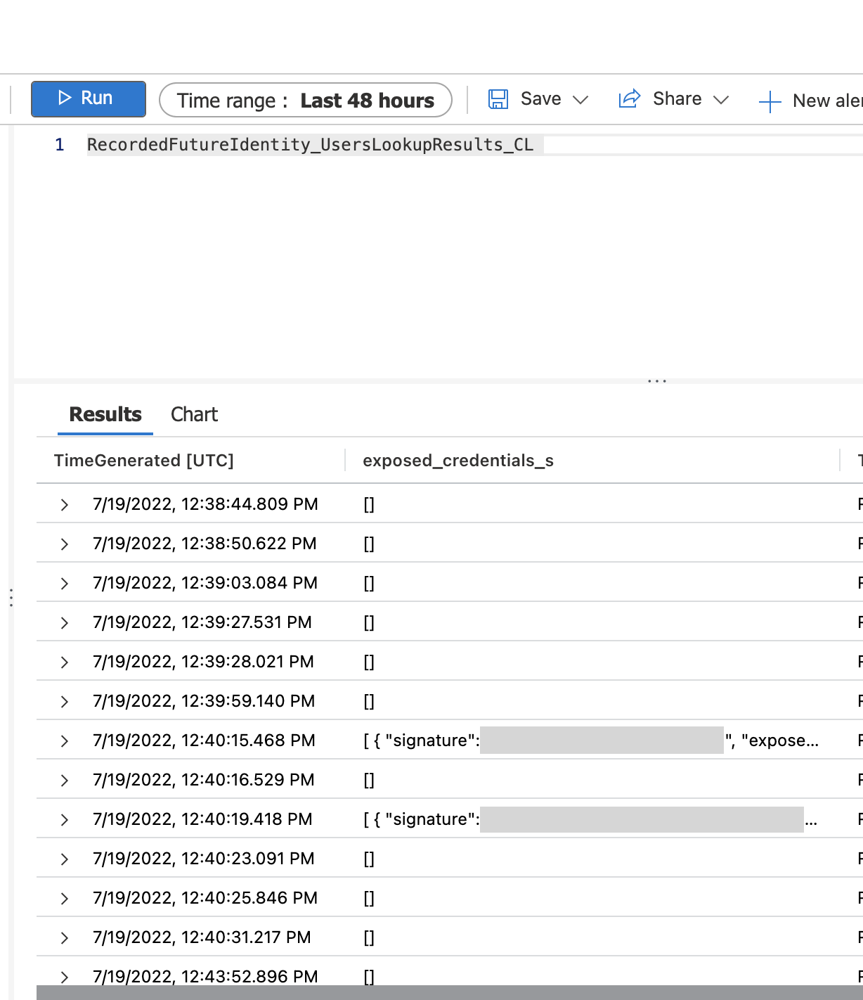

To mitigate this case: make sure you set up the Lookup lookback range equal to or larger than the Search lookback range.

Another way to cover this case - you can add a corresponding check to RecordedFutureIdentity-lookup-and-save-user playbook and not save the results to Log Analytics if the result is empty.

## Deployment

There is several ways you can deploy this Solution:
- Deployment of complete Solution from Azure Marketplace
- Using ["Deploy a Custom template"](https://portal.azure.com/#create/Microsoft.Template)
  - Deploy the Solution (one step to deploy all resources in the Solution)
  - Deploy each playbook one by one
  
**Important:**
- **Make sure you deploy all 3 "Reactive" playbooks before deploying "Base" playbooks. And make sure you configure all 3 "Reactive" playbooks before running "Base" playbooks.**
- **Make sure to specify correct "Reactive" playbook names while deploying "Base" playbooks.** "Correct" - are just the same as you have used while deploying "Reactive" playbooks.

### Prerequisites

- An Azure account and subscription. If you don't have a subscription, [sign up for a free Azure account](https://azure.microsoft.com/free/?WT.mc_id=A261C142F).
- Azure subscription Owner or Contributor permissions so you can install the Logic Apps Management solution from the Azure Marketplace. For more information, review [Permission to purchase - Azure Marketplace purchasing](https://docs.microsoft.com/marketplace/azure-purchasing-invoicing#permission-to-purchase) and [Azure roles - Classic subscription administrator roles, Azure roles, and Azure AD roles](https://docs.microsoft.com/azure/role-based-access-control/rbac-and-directory-admin-roles#azure-roles).
- A [Log Analytics workspace](https://docs.microsoft.com/azure/azure-monitor/essentials/resource-logs#send-to-log-analytics-workspace). If you don't have a workspace, learn [how to create a Log Analytics workspace](https://docs.microsoft.com/azure/azure-monitor/logs/quick-create-workspace). Note that the custom logs specified as parameters in these playbooks will be created automatically if they don’t already exist.
- In Consumption logic apps, before you can create or manage logic apps and their connections, you need specific permissions. For more information about these permissions, review [Secure operations - Secure access and data in Azure Logic Apps](https://docs.microsoft.com/azure/logic-apps/logic-apps-securing-a-logic-app#secure-operations).
- For `Recorded Future Identity` Connections you will need `Recorded Future Identity API` token. To obtain one - check out [this section](#how_to_obtain_Recorded_Future_API_token).

### Deployment using [Azure Marketplace](https://portal.azure.com/#view/Microsoft_Azure_Marketplace/)

1) Open Recorded Future Identity Solution page in Azure Marketplace in one of two ways:
   1) Use the direct link to [Recorded Future Identity Solution](https://portal.azure.com/#view/Microsoft_Azure_Marketplace/GalleryItemDetailsBladeNopdl/id/recordedfuture1605638642586.recorded_future_identity_solution).
   1) Open [Azure Marketplace](https://portal.azure.com/#view/Microsoft_Azure_Marketplace/). Search for "Recorded Future Identity Solution".
1) On the Recorded Future Identity Solution page click "Create".
1) Follow the installation process as described below.

Parameters for deployment:

| Parameter                                                    | Description                                                                                                                                                            |
|--------------------------------------------------------------|------------------------------------------------------------------------------------------------------------------------------------------------------------------------|
| **Subscription**                                             | Your Azure Subscription to deploy the Solution in. All resources in an Azure subscription are billed together.                                                         |
| **Resource group**                                           | Resource group in your Subscription to deploy the Solution in. A resource group is a collection of resources that share the same lifecycle, permissions, and policies. |
| **Workspace**                                                | Log Analytics Workspace name.                                                                                                                                          |
| **Playbook Name for "Add ADD security group user" playbook** | Playbook name to use for "RecordedFutureIdentity-add-AAD-security-group-user" playbook.                                                                                |
| **Playbook Name for "Confirm AAD risky user" playbook**      | Playbook name to use for "RecordedFutureIdentity-confirm-AAD-risky-user" playbook.                                                                                     |
| **Playbook Name for "Lookup and save user" playbook**        | Playbook name to use for "RecordedFutureIdentity-lookup-and-save-user" playbook.                                                                                       |
| **Playbook Name for "Search workforce user" playbook**       | Playbook name to use for "RecordedFutureIdentity-search-workforce-user" playbook.                                                                                      |
| **Playbook Name for "Search external user" playbook**        | Playbook name to use for "RecordedFutureIdentity-search-external-user" playbook.                                                                                       |

 

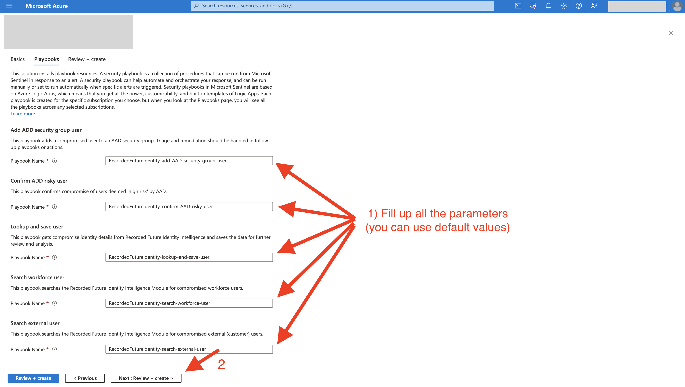

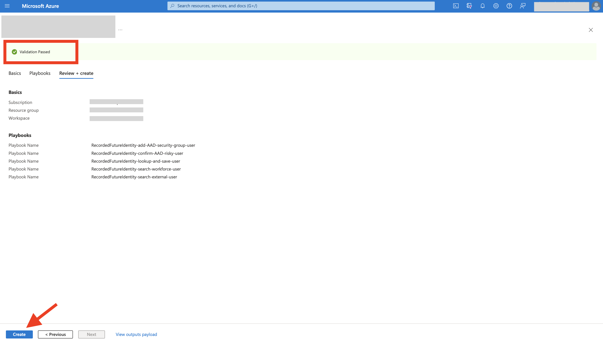

 

At the end it should look like this:

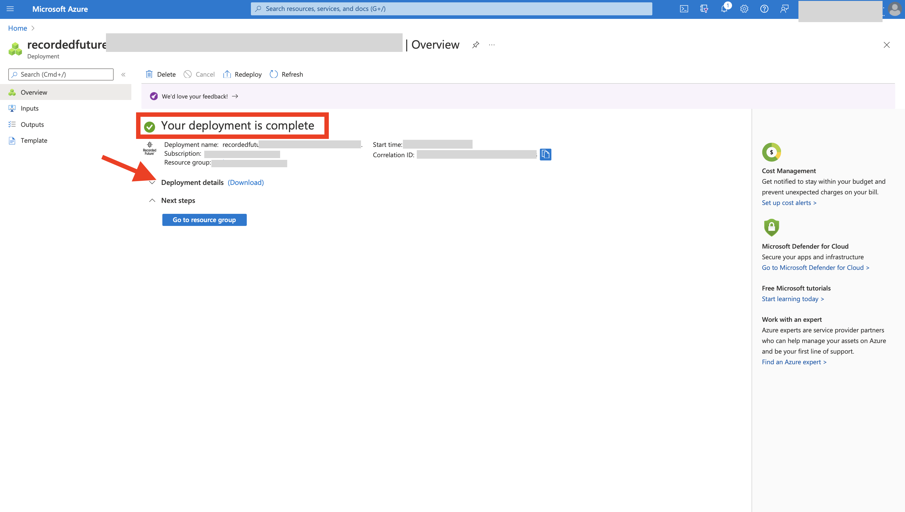

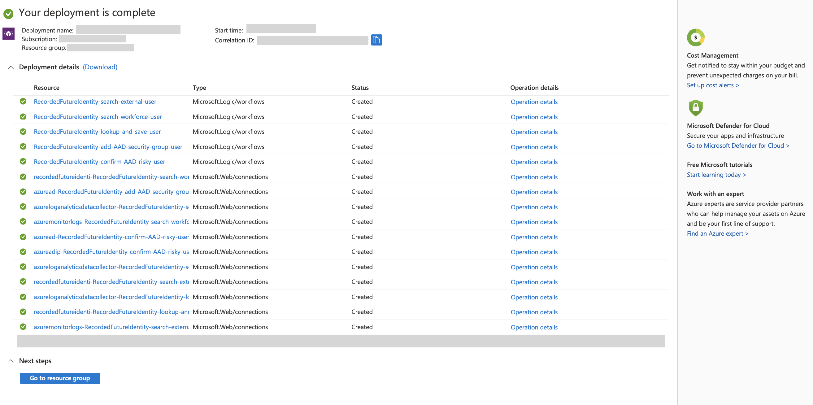

 
 

### Deployment using "Deploy a custom template" service

You can deploy resources (Solution, Playbooks, etc) from templates using `Deploy a custom template` service.

 

**Important:**
- **Make sure you deploy all 3 "Reactive" playbooks before deploying "Base" playbooks. And make sure you configure all 3 "Reactive" playbooks before running "Base" playbooks.**
- **Make sure to specify correct "Reactive" playbook names while deploying "Base" playbooks.** "Correct" - are just the same as you have used while deploying "Reactive" playbooks.

 

**! If you decided deploy the Solution using `Deploy a custom template` service - THE EASIEST WAY TO DEPLOY templates of the current Solution - just by using corresponding `Deploy to Azure`  button or `Deploy to Azure Gov`  buttons in the next sections.**

 

You can find `Deploy a custom template` service using search on [Azure portal home page](https://portal.azure.com).

Here is how icons for this service looks: 

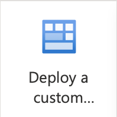

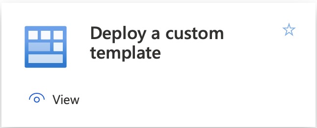

 

 

 

Here is the interface and short usage tutorial:

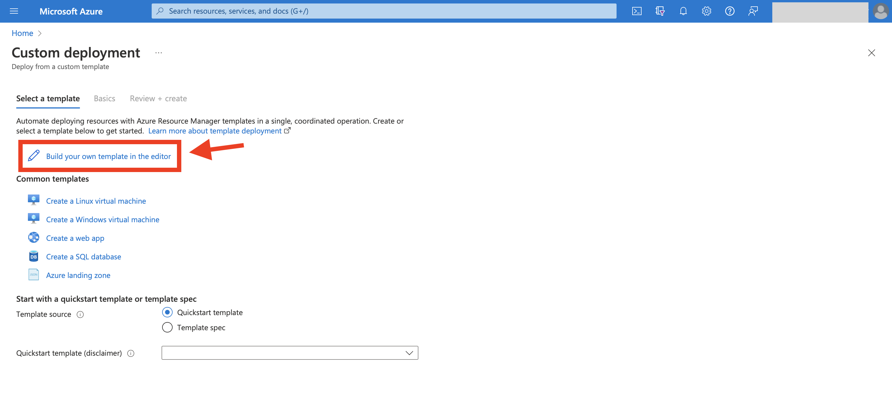

You can click on `Build your own template in the editor` button.

There you can paste any template to deploy:

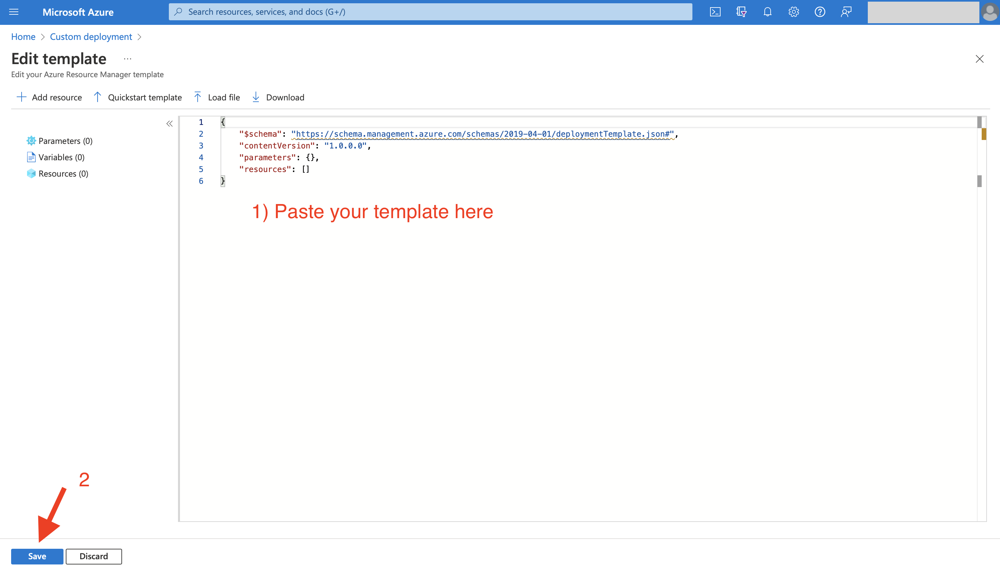

 

"Templates" - are just content of corresponding files. For example:
- use content of [../Package/mainTemplate.json](../Package/mainTemplate.json) file to deploy this whole Solution (all in one).
- or use content of [./RecordedFutureIdentity-add-AAD-security-group-user.json](./RecordedFutureIdentity-add-AAD-security-group-user.json) file to deploy ONLY `RecordedFutureIdentity-add-AAD-security-group-user` playbook.

After you paste your template to deploy - click `Save` button:

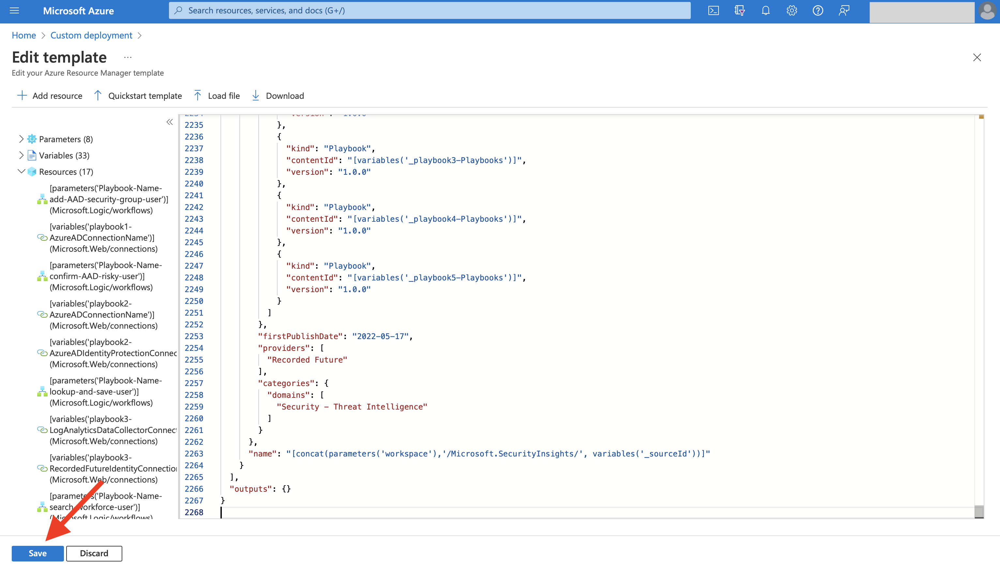

Regarding next steps specific parameters descriptions - check out a corresponding section below for your specific template deployment (as each template have its own deployment parameters).

But in general, next steps will look like this:

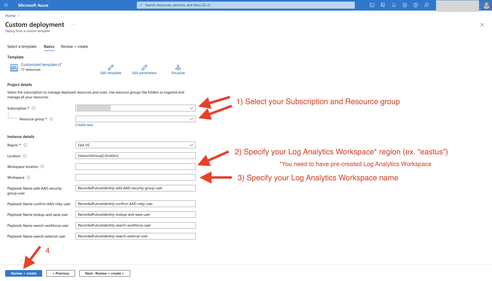

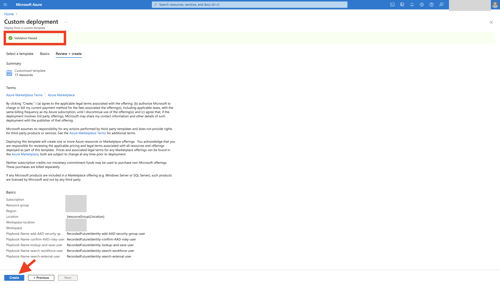

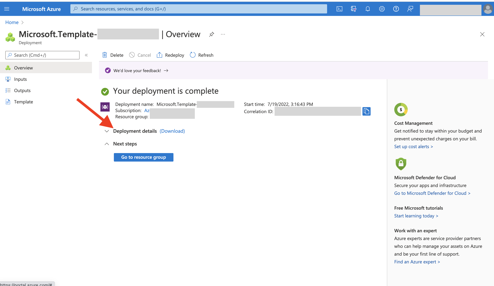

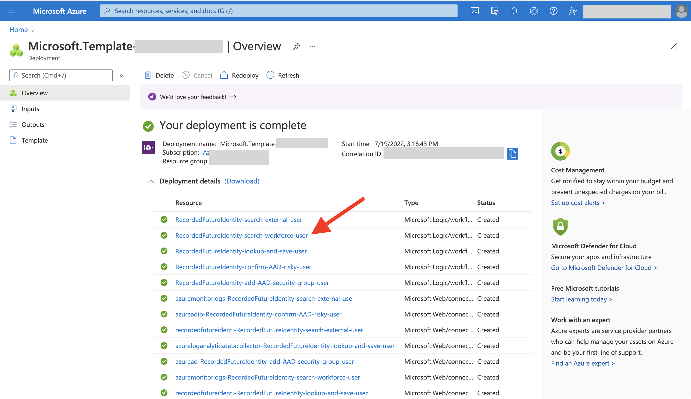

 

 

#### Deploy the Solution (all in one step)

Parameters for deployment:

| Parameter                                     | Description                                                                                                                                                            |
|-----------------------------------------------|------------------------------------------------------------------------------------------------------------------------------------------------------------------------|
| **Subscription**                              | Your Azure Subscription to deploy the Solution in. All resources in an Azure subscription are billed together.                                                         |
| **Resource group**                            | Resource group in your Subscription to deploy the Solution in. A resource group is a collection of resources that share the same lifecycle, permissions, and policies. |
| **Region**                                    | Choose the Azure region that's right for you and your customers. Not every resource is available in every region.                                                      |
| **Location**                                  | Not used. Leave default value.                                                                                                                                         |
| **Workspace-location**                        | Region in which your Log Analytics Workspace is deployed (ex. "`eastus`" - for East US).                                                                               |
| **Workspace**                                 | Log Analytics Workspace name.                                                                                                                                          |
| **Playbook-Name-add-AAD-security-group-user** | Playbook name to use for "RecordedFutureIdentity-add-AAD-security-group-user" playbook.                                                                                |
| **Playbook-Name-confirm-AAD-risky-user**      | Playbook name to use for "RecordedFutureIdentity-confirm-AAD-risky-user" playbook.                                                                                     |
| **Playbook-Name-lookup-and-save-user**        | Playbook name to use for "RecordedFutureIdentity-lookup-and-save-user" playbook.                                                                                       |
| **Playbook-Name-search-workforce-user**       | Playbook name to use for "RecordedFutureIdentity-search-workforce-user" playbook.                                                                                      |
| **Playbook-Name-search-external-user**        | Playbook name to use for "RecordedFutureIdentity-search-external-user" playbook.                                                                                       |

 

#### Deploy Playbooks one by one

Important:
- **Make sure you deploy all 3 "Reactive" playbooks before deploying "Base" playbooks. And make sure you configure all 3 "Reactive" playbooks before running "Base" playbooks.**
- **Make sure to specify correct "Reactive" playbook names while deploying "Base" playbooks.** "Correct" - are just the same as you have used while deploying "Reactive" playbooks.

 

##### RecordedFutureIdentity-add-AAD-security-group-user

 

Parameters for deployment:

| Parameter          | Description                                                                                                                                                            |
|--------------------|------------------------------------------------------------------------------------------------------------------------------------------------------------------------|
| **Subscription**   | Your Azure Subscription to deploy the Solution in. All resources in an Azure subscription are billed together.                                                         |
| **Resource group** | Resource group in your Subscription to deploy the Solution in. A resource group is a collection of resources that share the same lifecycle, permissions, and policies. |
| **Region**         | Choose the Azure region that's right for you and your customers. Not every resource is available in every region.                                                      |
| **Playbook-Name**  | Playbook name to use for this playbook (ex. "RecordedFutureIdentity-add-AAD-security-group-user").                                                                     |

 

##### RecordedFutureIdentity-confirm-AAD-risky-user

 

Parameters for deployment:

| Parameter          | Description                                                                                                                                                            |
|--------------------|------------------------------------------------------------------------------------------------------------------------------------------------------------------------|
| **Subscription**   | Your Azure Subscription to deploy the Solution in. All resources in an Azure subscription are billed together.                                                         |
| **Resource group** | Resource group in your Subscription to deploy the Solution in. A resource group is a collection of resources that share the same lifecycle, permissions, and policies. |
| **Region**         | Choose the Azure region that's right for you and your customers. Not every resource is available in every region.                                                      |
| **Playbook-Name**  | Playbook name to use for this playbook (ex. "RecordedFutureIdentity-confirm-AAD-risky-user").                                                                          |

 

##### RecordedFutureIdentity-lookup-and-save-user

 

Parameters for deployment:

| Parameter          | Description                                                                                                                                                            |
|--------------------|------------------------------------------------------------------------------------------------------------------------------------------------------------------------|
| **Subscription**   | Your Azure Subscription to deploy the Solution in. All resources in an Azure subscription are billed together.                                                         |
| **Resource group** | Resource group in your Subscription to deploy the Solution in. A resource group is a collection of resources that share the same lifecycle, permissions, and policies. |
| **Region**         | Choose the Azure region that's right for you and your customers. Not every resource is available in every region.                                                      |
| **Playbook-Name**  | Playbook name to use for this playbook (ex. "RecordedFutureIdentity-lookup-and-save-user").                                                                            |

 

##### RecordedFutureIdentity-search-workforce-user

 

Parameters for deployment:

| Parameter                                     | Description                                                                                                                                                            |
|-----------------------------------------------|------------------------------------------------------------------------------------------------------------------------------------------------------------------------|
| **Subscription**                              | Your Azure Subscription to deploy the Solution in. All resources in an Azure subscription are billed together.                                                         |
| **Resource group**                            | Resource group in your Subscription to deploy the Solution in. A resource group is a collection of resources that share the same lifecycle, permissions, and policies. |
| **Region**                                    | Choose the Azure region that's right for you and your customers. Not every resource is available in every region.                                                      |
| **Playbook-Name**                             | Playbook name to use for this playbook (ex. "RecordedFutureIdentity-search-workforce-user").                                                                           |
| **Playbook-Name-add-AAD-security-group-user** | Playbook name to use for "RecordedFutureIdentity-add-AAD-security-group-user" playbook.                                                                                |
| **Playbook-Name-confirm-AAD-risky-user**      | Playbook name to use for "RecordedFutureIdentity-confirm-AAD-risky-user" playbook.                                                                                     |
| **Playbook-Name-lookup-and-save-user**        | Playbook name to use for "RecordedFutureIdentity-lookup-and-save-user" playbook.                                                                                       |

 

##### RecordedFutureIdentity-search-external-user

 

Parameters for deployment:

| Parameter                                     | Description                                                                                                                                                            |
|-----------------------------------------------|------------------------------------------------------------------------------------------------------------------------------------------------------------------------|
| **Subscription**                              | Your Azure Subscription to deploy the Solution in. All resources in an Azure subscription are billed together.                                                         |
| **Resource group**                            | Resource group in your Subscription to deploy the Solution in. A resource group is a collection of resources that share the same lifecycle, permissions, and policies. |
| **Region**                                    | Choose the Azure region that's right for you and your customers. Not every resource is available in every region.                                                      |
| **Playbook-Name**                             | Playbook name to use for this playbook (ex. "RecordedFutureIdentity-search-external-user").                                                                            |
| **Playbook-Name-add-AAD-security-group-user** | Playbook name to use for "RecordedFutureIdentity-add-AAD-security-group-user" playbook.                                                                                |
| **Playbook-Name-confirm-AAD-risky-user**      | Playbook name to use for "RecordedFutureIdentity-confirm-AAD-risky-user" playbook.                                                                                     |
| **Playbook-Name-lookup-and-save-user**        | Playbook name to use for "RecordedFutureIdentity-lookup-and-save-user" playbook.                                                                                       |

 

## How to configure playbooks

Every playbook (Logic App) can be configured using parameters in the playbook (Logic App). 

After deployment - initial set up for each deployed Logic App (playbook) includes:
- configuring [Connections](https://docs.microsoft.com/azure/connectors/apis-list#connection-configuration)
- configuring [Parameters](https://docs.microsoft.com/azure/logic-apps/create-parameters-workflows?tabs=consumption#define-use-and-edit-parameters)

 

**What exact parameters to configure for a specific Playbook and what each of the parameters means - you can find in the corresponding [section of this document](#playbooks).** 

 

**Important:**
- **Make sure you deploy all 3 "Reactive" playbooks before deploying "Base" playbooks. And make sure you configure all 3 "Reactive" playbooks before running "Base" playbooks.**
- **Make sure to specify correct "Reactive" playbook names while deploying "Base" playbooks.** "Correct" - are just the same as you have used while deploying "Reactive" playbooks.
- **Make sure to use `lookup_lookback_days` same or larger than `search_lookback_days`. Otherwise you can encounter a situation when you get empty results on Lookup for the compromised credentials from the Search.**

 

### How to find the playbooks (Logic Apps) after deployment

Find your Playbooks (Logic Apps) after deployment - you can search for `Logic Apps` from the Azure Portal page and find deployed Logic Apps there.

### Configuring Logic App Connections

After deployment - you will need to create/validate the Connections in each of deployed Logic Apps.

For `Recorded Future Identity` Connections you will need `Recorded Future Identity API` token. To obtain one - check out [this section](#how_to_obtain_Recorded_Future_API_token).

 

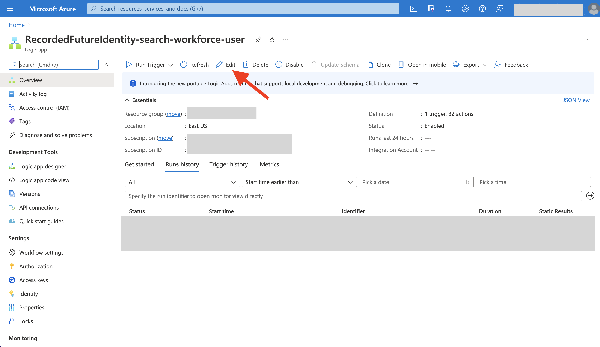
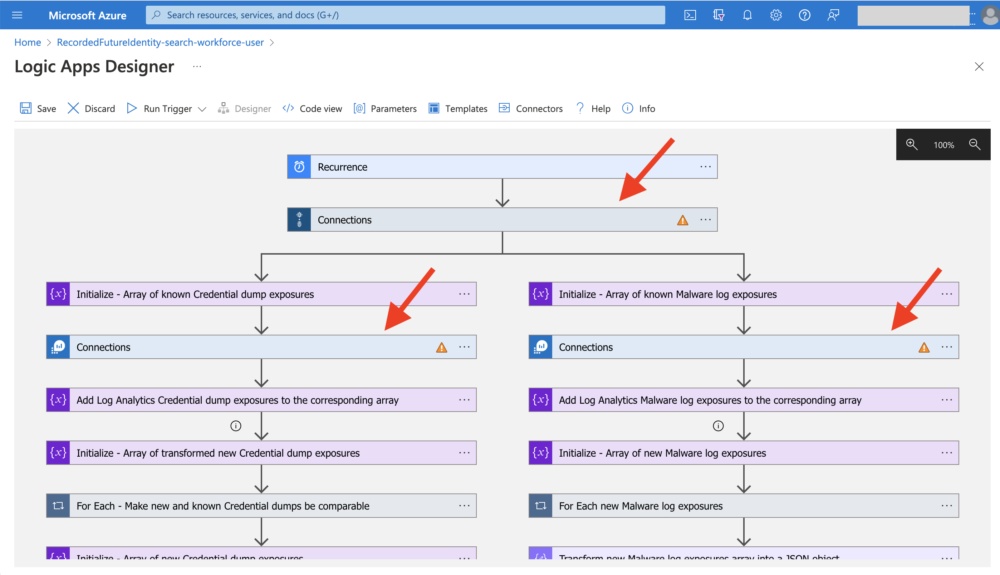
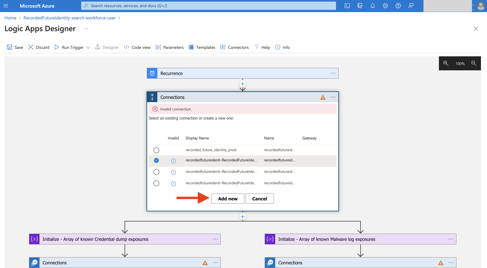
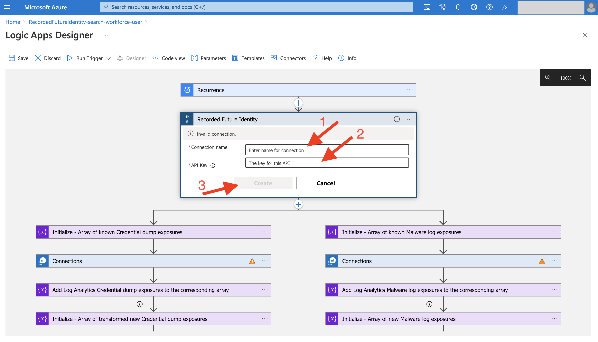
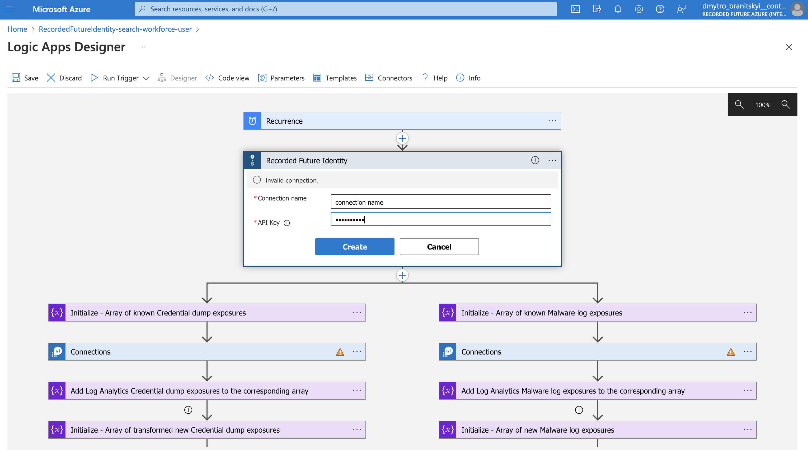

 
 

### Configuring Logic Apps Parameters

Using Logic Apps parameters - you can configure each Playbook in this Solution.

**For more information, see [Logic Apps Parameters](https://docs.microsoft.com/azure/logic-apps/create-parameters-workflows?tabs=consumption#define-use-and-edit-parameters) documentation.**

What exact parameters to configure for a specific Playbook and what each of the parameters means - you can find in the corresponding [section of this document](#playbooks).

On the screenshots you can see where to configure Logic Apps Parameters: 

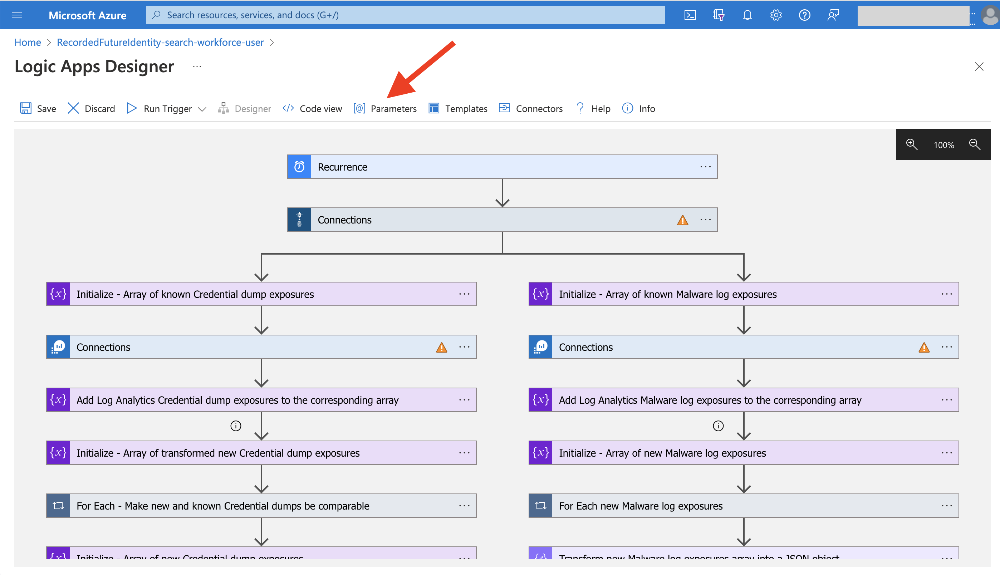
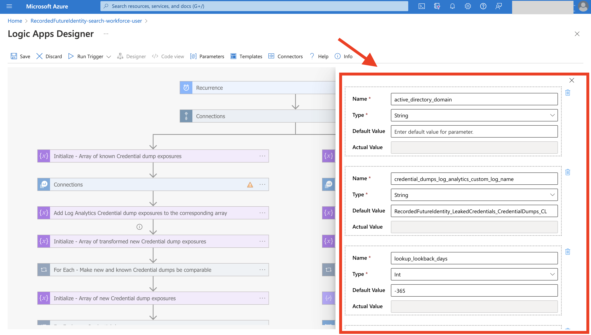

## Suggestions for advanced users

- You can add more advanced control of compromised Active Directory users using GraphQL API, which allows you to force a user to reset a password, etc. But it requires some additional Azure skills (secrets handling, etc).
- As Search and Lookup data is stored in Log Analytics Custom Log - you can create / set up custom Sentinel Alerts on that data.
- In current implementation Search request gets only 500 records per request. You can request more records using the "Results" parameter. Also you can create a loop and use the "Offset" parameter in Search to request all the records using pagination. Probably better to process/react on compromised credentials "on the go" in the same loop cycle you retrieved them.

## How to access Log Analytics Custom Logs

To see Log Analytics Custom Logs:
-   From your Home page, navigate to the `Log Analytics` service
-   There, select the Workspace in which you have deployed the Solution
-   There, in the left-side menu click on Logs, and expand second left side menu, and select Custom Logs

## Useful Azure documentation

Microsoft Sentinel:
- [Quickstart Onboard](https://docs.microsoft.com/azure/sentinel/quickstart-onboard)
- [Solutions](https://docs.microsoft.com/azure/sentinel/sentinel-solutions)
- [Connect Data sources](https://docs.microsoft.com/azure/sentinel/connect-data-sources)
- [Playbooks](https://docs.microsoft.com/azure/sentinel/automate-responses-with-playbooks)

Permissions / Roles:
- [Azure](https://docs.microsoft.com/azure/role-based-access-control/rbac-and-directory-admin-roles#azure-roles)
- [Sentinel](https://docs.microsoft.com/azure/sentinel/roles)
- [Purchase on Marketplace](https://docs.microsoft.com/marketplace/azure-purchasing-invoicing#permission-to-purchase)
- [Log Analytics](https://docs.microsoft.com/azure/role-based-access-control/built-in-roles#log-analytics-contributor)
- [Logic Apps](https://docs.microsoft.com/azure/role-based-access-control/built-in-roles#logic-app-contributor)

## How to obtain Recorded Future API token

Recorded Future clients interested in API access for custom scripts or to enable a paid integration can request an API Token via this Integration Support Ticket form.  Please fill out the following fields, based on intended API usage.

Recorded Future API Services - Choose if your token is pertaining to one of the below Recorded Future API offerings:
- Connect API
- Entity Match API
- List API 
- Identity API (Note:  Identity API is included with license to Identity Intelligence Module)
- Detection Rule API
- Playbook Alert API (currently in Beta)

Integration Partner Category - Choose if your token is pertaining to a supported partner integration offering:
- Premier Integrations
- Partner Owned Integrations
- Client Owned Integration
- Intelligence Card Extensions

Select Your Problem - Choose "Upgrade" or "New Installation"

Note that for API access to enable a paid integration, Recorded Future Support will connect with your account team to confirm licensing and ensure the token is set up with the correct specifications and permissions.

Additional questions about API token requests not covered by the above can be sent via email to our support team, support@recordedfuture.com.

## How to contact Recorded Future

If you are already a Recorded Future client and wish to learn more about using Recorded Future’s Microsoft integrations, including how to obtain an API Token to enable an integration contact us at **support@recordedfuture.com**. 

If you not a current Recorded Future client and wish to become one, contact **sales@recordedfuture.com** to setup a discussion with one of our business development associates.
