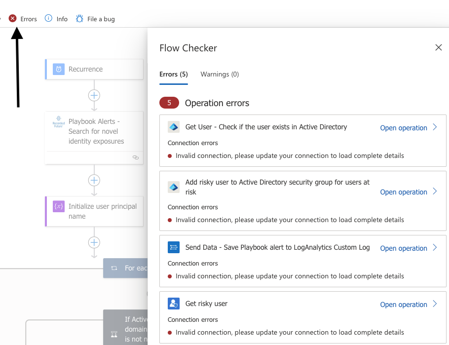
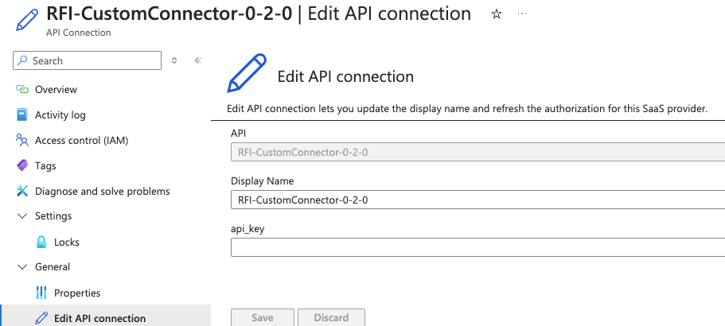
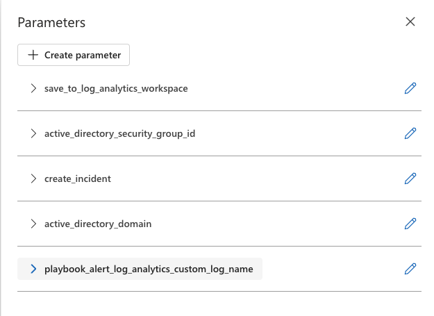
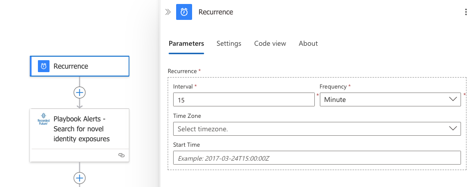
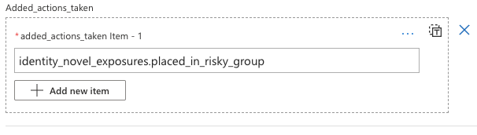

# Recorded Future Identity Installation Guide

Link to [Recorded Future Identity main readme](../readme.md)

---

## Migrations & Breaking Changes

> [!IMPORTANT]
> ### Log Ingestion API migration (deadline: 2026-09-14)
>
> The `RFI-Playbook-Alert-Importer-LAW` playbook used the deprecated Azure Log Analytics Data Collector connector, which Microsoft is retiring on September 14, 2026. 
>
> Notable solution changes:
> - `RFI-Playbook-Alert-Importer-LAW` has been updated to use the Log Ingestion API instead, which authenticates via managed identity and routes data through a Data Collection Endpoint (DCE) and Data Collection Rule (DCR) rather than a shared workspace key.
> - The LAW table has been renamed from `RecordedFutureIdentity_PlaybookAlertResults_CL` to `RFI_PlaybookAlertResults_V2_CL` (Microsoft doesn't allow us to target an existing "v1" table with DCR/DCE without running migration scripts, so a new table was needed)
> 
> **Migration path:**
> 1. Deploy the Data Connectors infrastructure (step B1) and the updated Logic App (step B3).
> 2. Deploy the updated Analytics Rule that creates incidents from `RFI_PlaybookAlertResults_V2_CL` (step B4).
> 3. _Optional_: If you have other logic apps or processes dependent on `RecordedFutureIdentity_PlaybookAlertResults_CL`, update these references to `RFI_PlaybookAlertResults_V2_CL`.

> [!WARNING]
> ### Microsoft Defender Platform Migration
>
> The `RFI-Playbook-Alert-Importer-LAW-Sentinel` playbook is deprecated. Incidents created via the Azure Sentinel Logic Apps connector no longer appear in the Microsoft Defender portal.
>
> **Migration path:**
> 1. Deploy the Data Connectors infrastructure (step B1).
> 2. Deploy the Logic App `RFI-Playbook-Alert-Importer-LAW` (step B3) to write alert data to Log Analytics.
> 3. Deploy the Analytics Rule (step B4) to create incidents from the `RFI_PlaybookAlertResults_V2_CL` table.

---

## Overview

This solution contains two approaches to deal with exposed credentials.

- The recommended variant (based on Recorded Future Playbook Alerts) is described in this readme
- The old variant (based on the Recorded Future Identity API) is located in the [v3.0](v3.0) folder

For importing playbook alerts, there are two options available, depending on your organization's needs and existing infrastructure:

| Option | When to use |
|-|-|
| A. Entra ID only | Choose if only Entra ID is available. |
| B. Entra ID + Log Analytics + Incident Creation | Choose if Entra ID and Log Analytics Workspace (LAW) is available. **Recommended.** |

### How it works

Both options poll Recorded Future for Novel Identity Exposure Playbook Alerts on a recurring schedule, place affected users in an Entra ID security group, optionally confirm them as risky in Entra ID Identity Protection, and report actions taken back to Recorded Future.

Detailed workflow

| # | Action | Option A | Option B |
|-|-|-|-|
| 1 | Pull novel identity exposure Playbook Alerts from Recorded Future based on previously done Playbook Alert setup. | ✅ | ✅ |
| 2 | For each user, check if they exist within the domain, if so, place them in a specified security group. If the user is already flagged as a "Risky user" by Microsoft, confirm them as risky. | ✅ | ✅ |
| 3 | Save all information related to the Playbook Alert in a Log Analytics Workspace. | ❌ | ✅ |
| 4 | Create a Microsoft Sentinel incident with information pertaining to the identity exposure. | ❌ | ✅ |
| 5 | Report back actions taken for each specific Playbook Alert to Recorded Future, for viewing in Recorded Future Portal. | ✅ | ✅ |

### Prerequisites

- A Recorded Future Identity API token. See [Support & API Token](#api-token).
- A Microsoft Entra ID security group to place users with leaked credentials into (note its Object ID).
- A Playbook Alert rule configured in the Recorded Future portal. See [this guide](https://support.recordedfuture.com/hc/en-us/articles/21314816259859-Identity-Exposure-Playbook-Alert-Configuration).

---

## Required Permissions

Permissions required to deploy Option A (Entra ID only):

| Deployment step       | Permission                                                                                                                                                                                                                                                                                                                                                                                            |
|-----------------------|-------------------------------------------------------------------------------------------------------------------------------------------------------------------------------------------------------------------------------------------------------------------------------------------------------------------------------------------------------------------------------------------------------|
| A1 - Custom connector | <a href="https://learn.microsoft.com/en-us/azure/role-based-access-control/built-in-roles#logic-app-contributor" target="_blank">_**Logic App Contributor**_</a> and <a href="https://learn.microsoft.com/en-us/azure/role-based-access-control/built-in-roles#microsoft-sentinel-contributor" target="_blank">_**Microsoft Sentinel Contributor**_ </a> permissions on a **Resource Group** level.   |
| A2 - Logic app        | <a href="https://learn.microsoft.com/en-us/azure/role-based-access-control/built-in-roles#logic-app-contributor" target="_blank">_**Logic App Contributor**_</a> and <a href="https://learn.microsoft.com/en-us/azure/role-based-access-control/built-in-roles#microsoft-sentinel-contributor" target="_blank">_**Microsoft Sentinel Contributor**_ </a> permissions on a **Resource Group** level.   |

Permissions required to deploy Option B (Entra ID + Log Analytics + Incident Creation):

<table>
  <thead>
    <tr>
      <th>Deployment step</th>
      <th>Permission</th>
    </tr>
  </thead>
  <tbody>
    <tr>
      <td>B1 - Data connectors</td>
      <td><a href="https://learn.microsoft.com/en-us/azure/role-based-access-control/built-in-roles#monitoring-contributor" target="_blank"><em><strong>Monitoring Contributor</strong></em></a> and <a href="https://learn.microsoft.com/en-us/azure/role-based-access-control/built-in-roles#log-analytics-contributor" target="_blank"><em><strong>Log Analytics Contributor</strong></em></a> on the <strong>Resource Group</strong> level.</td>
    </tr>
    <tr>
      <td>B2 - Custom connector</td>
      <td><a href="https://learn.microsoft.com/en-us/azure/role-based-access-control/built-in-roles#logic-app-contributor" target="_blank"><em><strong>Logic App Contributor</strong></em></a> and <a href="https://learn.microsoft.com/en-us/azure/role-based-access-control/built-in-roles#microsoft-sentinel-contributor" target="_blank"><em><strong>Microsoft Sentinel Contributor</strong></em></a> permissions on a <strong>Resource Group</strong> level.</td>
    </tr>
    <tr>
      <td>B3 - Logic app (create_role_assignment=true)</td>
      <td>
        Either:
        <ol>
        <li><a href="https://learn.microsoft.com/en-us/azure/role-based-access-control/built-in-roles/privileged#owner" target="_blank"><em><strong>Owner</strong></em></a> permissions on a <strong>Resource Group</strong> level.</li>
        <li><strong>or</strong> <a href="https://learn.microsoft.com/en-us/azure/role-based-access-control/built-in-roles#logic-app-contributor" target="_blank"><em><strong>Logic App Contributor</strong></em></a> and <a href="https://learn.microsoft.com/en-us/azure/role-based-access-control/built-in-roles#microsoft-sentinel-contributor" target="_blank"><em><strong>Microsoft Sentinel Contributor</strong></em></a> and <a href="https://learn.microsoft.com/en-us/azure/role-based-access-control/built-in-roles#microsoft-sentinel-contributor" target="_blank"><em><strong>Role Based Access Control Administrator</strong></em></a> on a <strong>Resource Group</strong> level.</li>
        </ol>
      </td>
    </tr>
    <tr>
      <td>B3 - Logic app (create_role_assignment=false)</td>
      <td>
        <a href="https://learn.microsoft.com/en-us/azure/role-based-access-control/built-in-roles#logic-app-contributor" target="_blank"><em><strong>Logic App Contributor</strong></em></a> and <a href="https://learn.microsoft.com/en-us/azure/role-based-access-control/built-in-roles#microsoft-sentinel-contributor" target="_blank"><em><strong>Microsoft Sentinel Contributor</strong></em></a> permissions on a <strong>Resource Group</strong> level.
         <strong>Note: </strong> if you use create_role_assignment=false, an Azure administrator needs to manually assign <a href="https://learn.microsoft.com/en-us/azure/role-based-access-control/built-in-roles/monitor#monitoring-metrics-publisher" target="_blank"><em><strong>Monitoring Metrics Publisher</strong></em></a> role on the recorded-future-identity-dcr-playbook-alerts Data Collection Rule to the Logic App's managed identity after deployment.
      </td>
    </tr>
    <tr>
      <td>B4 - Analytic rules</td>
      <td><a href="https://learn.microsoft.com/en-us/azure/role-based-access-control/built-in-roles#microsoft-sentinel-contributor" target="_blank"><em><strong>Microsoft Sentinel Contributor</strong></em></a> permissions on a <strong>Resource Group</strong> level.</td>
    </tr>

</tbody>
</table>

Post-deployment, authorizing the connectors also requires:
- **Entra ID** (`azuread`): the authorizing user must have the Entra role `Directory Writers`
- **Entra ID Identity Protection** (`azureadip`): the authorizing user must have the Entra role `Security Administrator`

---

## Deployment
### Deploying Option A - Entra ID only

This option handles Entra ID group assignment and optional risky user confirmation, but does not write any data to Log Analytics.

Deploy the following resources **in order**:

#### A1 — Deploy RFI-CustomConnector

The custom connector handles communication with the Recorded Future API.

Expand deployment parameters:

| Parameter | Description |
|-|-|
| **Connector-Name** | Name for this connector resource (default: `RFI-CustomConnector-0-2-0`). |
| **Service Endpoint** | Always use the default: `https://api.recordedfuture.com/gw/azure-identity` |

#### A2 — Deploy RFI-Playbook-Alert-Importer

Logic App that runs on a recurring schedule.

Expand deployment parameters:

| Parameter | Description |
|-|-|
| **Playbook Name** | Name for this Logic App (default: `RFI-Playbook-Alert-Importer`). |
| **Entra_id_security_group_id** | Object ID of the Entra ID security group to place risky users into. The group must be pre-created — search for "Groups" in the Azure Portal. Leave empty to skip group assignment. |
| **Confirm_user_as_risky** | Confirm affected users as risky in Entra ID Identity Protection. Note: this only acts on users already flagged as risky by Microsoft — it does not flag them itself. Requires Entra ID P1 or P2 license. |
| **Entra_id_domain** | Optional domain override — use this if your Entra ID domain differs from the leaked credential domain (e.g. leaked email is `user@acme.com` but the Entra ID UPN is `user@acme.onmicrosoft.com`, set this to `acme.onmicrosoft.com`). Leave empty if your Entra ID domain matches the leaked credential domain. |
| **RFI Custom Connector** | Name of the connector deployed in A1 (default: `RFI-CustomConnector-0-2-0`). |

---

### Deploying Option B — Entra ID + Log Analytics + Incident Creation

This option handles Entra ID group assignment and optional risky user confirmation, as well as saving detailed Playbook Alert data to a Log Analytics Workspace and enabling automatic incident creation via an Analytic Rule.

Deploy the following resources **in order**:

#### B1 — Deploy Data Connectors infrastructure

Shared infrastructure required by the playbook to write data to Log Analytics: a Data Collection Endpoint (DCE), a Data Collection Rule (DCR), the `RFI_PlaybookAlertResults_V2_CL` Log Analytics table, and the Data Connector tile in the Microsoft Sentinel Data Connectors blade. Deploy this into the same resource group as your Log Analytics Workspace.

Expand deployment parameters:

| Parameter | Description |
|-|-|
| **log_analytics_workspace_name** | Name of your Log Analytics Workspace. Must be in the same resource group. |
| **log_analytics_workspace_location** | Location of the workspace. Defaults to the resource group location. |

#### B2 — Deploy RFI-CustomConnector

The custom connector handles communication with the Recorded Future API.

Expand deployment parameters:

| Parameter | Description |
|-|-|
| **Connector-Name** | Name for this connector resource (default: `RFI-CustomConnector-0-2-0`). |
| **Service Endpoint** | Always use the default: `https://api.recordedfuture.com/gw/azure-identity` |

#### B3 — Deploy RFI-Playbook-Alert-Importer-LAW

Logic App that runs on a recurring schedule.

Expand deployment parameters:

| Parameter | Description |
|-|-|
| **Playbook Name** | Name for this Logic App (default: `RFI-Playbook-Alert-Importer-LAW`). |
| **Save_to_log_analytics_workspace** | Whether to save detailed Playbook Alert data to Log Analytics. Defaults to `true`. |
| **Entra_id_security_group_id** | Object ID of the Entra ID security group to place risky users into. The group must be pre-created — search for "Groups" in the Azure Portal. Leave empty to skip group assignment. |
| **Confirm_user_as_risky** | Confirm affected users as risky in Entra ID Identity Protection. Note: this only acts on users already flagged as risky by Microsoft — it does not flag them itself. Requires Entra ID P1 or P2 license. |
| **Entra_id_domain** | Optional domain override — use this if your Entra ID domain differs from the leaked credential domain (e.g. leaked email is `user@acme.com` but the Entra ID UPN is `user@acme.onmicrosoft.com`, set this to `acme.onmicrosoft.com`). Leave empty if your Entra ID domain matches the leaked credential domain. |
| **Playbook_alert_log_analytics_custom_log_name** | Name of the Log Analytics table to write alert data to (default: `RFI_PlaybookAlertResults_V2_CL`). |
| **log_analytics_workspace_name** | Name of your Log Analytics Workspace. |
| **create_role_assignment** | Whether to automatically assign the _Monitoring Metrics Publisher_ role on the DCR to the Logic App's managed identity. See [Required Permissions](#required-permissions) for details. |
| **RFI Custom Connector** | Name of the connector deployed in B2 (default: `RFI-CustomConnector-0-2-0`). |

#### B4 — Deploy Analytics Rule

This rule queries the `RFI_PlaybookAlertResults_V2_CL` table and creates Microsoft Sentinel incidents for new identity exposures. The table is created in step B1, so this can be deployed as soon as B1 is complete.

The rule is also available under **Microsoft Sentinel → Configuration → Analytics → Rule Templates**.

---

## Post-deployment configuration

### Finding the Logic Apps after deployment

After deployment, search for `Logic Apps` in the [Azure Portal](https://portal.azure.com/) to find the deployed playbooks.

### Authorizing connections

After deployment the Logic App will show errors until all connections are authorized. Navigate to the Logic App → **Development tools** → **API connections**.

The Recorded Future identity solution uses the following connectors. Each needs to be individually authorized after deployment.

| Connector | Description |
|-|-|
| **/RFI-CustomConnector** | [How to obtain Recorded Future API token](#api-token) |
| **/azuread** | [Microsoft Entra ID power platform connectors](https://learn.microsoft.com/en-us/connectors/azuread/) |
| **/azureadip** | [Azure AD Identity Protection](https://learn.microsoft.com/en-us/connectors/azureadip/) |

Below are guides for each connector. Depending on your organizational rules, the flow might be different — consult with your Azure administrator in those cases.

Expand to see RFI-CustomConnector authorization guide

 

After a Logic App has been installed, the **RFI-CustomConnector-0-2-0** needs to be authorized. This only needs to be done once. If there are any uncertainties expand all nodes in the Logic App after installation and look for blocks marked with a warning sign.

1. Go to the specific Logic App, in the left menu click on the section _**Development tools**_
2. Click on **_API connections_**
3. Click on **_RFI-CustomConnector-0-2-0_**
4. Click on **_General_** in the left menu on the newly opened section
5. Click on **_Edit API Connection_**
6. Paste the **Recorded Future API Key** and click **_Save_**

Expand to see azuread authorization information

 

The Microsoft Entra ID connector needs to be authorized via **OAuth** by a user who has the `Group.ReadWrite.All`, `User.ReadWrite.All`, and `Directory.ReadWrite.All` permissions. For more information, see <a href="https://learn.microsoft.com/en-us/connectors/azuread/" target="_blank">this article</a>.

Expand to see azureadip authorization information

 

The Azure AD Identity Protection connector needs to be authorized via **OAuth**. For more information, see <a href="https://learn.microsoft.com/en-us/connectors/azureadip/" target="_blank">this article</a>.

After all connections are authorized, make sure the Logic App is **enabled**.

### Configuring playbook parameters

Playbook parameters can be updated at any time without redeployment. Open the Logic App → **Logic app designer** → **Parameters** (toolbar).

### Running the playbook

The playbook runs on a recurring schedule. You can also trigger it manually or adjust the interval from the Logic App designer.

### Accessing Log Analytics Custom Logs

From the Azure Portal, navigate to **Log Analytics workspaces** → select your workspace → **Logs** → **Custom Logs**.

---

## Customization

### Automatic remediation

The default configuration remediates exposed users by placing them in an Entra ID security group and optionally confirming them as risky. Depending on your Entra ID license level, additional automated remediation options are available:

- [Conditional Access Policies](https://learn.microsoft.com/en-us/entra/identity/conditional-access/overview) — requires P1 or P2. Allows blocking sign-ins for users in the risky group.
- [Entra ID Protection](https://learn.microsoft.com/en-us/entra/id-protection/overview-identity-protection) — requires P1 or P2. Allows forcing password resets for risky users.
- [Microsoft Graph API](https://learn.microsoft.com/en-us/graph/identity-network-access-overview) — no license requirement, but requires additional configuration. Contact your Recorded Future Customer Success Manager for guidance.

### Onward Actions

The playbook reports back to Recorded Future which remediation actions were taken on each alert, keeping the Playbook Alert status in the Recorded Future portal up to date. By default the playbook reports `identity_novel_exposures.placed_in_risky_group`. To add or change reported actions, modify the `added_actions_taken` field in the Playbook Alert Update step in the Logic App designer.

Supported values:

| Action |
|-|
| `identity_novel_exposures.enforced_password_reset` |
| `identity_novel_exposures.placed_in_risky_group` |
| `identity_novel_exposures.reviewed_incident_report` |
| `identity_novel_exposures.account_disabled_or_terminated` |
| `identity_novel_exposures.account_remediated` |
| `identity_novel_exposures.other` |

---

## Known Issues

#### Risky Users (Microsoft Entra ID P1 or P2 license)
Microsoft Entra ID Protection is a premium feature. You need an Microsoft Entra ID P1 or P2 license to access the `riskDetection` API (note: P1 licenses receive limited risk information). The `riskyUsers` API is only available to Microsoft Entra ID P2 licenses only. If your organization does not have P1 or P2 license, then the `Confirm as risky user as compromised` step will fail, but the run will continue and complete.

#### Playbook Alert set to resolved but not added to Security Group
When the user that authorizes the Entra ID connector can search for a user in Entra ID, but lacks sufficient privileges to add the user to a group (e.g, same organization, but no permissions to modify users) there can be a scenario where the Logic App does not fail, and the Playbook Alert is incorrectly set to resolve, even if no remediation action has been done. A possible remediation can be that the user which authorizes the Entra ID connector has sufficient privileges to modify all users in  a organization.

---

## Deprecated: RFI-Playbook-Alert-Importer-LAW-Sentinel

> [!WARNING]
> This playbook is deprecated and should not be used for new deployments. Incidents created via the Azure Sentinel Logic Apps connector do not appear in the unified Microsoft Defender portal. Use `RFI-Playbook-Alert-Importer-LAW` with an Analytics Rule instead — see **Option B** above.

The deploy button below is provided for reference only.

---

## Useful Azure documentation

Microsoft Sentinel:
- [Playbooks](https://docs.microsoft.com/azure/sentinel/automate-responses-with-playbooks)

Permissions / Roles:
- [Azure](https://docs.microsoft.com/azure/role-based-access-control/rbac-and-directory-admin-roles#azure-roles)
- [Log Analytics](https://docs.microsoft.com/azure/role-based-access-control/built-in-roles#log-analytics-contributor)
- [Logic Apps](https://docs.microsoft.com/azure/role-based-access-control/built-in-roles#logic-app-contributor)

---

## Support & API Token

You can issue a Recorded Future Identity API token yourself by visiting the Integration Center within the [Recorded Future Portal](https://app.recordedfuture.com).

For questions or support, contact **support@recordedfuture.com**.
