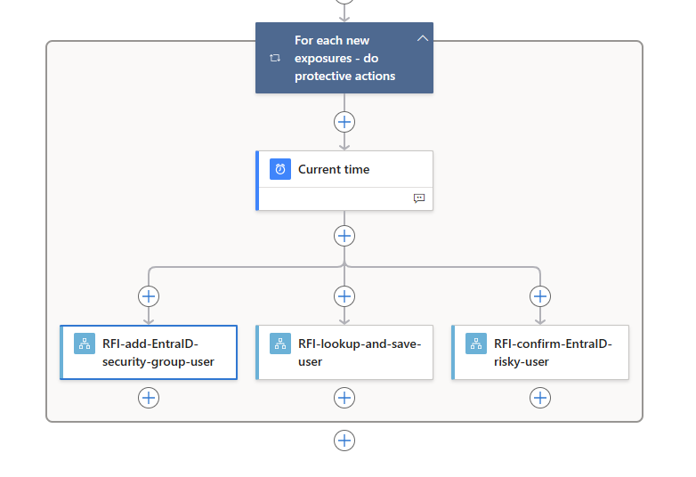

# Recorded Future Identity Installation Guide

Link to [Recorded Future Identity main readme](../readme.md)

## Table of Contents

1. [Overview](#overview)
1. [Deployment](#deployment)
1. [Prerequisites](#prerequisites)  
1. [Playbooks](#playbooks)
   1. ["Connector" playbooks](#connector_playbooks)
      1. [RFI-CustomConnector](#RFI-CustomConnector)
   1. [Base playbooks](#Base-playbooks)
      1. [Add risky user to Microsoft EntraID Group](#RFI-add-EntraID-security-group-user)
      1. [Microsoft EntraID Protection - confirm user is compromised](#entraid_identity_protection_confirm_user_is_compromised)
      1. [Lookup risky user and save results](#RFI-lookup-and-save-user)
   1. ["Search" playbooks (Workforce and External)](#search_playbooks)
      1. [RFI-search-workforce-user](#RFI-search-workforce-user)
      1. [RFI-search-external-user](#RFI-search-external-user)
1. [How to configure playbooks](#configuration)
   1. [How to find the playbooks (Logic Apps) after deployment](#find_playbooks_after_deployment)
   1. [Configuring Playbooks Connections](#configuration_connections)
   1. [API connector authorization](#API-connector-authorization)
   1. [Configuring Playbooks Parameters](#configuration_parameters)
1. [How to Run Playbooks](#how_to_run_playbooks)
1. [Suggestions for advanced users](#suggestions_for_advanced_users)
1. [How to access Log Analytics Custom Logs](#how_to_access_log_analytics_custom_logs)
1. [Useful Azure documentation](#useful_documentation)
1. [How to obtain Recorded Future API token](#how_to_obtain_Recorded_Future_API_token)
1. [How to contact Recorded Future](#how_to_contact_Recorded_Future)

<a id="overview"></a>
## Overview

This Solution consists of 6 playbooks (Logic Apps). Due to inconsistent naming of Logic Apps in Microsoft security products like Sentinel we will use the name playbooks instead of Logic Apps in this README. The playbooks need to be installed in the following order: custom-connector, base playbooks and one of the search playbooks. 

<details>
<summary>Expand playbook overview</summary>

<br/>

Connector playbooks:
Custom connector are used to communicate and authorize towards Recorded Future backend API. 

| Playbook Name| Description  |
|-|-|
| **RFI-CustomConnector** | RFI-CustomConnector connection and authorization to Recorded Future Backend API.|

Base playbooks:
Sub playbooks that are called by the search playbooks. 

| Playbook Name | Description |
|-|-|
| **RFI-add-EntraID-security-group-user** | Add risky user to Microsoft EntraID Group for users at risk. |
| **RFI-confirm-EntraID-risky-user** | Confirm to Microsoft EntraID Identity Protection that user is compromised. |
| **RFI-lookup-and-save-user** | Lookup additional information on a compromised user and save results to Log Analytics. |

Search playbooks:
These are the main playbooks, select one and run on a schedule.  

| Playbook Name | Description |
|-|-|
| **RFI-search-workforce-user** | Search new exposures for Workforce users. |
| **RFI-search-external-user** | Search new exposures for External users. |
</details>

## Deployment

Recorded Future recommend deploying playbooks in this solution from this README, first the connector and then the base playbooks. Deploy search playbook dependent on your use case. After installation configure connectors inside of each playbook. Lastly configure playbook parameters in the search playbook. 

### Prerequisites

- A Microsoft EntraID Tenant and subscription. 
- Azure subscription Owner or Contributor permissions so you can install the Logic Apps. [Azure roles - Classic subscription administrator roles, Azure roles, and Entra ID roles](https://docs.microsoft.com/azure/role-based-access-control/rbac-and-directory-admin-roles#azure-roles).
- A [Log Analytics workspace](https://docs.microsoft.com/azure/azure-monitor/essentials/resource-logs#send-to-log-analytics-workspace). If you don't have a workspace, learn [how to create a Log Analytics workspace](https://docs.microsoft.com/azure/azure-monitor/logs/quick-create-workspace). Note that the custom logs specified as parameters in these logic apps will be created automatically if they don’t already exist. Note the name of the Log Analytic Workspace, it will be used at a later stage of the deployment.
- In Consumption logic apps, before you can create or manage logic apps and their connections, you need specific permissions. For more information about these permissions, review [Secure operations - Secure access and data in Azure Logic Apps](https://docs.microsoft.com/azure/logic-apps/logic-apps-securing-a-logic-app#secure-operations).
- For `Recorded Future Identity` Connections you will need `Recorded Future Identity API` token. To obtain one - check out [this section](#how_to_obtain_Recorded_Future_API_token).


<a id="playbooks"></a>
## Playbooks

> [!IMPORTANT]
> Deploy connector and base playbooks before deploying the Search playbooks. 

<a id="connector_playbooks"></a>
### Connector-playbooks

Connector playbooks are used by other playbooks in this solution to communicate with Recorded Future backend API. 

## RFI-CustomConnector

This connector is used by other playbooks in this solution to communicate with Recorded Future backend API. 

### Deployment

<a href="https://portal.azure.com/#create/Microsoft.Template/uri/https%3A%2F%2Fraw.githubusercontent.com%2FAzure%2FAzure-Sentinel%2Fmaster%2FSolutions%2FRecorded%20Future%20Identity%2FPlaybooks%2FRFI-CustomConnector-0-1-0%2Fazuredeploy.json" target="_blank"></a>
<a href="https://portal.azure.us/#create/Microsoft.Template/uri/https%3A%2F%2Fraw.githubusercontent.com%2FAzure%2FAzure-Sentinel%2Fmaster%2FSolutions%2FRecorded%20Future%20Identity%2FPlaybooks%2FRFI-CustomConnector-0-1-0%2Fazuredeploy.json" target="_blank"></a>

<details>
<summary>Expand deployment parameters:</summary>

| Parameter | Description |
|-|-|
| **Subscription** | Your Azure Subscription to deploy the Solution in. All resources in an Azure subscription are billed together. |
| **Resource group** | Resource group in your Subscription to deploy the Solution in. A resource group is a collection of resources that share the same lifecycle, permissions, and policies. |
| **Region** | Choose the Azure region that's right for you and your customers. Not every resource is available in every region. |
| **Connector-Name**  | Connector name to use for this playbook (ex. "RFI-CustomConnector-0-1-0"). |
|**Service Endpoint**| API Endpoint, always use the default ```https://api.recordedfuture.com/gw/azure-identity```| 
</details>
<hr/>

## Base-playbooks

Base playbooks is called within the search playbooks to take action and mitigate the risks.

## RFI-add-EntraID-security-group-user

This playbook adds a compromised user to an Microsoft EntraID group. Triage and remediation should be handled in sub playbooks. 
By applying security policies to the Microsoft EntraID group and adding leaked users to that group - you can react to a leak and mitigate the risks.

<details>
<summary> 
Expand Playbook Workflow
</summary>

| # | Action |
|-|-|
| 1 | Called by search playbooks. |
| 2 | From `user_principal_name` (email or email username + Entra ID domain if it is not empty). |
| 3 | Get user from EntraID by `user_principal_name`. |
| 4 | Add user to EntraID security group. |
</details>

### Deployment

<a href="https://portal.azure.com/#create/Microsoft.Template/uri/https%3A%2F%2Fraw.githubusercontent.com%2FAzure%2FAzure-Sentinel%2Fmaster%2FSolutions%2FRecorded%20Future%20Identity%2FPlaybooks%2FRFI-add-EntraID-security-group-user%2Fazuredeploy.json" target="_blank"></a> 
<a href="https://portal.azure.us/#create/Microsoft.Template/uri/https%3A%2F%2Fraw.githubusercontent.com%2FAzure%2FAzure-Sentinel%2Fmaster%2FSolutions%2FRecorded%20Future%20Identity%2FPlaybooks%2FRFI-add-EntraID-security-group-user%2Fazuredeploy.json" target="_blank"></a>

<details>
<summary>Expand deployment parameters:</summary>

| Parameter | Description |
|-|-|
| **Subscription** | Your Azure Subscription to deploy the Solution in. All resources in an Azure subscription are billed together. |
| **Resource group** | Resource group in your Subscription to deploy the Solution in. A resource group is a collection of resources that share the same lifecycle, permissions, and policies. |
| **Region** | Choose the Azure region that's right for you and your customers. Not every resource is available in every region. |
| **Playbook-Name** | Playbook name to use for this playbook (ex. "RFI-add-EntraID-security-group-user"). |
</details>
<hr/>

<a id="entraid_identity_protection_confirm_user_is_compromised"></a>

## RFI-confirm-EntraID-risky-user

This playbook confirms compromise of users deemed "high risk" by Microsoft Entra ID Protection.

For more info on Microsoft EntraID Protection, read here: 
- [Microsoft Entra ID Protection](https://learn.microsoft.com/en-gb/entra/id-protection/) 
- [What is Identity Protection](https://learn.microsoft.com/en-gb/entra/id-protection/overview-identity-protection)
- [Remediate risks and unblock users](https://learn.microsoft.com/en-gb/entra/id-protection/howto-identity-protection-remediate-unblock).

Note that this playbook only runs on already flagged risky users. If a user isn't flagged as a risky user by Entra ID Protection, this playbook won't do anything.

<details>
<summary> 
Expand Playbook Workflow
</summary>

| # | Action |
|-|-|
| 1 | Called by search playbooks. |
| 2 | Get user from Microsoft EntraID by `user_principal_name`. |
| 3 | Check if Microsoft EntraID Identity Protection contains the user in a list of risky users. |
| 4 | Confirm to Microsoft EntraID Identity Protection that user is compromised. |
</details>

### Deployment

<a href="https://portal.azure.com/#create/Microsoft.Template/uri/https%3A%2F%2Fraw.githubusercontent.com%2FAzure%2FAzure-Sentinel%2Fmaster%2FSolutions%2FRecorded%20Future%20Identity%2FPlaybooks%2FRFI-confirm-EntraID-risky-user%2Fazuredeploy.json" target="_blank" ></a>
<a href="https://portal.azure.us/#create/Microsoft.Template/uri/https%3A%2F%2Fraw.githubusercontent.com%2FAzure%2FAzure-Sentinel%2Fmaster%2FSolutions%2FRecorded%20Future%20Identity%2FPlaybooks%2FRFI-confirm-EntraID-risky-user%2Fazuredeploy.json" target="_blank"></a>

<details>
<summary>Expand deployment parameters:</summary>

| Parameter | Description |
|-|-|
| **Subscription** | Your Azure Subscription to deploy the Solution in. All resources in an Azure subscription are billed together. |
| **Resource group** | Resource group in your Subscription to deploy the Solution in. A resource group is a collection of resources that share the same lifecycle, permissions, and policies. |
| **Region** | Choose the Azure region that's right for you and your customers. Not every resource is available in every region. |
| **Playbook-Name**  | Playbook name to use for this playbook (ex. "RFI-confirm-EntraID-risky-user"). |
</details>
<hr/>

## RFI-lookup-and-save-user

This playbook gets compromised identity details from Recorded Future Identity Intelligence and saves the data in Azure Log Analytics Workspace for further review and analysis.

Lookup returns more data than initial Search, so you will get the leaks history for the email and other info.

<details>
<summary> 
Expand Playbook Workflow
</summary>

| # | Action |
|-|-|
| 1 | Called by search playbooks. |
| 2 | Pull data from Recorded Future Identity API for specified email and time range. |
| 3 | Save Lookup results to Log Analytics Custom Log. |
</details>

### Deployment

<a href="https://portal.azure.com/#create/Microsoft.Template/uri/https%3A%2F%2Fraw.githubusercontent.com%2FAzure%2FAzure-Sentinel%2Fmaster%2FSolutions%2FRecorded%20Future%20Identity%2FPlaybooks%2FRFI-lookup-and-save-user%2Fazuredeploy.json" target="_blank"></a> 
<a href="https://portal.azure.us/#create/Microsoft.Template/uri/https%3A%2F%2Fraw.githubusercontent.com%2FAzure%2FAzure-Sentinel%2Fmaster%2FSolutions%2FRecorded%20Future%20Identity%2FPlaybooks%2FRFI-lookup-and-save-user%2Fazuredeploy.json" target="_blank"></a>

<details>
<summary>Expand deployment parameters:</summary>

| Parameter | Description |
|-|-|
| **Subscription** | Your Azure Subscription to deploy the Solution in. All resources in an Azure subscription are billed together. |
| **Resource group** | Resource group in your Subscription to deploy the Solution in. A resource group is a collection of resources that share the same lifecycle, permissions, and policies. |
| **Region** | Choose the Azure region that's right for you and your customers. Not every resource is available in every region. |
| **Playbook-Name**  | Playbook name to use for this playbook (ex. "RFI-lookup-and-save-user"). |
</details>
<hr/>

<a id="search_playbooks"></a>

## Search playbooks (Workforce and External)

Search the Recorded Future Identity Intelligence Module for compromised workforce or external users.

<details>
<summary> Workflow of Search Playbooks (both Workforce and External use cases)</summary>

| # | Action |
|-|-|
| 1 | Pull data from Recorded Future Identity API for specified domain and time range (can be "workforce" or "external" use case). |
| 2 | Pull previously seen/saved leaks data from Log Analytics Custom Log. |
| 3 | Compare data from step 1 and step 2 - to determine which leaks are new and haven't been seen previously by the Search Playbook. |
| 4 | Save the new leaks from step 3, so on the next run of the Search Playbook we would get that data on step 2. |
| 5 | Use Base Playbooks to react / take actions on the newly leaked credentials. |
</details>

External search playbook - will get data from Recorded Future on your clients leaks. The most valuable base playbook is "Lookup risky user and save results", as "Add risky user to Microsoft EntraID Group" and "Microsoft EntraID Identity Protection - confirm user is compromised" assumes that the leaked email is a user in your organization Microsoft EntraID, which is not true for External use case.

<a id="RFI-search-workforce-user"></a>
### Deployment RFI-search-workforce-user

<a href="https://portal.azure.com/#create/Microsoft.Template/uri/https%3A%2F%2Fraw.githubusercontent.com%2FAzure%2FAzure-Sentinel%2Fmaster%2FSolutions%2FRecorded%20Future%20Identity%2FPlaybooks%2FRFI-search-workforce-user%2Fazuredeploy.json" target="_blank"></a> 
<a href="https://portal.azure.us/#create/Microsoft.Template/uri/https%3A%2F%2Fraw.githubusercontent.com%2FAzure%2FAzure-Sentinel%2Fmaster%2FSolutions%2FRecorded%20Future%20Identity%2FPlaybooks%2FRFI-search-workforce-user%2Fazuredeploy.json" target="_blank"></a>

<details>
<summary>Expand deployment parameters:</summary>

| Parameter | Description |
|-|-|
| **Subscription** | Your Azure Subscription to deploy the Solution in. All resources in an Azure subscription are billed together. |
| **Resource group** | Resource group in your Subscription to deploy the Solution in. A resource group is a collection of resources that share the same lifecycle, permissions, and policies. |
| **Region** | Choose the Azure region that's right for you and your customers. Not every resource is available in every region. |
| **Playbook-Name** | Playbook name to use for this playbook (ex. "RFI-search-workforce-user"). |
| **Playbook-Name-add-EntraID-security-group-user** | Playbook name to use for "RFI-add-EntraID-security-group-user" playbook. |
| **Playbook-Name-confirm-EntraID-risky-user** | Playbook name to use for "RFI-confirm-EntraID-risky-user" playbook. |
| **Playbook-Name-lookup-and-save-user** | Playbook name to use for "RFI-lookup-and-save-user" playbook. |
</details>
<hr/>

<a id="RFI-search-external-user"></a>
### Deployment RFI-search-external-user (Service Providers or MSSPs)

<a href="https://portal.azure.com/#create/Microsoft.Template/uri/https%3A%2F%2Fraw.githubusercontent.com%2FAzure%2FAzure-Sentinel%2Fmaster%2FSolutions%2FRecorded%20Future%20Identity%2FPlaybooks%2FRFI-search-external-user%2Fazuredeploy.json" target="_blank"></a> 
<a href="https://portal.azure.us/#create/Microsoft.Template/uri/https%3A%2F%2Fraw.githubusercontent.com%2FAzure%2FAzure-Sentinel%2Fmaster%2FSolutions%2FRecorded%20Future%20Identity%2FPlaybooks%2FRFI-search-external-user%2Fazuredeploy.json" target="_blank"></a>

<details>
<summary>Expand deployment parameters:</summary>

| Parameter | Description |
|-|-|
| **Subscription** | Your Azure Subscription to deploy the Solution in. All resources in an Azure subscription are billed together. |
| **Resource group** | Resource group in your Subscription to deploy the Solution in. A resource group is a collection of resources that share the same lifecycle, permissions, and policies. |
| **Region** | Choose the Azure region that's right for you and your customers. Not every resource is available in every region. |
| **Playbook-Name** | Playbook name to use for this playbook (ex. "RFI-search-external-user"). |
| **Playbook-Name-add-EntraID-security-group-user** | Playbook name to use for "RFI-add-EntraID-security-group-user" playbook. |
| **Playbook-Name-confirm-EntraID-risky-user** | Playbook name to use for "RFI-confirm-EntraID-risky-user" playbook.                                                                                     |
| **Playbook-Name-lookup-and-save-user** | Playbook name to use for "RFI-lookup-and-save-user" playbook. |
</details>
<hr/>

## Configuration

### How to find the playbooks (Logic Apps) after deployment

To find installed Playbooks (Logic Apps) after deployment - you can search for `Logic Apps` from the [Azure Portal](https://portal.azure.com/) page and find deployed Logic Apps there.

<a id="configuration_connections"></a>
### Configuring Playbook Connections

After deployment - create/validate the Connections in each of deployed Playbooks. The logic app will have errors and save is disabled until all connectors are authorized.


<a id="API-connector-authorization"></a>
### API connector authorization
The Recorded Future identity solution uses the following connectors. Information on how to authorize connectors is documented in the provided links. Playbooks use connectors that have to be individually authorized during deployment.  

| Connector | Description |
|-|-|
| **/recordedfutureidenti** | [Microsoft power platform connector](https://learn.microsoft.com/en-us/connectors/recordedfutureidenti/).<br/> [How to obtain Recorded Future API token](#how_to_obtain_Recorded_Future_API_token) |
| **/RFI-CustomConnector** | [RecordedFuture-CustomConnector](Connectors/RecordedFuture-CustomConnector/readme.md) <br/> Same API token as the recordedfutureidenti connector. |
| **/azureloganalyticsdatacollector** | [Azure Log Analytics Data Collector](https://learn.microsoft.com/en-us/connectors/azureloganalyticsdatacollector/) <br/> [How to find Log Analytics Workspace key.](https://learn.microsoft.com/en-us/answers/questions/1154380/where-is-azure-is-the-primary-key-and-workspace-id) 
| **/azuremonitorlogs** | [Azure Monitor Logs](https://learn.microsoft.com/en-us/connectors/azuremonitorlogs/) |
| **/azuread** | [Microsoft Entra ID power platform connectors](https://learn.microsoft.com/en-us/connectors/azuread/). |
| **/azureadip** | [Azure AD Identity Protection](https://learn.microsoft.com/en-us/connectors/azureadip/) |

<a id="how_to_obtain_Recorded_Future_API_token"></a>
### How to obtain Recorded Future API token

Recorded Future clients interested in API access for custom scripts or to enable a paid integration can request an API Token via this [Integration Support Ticket form](https://support.recordedfuture.com/hc/en-us/articles/4411077373587-Requesting-API-Tokens).  Please fill out the following fields, based on intended API usage.

<details>
<summary>Expand for example image of request form.</summary> 


</details>
Select:

- Recorded Future API Services - Identity API
- Integration Partner Category - Recorded Future Owned Integrations (Premier)
- Premier Integration - Recorded Future Identity Intelligence for Azure Active Directory (Entra ID)
- Select Your Type of Inquiry (optional) - New Installation

Recorded Future Support will connect with your account team to confirm licensing and ensure the token is set up with the correct specifications and permissions. Additional questions about API token requests not covered by the above can be sent via email to our support team, support@recordedfuture.com.


<a id="configuration_parameters"></a>
### Configuring search Playbooks Parameters

Search playbooks are configured using Playbooks Parameters. Parameters can be found and set in the Logic App designer.


### Playbook parameters for Search Playbooks.

- **You need to create a Microsoft EntraID Group, and provide the Object ID as a parameter to the Playbook. For more information, see [Microsoft EntraID Groups](https://learn.microsoft.com/en-us/entra/fundamentals/how-to-manage-groups) documentation.**
- **You need to create a Log Analytics Workspace and provide the ID as a parameter to the playbook.**
- **Recorded Future must be authorize `organization_domain` to search for connected to the API Tokens. This is done during the API request process** 
 
> [!IMPORTANT]
> Make sure to set `lookup_lookback_days` same or larger than `search_lookback_days`. Otherwise, you can encounter a situation when you get empty results on Lookup for the compromised credentials from the search. 

| Parameter | Description | 
|-|-|
| **organization_domain** | Organization domain to search exposures for. |
| **search_lookback_days** | Time range for Search / number of days before today to search (e.g. input "-14" to search the last 14 days). |
| **malware_logs_log_analytics_custom_log_name** | Name for Log Analytics Custom Log to save Credential Dumps Search results at (**needs to end with "`_CL`"**). |
| **credential_dumps_log_analytics_custom_log_name** | Name for Log Analytics Custom Log to save Malware Logs Search results at (**needs to end with "`_CL`"**).  |
| **active_directory_security_group_id** | Object ID of Microsoft EntraID Group for users at risk. You need to pre-create it by hand: search for "Groups" in Service search at the top of the page. For more information, see [Microsoft EntraID Groups](https://docs.microsoft.com/windows/security/identity-protection/access-control/active-directory-security-groups) documentation. |
| **lookup_lookback_days**  | Time range for Lookup / number of days before today to search (e.g. input "-14" to search the last 14 days). **Make sure to use `lookup_lookback_days` same or larger than `search_lookback_days`. Otherwise you can encounter a situation when you get empty results on Lookup for the compromised credentials from the Search.** |
| **lookup_results_log_analytics_custom_log_name**   | Name for Log Analytics Custom Log to save Lookup results at (**needs to end with "`_CL`"**). |
| **active_directory_domain** | (Optional, can be left empty) - in case your Microsoft EntraID domain is different from your organization domain, this parameter will be used to transform compromised credentials to find corresponding user in your Microsoft EntraID (ex. Compromised email: leaked@mycompany.com), your Microsoft EntraID domain: `@mycompany.onmicrosoft.com`, so you set parameter `active_directory_domain = mycompany.onmicrosoft.com` (**just domain, without "@"**), and search playbooks will replace the domain from the leaked email with the provided domain from the active_directory_domain parameter, before searching for the corresponding user in your Microsoft EntraID: `leaked@mycompany.com ->  leaked@mycompany.onmicrosoft.com`. (Lookup playbook - will still use the original email to Lookup the data). |

Playbook parameters for Search playbook "External use case" are the same as for "Workforce use case", except "External use case" does NOT need `credential_dumps_log_analytics_custom_log_name` parameter.

<br/>

Remove base playbook steps from search playbooks if the actions are not valid for your use case. Actions like set user as risky requires additional licensing from Microsoft (RFI-confirm-EntraID-risky-user).



<a id="how_to_run_playbooks"></a>
## How to run Playbooks

RFI-search-workforce-user or/and RFI-search-external-user are running on recurrence schedule. It's possible to reschedule or change interval.


<a id="suggestions_for_advanced_users"></a>

## Suggestions for advanced users

- You can add more advanced control of compromised Microsoft EntraID users using GraphQL API, which allows you to force a user to reset a password, etc. But it requires some additional Azure skills (secrets handling, etc).
- As Search and Lookup data is stored in Log Analytics Custom Log - you can create / set up custom Sentinel Alerts on that data.
- In current implementation Search request gets only 500 records per request. You can request more records using the "Results" parameter. You can create a loop and use the "Offset" parameter in Search to request all the records using pagination. It's better to process/react on compromised credentials "on the go" in the same loop cycle you retrieved them.

<a id="how_to_access_log_analytics_custom_logs"></a>
## How to access Log Analytics Custom Logs

To see Log Analytics Custom Logs:
-   From then Azure Portal, navigate to the `Log Analytics workspaces` service
-   There, select the Log Analytic Workspace in which you have deployed the Solution
-   There, in the left-side menu click on Logs, and expand second left side menu, and select Custom Logs

## Troubleshooting

If you use the `RFI-lookup-and-save-user` playbook to Lookup leaks info for an email and response lookup data is empty (for specified email and look back range) - the playbook will still save empty results to the Log Analytics Custom Log. 

This case is possible if you set up the Playbooks in that way that Lookup look back range (`lookup_lookback_days`) in `RFI-lookup-and-save-user` playbook is smaller than Search look back range (`search_lookback_days`) in `RFI-search-workforce-user` or `RFI-search-external-user` playbooks.

In that case you will see some empty records in the corresponding Log Analytics Custom Log (see the screenshot). 

<details>
<summary>Expand screenshot</summary>

</details>
Another way to cover this case - you can add a corresponding check to RFI-lookup-and-save-user playbook and not save the results to Log Analytics if the result is empty.


<a id="useful_documentation"></a>
## Useful Azure documentation

Microsoft Sentinel:
- [Playbooks](https://docs.microsoft.com/azure/sentinel/automate-responses-with-playbooks)

Permissions / Roles:
- [Azure](https://docs.microsoft.com/azure/role-based-access-control/rbac-and-directory-admin-roles#azure-roles)
- [Log Analytics](https://docs.microsoft.com/azure/role-based-access-control/built-in-roles#log-analytics-contributor)
- [Logic Apps](https://docs.microsoft.com/azure/role-based-access-control/built-in-roles#logic-app-contributor)


<a id="how_to_contact_Recorded_Future"></a>
## How to contact Recorded Future

If you are already a Recorded Future client and wish to learn more about using Recorded Future’s Microsoft integrations, including how to obtain an API Token to enable an integration contact us at **support@recordedfuture.com**. 

If you not a current Recorded Future client and wish to become one, contact **sales@recordedfuture.com** to setup a discussion with one of our business development associates.