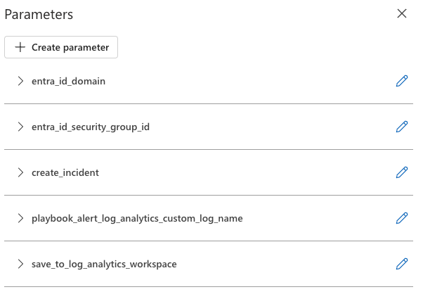

# Recorded Future Identity Installation Guide

Link to [Recorded Future Identity main readme](../readme.md)

## Table of Contents

1. [Overview](#overview)
1. [Deployment](#deployment)
1. [Prerequisites](#prerequisites)  
1. [Playbooks](#playbooks)
   1. ["Connector" playbooks](#connector_playbooks)
      1. [RFI-CustomConnector](#RFI-CustomConnector)
   1. ["Alert" playbooks](#alert_playbooks)
      1. [RFI-playbook-alert-importer](#RFI-playbook-alert-importer)
      1. [RFI-playbook-alert-importer-law](#RFI-playbook-alert-importer-law)
      1. [RFI-playbook-alert-importer-law-sentinel](#RFI-playbook-alert-importer-law-sentinel)
1. [How to configure playbooks](#configuration)
   1. [How to find the playbooks (Logic Apps) after deployment](#find_playbooks_after_deployment)
   1. [Configuring Playbooks Connections](#configuration_connections)
   1. [API connector authorization](#API-connector-authorization)
   1. [Configuring Playbooks Parameters](#configuration_parameters)
1. [How to Run Playbooks](#how_to_run_playbooks)
1. [Suggestions for advanced users](#suggestions_for_advanced_users)
1. [How to access Log Analytics Custom Logs](#how_to_access_log_analytics_custom_logs)
1. [Customization](#customization)
1. [Known Issues](#known-issues)
1. [Useful Azure documentation](#useful_documentation)
1. [How to obtain Recorded Future API token](#how_to_obtain_Recorded_Future_API_token)
1. [How to contact Recorded Future](#how_to_contact_Recorded_Future)

<a id="overview"></a>
## Overview

This Solution contains two different **sub solutions** that consists of 9 playbooks (Logic Apps). Due to inconsistent naming of Logic Apps in Microsoft security products like Sentinel we will use the name playbooks instead of Logic Apps in this README. Depending on which **sub solution** that is chosen, follow the appropriate **readme**. This **readme** is for the recommended **Novel Identity Exposures** solution. For the **Identity** solution, see this [readme](v3/readme.md)

The playbooks need to be installed in the following order: custom-connector, and one of the alert playbooks. 

<details>
<summary>Expand playbook overview</summary>

<br/>

Connector playbooks:
Custom connector are used to communicate and authorize towards Recorded Future backend API. 

| Playbook Name| Description  |
|-|-|
| **RFI-CustomConnector** | RFI-CustomConnector connection and authorization to Recorded Future Backend API.|

Alert playbook:
These are the main playbooks

| Playbook Name | Description |
|-|-|
| **RFI-playbook-alert-importer** | Search new exposures for Workforce users. Choose this one if only Entra ID is available |
| **RFI-playbook-alert-importer-law** | Search new exposures for Workforce users. Choose this one if Entra ID  and Log Analytics Workspace (LAW) is available |
| **RFI-playbook-alert-importer-law-sentinel** | Search new exposures for Workforce users. Choose this one if Entra ID, Log Analytics Workspace (LAW) and Microsoft Sentinel is available  |
</details>

## Deployment

Recorded Future recommend deploying playbooks in this solution from this README, first the connector and then deploy a playbook dependent on your use case. After installation configure connectors inside of the playbook. Lastly configure playbook parameters in the playbook. 

### Prerequisites

- A Microsoft EntraID Tenant and subscription.
- For the Entra ID connector, the permissions required for the user that authorizes the connector are `Group.ReadWrite.All User.ReadWrite.All and Directory.ReadWrite.All`. For more information read <a href="https://learn.microsoft.com/en-us/connectors/azuread/" target="_blank"> ***here*** </a> 
- Azure subscription Owner or Contributor permissions so you can install the Logic Apps. [Azure roles - Classic subscription administrator roles, Azure roles, and Entra ID roles](https://docs.microsoft.com/azure/role-based-access-control/rbac-and-directory-admin-roles#azure-roles).
- In Consumption logic apps, before you can create or manage logic apps and their connections, you need specific permissions. For more information about these permissions, review [Secure operations - Secure access and data in Azure Logic Apps](https://docs.microsoft.com/azure/logic-apps/logic-apps-securing-a-logic-app#secure-operations).

- For `Recorded Future Identity` Connections you will need `Recorded Future Identity API` token. To obtain one - check out [this section](#how_to_obtain_Recorded_Future_API_token).
- Configure `Recorded Future Identity Exposure Playbook Alerts` for your use case, detailed information on how to - view this <a href="https://support.recordedfuture.com/hc/en-us/articles/21314816259859-Identity-Exposure-Playbook-Alert-Configuration" target="_blank"> guide </a>(requires Recorded Future login)

#### Optional prerequisites
These prerequisites is required for the playbooks **RFI-playbook-alert-importer-law** and **RFI-playbook-alert-importer-law-sentinel**
- A [Log Analytics workspace](https://docs.microsoft.com/azure/azure-monitor/essentials/resource-logs#send-to-log-analytics-workspace). If you don't have a workspace, learn [how to create a Log Analytics workspace](https://docs.microsoft.com/azure/azure-monitor/logs/quick-create-workspace). Note that the custom logs specified as parameters in these logic apps will be created automatically if they don’t already exist. Note the name of the Log Analytic Workspace, it will be used at a later stage of the deployment.
- During installation, the person performing the installations of the playbooks require <a href="https://learn.microsoft.com/en-us/azure/role-based-access-control/built-in-roles#logic-app-contributor" target="_blank">_**Logic App Contributor**_</a> and <a href="https://learn.microsoft.com/en-us/azure/role-based-access-control/built-in-roles#microsoft-sentinel-contributor" target="_blank">_**Microsoft Sentinel Contributor**_ </a> permissions on a **Resource Group** level, 


<a id="playbooks"></a>
## Playbooks

> [!IMPORTANT]
> Deploy connector before deploying the alert importer playbooks. 

<a id="connector_playbooks"></a>
### Connector-playbooks

Connector playbooks are used by other playbooks in this solution to communicate with Recorded Future backend API. 

## RFI-CustomConnector

This connector is used by other playbooks in this solution to communicate with Recorded Future backend API. 

### Deployment

<a href="https://portal.azure.com/#create/Microsoft.Template/uri/https%3A%2F%2Fraw.githubusercontent.com%2Frecordedfuture%2FAzure-Sentinel%2Ffeat-identity-pba-importer%2FSolutions%2FRecorded%20Future%20Identity%2FPlaybooks%2FConnectors%2FRFI-CustomConnector-0-2-0%2Fazuredeploy.json" target="_blank"></a>
<a href="https://portal.azure.us/#create/Microsoft.Template/uri/https%3A%2F%2Fraw.githubusercontent.com%2FAzure%2FAzure-Sentinel%2Fmaster%2FSolutions%2FRecorded%20Future%20Identity%2FPlaybooks%2FConnectors%2FRFI-CustomConnector-0-2-0%2Fazuredeploy.json" target="_blank"></a>

<details>
<summary>Expand deployment parameters:</summary>

| Parameter | Description |
|-|-|
| **Subscription** | Your Azure Subscription to deploy the Solution in. All resources in an Azure subscription are billed together. |
| **Resource group** | Resource group in your Subscription to deploy the Solution in. A resource group is a collection of resources that share the same lifecycle, permissions, and policies. |
| **Region** | Choose the Azure region that's right for you and your customers. Not every resource is available in every region. |
| **Connector-Name**  | Connector name to use for this playbook (ex. "RFI-CustomConnector-0-2-0"). |
|**Service Endpoint**| API Endpoint, always use the default ```https://api.recordedfuture.com/gw/azure-identity```| 
</details>
<hr/>

<a id="alert_playbooks"></a>

## Alert Playbooks

Search the Recorded Future Identity Intelligence Module for compromised identities, depending on use case, select the playbook that fits.

<details>
<summary> Workflow of Alert Playbooks</summary>

| # | Action |
|-|-|
| 1 | Pull novel identity exposures from Recorded Future Identity API based on previously done Playbook Alert setup |
| 2 | For each user, check if they exist within the domain, if so, place them in a specified security group, if they are placed within in "Risky users" list, confirm them as risky.|
| 3 | (Optional) Save all information related to the Playbook Alert in Log Analytics Workspace|
| 3 | (Optional) Create a Microsoft Sentinel incident with information pertaining the identity exposure|
| 4 | Report back actions taken for each specific Playbook Alert, for viewing in Recorded Future Portal|

</details>

Depending on use case, choose the playbook that fits. The `RFI-playbook-alert-importer` playbook contains the base use case, ingesting novel identity exposures and remediation of those exposures trough Entra ID. `RFI-playbook-alert-importer-law` extends previous functionality by saving detailed information to a Log Analytics Workspace (LAW). Lastly, `RFI-playbook-alert-importer-law-sentinel` does all of the above and creates a **Microsoft Sentinel** incident, for easier investigation and follow up.

<a id="RFI-playbook-alert-importer"></a>
### Deployment RFI-playbook-alert-importer

<a href="https://portal.azure.com/#create/Microsoft.Template/uri/https%3A%2F%2Fraw.githubusercontent.com%2Frecordedfuture%2FAzure-Sentinel%2Ffeat-identity-pba-importer%2FSolutions%2FRecorded%20Future%20Identity%2FPlaybooks%2FRFI-Playbook-Alert-Importer%2Fazuredeploy.json" target="_blank"></a> 
<a href="https://portal.azure.us/#create/Microsoft.Template/uri/https%3A%2F%2Fraw.githubusercontent.com%2FAzure%2FAzure-Sentinel%2Fmaster%2FSolutions%2FRecorded%20Future%20Identity%2FPlaybooks%2FRFI-Playbook-Alert-Importer%2Fazuredeploy.json" target="_blank"></a>

<details>
<summary>Expand deployment parameters:</summary>

| Parameter | Description |
|-|-|
| **Subscription** | Your Azure Subscription to deploy the Solution in. All resources in an Azure subscription are billed together. |
| **Resource group** | Resource group in your Subscription to deploy the Solution in. A resource group is a collection of resources that share the same lifecycle, permissions, and policies. |
| **Region** | Choose the Azure region that's right for you and your customers. Not every resource is available in every region. |
| **Playbook Name** | Playbook name to use for this playbook (ex. "RFI-Playbook-Alert-Importer"). |
|**Active_directory_security_group_id**| ID of the the group in which to place risky users|
|**Active_directory_domain**| (Optional) If domains does not match between external and Entra ID domains specify the domain used in Entra ID. Example: john.smith@acme -> john.smith@onmicrosoft.com |
|**RFI Custom Connector**| Name of the custom connector which to connect to Recorded Future with, should not deviate from "RFI-CustomConnector-0-2-0"|
</details>
<hr/>

<a id="RFI-playbook-alert-importer-law"></a>
### Deployment RFI-playbook-alert-importer-law

<a href="https://portal.azure.com/#create/Microsoft.Template/uri/https%3A%2F%2Fraw.githubusercontent.com%2Frecordedfuture%2FAzure-Sentinel%2Ffeat-identity-pba-importer%2FSolutions%2FRecorded%20Future%20Identity%2FPlaybooks%2FRFI-Playbook-Alert-Importer-LAW%2Fazuredeploy.json" target="_blank"></a> 
<a href="https://portal.azure.us/#create/Microsoft.Template/uri/https%3A%2F%2Fraw.githubusercontent.com%2FAzure%2FAzure-Sentinel%2Fmaster%2FSolutions%2FRecorded%20Future%20Identity%2FPlaybooks%2FRFI-Playbook-Alert-Importer-LAW%2Fazuredeploy.json" target="_blank"></a>

<details>
<summary>Expand deployment parameters:</summary>

| Parameter | Description |
|-|-|
| **Subscription** | Your Azure Subscription to deploy the Solution in. All resources in an Azure subscription are billed together. |
| **Resource group** | Resource group in your Subscription to deploy the Solution in. A resource group is a collection of resources that share the same lifecycle, permissions, and policies. |
| **Region** | Choose the Azure region that's right for you and your customers. Not every resource is available in every region. |
| **Playbook Name** | Playbook name to use for this playbook (ex. "RFI-Playbook-Alert-Importer-LAW"). |
|**Save_to_log_analytics_workspace**|Boolean parameter to determine if the playbook should save the detailed Playbook Alert information to Log Analytics Workspace (LAW)|
|**Active_directory_security_group_id**| ID of the the group in which to place risky users|
|**Active_directory_domain**| (Optional) If domains does not match between external and Entra ID domains specify the domain used in Entra ID. Example: john.smith@acme -> john.smith@onmicrosoft.com |
|**Playbook_alert_log_analytics_custom_log_name**|Name of the custom log in Log Analytics Workspace, defaults to "RecordedFutureIdentity_PlaybookAlertResults_CL"|
|**RFI Custom Connector**| Name of the custom connector which to connect to Recorded Future with, should not deviate from "RFI-CustomConnector-0-2-0"|
</details>
<hr/>

<a id="RFI-playbook-alert-importer-law-sentinel"></a>
### Deployment RFI-playbook-alert-importer-law-sentinel

<a href="https://portal.azure.com/#create/Microsoft.Template/uri/https%3A%2F%2Fraw.githubusercontent.com%2Frecordedfuture%2FAzure-Sentinel%2Ffeat-identity-pba-importer%2FSolutions%2FRecorded%20Future%20Identity%2FPlaybooks%2FRFI-Playbook-Alert-Importer-LAW-Sentinel%2Fazuredeploy.json" target="_blank"></a> 
<a href="https://portal.azure.us/#create/Microsoft.Template/uri/https%3A%2F%2Fraw.githubusercontent.com%2FAzure%2FAzure-Sentinel%2Fmaster%2FSolutions%2FRecorded%20Future%20Identity%2FPlaybooks%2FRFI-Playbook-Alert-Importer-LAW-Sentinel%2Fazuredeploy.json" target="_blank"></a>

<details>
<summary>Expand deployment parameters:</summary>

| Parameter | Description |
|-|-|
| **Subscription** | Your Azure Subscription to deploy the Solution in. All resources in an Azure subscription are billed together. |
| **Resource group** | Resource group in your Subscription to deploy the Solution in. A resource group is a collection of resources that share the same lifecycle, permissions, and policies. |
| **Region** | Choose the Azure region that's right for you and your customers. Not every resource is available in every region. |
| **Playbook Name** | Playbook name to use for this playbook (ex. "RFI-Playbook-Alert-Importer-LAW-Sentinel"). |
|**Save_to_log_analytics_workspace**|Boolean parameter to determine if the playbook should save the detailed Playbook Alert information to Log Analytics Workspace (LAW)|
|**Active_directory_security_group_id**| ID of the the group in which to place risky users|
|**Create_incident**|Boolean parameter to determine if the playbook should create a incident in Microsoft Sentinel|
|**Active_directory_domain**| (Optional) If domains does not match between external and Entra ID domains specify the domain used in Entra ID. Example: john.smith@acme -> john.smith@onmicrosoft.com |
|**Playbook_alert_log_analytics_custom_log_name**|Name of the custom log in Log Analytics Workspace, defaults to "RecordedFutureIdentity_PlaybookAlertResults_CL"|
|**RFI Custom Connector**| Name of the custom connector which to connect to Recorded Future with, should not deviate from "RFI-CustomConnector-0-2-0"|
</details>
<hr/>

## Configuration

### How to find the playbooks (Logic Apps) after deployment

To find installed Playbooks (Logic Apps) after deployment - you can search for `Logic Apps` from the [Azure Portal](https://portal.azure.com/) page and find deployed Logic Apps there.

<a id="configuration_connections"></a>
### Configuring Playbook Connections

After deployment - create/validate the Connections in each of deployed Playbooks. The logic app will have errors and save is disabled until all connectors are authorized.


<a id="API-connector-authorization"></a>
### API connector authorization
The Recorded Future identity solution uses the following connectors, some are required and and some optional. Information on how to authorize connectors is documented in the provided links. Playbooks use connectors that have to be individually authorized during deployment.  

| Connector | Description |
|-|-|
| **/RFI-CustomConnector** | [RecordedFuture-CustomConnector](../../Recorded%20Future/Playbooks/Connectors/RecordedFuture-CustomConnector/readme.md) <br/> [How to obtain Recorded Future API token](#how_to_obtain_Recorded_Future_API_token) |
| **/azuread** | [Microsoft Entra ID power platform connectors](https://learn.microsoft.com/en-us/connectors/azuread/). |
| **/azureadip** | [Azure AD Identity Protection](https://learn.microsoft.com/en-us/connectors/azureadip/) |
| **/azureloganalyticsdatacollector** (Optional) | [Azure Log Analytics Data Collector](https://learn.microsoft.com/en-us/connectors/azureloganalyticsdatacollector/) <br/> [How to find Log Analytics Workspace key.](https://learn.microsoft.com/en-us/answers/questions/1154380/where-is-azure-is-the-primary-key-and-workspace-id) 
| **/azuresentinel** (Optional)| <a href="https://learn.microsoft.com/en-us/connectors/azuresentinel/" target="_blank">Documentation on Microsoft power platform connectors </a> |


Each installed logic app uses various connectors that needs to be authorized, each of the connectors needs to be authorized in different ways depending on their type. 

Below are guides that a tailored to our recommended authorization flow (Managed Identity, when possible), depending on organizational rules, the flow might be different. Please consult with your Azure administrator in those cases. Multi-tenant authorizations are untested, please consult with your Azure administrators for proper authorization flow.
<details>
<summary>Expand to see rfi-custom-connector authorization guide</summary>

<br>

After a logic app has been installed, the **RFI-CustomConnector-0-2-0** needs to be authorized. This only needs to be done once. If there are any uncertainties expand all nodes in the logic app after installation and look for blocks marked with a warning sign.

1. Go to the specific logic app,  in the left menu click on the section _**Development tools**_
2. Click on **_API connections_**
3. Click on **_RFI-CustomConnector-0-2-0_**
4. Click on **_General_** in the left menu on the newly opened section
5. Click on **_Edit API Connection_**
6. Paste the **Recorded Future API Key** and click **_Save_**   


</details>

<details>
<summary>Expand to see azuread authorization information</summary>

<br>

The Microsoft Entra ID connector needs to be authorized via **OAuth** by a user who has the `Group.ReadWrite.All User.ReadWrite.All and Directory.ReadWrite.All` permissions. For more information, see <a href="https://learn.microsoft.com/en-us/connectors/azuread/" target="_blank">this article</a>.

<br>

</details>

<details>
<summary>Expand to see azureadip authorization information</summary>

<br>

The Azure AD Identity Protection needs to be authorized via **OAuth**. For more information, see <a href="https://learn.microsoft.com/en-us/connectors/azureadip/" target="_blank">this article</a>. 
</details>
<br>

***Optional connectors***
<details>
<summary>Expand to see azuresentinel managed identity authorization guide</summary>

<br>

The **azuresentinel** connector needs to be authorized for the solution to write to Microsoft Sentinel. There are multiple ways to do this, but our recommendation is using <a href="https://learn.microsoft.com/en-us/entra/identity/managed-identities-azure-resources/overview" target="_blank">**system assigned managed identity**</a>, this requires that the user performing the installation needs to have the role of **Owner (with highest permissions)** or **Role Based Access Control Administrator** on resource group level. 

For more detailed information check out this Micrsoft <a href="https://learn.microsoft.com/en-us/azure/logic-apps/authenticate-with-managed-identity?tabs=consumption" target="_blank">guide</a>

These steps will be needed for each logic app that uses the **azuresentinel** / **RecordedFuture-MicrosoftSentinelConnection**
1. Go to the specific logic app,  in the left menu click on the section _**Settings**_
2. Click on _**Identity**_
2. Click on the _**System Assinged**_ tab at the top of the page
3. If needed, Toggle the _**Status**_ to _**On**_ then click _**Save**_

4. Click on _**Azure role assignments**_
5. Click on _**Add new role assignment (Preview)**_
6. Set _**Scope**_ to _**Resource Group**_, choose **Subscription**, choose the **Resource Group** in which the logic app is installed on and set the _**Role**_ to _**Microsoft Sentinel Contributor**_


7. Click _**Save**_

</details>
<details>
<summary>Expand to see azureloganalyticsdatacollector managed identity authorization guide</summary>

<br>

1. Identify your **Workspace ID** and **Workspace Key**, for guidance, see <a href="https://learn.microsoft.com/en-us/answers/questions/1154380/where-is-azure-is-the-primary-key-and-workspace-id" target="_blank">this</a>
1. Follow the steps outlined in the **azuresentinel** authorization guide
2. Add the role _**Log Analytics Contributor**_ instead of _**Microsoft Sentinel Contributor**_

</details>

<a id="how_to_obtain_Recorded_Future_API_token"></a>
### How to obtain Recorded Future API token

Recorded Future clients interested in API access for custom scripts or to enable a paid integration can request an API Token via this [Integration Support Ticket form](https://support.recordedfuture.com/hc/en-us/articles/4411077373587-Requesting-API-Tokens).  Please fill out the following fields, based on intended API usage.

<details>
<summary>Expand for example image of request form</summary> 


</details>
Select:

- Recorded Future API Services - Playbook Alert API
- Integration Partner Category - Recorded Future Owned Integrations (Premier)
- Premier Integration - Recorded Future Identity Intelligence for Azure Active Directory (Entra ID)
- Select Your Type of Inquiry (optional) - New Installation

Recorded Future Support will connect with your account team to confirm licensing and ensure the token is set up with the correct specifications and permissions. Additional questions about API token requests not covered by the above can be sent via email to our support team, support@recordedfuture.com.


<a id="configuration_parameters"></a>
### Configuring search Playbooks Parameters

Search playbooks are configured using Playbooks Parameters. Parameters can be found and set in the Logic App designer.



Example shows all parameters, number of parameters depends on playbook used

### Playbook parameters for Search Playbooks.

- **You need to create a Microsoft EntraID Group, and provide the Object ID as a parameter to the Playbook. For more information, see [Microsoft EntraID Groups](https://learn.microsoft.com/en-us/entra/fundamentals/how-to-manage-groups) documentation.**

| Parameter | Description | 
|-|-|
| **active_directory_security_group_id** | Object ID of Microsoft EntraID Group for users at risk. You need to pre-create it by hand: search for "Groups" in Service search at the top of the page. For more information, see [Microsoft EntraID Groups](https://docs.microsoft.com/windows/security/identity-protection/access-control/active-directory-security-groups) documentation. |
| **active_directory_domain** | (Optional, can be left empty) - in case your Microsoft EntraID domain is different from your organization domain, this parameter will be used to transform compromised credentials to find corresponding user in your Microsoft EntraID (ex. Compromised email: leaked@mycompany.com), your Microsoft EntraID domain: `@mycompany.onmicrosoft.com`, so you set parameter `active_directory_domain = mycompany.onmicrosoft.com` (**just domain, without "@"**), and search playbooks will replace the domain from the leaked email with the provided domain from the active_directory_domain parameter, before searching for the corresponding user in your Microsoft EntraID: `leaked@mycompany.com ->  leaked@mycompany.onmicrosoft.com`. (Lookup playbook - will still use the original email to Lookup the data). |
| **save_to_log_analytics_workspace** |(Optional, requires Log Analytics Workspace) - Boolean parameter to determine if the playbook should save the detailed Playbook Alert information to Log Analytics Workspace (LAW)|
| **create_incident** | (Optional, requires Microsoft Sentinel) - Boolean parameter to determine if the playbook should create a incident in Microsoft Sentinel|
|**playbook_alert_log_analytics_custom_log_name**| (Optional, requires Log Analytics Workspace) - Name of custom log where detailed Playbook Alert lookup information will be stored. Defaults to `RecordedFutureIdentity_PlaybookAlertResults_CL`|


<br/>

<a id="how_to_run_playbooks"></a>
## How to run Playbooks

RFI-playbook-alert-importer (-law/-law-sentinel) are running on recurrence schedule. It's possible to reschedule or change interval.


<a id="how_to_access_log_analytics_custom_logs"></a>
## How to access Log Analytics Custom Logs

To see Log Analytics Custom Logs:
-   From then Azure Portal, navigate to the `Log Analytics workspaces` service
-   There, select the Log Analytic Workspace in which you have deployed the Solution
-   There, in the left-side menu click on Logs, and expand second left side menu, and select Custom Logs

<a id="customization"></a>
## Customization
Recorded Future Identity Solution is a baseline solution, there are ways to customize it to your preferred workflow.

#### Playbook Alert Onward Actions
By default the Playbook Alert Update steps have been configured with `added_actions_taken` set to `identity_novel_exposures.placed_in_risky_group`, if the solution is extended with actions such as blocking users or forcing password resets, you can submit this information to Recorded Future, currently the following actions are supported.
   
| Action |
|-|
identity_novel_exposures.enforced_password_reset
identity_novel_exposures.placed_in_risky_group
identity_novel_exposures.reviewed_incident_report
identity_novel_exposures.account_disabled_or_terminated
identity_novel_exposures.account_remediated
identity_novel_exposures.other

To change/add actions, modify the items under `added_actions_taken` parameter in the Playbook Alerts Update step


<a id="known_issues"></a>
## Known Issues

Microsoft Entra ID Protection is a premium feature. You need an Microsoft Entra ID P1 or P2 license to access the `riskDetection` API (note: P1 licenses receive limited risk information). The `riskyUsers` API is only available to Microsoft Entra ID P2 licenses only. If your organization does not have P1 or P2 license, then the `Get risky user` step will fail, but the run will continue and complete.


<a id="useful_documentation"></a>
## Useful Azure documentation

Microsoft Sentinel:
- [Playbooks](https://docs.microsoft.com/azure/sentinel/automate-responses-with-playbooks)

Permissions / Roles:
- [Azure](https://docs.microsoft.com/azure/role-based-access-control/rbac-and-directory-admin-roles#azure-roles)
- [Log Analytics](https://docs.microsoft.com/azure/role-based-access-control/built-in-roles#log-analytics-contributor)
- [Logic Apps](https://docs.microsoft.com/azure/role-based-access-control/built-in-roles#logic-app-contributor)


<a id="how_to_contact_Recorded_Future"></a>
## How to contact Recorded Future

If you are already a Recorded Future client and wish to learn more about using Recorded Future’s Microsoft integrations, including how to obtain an API Token to enable an integration contact us at **support@recordedfuture.com**. 

If you not a current Recorded Future client and wish to become one, contact **sales@recordedfuture.com** to setup a discussion with one of our business development associates.