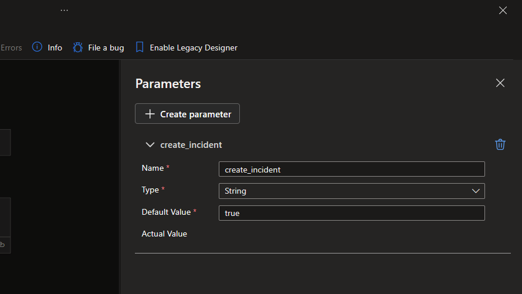

# Recorded Future Alerts

More information about Recorded Future Intelligence Solution for Microsoft Sentinel can be found in the main [readme](../readme.md).

## RecordedFuture-Alert-Importer
Type: **Alerting**\
Included in Recorded Future Intelligence Solution: **Yes**\
Requires **/recordedfuturev2** API keys as described in the [Connector authorization](../readme.md#connectors-authorization) section. \
Connectors used: ***recordedfuturev2***, ***azuresentinel***, ***azureloganalyticsdatacollector*** and ***azuremonitorlogs*** see [Connector authorization](../readme.md#connectors-authorization) for guidance.

Retrieves Alerts and stores them in a custom log in the Log Analytic Workspace. More information on <a href="https://support.recordedfuture.com/hc/en-us/articles/115002151327-Setting-up-Event-Alerts" target="_blank">Alerts</a> (requires Recorded Future login)

The Alert importer playbook can create sentinel incidents when receiving alerts. Its possible to turn off incident generation by setting the logic app parameter create_incident to false.

## RecordedFuture-Playbook-Alert-Importer
Type: **Alerting**\
Included in Recorded Future Intelligence Solution: **Yes**\
Requires **/recordedfuturev2** API keys as described in the [Connector authorization](#connectors-authorization) section. \
Connectors used: ***recordedfuturev2***, ***azuresentinel*** and ***azureloganalyticsdatacollector*** see [Connector authorization](../readme.md#connectors-authorization) for guidance. 

Retrieves Playbook Alerts and stores them in a custom log in the Log Analytic Workspace. More information on <a href="https://support.recordedfuture.com/hc/en-us/articles/13152506878739-Playbook-Alerting-Rules" target="_blank">Playbook Alerts</a> (requires Recorded Future login)

The Playbook Alert importer playbook can create sentinel incidents when receiving alerts. Its possible to turn off incident generation by setting the logic app parameter create_incident to false.

