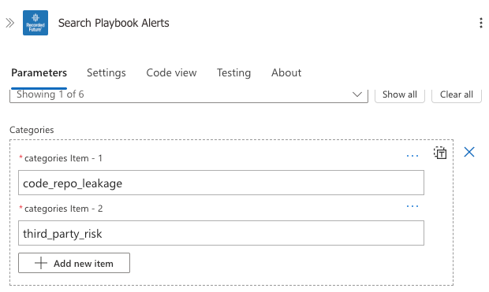

# Recorded Future Alerts

More information about Recorded Future Intelligence Solution for Microsoft Sentinel can be found in the main [readme](../readme.md).

> [!IMPORTANT]
> ## Microsoft Defender XDR Migration - Breaking Changes (v2.0)
>
> Starting with version 2.0, **direct incident creation via Logic Apps has been removed** from these playbooks. Incidents created via the Azure Sentinel connector do not appear in the unified Microsoft Defender XDR portal.
>
> ### What Changed
> - The `create_incident` parameter is now **deprecated and ignored**
> - Alerts are stored only in custom log tables
> - **No incidents are created directly by these playbooks**

## RecordedFuture-Alert-Importer
Type: **Alerting**\
Included in Recorded Future Intelligence Solution: **Yes**\
Requires **/recordedfuturev2** API keys as described in the [Connector authorization](../readme.md#connector-authorization) section. \
Connectors used: ***recordedfuturev2***, ***azureloganalyticsdatacollector*** and ***azuremonitorlogs*** see [Connector authorization](../readme.md#connector-authorization) for guidance.

Retrieves Alerts and stores them in the **RecordedFuturePortalAlerts_CL** custom log in the Log Analytic Workspace. More information on <a href="https://support.recordedfuture.com/hc/en-us/articles/115002151327-Setting-up-Event-Alerts" target="_blank">Alerts</a> (requires Recorded Future login)

> **Note:** The `create_incident` parameter is deprecated. Use Scheduled Analytics Rules to create incidents from the `RecordedFuturePortalAlerts_CL` table.

## RecordedFuture-Playbook-Alert-Importer
Type: **Alerting**\
Included in Recorded Future Intelligence Solution: **Yes**\
Requires **/recordedfuturev2** API keys as described in the [Connector authorization](#connector-authorization) section. \
Connectors used: ***recordedfuturev2*** and ***azureloganalyticsdatacollector*** see [Connector authorization](../readme.md#connector-authorization) for guidance.

Retrieves Playbook Alerts and stores them in the **RecordedFuturePlaybookAlerts_CL** custom log in the Log Analytic Workspace. More information on <a href="https://support.recordedfuture.com/hc/en-us/articles/13152506878739-Playbook-Alerting-Rules" target="_blank">Playbook Alerts</a> (requires Recorded Future login)

> **Note:** The `create_incident` parameter is deprecated. Use Scheduled Analytics Rules to create incidents from the `RecordedFuturePlaybookAlerts_CL` table.

### Limiting Playbook Alert categories
If you want to import only specific Playbook Alert categories, you can edit the `Search Playbook Alerts` step within the logic app and specify `Categories`:

The currently supported Playbook Alert categories are:
- `code_repo_leakage`
- `domain_abuse`
- `identity_novel_exposures`
- `third_party_risk`
- `cyber_vulnerability`
