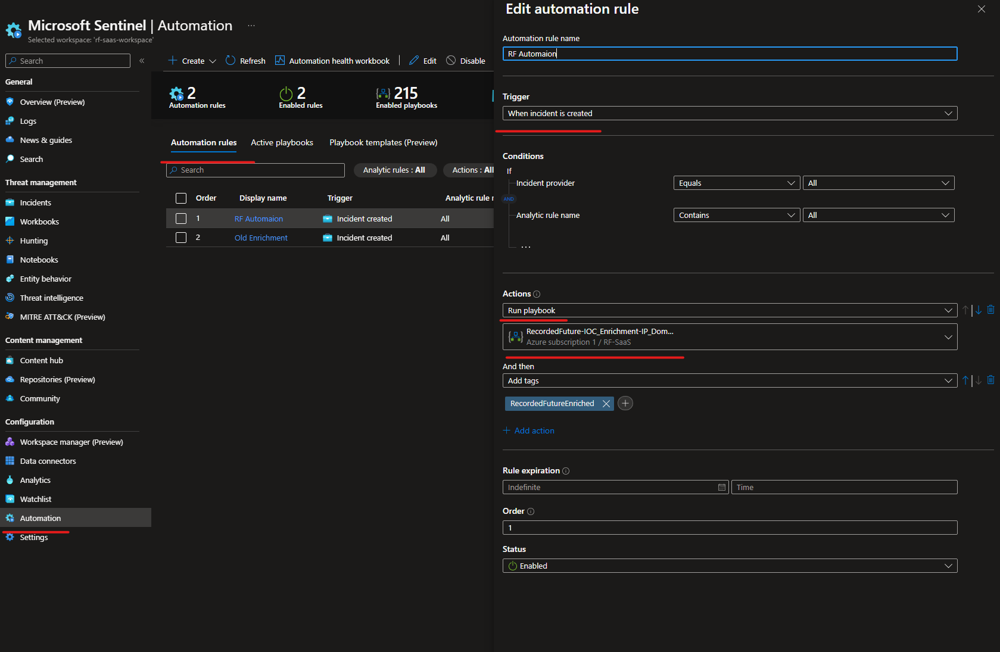

# Enrichment - Quick Start
More information about Recorded Future Intelligence Solution for Microsoft Sentinel can be found in the main [readme](../readme.md).

## Prerequisites
* For existing customers request an [APIKey](https://support.recordedfuture.com/hc/en-us/requests/new?ticket_form_id=360002422674) (Require Recorded Future Login)
* New customers request a [30-day free trial of Recorded Future for Microsoft Sentinel from here!](https://go.recordedfuture.com/microsoft-azure-sentinel-free-trial?utm_campaign=&utm_source=microsoft&utm_medium=gta)

## Roles and Permissions 
In Azure, the following permissions are required on the resource group level for the user authorizing the installation or the managed identity [Microsoft Sentinel Contributor](https://learn.microsoft.com/en-us/azure/role-based-access-control/built-in-roles#microsoft-sentinel-contributor) and [Logic App Contributor](https://learn.microsoft.com/en-us/azure/role-based-access-control/built-in-roles#logic-app-contributor).

In Microsoft Sentinel configure Playbook permissions for automation rules. 
Microsoft Sentinel automation rules can run Logic App playbooks to integrate with other services or create complex logic chains for incident handling. Explicit permissions are required to use this functionality.

## Installation
1. Locate the Recorded Future Intelligence Solution in the Content Hub.
1. Press **Install** and then **Create** and continue to configure the solution.  
1. If the installation was completed successfully, you will now have Enrichment Playbook templates installed.
1. Locate the RecordedFuture-IOC_Enrichment template and press create
   
1. Authorize all connections and press save
   
1. Set up an automation rule to enrich all incidents that contains entities of type, IP, Url, Domain and FileHash.
   

This will automation will provide enrichment on all incidents created written as comments in the activity log section.

Enrichment will activate detections in Recorded Future SecOps module.
 

### References
* [Overview on Recorded Future Integrations](../../readme.md)
* [Enrichment playbooks](./readme.md)
