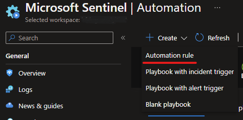
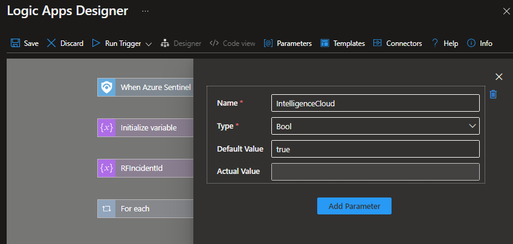

# Recorded Future Enrichment Playbooks

More information about Recorded Future Intelligence Solution for Microsoft Sentinel can be found in the main [readme](../readme.md).

## RecordedFuture-IOC_Enrichment
Type: Response\
Included in Recorded Future Intelligence Solution: Yes\
Requires **/recordedfuturev2** API keys as described in the [Connector authorization](../readme.md#connectors-authorization) section. 

Enriches IOCs (IPs, Domains, URLs and hashes) in Microsoft Sentinel incidents with Recorded Future Intelligence. The Playbook adds the following data for all IOCs an incident: 

* Recorded Future Risk Score
* Triggered Risk Rules 
* Research Links 
* Technical links 
* Previous detections 
* Link to the IOC Intelligence Card in the Recorded Future portal.  
  
Data is added as a comment in the incident.

Enable automatic enrichment by mapping enrichments to alerts using a [custom analytics rule](https://learn.microsoft.com/en-us/azure/sentinel/detect-threats-custom#alert-enrichment)

## Automate Incident Enrichment
After one of the enrichment playbooks is installed and all connections are configured. Create an automation rule to automate the enrichment process. This will automate  enrichment of Recorded Future intelligence to known entities in all incidents. 

 

In Microsoft Sentinel, go to Automation and create **Automation rule**. Give the new rule a name, select the trigger **When incident is created**, select the action **Run playbook** and finally select **RecordedFuture-IOC_Enrichment** or **RecordedFuture-Sandbox_Enrichment-Url** as the playbook. 

 

This will trigger the Recorded Future playbook to run when any incident is created. Recorded future will then enrich the incident if it contains entities of types IP, Domain, Url or FileHash. 

### Recorded Future Collective Insights Configuration
The Recorded Future Collective Insights aggregates data related to Sigma Rules and other indicators, driving collective insights to better identify threats. Anonymized, unattributable data is collected for analytical purposes to identify trends and insights with the Collective Insights. The **RecordedFuture-IOC_Enrichment** playbook gives end users the ability to contribute collective insights to the Collective Insights.
[Click here to learn more](https://support.recordedfuture.com/hc/en-us/articles/19308547864339) (Require Recorded Future Login)

To opt-out from Collective insights by setting the CollectiveInsights parameter to [false]

 

