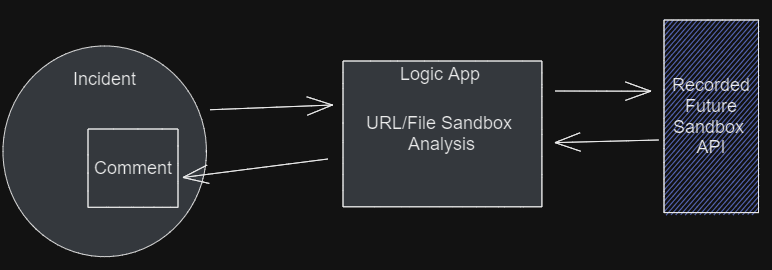
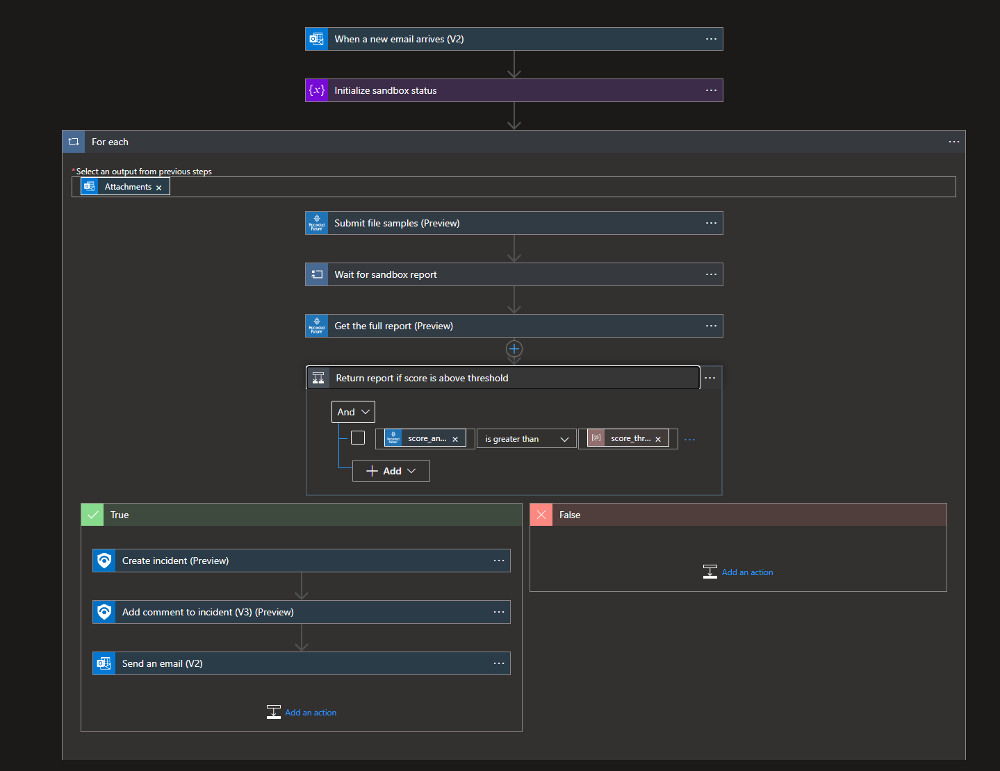
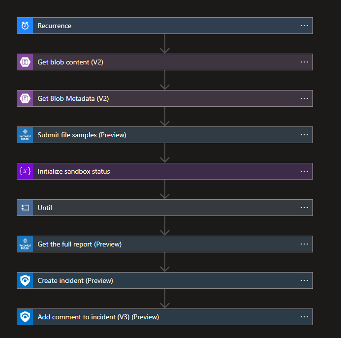

# Recorded Future Sandboxing

More information about Recorded Future Intelligence Solution for Microsoft Sentinel can be found in the main [readme](../readme.md).

## **Malware Sandbox Analysis**

Uploads and detonate samples in Recorded Future's Malware Analysis Sandbox. The sandbox provides safe and immediate behavioral analysis, helping contextualize key artifacts in an investigation, leading to faster triage.

## RecordedFuture-Sandbox_Enrichment-Url
Type: Response\
Included in Recorded Future Intelligence Solution: Yes\
Requires **/recordedfuturesanbo** API keys as described in the [Connector authorization](../readme.md#connectors-authorization) section. 

Enables URL submission to Recorded Future's Malware Analysis Sandbox, the playbook will also create a Microsoft Sentinel incident with the following information from the analysis report:

* Severity Score
* signatures
* A link to the complete analysis report 

File submission requires a storage account.

To set up automatic enrichment, map alerts to a [custom analytic rule](https://learn.microsoft.com/en-us/azure/sentinel/detect-threats-custom#alert-enrichment).

## RecordedFuture-Sandbox_Outlook_Attachment
Type: Response\
Included in Recorded Future Intelligence Solution: No\
Requires **/recordedfuturesanbo** API keys as described in the [Connector authorization](../readme.md#connectors-authorization) section. 

Enables submission of file attachments, from Microsoft Outlook emails, to Recorded to Future's Malware Analysis Sandbox. The playbook also creates a Microsoft Sentinel incident with a summary of the analysis report. 

The email address that received the attachment will also receive an email with the summary.

**Information in summary**
* Severity Score
* signatures
* A link to the complete analysis report. 

To set up automatic enrichment, map alerts to a [custom analytic rule](https://learn.microsoft.com/en-us/azure/sentinel/detect-threats-custom#alert-enrichment).

## RecordedFuture-Sandbox_StorageAccount
Type: Response\
Included in Recorded Future Intelligence Solution: No\
Requires **/recordedfuturesanbo** API keys as described in the [Connector authorization](../readme.md#connectors-authorization) section. 

Enables security and IT teams to submit files to Recorded Future's Malware Analysis Sandbox. The playbook will generate a Microsoft Sentinel incident, and add a comment with a the following data from the analysis report:

* Severity Score
* signatures
* A link to the complete Sandbox report 

This playbook is for file Submission with a storage account.

To set up automatic enrichment, map alerts to a [custom analytic rule](https://learn.microsoft.com/en-us/azure/sentinel/detect-threats-custom#alert-enrichment).

## Automate Incident Enrichment
After enrichment playbooks is installed and all connections are configured. Create an automation rule to automate enrichment of known entities with Recorded Future intelligence in all incidents. 

 

In Microsoft Sentinel, go to Automation and create **Automation rule**. Give the new rule a name, select the trigger **When incident is created**, select the action **Run playbook** and finally select **RecordedFuture-IOC_Enrichment** or **RecordedFuture-Sandbox_Enrichment-Url** as the playbook. 

 

This will trigger the Recorded Future playbook to run when any incident is created. Recorded future will then enrich the incident if it contains entities of types IP, Domain, Url or FileHash. 