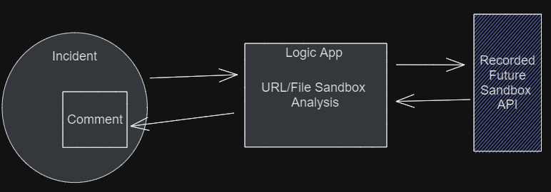
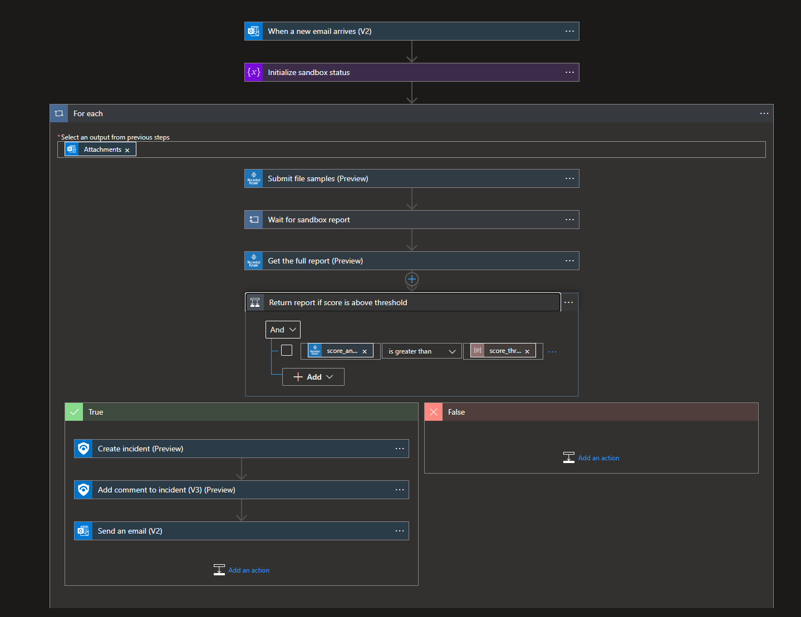
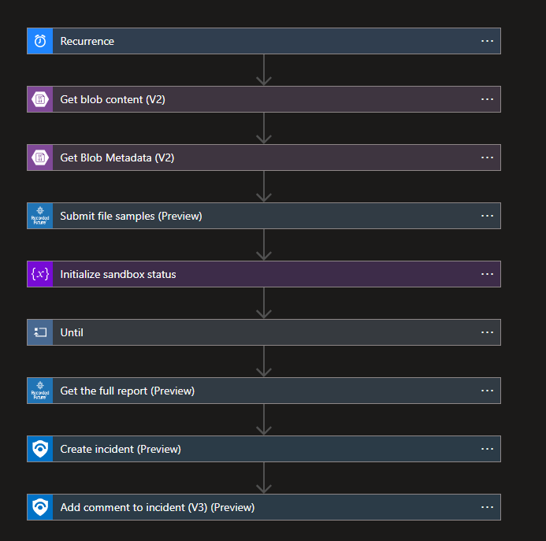
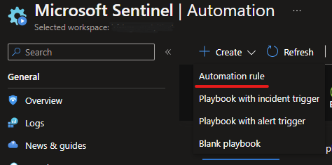
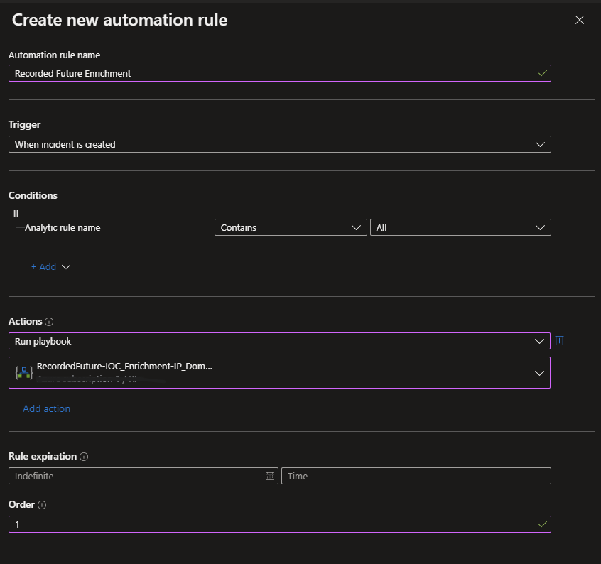

# Recorded Future Sandboxing

More information about Recorded Future Intelligence Solution for Microsoft Sentinel can be found in the main [readme](../readme.md).

### Configure API keys
The Recorded Future Sandbox integration requires an API key for `Recorded Future Sandbox for Microsoft Sentinel`. **Note**: this is different from the one used in the `Recorded Future for Microsoft Sentinel` integration.

If you use the Enterprise Sandbox, you need to provide an additional key `Enterprise Sandbox API token`.  This can be retrieved from https://sandbox.recordedfuture.com/account. It should be provided to the corresponding logic apps as a logic app parameter `Enterprise Sandbox API token`.
> [!IMPORTANT]
> ## Microsoft Defender Migration - Breaking Changes (v3.2.20)
>
> Starting with version 4.0, **direct incident creation via Logic Apps has been removed** from the `RecordedFuture-Sandbox_Outlook_Attachment` and `RecordedFuture-Sandbox_StorageAccount` playbooks. Incidents created via the Azure Sentinel connector do not appear in the unified Microsoft Defender portal.
>
> ### What Changed
> - Sandbox results are now written to **RecordedFutureSandboxResults_CL** custom log table
> - **No incidents are created directly by these playbooks**
> - Email notifications are still sent (Outlook playbook only)
> - We provide Analytic Rules that will handle **incident creation**, see [Incident Creation](../readme.md#incident-creation)

The Recorded Future Sandbox integration requires an API key for `Recorded Future Sandbox for Microsoft Sentinel`. **Note**: this is different from the one used in the `Recorded Future for Microsoft Sentinel` integration.

If you use the Enterprise Sandbox, you need to provide an additional key `Enterprise Sandbox API token`.  This can be retrieved from https://sandbox.recordedfuture.com/account. It should be provided to the corresponding logic apps as a logic app parameter `Enterprise Sandbox API token`.

Refer to [Recorded Future API Key](../readme.md#recorded-future-api-key) for guidance on obtaining and using the necessary API keys.

### Configure Sandbox region
Recorded Future has multiple sandbox regions available. By default, the playbooks will submit to the `us` sandbox.
But you can configure this in the logic apps by changing the parameter `SandboxRegion` to one of the following values:
* `eu` (default)
* `us`
* `apj`

## **Malware Sandbox Analysis**

Uploads and detonate samples in Recorded Future's Malware Analysis Sandbox. The sandbox provides safe and immediate behavioral analysis, helping contextualize key artifacts in an investigation, leading to faster triage.

## RecordedFuture-Sandbox_Enrichment-Url
Type: **Response**\
Included in Recorded Future Intelligence Solution: **Yes**\
Requires **/recordedfuturesanbo** API keys as described in the [Connector authorization](../readme.md#connector-authorization) section. \
Connectors used: ***recordedfuturesandbo*** and ***azuresentinel*** see [Connector authorization](../readme.md#connector-authorization) for guidance.

Enables URL submission to Recorded Future's Malware Analysis Sandbox, the playbook will also create a Microsoft Sentinel comment with the following information from the analysis report:

* Severity Score
* Signatures
* A link to the complete analysis report

File submission requires a storage account.

To set up automatic enrichment, map alerts to a <a href="https://learn.microsoft.com/en-us/azure/sentinel/detect-threats-custom#alert-enrichment" target="_blank">custom analytic rule</a>.

## RecordedFuture-Sandbox_Outlook_Attachment
Type: **Response**\
Included in Recorded Future Intelligence Solution: **No**\
Requires **/recordedfuturesanbo** API keys as described in the [Connector authorization](../readme.md#connector-authorization) section. \
Connectors used: ***recordedfuturesandbo***, ***azureloganalyticsdatacollector*** and ***outlook*** see [Connector authorization](../readme.md#connector-authorization) for guidance.

Enables submission of file attachments, from Microsoft Outlook emails, to Recorded to Future's Malware Analysis Sandbox. Results are written to the **RecordedFutureSandboxResults_CL** custom log table. An email summary is sent to the recipient if the score exceeds the threshold.

> **Note:** To create incidents, use a Analytics Rule that queries `RecordedFutureSandboxResults_CL`. See [Incident Creation](../readme.md#incident-creation) for more information

**Information in summary**
* Severity Score
* signatures
* A link to the complete analysis report.

To set up automatic enrichment, map alerts to a <a href="https://learn.microsoft.com/en-us/azure/sentinel/detect-threats-custom#alert-enrichment" target="_blank">custom analytic rule</a>.

## RecordedFuture-Sandbox_StorageAccount
Type: **Response**\
Included in Recorded Future Intelligence Solution: **No**\
Requires **/recordedfuturesanbo** API keys as described in the [Connector authorization](../readme.md#connector-authorization) section.\
Connectors used: ***recordedfuturesandbo***, ***azureloganalyticsdatacollector*** and ***azureblob*** see [Connector authorization](../readme.md#connector-authorization) for guidance.

Enables security and IT teams to submit files from Azure Blob Storage to Recorded Future's Malware Analysis Sandbox. Results are written to the **RecordedFutureSandboxResults_CL** custom log table with the following data:

* File Name
* Severity Score
* Sandbox Verdict
* Sample ID
* HTML Report

> **Note:** To create incidents, use a Analytics Rule that queries `RecordedFutureSandboxResults_CL`. See [Incident Creation](../readme.md#incident-creation) for more information

To set up automatic enrichment, map alerts to a <a href="https://learn.microsoft.com/en-us/azure/sentinel/detect-threats-custom#alert-enrichment" traget="_blank">custom analytic rule</a>.

## Automate Incident Enrichment

After enrichment playbooks is installed and all connections are configured. Create an automation rule to automate enrichment of known entities with Recorded Future intelligence in all incidents.

 

In Microsoft Sentinel, go to Automation and create **Automation rule**. Give the new rule a name, select the trigger **When incident is created**, select the action **Run playbook** and finally select **RecordedFuture-IOC_Enrichment** or **RecordedFuture-Sandbox_Enrichment-Url** as the playbook.

 

This will trigger the Recorded Future playbook to run when any incident is created. Recorded future will then enrich the incident if it contains entities of types IP, Domain, Url or FileHash.