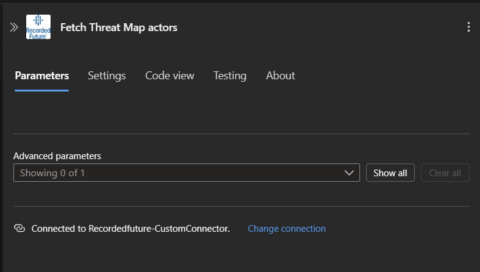
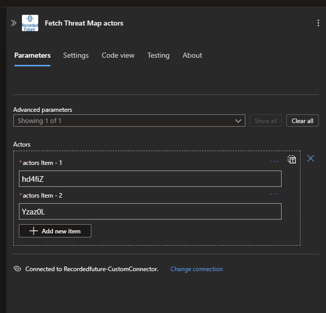
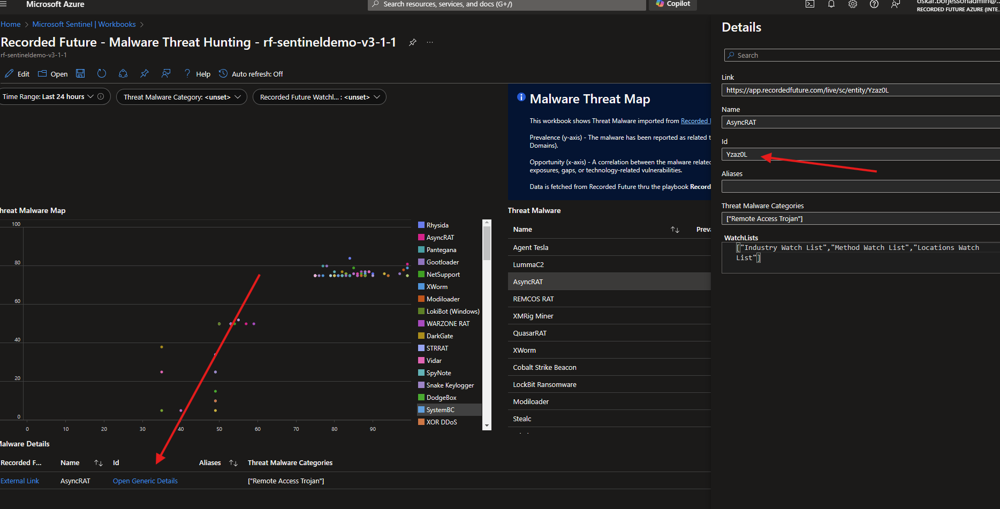
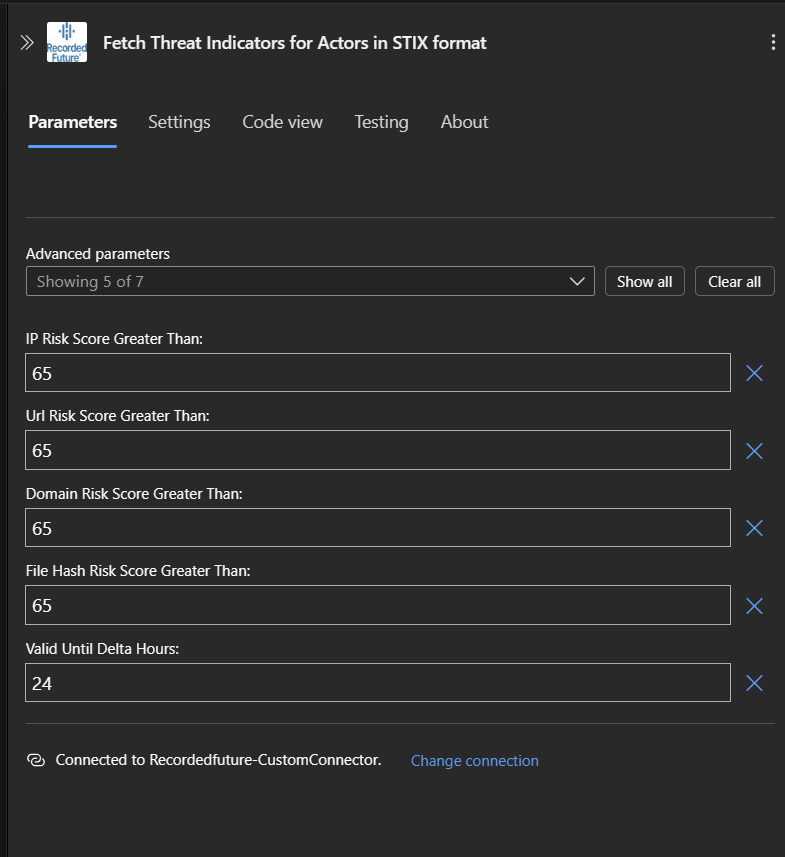
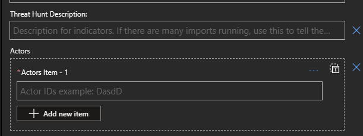

# Recorded Future Automated Threat Hunting

Information about Recorded Future Intelligence Solution for Microsoft Sentinel can be found in the main [readme](../readme.md).

## Recorded Future Automated Threat Hunt 
Threat hunting is the proactive and iterative process of searching for and detecting cyber threats that have evaded traditional security measures, such as firewalls, antivirus software, and intrusion detection systems. It involves using a combination of manual and automated techniques to identify and investigate potential security breaches and intrusions within an organization's network.

- <a href="https://support.recordedfuture.com/hc/en-us/articles/20849290045203-Automated-Threat-Hunting-with-Recorded-Future" target="_blank">More about Automated threat hunt</a> (requires Recorded Future login)

# Playbooks

## RecordedFuture-ThreatMap-Importer
Type: **Threat Hunt**\
Included in Recorded Future Intelligence Solution: **Yes**\
Requires [**/RecordedFuture-CustomConnector**](../Connectors/RecordedFuture-CustomConnector/readme.md) and API keys as described in the [Connector authorization](../readme.md#connectors-authorization) section. \
Connectors used: ***RecordedFuture-CustomConnector*** and ***azureloganalyticsdatacollector*** see [Connector authorization](../readme.md#connectors-authorization) for guidance. 

Import Recorded Future Actor Threat Map data and stores it in a custom table. Display the report in the workbook imported from the Recorded Future Threat Intelligence Solution. The Workbook shows Threat Actors from Recorded Future, their intent towards your company, and their opportunity. 

## RecordedFuture-ThreatMapMalware-Importer
Type: **Threat Hunt**\
Included in Recorded Future Intelligence Solution: **Yes**\
Requires [**/RecordedFuture-CustomConnector**](../Connectors/RecordedFuture-CustomConnector/readme.md) and API keys as described in the [Connector authorization](../readme.md#connectors-authorization) section.\
Connectors used: ***RecordedFuture-CustomConnector*** and ***azureloganalyticsdatacollector*** see [Connector authorization](../readme.md#connectors-authorization) for guidance.  

Import Recorded Future Malware Threat Map data and stores it in a custom table. Display the report in the workbook imported from the Recorded Future Threat Intelligence Solution. The Workbook shows Malware Threat from Recorded Future, their intent towards your company, and their opportunity. 

## RecordedFuture-ActorThreatHunt-IndicatorImport
Type: **Threat Hunt**\
Included in Recorded Future Intelligence Solution: **Yes**\
Requires [**/RecordedFuture-CustomConnector**](../Connectors/RecordedFuture-CustomConnector/readme.md) and API keys as described in the [Connector authorization](../readme.md#connectors-authorization) section. \
Connectors used: ***RecordedFuture-CustomConnector*** see [Connector authorization](../readme.md#connectors-authorization) for guidance. 

Fetch indicators linked to threat actors from the threat actor map. The logic app will run on a schedule and check threat actor related to the client’s Recorded Future threat map. It is possible to set a risk score threshold, so that if a threat actor score exceeds the score. The logic app will query Recorded Future for all relevant links indicators (IPs, Hashes, Domains, and URLs) tied to threat actors and store them in the ThreatIntelligenceIndicator table.

If recurrence is changed from default (24h), also change `valid_until_delta_hours` to avoid duplicates in ThreatIntelligenceIndicator table leading to multiple incidents created.

After successful installation, automate incidents creation by setup Analytic Rules shipped in the Solution to correlate this data with your infrastructure, described [here](../readme.md#analytic-rules). Automate triage of incidents by install and configure [Recorded Future Enrichment](../Enrichment/readme.md#recordedfuture-ioc_enrichment). 

## RecordedFuture-MalwareThreatHunt-IndicatorImport
Type: **Threat Hunt**\
Included in Recorded Future Intelligence Solution: **Yes**\
Requires [**/RecordedFuture-CustomConnector**](../Connectors/RecordedFuture-CustomConnector/readme.md) and API keys as described in the [Connector authorization](../readme.md#connectors-authorization) section. \
Connectors used: ***RecordedFuture-CustomConnector*** see [Connector authorization](../readme.md#connectors-authorization) for guidance. 

Fetch malware threat information from the threat actor map. The logic app will run on a schedule  to check threat actor data related to the client’s Recorded Future threat map. It is possible to set a risk score threshold, so that if a threat actor score exceeds the score. The logic app will query Recorded Future for all relevant links indicators (IPs, Hashes, Domains, and URLs) tied to threat actors and store them in the ThreatIntelligenceIndicator table.

If recurrence is changed from default (24h), also change `valid_until_delta_hours` to avoid duplicates in ThreatIntelligenceIndicator table leading to multiple incidents created.

After successful installation, automate incidents creation by setup Analytic Rules shipped in the Solution to correlate this data with your infrastructure, described [here](../readme.md#analytic-rules). Automate triage of incidents by install and configure [Recorded Future Enrichment](../Enrichment/readme.md#recordedfuture-ioc_enrichment). 

## Configure Threat Map Import Playbooks
Malware and actor threat map import playbooks are configured with defaults that will retrieve the maps presented in Recorded Future Portal without any modifications. 

 
 

Expand Advance parameters

It's possible to restrict hunts by actor or malware. 

Find individual Ids the treat map workbook once it setup by open `Open Generic Details`.

## Configure Threat Indicator Import Playbooks
Malware and actor indicator import playbooks are configured with defaults that will retrive url, ip, domain and hash -indicators linked to entities on the threat map.  

Risk scores can be modified to restrict number of indicators returned from the API. 

If recurrence is changed from default (24h), also change `valid_until_delta_hours` to avoid duplicates in ThreatIntelligenceIndicator table leading to multiple incidents created.

 
 

Expand Advanced parameters

It's possible to restrict indicators downloaded by actor or malware. If several downloads are running use the `Threat Hunt description` field to keep them apart. 

Find individual Ids the treat map workbook once it setup by open `Open Generic Details`.

## Threat hunting for multi-orgs

If your Recorded Future Enterprise is using [multi-org](https://support.recordedfuture.com/hc/articles/4402787600787-Multi-Org-for-Modules), then which threat map you see depends on which API key is used.

- If the API key is tied to one specific organisation, then you will see that organisation's threat map.
- If the API key is tied to multiple organisations (not recommended), then you will see the first threat map available, which could belong to any of your organisations.