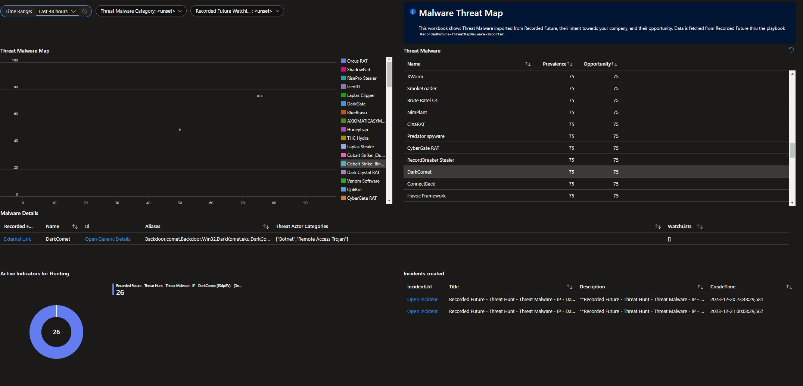
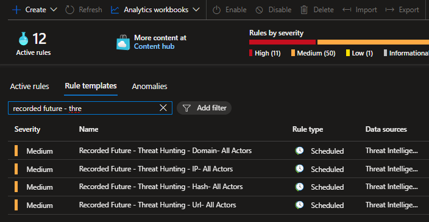
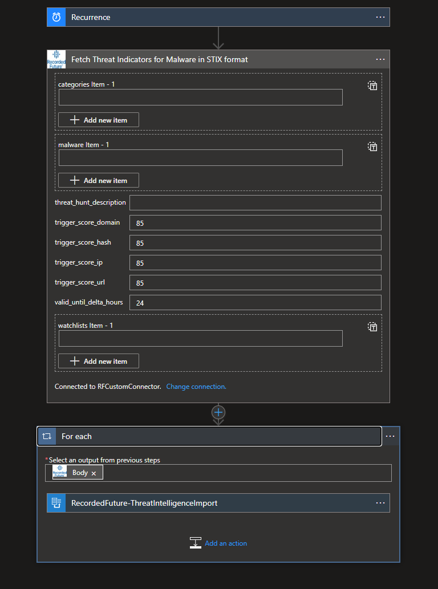

# Recorded Future Automated Threat Hunting

More information about Recorded Future Intelligence Solution for Microsoft Sentinel can be found in the main [readme](../readme.md).

## Recorded Future Automated Threat Hunt 
Threat hunting is the proactive and iterative process of searching for and detecting cyber threats that have evaded traditional security measures, such as firewalls, antivirus software, and intrusion detection systems. It involves using a combination of manual and automated techniques to identify and investigate potential security breaches and intrusions within an organization's network.

- [More about Automated threat hunt](https://support.recordedfuture.com/hc/en-us/articles/20849290045203-Automated-Threat-Hunting-with-Recorded-Future) (requires login)

# Playbooks

## RecordedFuture-ThreatMap-Importer
Type: Threat Hunt\
Included in Recorded Future Intelligence Solution: Yes\
Requires [**/RecordedFuture-CustomConnector**](../Connectors/RecordedFuture-CustomConnector/readme.md) and API keys as described in the [Connector authorization](../readme.md#connectors-authorization) section. 

Import Recorded Future Threat Map data and stores it in a custom table. Display the report in the workbook imported from the Recorded Future Threat Intelligence Solution. The Workbook shows Threat Actors from Recorded Future, their intent towards your company, and their opportunity. 

## RecordedFuture-ThreatMapMalware-Importer
Type: Threat Hunt\
Included in Recorded Future Intelligence Solution: Yes\
Requires [**/RecordedFuture-CustomConnector**](../Connectors/RecordedFuture-CustomConnector/readme.md) and API keys as described in the [Connector authorization](../readme.md#connectors-authorization) section. 

Import Recorded Future Malware Threat Map data and stores it in a custom table. Display the report in the workbook imported from the Recorded Future Threat Intelligence Solution. The Workbook shows Malware Threat from Recorded Future, their intent towards your company, and their opportunity. 

## RecordedFuture-ActorThreatHunt-IndicatorImport
Type: Threat Hunt\
Included in Recorded Future Intelligence Solution: Yes\
Requires [**/RecordedFuture-CustomConnector**](../Connectors/RecordedFuture-CustomConnector/readme.md) and API keys as described in the [Connector authorization](../readme.md#connectors-authorization) section. 

Fetch threat actor information from the threat actor map. The logic app will run on a schedule  to check threat actor data related to the client’s Recorded Future threat map. Set the valid_until_delta_hours to match the recurrence. It is possible to set a risk score threshold, so that if a threat actor score exceeds the score. The logic app will query Recorded Future for all relevant links indicators (IPs, Hashes, Domains, and URLs) tied to threat actors and store them in the ThreatIntelligenceIndicator table.

Match the recurrence and valid_until_delta_hours to avoid duplicates in the ThreatIntelligenceIndicator table and duplicate detections leading to multiple incidents created.

Setup the Analytic Rules shipped in the Solution to correlate this data with your infrastructure and if incidents are created implement  [Recorded Future Enrichment](../Enrichment/readme.md#recordedfuture-ioc_enrichment) to enhance triage. 

## RecordedFuture-MalwareThreatHunt-IndicatorImport
Type: Threat Hunt\
Included in Recorded Future Intelligence Solution: Yes\
Requires [**/RecordedFuture-CustomConnector**](../Connectors/RecordedFuture-CustomConnector/readme.md) and API keys as described in the [Connector authorization](../readme.md#connectors-authorization) section. 

Fetch malware threat information from the threat actor map. The logic app will run on a schedule  to check threat actor data related to the client’s Recorded Future threat map. Set the valid_until_delta_hours to match the recurrence. It is possible to set a risk score threshold, so that if a threat actor score exceeds the score. The logic app will query Recorded Future for all relevant links indicators (IPs, Hashes, Domains, and URLs) tied to threat actors and store them in the ThreatIntelligenceIndicator table.

Match the recurrence and valid_until_delta_hours to avoid duplicates in the ThreatIntelligenceIndicator table and duplicate detections leading to multiple incidents created.

Setup the Analytic Rules shipped in the Solution to correlate this data with your infrastructure and if incidents are created implement  [Recorded Future Enrichment](../Enrichment/readme.md#recordedfuture-ioc_enrichment) to enhance triage. 

