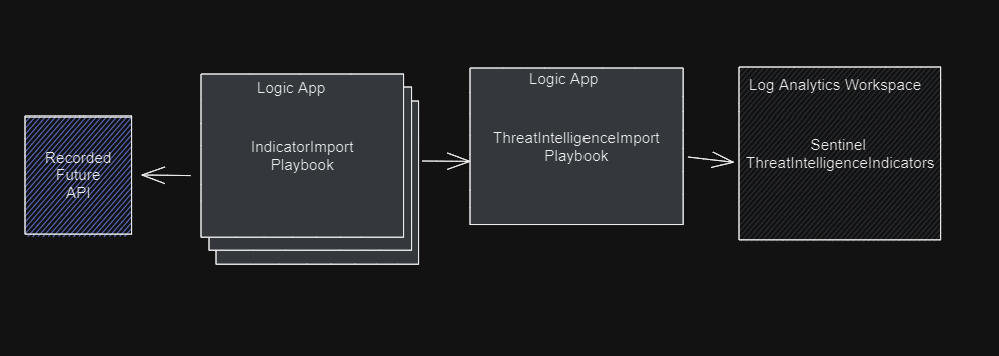
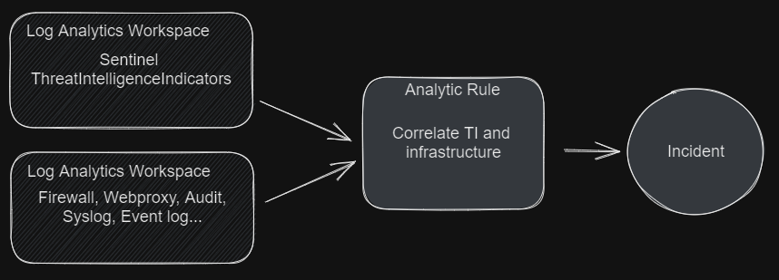
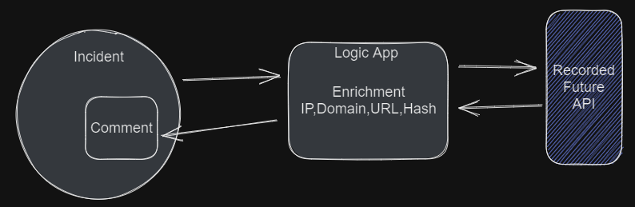
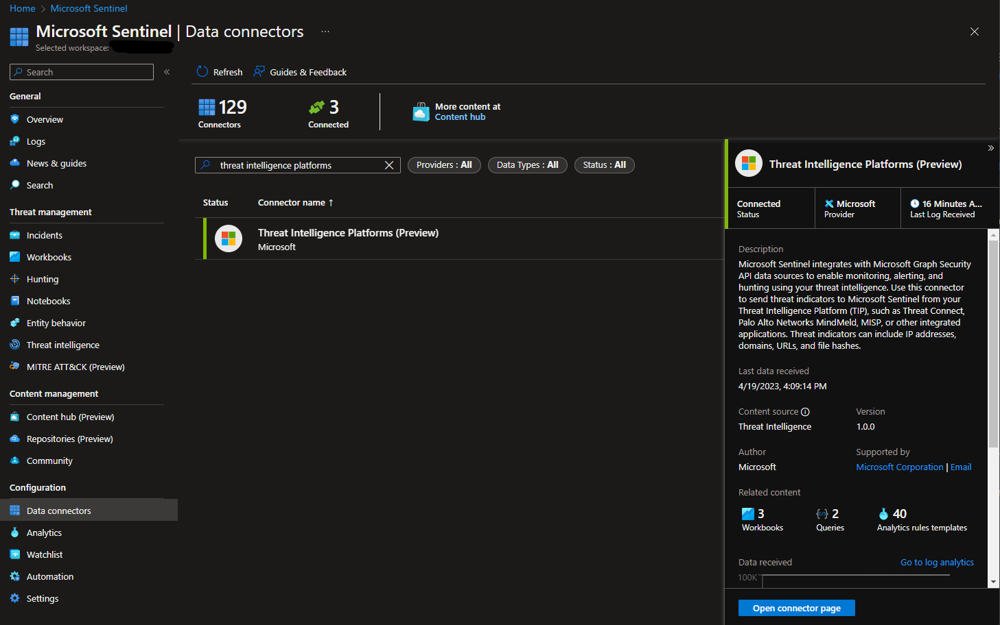
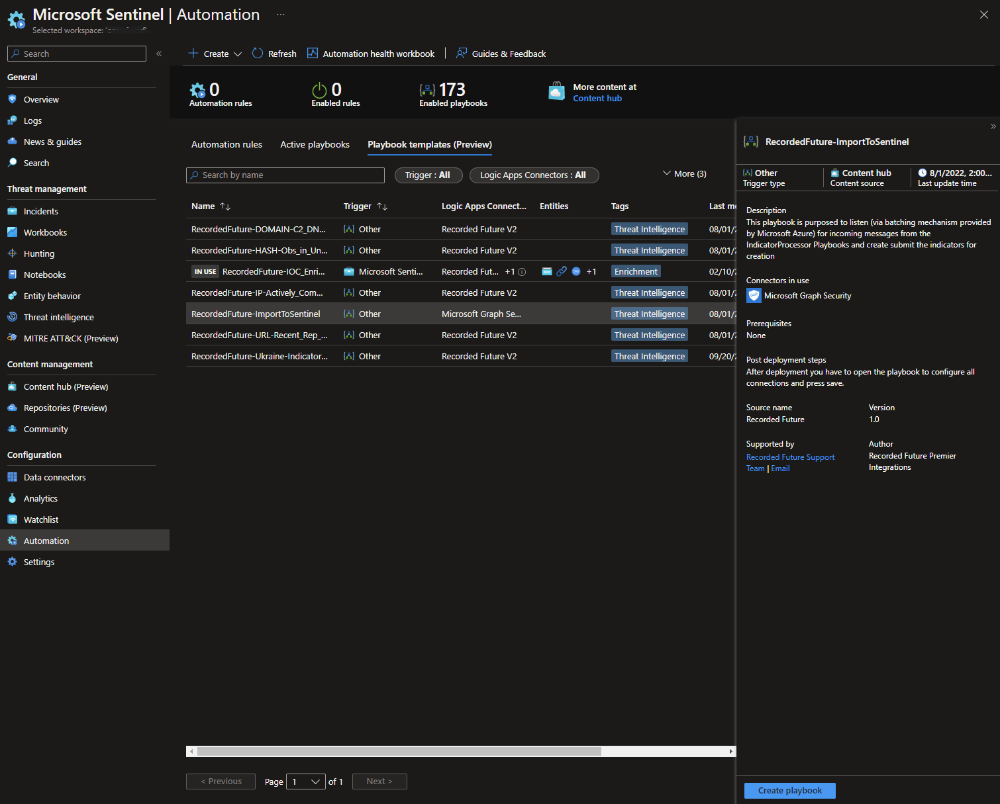
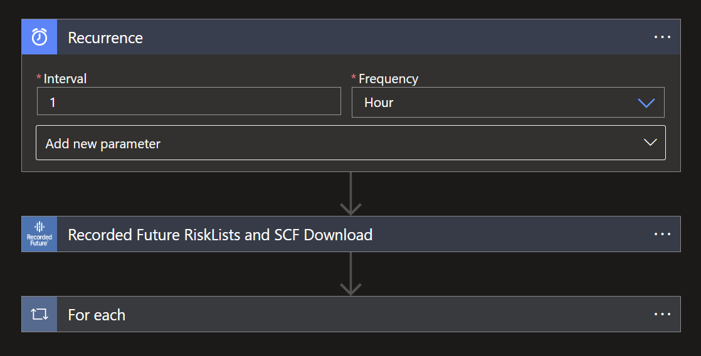
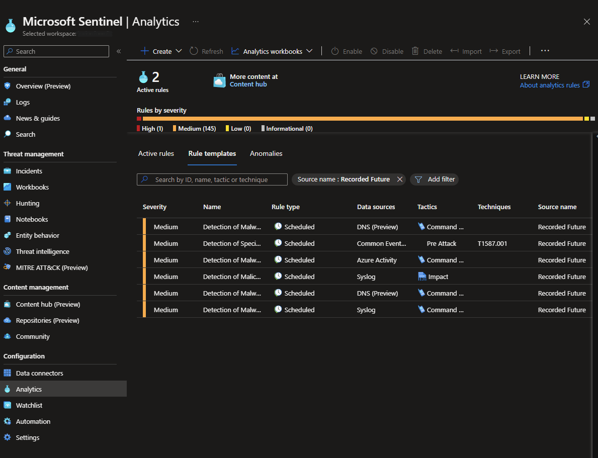
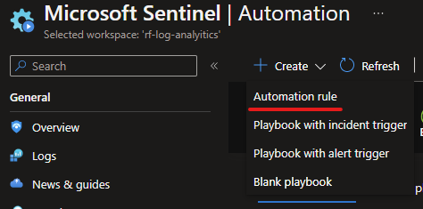
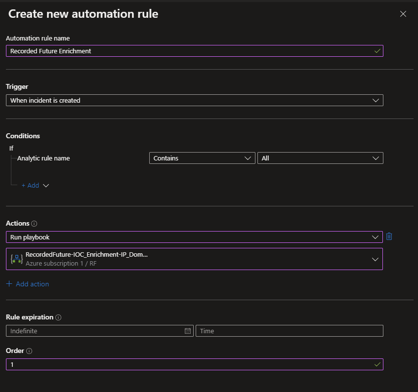

# Recorded Future Intelligence for Microsoft Sentinel
[](https://www.recordedfuture.com/)


# Overview
Recorded Future are the world’s largest provider of intelligence for enterprise security. By combining persistent and pervasive automated data collection and analytics with human analysis, Recorded Future delivers intelligence that is timely, accurate, and actionable.

The Recorded Future Microsoft Sentinel Integration will supercharge Sentinel by integrating intelligence from Recorded Future. 

**Benefits** 
- Detect risky indicators of compromise (IOCs) in your environment.
- Triage alerts faster with elite, real-time intelligence.
- Respond quickly with transparency and context around internal telemetry data.
- Maximize your investment in Microsoft Sentinel.

For more information see: [How to Apply Elite Intelligence to Microsoft Azure Sentinel](https://www.recordedfuture.com/microsoft-azure-sentinel-integration)


# Use cases
The playbooks provided in the Recorded Future Solution support use cases for detection and incident response. Automation of a complete use case will require installation of playbooks, creation of analytic rules, and configuration of automation rules. 
## Detection - Risk list 

The TI-Processor pulls configured risk lists from Recorded Future and writes the contained indicators to Sentinels ThreatIntelligenceIndicator table in batches via the RecordedFuture-ImportToSentinel playbook. 


Analytic rules correlates threat intelligence indicators with logs provided to Sentinel and creates incidents for any matches found.


## Response - Enrichment 

Automation rules trigger on each incident and enriches the incidents with Recorded Future intelligence. 


# Risk lists
Risk lists are lists of high risk indicators matching some specific criteria. We use these lists to transfer accurate and current threat intelligence to Microsoft Sentinel as ThreatIntelligenceIndicators. Connect logs from your infrastructure in order to detect, prevent and triage security vulnerabilities.

Read more about risk lists by following the links below:
- https://www.recordedfuture.com/support/install-configure-manage-risk-lists
-[Recorded Future Risk Lists](https://support.recordedfuture.com/hc/en-us/articles/115000897248-Recorded-Future-Risk-Lists) (Require Recorded Future Login)
- [Risk List Download Recommendations](https://support.recordedfuture.com/hc/en-us/articles/115010401968-Risk-List-Download-Recommendations) (Require Recorded Future Login)

# Prerequisites

## Roles and Permissions

The following article describes roles and permissions in Microsoft Sentinel [Roles and permissions in Microsoft Sentinel](https://learn.microsoft.com/en-us/azure/sentinel/roles).

To install and manage Playbooks/Logic Apps, the following permissions are required on the resource group [Microsoft Sentinel Contributor](https://learn.microsoft.com/en-us/azure/role-based-access-control/built-in-roles#microsoft-sentinel-contributor) + [Logic App Contributor](https://learn.microsoft.com/en-us/azure/role-based-access-control/built-in-roles#logic-app-contributor).

The Threat Intelligence Platforms Data Connector in Sentinel must be enabled in order for indicators to be forwarded from the Graph Security API to Sentinel.



## Connector authorization 
Each connector need to be authorized after playbook/logic app installation. Expand all nodes in the logic app after installation and look for blocks marked with a warning sign. Open and authorize all connections.

The Recorded Future solution uses the following connectors:
- **/recordedfuturev2** - [Microsoft power platform connectors](https://learn.microsoft.com/en-us/connectors/recordedfuturev2/). All logic apps require APIKeys to communicate with the Recorded Future API. To obtain APIKeys, please visit [Recorded Future Requesting API Tokens](https://support.recordedfuture.com/hc/en-us/articles/4411077373587-Requesting-API-Tokens)(Require Recorded Future Login) and request API token for Recorded Future for Microsoft Sentinel.
- **/microsoftgraphsecurity** - [Documenation on Microsoft power platform connectors](https://learn.microsoft.com/en-us/connectors/microsoftgraphsecurity/)
- **/azuresentinel** - [Documentation on Microsoft power platform connectors](https://learn.microsoft.com/en-us/connectors/azuresentinel/)
- **/recordedfuturesandbo** - [Microsoft power platform connectors](https://learn.microsoft.com/en-us/connectors/recordedfuturesandbo/). All logic apps require APIKeys to communicate with the Recorded Future API. To obtain APIKeys, please visit [Recorded Future Requesting API Tokens](https://support.recordedfuture.com/hc/en-us/articles/4411077373587-Requesting-API-Tokens) (Require Recorded Future Login) and request API Token for Recorded Future Sandbox for Microsoft Sentinel. 

## Ingestion and Operational costs
Playbook(Logic apps) may result in additional ingestion or operational costs:

1. [Usage metering, billing, and pricing for Azure Logic Apps](https://learn.microsoft.com/en-us/azure/logic-apps/logic-apps-pricing)

1. [Azure Monitor Logs cost calculations and options](https://learn.microsoft.com/en-us/azure/azure-monitor/logs/cost-logs)

Recorded Futures risk lists are generated at different cadences as described in this support article [Risk List Download Recommendations](https://support.recordedfuture.com/hc/en-us/articles/115010401968-Risk-List-Download-Recommendations) (Require Recorded Future Login). It is possible to adjust cadence to decrease cost of data processing.

# Installation

There are two options for installing playbooks and starting automated threat response:

- Installing the solution from [Content Hub](https://portal.azure.com/#view/Microsoft_Azure_Marketplace/GalleryItemDetailsBladeNopdl/dontDiscardJourney~/true/id/recordedfuture1605638642586.recorded_future_sentinel_solution). (Recommended)

- Installing the playbooks one by one by from this Readme.

> **Due to internal dependencies, please deploy and activate the ImportToSentinel playbook before any of the IndicatorProcessor/TIProcessor playbooks.**

## Content Hub Installation

1. Locate the Recorded Future Solution in the Content Hub.

1. Press **Install** and then **Create** and continue to configure the solution. 

1. If the installation was completed successfully, you will now have Workbook templates, Automation Playbook templates and Analytic Rules templates.

To use the workbooks, playbooks and analytic rules, install them inside of Sentinel by selecting the respective template and install/activate/create. 

## Playbooks one by one installation
To install individual playbooks one by one, use the buttons next to the descriptions of the individual playbooks further down in this document.

# Configuration 
## Risk list configuration 
Verify that the **ImportToSentinel** logic app is installed and active in your environment before installing the TIProcessing risk lists.


From Automation -> Playbook Template -> Select any Recorded Future playbook that ends with TIProcessor, like **RecordedFuture-IP-Actively_Comm_C2_Server-TIProcessor**, press create playbook.
Note that it is possible to deploy several instances of the same template by giving them unique names. 


The parameter PlaybookNameBatching is the name of the ImportToSentinel playbook that will handle batch processing of indicators into Sentinel. In the last step press **Create and continue to designer**.


In the designer, locate all steps that show a warning and authenticate these steps. Authentication looks different for each connection. More information on this can be found in the chapter above called Connector Authorization.


## Configure cadence of Risk list ingestion 
The first step of all TIProcessing Playbooks is a recurrence step, it is possible to adjust the cadence by modifying the interval and frequency parameters.


If you do so however, it is critical that you also adjust the expirationDateTime parameter in the final block of that logic app to be synchronized with the recurrence timing. Failure to do so can result in either:
* Duplication of indicators.
* Having no active Recorded Future indicators the majority of the time. 

If you are unsure of how to do this, please consult Recorded Future Professional Services.

## Query Risk lists
After successfully importing one or more risk lists it is possible to query the imported data in your Log Analytics Workspace. 

Example queries:  
``` sql 
ThreatIntelligenceIndicator
| where Description contains "Recorded Future"
| take 10

ThreatIntelligenceIndicator
|where Description == "Recorded Future - IP - Actively Communicating C&C Server"
| take 10

ThreatIntelligenceIndicator
|where Description == "Recorded Future - IP - Actively Communicating C&C Server" and AdditionalInformation contains "Cobalt Strike"
| take 10
```


## Configure Analytic Rules for detection 
The Solution contains examples of how to build Analytic Rules based on Recorded Future Risk Lists. 


Provided the example you have to adjust the KQL query to match Threat Intelligence indicators with logs from your infrastructure.


# Playbooks
The following playbooks are provided by Recorded Future. 

## RecordedFuture-ImportToSentinel
Type: Detection
Included in Recorded Future Intelligence Solution: Yes

This playbook will serve all the TIProcessor playbooks with batch import of threat intelligence indicators into the ThreatIntelligenceIndicator table.

[](https://portal.azure.com/#create/Microsoft.Template/uri/https%3A%2F%2Fraw.githubusercontent.com%2FAzure%2FAzure-Sentinel%2Fmaster%2FSolutions%2FRecorded%2520Future%2FPlaybooks%2FRecordedFuture-ImportToSentinel%2Fazuredeploy.json)
[](https://portal.azure.us/#create/Microsoft.Template/uri/https%3A%2F%2Fraw.githubusercontent.com%2FAzure%2FAzure-Sentinel%2Fmaster%2FSolutions%2FRecorded%2520Future%2FPlaybooks%2FRecordedFuture-ImportToSentinel%2Fazuredeploy.json)

## RecordedFuture-IP-Actively_Comm_C2_Server-TIProcessor
Type: Detection
Included in Recorded Future Intelligence Solution: Yes

This playbook leverages the Recorded Future API to automate the ingestion of Recorded Future [Actively Communicating C&C Server IP RiskList](https://support.recordedfuture.com/hc/en-us/articles/115000894448-IP-Address-Risk-Rules) (Require Recorded Future Login), into the ThreatIntelligenceIndicator table, for detection (alert) actions in Microsoft Sentinel. For additional information please visit [Recorded Future](https://www.recordedfuture.com/integrations/microsoft).

[](https://portal.azure.com/#create/Microsoft.Template/uri/https%3A%2F%2Fraw.githubusercontent.com%2FAzure%2FAzure-Sentinel%2Fmaster%2FSolutions%2FRecorded%2520Future%2FPlaybooks%2FRecordedFuture-IP-Actively_Comm_C2_Server-IndicatorProcessor%2Fazuredeploy.json)
[](https://portal.azure.us/#create/Microsoft.Template/uri/https%3A%2F%2Fraw.githubusercontent.com%2FAzure%2FAzure-Sentinel%2Fmaster%2FSolutions%2FRecorded%2520Future%2FPlaybooks%2FRecordedFuture-IP-Actively_Comm_C2_Server-IndicatorProcessor%2Fazuredeploy.json)

## RecordedFuture-DOMAIN-C2_DNS_Name-TIProcessor
Type: Detection 
Included in Recorded Future Intelligence Solution: Yes

This playbook leverages the Recorded Future API to automate the ingestion of Recorded Future [C&C DNS Name Domain RiskList](https://support.recordedfuture.com/hc/en-us/articles/115003793388-Domain-Risk-Rules) (Require Recorded Future Login), into the ThreatIntelligenceIndicator table, for detection (alert) actions in Microsoft Sentinel. For additional information please visit [Recorded Future](https://www.recordedfuture.com/integrations/microsoft).

[](https://portal.azure.com/#create/Microsoft.Template/uri/https%3A%2F%2Fraw.githubusercontent.com%2FAzure%2FAzure-Sentinel%2Fmaster%2FSolutions%2FRecorded%2520Future%2FPlaybooks%2FRecordedFuture-DOMAIN-C2_DNS_Name-IndicatorProcessor%2Fazuredeploy.json)
[](https://portal.azure.us/#create/Microsoft.Template/uri/https%3A%2F%2Fraw.githubusercontent.com%2FAzure%2FAzure-Sentinel%2Fmaster%2FSolutions%2FRecorded%2520Future%2FPlaybooks%2FRecordedFuture-DOMAIN-C2_DNS_Name-IndicatorProcessor%2Fazuredeploy.json)

## RecordedFuture-URL-Recent_Rep_by_Insikt-TIProcessor
Type: Detection 
Included in Recorded Future Intelligence Solution: Yes

This playbook leverages the Recorded Future API to automate the ingestion of Recorded Future [Recently Reported by Insikt Group URL RiskList](https://support.recordedfuture.com/hc/en-us/articles/115010052768-URL-Risk-Rules) (Require Recorded Future Login), into the ThreatIntelligenceIndicator table, for detection (alert) actions in Microsoft Sentinel. For additional information please visit [Recorded Future](https://www.recordedfuture.com/integrations/microsoft).

[](https://portal.azure.com/#create/Microsoft.Template/uri/https%3A%2F%2Fraw.githubusercontent.com%2FAzure%2FAzure-Sentinel%2Fmaster%2FSolutions%2FRecorded%2520Future%2FPlaybooks%2FRecordedFuture-URL-Recent_Rep_by_Insikt_Group-IndicatorProcessor%2Fazuredeploy.json)
[](https://portal.azure.us/#create/Microsoft.Template/uri/https%3A%2F%2Fraw.githubusercontent.com%2FAzure%2FAzure-Sentinel%2Fmaster%2FSolutions%2FRecorded%2520Future%2FPlaybooks%2FRecordedFuture-URL-Recent_Rep_by_Insikt_Group-IndicatorProcessor%2Fazuredeploy.json)

## RecordedFuture-HASH-Obs_in_Underground-TIProcessor
Type: Detection 
Included in Recorded Future Intelligence Solution: Yes

This playbook leverages the Recorded Future API to automate the ingestion of Recorded Future [Observed in Underground Virus Testing Sites Hash RiskList](https://support.recordedfuture.com/hc/en-us/articles/115000846167-Hash-Risk-Rules) (Require Recorded Future Login), into the ThreatIntelligenceIndicator table, for detection (alert) actions in Microsoft Sentinel. For additional information please visit [Recorded Future](https://www.recordedfuture.com/integrations/microsoft).

[](https://portal.azure.com/#create/Microsoft.Template/uri/https%3A%2F%2Fraw.githubusercontent.com%2FAzure%2FAzure-Sentinel%2Fmaster%2FSolutions%2FRecorded%2520Future%2FPlaybooks%2FRecordedFuture-HASH-Observed_in_Underground_Virus_Test_Sites-IndicatorProcessor%2Fazuredeploy.json)
[](https://portal.azure.us/#create/Microsoft.Template/uri/https%3A%2F%2Fraw.githubusercontent.com%2FAzure%2FAzure-Sentinel%2Fmaster%2FSolutions%2FRecorded%2520Future%2FPlaybooks%2FRecordedFuture-HASH-Observed_in_Underground_Virus_Test_Sites-IndicatorProcessor%2Fazuredeploy.json)

## RecordedFuture-Ukraine-IndicatorProcessor
Type: Detection
Included in Recorded Future Intelligence Solution: Yes

This playbook leverages the Recorded Future API to automate the ingestion of Recorded Future [Ukraine Threat List of Related IOCs](https://support.recordedfuture.com/hc/en-us/articles/4484981411475-Resource-Center-on-the-Ukraine-Conflict) (Require Recorded Future Login), into the ThreatIntelligenceIndicator table, for detection (alert) actions in Microsoft Sentinel. For additional information please visit [Recorded Future](https://www.recordedfuture.com/integrations/microsoft).

[](https://portal.azure.com/#create/Microsoft.Template/uri/https%3A%2F%2Fraw.githubusercontent.com%2FAzure%2FAzure-Sentinel%2Fmaster%2FSolutions%2FRecorded%20Future%2FPlaybooks%2FRecordedFuture-Ukraine-IndicatorProcessor%2Fazuredeploy.json)
[](https://portal.azure.us/#create/Microsoft.Template/uri/https%3A%2F%2Fraw.githubusercontent.com%2FAzure%2FAzure-Sentinel%2Fmaster%2FSolutions%2FRecorded%20Future%2FPlaybooks%2FRecordedFuture-Ukraine-IndicatorProcessor%2Fazuredeploy.json)

## RecordedFuture-Sandbox_Enrichment-Url
Type: Response
Included in Recorded Future Intelligence Solution: Yes

The Recorded Future Sandbox Playbook enables security and IT teams to analyze and understand URLs, which provides safe and immediate behavioral analysis, helping contextualize key artifacts in an investigation, leading to faster triage. Through this playbook, organizations can incorporate the malware analysis sandbox into automated workflows with applications. Incidents will be enriched with the following Recorded Future context: Sandbox Analysis Score, Signatures and a link to the full Recorded Future Sandbox report. The sandbox enrichment will be posted as a comment in the Microsoft Sentinel incident. For additional information please visit [Recorded Future Sandbox](https://go.recordedfuture.com/hubfs/data-sheets/A4/sandbox.pdf). 

The automatic enrichments works on known entities of type Url mapped to alerts via analytic rules as described here [Create custom analytics rules to detect threats](https://learn.microsoft.com/en-us/azure/sentinel/detect-threats-custom#alert-enrichment). How to setup automatic enrichment is described in the next section.

[](https://portal.azure.com/#create/Microsoft.Template/uri/https%3A%2F%2Fraw.githubusercontent.com%2FAzure%2FAzure-Sentinel%2Fmaster%2FSolutions%2FRecorded%2520Future%2FPlaybooks%2FRecordedFuture-Sandbox_Enrichment-Url%2Fazuredeploy.json)
[](https://portal.azure.us/#create/Microsoft.Template/uri/https%3A%2F%2Fraw.githubusercontent.com%2FAzure%2FAzure-Sentinel%2Fmaster%2FSolutions%2FRecorded%2520Future%2FPlaybooks%2FRecordedFuture-Sandbox_Enrichment-Url%2Fazuredeploy.json)

## RecordedFuture-Sandbox_Outlook_Attachment
Type: Response
Included in Recorded Future Intelligence Solution: No

> This playbook is in preview and not part of the Recorded Future Sentinel Solution. It's provided as an example how to build sandbox playbooks. 

The Recorded Future Sandbox Playbook enables security and IT teams to analyze and understand Outlook attachments, which provides safe and immediate behavioral analysis, helping contextualize key artifacts in an investigation, leading to faster triage. Through this playbook, organizations can incorporate the malware analysis sandbox into automated workflows with outlook. Attachments will be enriched with the following Recorded Future context: Sandbox Analysis Score, Signatures and a link to the full Recorded Future Sandbox report. The sandbox enrichment will be sent as a reply to the originating mailbox and a Microsoft Sentinel incident. For additional information about Recorded Future sandbox please visit [Recorded Future Sandbox](https://go.recordedfuture.com/hubfs/data-sheets/A4/sandbox.pdf). 

The automatic enrichments works on known entities of type Url mapped to alerts via analytic rules as described here [Create custom analytics rules to detect threats](https://learn.microsoft.com/en-us/azure/sentinel/detect-threats-custom#alert-enrichment). How to setup automatic enrichment is described in the next section.

[](https://portal.azure.com/#create/Microsoft.Template/uri/https%3A%2F%2Fraw.githubusercontent.com%2FAzure%2FAzure-Sentinel%2Fmaster%2FSolutions%2FRecorded%2520Future%2FPlaybooks%2FRecordedFuture-Sandbox_Outlook_Attachment%2Fazuredeploy.json)
[](https://portal.azure.us/#create/Microsoft.Template/uri/https%3A%2F%2Fraw.githubusercontent.com%2FAzure%2FAzure-Sentinel%2Fmaster%2FSolutions%2FRecorded%2520Future%2FPlaybooks%2FRecordedFuture-Sandbox_Outlook_Attachment%2Fazuredeploy.json)


## RecordedFuture-Sandbox_StorageAccount
Type: Response
Included in Recorded Future Intelligence Solution: No

> This playbook is in preview state not part of the Recorded Future Sentinel Solution. It's provided as an example how to build sandbox playbooks. 

The Recorded Future Sandbox Playbook enables security and IT teams to upload and detonate files in Recorded Future Sandbox from a storage accounts. Recorded Future Sandbox provides safe and immediate behavioral analysis, helping contextualize key artifacts in an investigation, leading to faster triage. Through this playbook, organizations can incorporate the malware analysis sandbox into automated workflows with storage accounts. Files will be enriched with the following Recorded Future context: Sandbox Analysis Score, Signatures and a link to the full Recorded Future Sandbox report. The sandbox enrichment will create a Microsoft Sentinel incident. For additional information about Recorded Future sandbox please visit [Recorded Future Sandbox](https://go.recordedfuture.com/hubfs/data-sheets/A4/sandbox.pdf). 

The automatic enrichments works on known entities of type Url mapped to alerts via analytic rules as described here [Create custom analytics rules to detect threats](https://learn.microsoft.com/en-us/azure/sentinel/detect-threats-custom#alert-enrichment). How to setup automatic enrichment is described in the next section.

[](https://portal.azure.com/#create/Microsoft.Template/uri/https%3A%2F%2Fraw.githubusercontent.com%2FAzure%2FAzure-Sentinel%2Fmaster%2FSolutions%2FRecorded%2520Future%2FPlaybooks%2FRecordedFuture-Sandbox_StorageAccount%2Fazuredeploy.json)
[](https://portal.azure.us/#create/Microsoft.Template/uri/https%3A%2F%2Fraw.githubusercontent.com%2FAzure%2FAzure-Sentinel%2Fmaster%2FSolutions%2FRecorded%2520Future%2FPlaybooks%2FRecordedFuture-Sandbox_StorageAccount%2Fazuredeploy.json)


---

## RecordedFuture-IOC_Enrichment-IP_Domain_URL_Hash
Type: Response

This playbook leverages the Recorded Future API to automatically enrich the IP, Domain, Url and Hash indicators, found in incidents. Incidents will be enriched with the following Recorded Future context: Risk Score, Risk Rules, Research links, Technical links, Previous detections and a link to the Recorded Future Intelligence Card. The enrichment will be posted as a comment in the Microsoft Sentinel incident. For additional information please visit [Recorded Future](https://www.recordedfuture.com/integrations/microsoft). 

The automatic enrichments works on known entity type (IP, Domain, Url or File Hash) mapped to alerts via analytic rules as described here [Create custom analytics rules to detect threats](https://learn.microsoft.com/en-us/azure/sentinel/detect-threats-custom#alert-enrichment). How to setup automatic enrichment is described in the next section.


[](https://portal.azure.com/#create/Microsoft.Template/uri/https%3A%2F%2Fraw.githubusercontent.com%2FAzure%2FAzure-Sentinel%2Fmaster%2FSolutions%2FRecorded%2520Future%2FPlaybooks%2FRecordedFuture-IOC_Enrichment-IP_Domain_URL_Hash%2Fazuredeploy.json)
[](https://portal.azure.us/#create/Microsoft.Template/uri/https%3A%2F%2Fraw.githubusercontent.com%2FAzure%2FAzure-Sentinel%2Fmaster%2FSolutions%2FRecorded%2520Future%2FPlaybooks%2FRecordedFuture-IOC_Enrichment-IP_Domain_URL_Hash%2Fazuredeploy.json)

### Automate Incident Enrichment
After one of the enrichment playbooks is installed and all connections are configured. Create an automation rule to automate the enrichment process. This will automate  enrichment of Recorded Future intelligence to known entities in all incidents. 

<br/>

In Sentinel, go to Automation and create **Automation rule**. Give the new rule a name, select the trigger **When incident is created**, select the action **Run playbook** and finally select **RecordedFuture-IOC_Enrichment-IP_Domain_URL_Hash** or **RecordedFuture-Sandbox_Enrichment-Url** as the playbook. 

<br/>

This will trigger the Recorded Future playbook to run when any incident is created. Recorded future will then enrich the incident if it contains entities of types IP, Domain, Url or FileHash. 

### Recorded Future Intelligence Cloud Configuration
The Recorded Future Intelligence Cloud aggregates data related to Sigma Rules and other indicators, driving collective insights to better identify threats. Anonymized, unattributable data is collected for analytical purposes to identify trends and insights with the Intelligence Cloud. The **RecordedFuture-IOC_Enrichment-IP_Domain_URL_Hash** playbook gives end users the ability to contribute collective insights to the Intelligence Cloud.
[Click here to learn more](https://support.recordedfuture.com/hc/en-us/articles/11633413141779) (Require Recorded Future Login)

