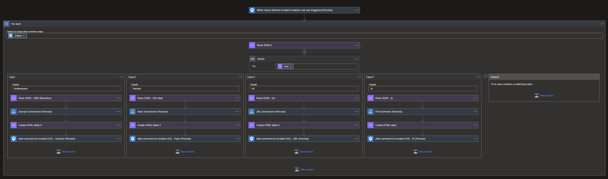

# RecordedFuture - Import Indicators Logic Apps and IOC Enrichment Playbook templates

# Overview
Recorded Future is the world’s largest provider of intelligence for enterprise security. By combining persistent and pervasive automated data collection and analytics with human analysis, Recorded Future delivers intelligence that is timely, accurate, and actionable.

# Roles and permissions for working with Recorded Future Solution

The following article describes roles and permissions for working with Microsoft Sentinel [https://learn.microsoft.com/en-us/azure/role-based-access-control/built-in-roles#microsoft-sentinel-contributor](https://learn.microsoft.com/en-us/azure/sentinel/roles).

To install and manage Playbooks/Logic Apps, the followong permissions are required on the resourcegroup [Microsoft Sentinel Contributor](https://learn.microsoft.com/en-us/azure/role-based-access-control/built-in-roles#microsoft-sentinel-contributor) + [Logic App Contributor](https://learn.microsoft.com/en-us/azure/role-based-access-control/built-in-roles#logic-app-contributor).

# Connectors Authorization 
Each connector needs to be authorize after playbook installation. Expand all nodes in the logic app after installation and look for blocks marked with a warning sign. Open and autorize the connection. more information about each connector can be found below. 

We use the following connectors in Recordedd Future solution:
- **/recordedfuturev2** Microsoft power platform connectors 
https://learn.microsoft.com/en-us/connectors/recordedfuturev2/  . All logic apps require an APIKey to communicate with the Recorded Future API. To obtain an APIKey, please visit [Recorded Future](https://www.recordedfuture.com/integrations/azure/).
- **/microsoftgraphsecurity** - Microsoft power platform connectors https://learn.microsoft.com/en-us/connectors/microsoftgraphsecurity/
- **/azuresentinel** - Microsoft power platform connectors https://learn.microsoft.com/en-us/connectors/azuresentinel/

# Deployment

> **Due to internal Microsoft Logic Apps dependencies, please deploy first the ImportToSentinel playbook before any of the IndicatorProcessor one.**

## ImportToSentinel

This playbooks will serve via the Microsoft Batching mechanism all of the IndicatorProcessor playbooks, for optimizition of the indicator deployment process.

## Detection - IP - Actively Communicating C&C Server

This playbook leverages the Recorded Future API to automate the ingestion of Recorded Future [Actively Communicating C&C Server IP RiskList](https://support.recordedfuture.com/hc/en-us/articles/115000894448-IP-Address-Risk-Rules), into the ThreatIntelligenceIndicator table, for detection (alert) actions in Microsoft Sentinel. For additional information please visit [Recorded Future](https://www.recordedfuture.com/integrations/azure/).

## Detection - Domain - C&C DNS Name

This playbook leverages the Recorded Future API to automate the ingestion of Recorded Future [C&C DNS Name Domain RiskList](https://support.recordedfuture.com/hc/en-us/articles/115003793388-Domain-Risk-Rules), into the ThreatIntelligenceIndicator table, for detection (alert) actions in Microsoft Sentinel. For additional information please visit [Recorded Future](https://www.recordedfuture.com/integrations/azure/).

## Detection - URL - Recently Reported by Insikt Group

This playbook leverages the Recorded Future API to automate the ingestion of Recorded Future [Recently Reported by Insikt Group URL RiskList](https://support.recordedfuture.com/hc/en-us/articles/115010052768-URL-Risk-Rules), into the ThreatIntelligenceIndicator table, for detection (alert) actions in Microsoft Sentinel. For additional information please visit [Recorded Future](https://www.recordedfuture.com/integrations/azure/).

## Detection - Hash - Observed in Underground Virus Testing Sites

This playbook leverages the Recorded Future API to automate the ingestion of Recorded Future [Observed in Underground Virus Testing Sites Hash RiskList](https://support.recordedfuture.com/hc/en-us/articles/115000846167-Hash-Risk-Rules), into the ThreatIntelligenceIndicator table, for detection (alert) actions in Microsoft Sentinel. For additional information please visit [Recorded Future](https://www.recordedfuture.com/integrations/azure/).

## Response (Enrichment) - IP, Domain, Hash, URL

This playbook leverages the Recorded Future API to automatically enrich the IP, Domain, Url and Hash indicators, found in incidents, with the following Recorded Future context: Risk Score, Risk Rules, Reasearch links, technical links and Link to Intelligence Card. The enrichment content will be posted as a comment in the Microsoft Sentinel incident. For additional information please visit [Recorded Future](https://www.recordedfuture.com/integrations/azure/). 

When the enrichment playbook is installed and configured. Create an automation rule to automate the enrichment process. The playbook will enrich known entities in the incident and write back data from Recorded Future as a comment. 
 
Select automation rule and enrichment playbook to run.
 
After the automation rule is created, the enrichment playbook will run automatically when a new incident is created. Enrichment of known entities will be written as a comment in the incident.
 