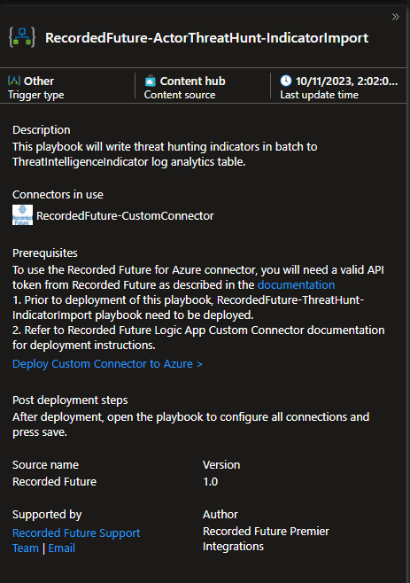

[](https://www.recordedfuture.com/)
# Recorded Future Intelligence for Microsoft Sentinel

## Prerequisites  

### Solution Dependencies  

The **Threat Intelligence** solution from Microsoft Sentinel Content Hub must be installed for indicators to be forwarded to Microsoft Sentinel ThreatIntelligenceIndicator log table. The Threat Intelligence Solution contains both the new **Threat Intelligence Upload Indicators API** and the _deprecated_ **Threat Intelligence Platforms Data Connector**.


### Roles and Permissions

Microsoft article that describes roles and permissions in Microsoft Sentinel <a href="https://learn.microsoft.com/en-us/azure/sentinel/roles" target="_blank">Roles and permissions in Microsoft Sentinel</a>

- During installation, the person performing the installations of the playbooks require <a href="https://learn.microsoft.com/en-us/azure/role-based-access-control/built-in-roles#logic-app-contributor" target="_blank">_**Logic App Contributor**_</a> and <a href="https://learn.microsoft.com/en-us/azure/role-based-access-control/built-in-roles#microsoft-sentinel-contributor" target="_blank">_**Microsoft Sentinel Contributor**_ </a> permissions on a **Resource Group** level, 

- If you use <a href="https://learn.microsoft.com/en-us/entra/identity/managed-identities-azure-resources/overview" target="_blank">managed identity</a> authorization for playbook (**Recommended**). The user performing the installation needs to have the role of **Owner (highest level)** or **Role Based Access Control Administrator** on resource group level. 

- The users that are to interact with **Microsoft Sentinel** require _**Microsoft Sentinel Contributor**_ permissions

 
### Recorded Future API Key
Recorded Future requires API keys to communicate with our API. To obtain API keys. <a href="https://go.recordedfuture.com/microsoft-azure-sentinel-free-trial?utm_campaign=&utm_source=microsoft&utm_medium=gta" target="_blank">Start a 30-day free trial of Recorded Future for Microsoft Sentinel from here</a> or visit <a href="https://support.recordedfuture.com/hc/en-us/articles/4411077373587-Requesting-API-Tokens" target="_blank">Recorded Future Requesting API Tokens</a> (Require Recorded Future Login) and request API token for ```Recorded Future for Microsoft Sentinel``` or/and ```Recorded Future Sandbox for Microsoft Sentinel```.

<details>
<summary>Expand to see API request form</summary>
<br/>
or\


</details>

### Connectors
The Recorded Future solution uses the following connectors:
- **/recordedfuturev2** - <a href="https://learn.microsoft.com/en-us/connectors/recordedfuturev2/" target="_blank">Microsoft power platform connector</a>. 

- **/RecordedFuture-CustomConnector** - [RecordedFuture-CustomConnector](Connectors/RecordedFuture-CustomConnector/readme.md)

- **/recordedfuturesandbo** - <a href="https://learn.microsoft.com/en-us/connectors/recordedfuturesandbo/" target="_blank">Microsoft power platform connector</a>.

- **/azuresentinel** - <a href="https://learn.microsoft.com/en-us/connectors/azuresentinel/" target="_blank">Documentation on Microsoft power platform connectors</a>

- **/azureloganalyticsdatacollector** - <a href="https://learn.microsoft.com/en-us/connectors/azureloganalyticsdatacollector/" target="_blank">Documentation on Microsoft azure log analytics data collector</a>

- **/azuremonitorlogs** - <a href="https://learn.microsoft.com/en-us/connectors/azuremonitorlogs/" target="_blank">Documentation on Microsoft azure monitor logs</a>

- **/microsoftgraphsecurity** - <a href="https://learn.microsoft.com/en-us/connectors/microsoftgraphsecurity/" target="_blank">Documentation on Microsoft power platform connectors</a>. The playbooks using this API is being **_DEPRECATED_** and will transition to new playbooks using **/azuresentinel** API.

## Ingestion and Operational costs
Playbook(Logic apps) may result in additional ingestion or operational costs:

1. <a href="https://learn.microsoft.com/en-us/azure/logic-apps/logic-apps-pricing" target="_blank">Usage metering, billing, and pricing for Azure Logic Apps</a>

1. <a href="https://learn.microsoft.com/en-us/azure/azure-monitor/logs/cost-logs" target="_blank">Azure Monitor Logs cost calculations and options</a>

Recorded Futures risk lists are generated at different cadences as described in this support article <a href="https://support.recordedfuture.com/hc/en-us/articles/115010401968-Risk-List-Download-Recommendations" target="_blank">Risk List Download Recommendations</a> (Require Recorded Future Login). It is possible to adjust cadence to decrease cost of data processing.

# Installation

The recommended way of installing the solution is via Microsoft Sentinel Content Hub, as it will provide templates for Playbooks, Workbooks and Analytic Rules.

It is possible to install specific playbooks as specified in the [Playbooks](#playbooks) section, as there are some playbooks not included in the content pack. This information is specified in their respective READMEs. Installing a specific playbook is a way to get bugfixes for a specific module.


## 1. Content Hub Installation

1. Locate the `Recorded Future Intelligence` in Microsoft Sentinel Content Hub.

Press **Install**  and continue to configure the solution. 

> [!NOTE] 
> The Content Hub installation provides templates and you have to create playbooks, workbooks, and analytic rules based on the templates. 


When installing playbooks from templates, read the description and look for dependencies that have to be installed. 

Example, install a custom connector that is included in the solution together with the playbook. Read the documentation for each playbook in sub folders listed [here](#playbooks)



After pressing the "Create Playbook" specify Subscription, Resource Group and Workspace. This is needed when installing any of the Playbooks.


# Playbooks
Some playbooks are not included in the Content Hub Solution and can be installed from this README. It is stated in the description of each playbook as **'Included in Solution: Yes/No'**. Playbooks not included in the Content Hub installation are provided as previews or examples of how to automate use cases.   

<a id="playbooks"></a>
## Playbooks
Consider your organizational use cases and install the corresponding playbooks to fit your needs. For examples and explanations of the use cases, see the [Key Features](../readme.md#key-features) section. 

|Use case| Playbook |
|-|-|
|Response| [Enrichment Playbooks](Enrichment/readme.md) |
| Detect | [Indicator Import/Risk List Playbooks](IndicatorImport/readme.md) |
| SOC Efficiency | [Alert Playbooks](Alerts/readme.md) |
| Sandbox | [Sandbox Playbooks](./Sandboxing/readme.md) |
| Threat Hunt  | [Threat Hunt Playbooks](./ThreatHunting/readme.md) |
| Custom connectors | [Custom Connector](./Connectors/RecordedFuture-CustomConnector/readme.md) |
| Deprecated playbooks | [Deprecated Risk List Playbooks](Deprecated/readme.md) |

<a id="connectors-authorization"></a>
## Connector Authorization

Each installed logic app uses various connectors that needs to be authorized, each of the connectors needs to be authorized in different ways depending on their type. 

Below are guides that a tailored to our recommended authorization flow, depending on organizational rules, the flow might be different. Please consult with your Azure administrator in those cases.

<details>
<summary>Expand to see recordedfuturev2 authorization guide</summary>

<br>

After a logic app has been installed, the **Recorded Future Connector V2** needs to be authorized. This only needs to be done once. If there are any uncertainties expand all nodes in the logic app after installation and look for blocks marked with a warning sign.

1. Go to the specific logic app,  in the left menu click on the section _**Development tools**_
2. Click on **_API connections_**
3. Click on **_RecordedFuture-ConnectorV2_**
4. Click on **_General_** in the left menu on the newly opened section
5. Click on **_Edit API Connection_**
6. Paste the **Recorded Future API Key** and click **_Save_**   


</details>

<details>
<summary>Expand to see azuresentinel managed identity authorization guide</summary>

<br>

The **azuresentinel** connector needs to be authorized for the solution to write to Microsoft Sentinel. There are multiple ways to do this, but our recommendation is using <a href="https://learn.microsoft.com/en-us/entra/identity/managed-identities-azure-resources/overview" target="_blank">**system assigned managed identity**</a>, this requires that the user performing the installation needs to have the role of **Owner (with highest permissions)** or **Role Based Access Control Administrator** on resource group level. 

For more detailed information check out this Micrsoft <a href="https://learn.microsoft.com/en-us/azure/logic-apps/authenticate-with-managed-identity?tabs=consumption" target="_blank">guide</a>

These steps will be needed for each logic app that uses the **azuresentinel** / **RecordedFuture-MicrosoftSentinelConnection**
1. Go to the specific logic app,  in the left menu click on the section _**Settings**_
2. Click on _**Identity**_
2. Click on the _**System Assinged**_ tab at the top of the page
3. If needed, Toggle the _**Status**_ to _**On**_ then click _**Save**_

4. Click on _**Azure role assignments**_
5. Click on _**Add new role assignment (Preview)**_
6. Set _**Scope**_ to _**Resource Group**_, choose **Subscription**, choose the **Resource Group** in which the logic app is installed on and set the _**Role**_ to _**Microsoft Sentinel Contributor**_

7. Click _**Save**_

</details>

<details>
<summary>Expand to see azureloganalyticsdatacollector and azuremonitorlogs managed identity authorization guide</summary>

<br>

1. Follow the steps outlined in the **azuresentinel** authorization guide
2. Add the role _**Log Analytics Contributor**_ instead of _**Microsoft Sentinel Contributor**_

</details>

# Workbooks

Workbook templates are installed as part of the Solution and and can be saved and configured in Sentinel's Workbook-Template section.
<details>
<summary>Expand image</summary>


</details>

The Recorded Future Solutions contains the following Workbooks. Note that workbooks have dependencies on corresponding Playbooks configured and running. 
|Use Case|Workbook Name| Playbook dependency|
|-|-|-|
|SOC Efficiency|Alerts Overview|Alert-Importer|
|SOC Efficiency|Playbook Alerts Overview|PlaybookAlert-Importer|
|Detect|Domain Correlation|Indicator Import/Risk List Playbooks/TAXII Import|
|Detect|Hash Correlation|Indicator Import/Risk List Playbooks/TAXII Import|
|Detect|IP Correlation|Indicator Import/Risk List Playbooks/TAXII Import|
|Detect|URL Correlation|Indicator Import/Risk List Playbooks/TAXII Import|
|Threat Hunt|Threat Actor Hunting|Threat Hunt Playbooks|
|Threat Hunt |Malware Threat Hunting|Threat Hunt Playbooks|

# Analytic Rules
Recorded Future Solution includes Analytic Rule templates. That can be configured to trigger alerts related to our imported risk lists och threat hunts.
<details>
<summary>Expand image</summary>


</details>

When creating Analytic Rules from templates, modify the provided KQL to match you infrastructure. The KQL query below is an example where the ASIM imNetworkSession table can be exchanged for any table containing outgoing IP traffic in your infrastructure. 

```JS
let ioc_lookBack = 1d;
// The source table (ASimNetworkSessionLogs) can be replaced by any infrastructure table containing ip data.
// The following workbook: Recorded Future - IP Correlation will help researching available data and selecting tables and columns  
imNetworkSession
| where isnotempty(DstIpAddr)
| join kind=inner (
ThreatIntelligenceIndicator
// Only look for IOCs
| where isnotempty(NetworkIP)
// Only look at Recorded Future Threat Hunt Indicators.
| where Description startswith "Recorded Future - Threat Hunt"
// Only work with the latest indicators  
| where TimeGenerated >= ago(ioc_lookBack)
| summarize LatestIndicatorTime = arg_max(TimeGenerated, *) by IndicatorId
| where Active == true and ExpirationDateTime > now()
) on $left.DstIpAddr == $right.NetworkIP
// select column from the source table to match with Recorded Future ThreatIntelligenceIndicator $left.DstIpAddr
| mv-expand RecordedFuturePortalLink=parse_json(tostring(parse_json(Tags)[0]))['RecordedFuturePortalLink']
| project NetworkIP, Description, Type, TimeGenerated, RecordedFuturePortalLink
```

The following Analytic rules are provided in the Solution. All of them requires configuration and adaption to your infrastructure. 

|User Case|Analytic Rule|
|-|-|
|Detect|DomainMalwareC2inDNSEvents|
|Detect|DomainMalwareC2inSyslogEvents|
|Detect|HashObservedInUndergroundinCommonSecurityLog|
|Detect|IPMalwareC2inAzureActivityEvents|
|Detect|IPMalwareC2inDNSEvents|
|Detect|UrlReportedbyInsiktGroupinSyslogEvents|
|Threat Hunt|RecordedFutureThreatHuntingHashAllActors|
|Threat Hunt|RecordedFutureThreatHuntingIPAllActors|
|Threat Hunt|RecordedFutureThreatHuntingDomainAllActors|
|Threat Hunt|RecordedFutureThreatHuntingUrlAllActors|


# Upgrade from previous versions
Information about latest released version number can be found in Recorded Future Intelligence Solution [release notes](../ReleaseNotes.md). There can be delay to the version available inside the content hub and whats in listed here due to publish/rollout time.  

### From version 2.4
We are deprecating the RecordedFuture-ImportToSentinel and all *-TIProcessor playbooks. Going forward, install the new IndicatorImport playbooks and configure them to download you selection of risk lists. Use the same risk lists being downloaded today, same cadence, and use the same description using the TIProcessor playbooks. Use the same description for threat indicators if you have analytic rules set up for alerting. 

Our support will end when Microsoft shut down the underlying API. More information can be found on <a href="https://learn.microsoft.com/en-us/azure/sentinel/understand-threat-intelligence#add-threat-indicators-to-microsoft-sentinel-with-the-threat-intelligence-platforms-data-connector" target="_blank">Microsoft Learn</a> (No end date has communicated from Microsoft at this point November 2023).

### From version 1
If you have a version 1 installation you need to first acquire a V2 APi key from Recorded Future. Install the new all IndicatorImport and enrichment -playbooks. Select a different name than the once already installed and reauthenticate them. Configure the IndicatorImport playbooks to pull your selection of risk lists. After validating that the new playbooks works as expected you can deactivate the V1 versions. 

# Troubleshooting

## Query Risk Lists
After successfully running and importing one or more Risk Lists it is possible to query the imported data in your Log Analytics Workspace. 

Example queries:  
``` sql 
//  List 10 rows from ThreatIntelligenceIndicator log imported from Recorded Future
ThreatIntelligenceIndicator
| where Description contains "Recorded Future"
| take 10

// List 10 rows from ThreatIntelligenceIndicator log imported from the  
// IP - Actively Communicating C&C Server Risk List 
ThreatIntelligenceIndicator
|where Description == "Recorded Future - IP - Actively Communicating C&C Server"
| take 10

//  List 10 rows from ThreatIntelligenceIndicator log imported from Recorded Future
ThreatIntelligenceIndicator
|where Description == "Recorded Future - IP - Actively Communicating C&C Server" and AdditionalInformation contains "Cobalt Strike"
| take 10
```

## "Errors" in RecordedFuture-IOC_Enrichment
If Recorded Future is missing data for a specific entity, when viewed within the Logic App "Previous Run" section, a error might be seen.

<details>
<summary> Example of "phantom error" </summary>


</details>
</br>

If the last box (Add Comment to incident (V3)) is green, then a comment has been created on the incident explaining what has happened.

If `http://` or `https://` is missing from URL entities, we will add `https://` to our URL Enrichment.


### Report issues/errors

When reporting issues or errors to Recorded Future on logic apps. Please include logic app version identifier that can be found in the `<Logic App> -> Development Tools -> Versions` section in the Azure portal.


# Known Issues 

## Version 3.0
Microsoft Sentinel playbook upgrade experience can result in the following error: ```Cannot read properties of null (reading 'parameters')```


A workaround is to reinstall and overwrite the playbooks from the template in Playbook Template tab and not using the upgrade wizard. Before overwriting an active playbook make note of the risk list downloaded, the description, cadence of downloading. 

