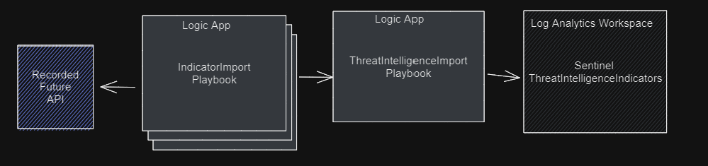
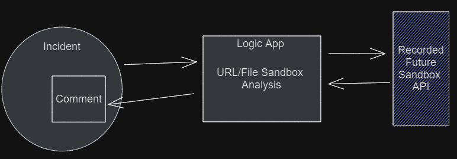
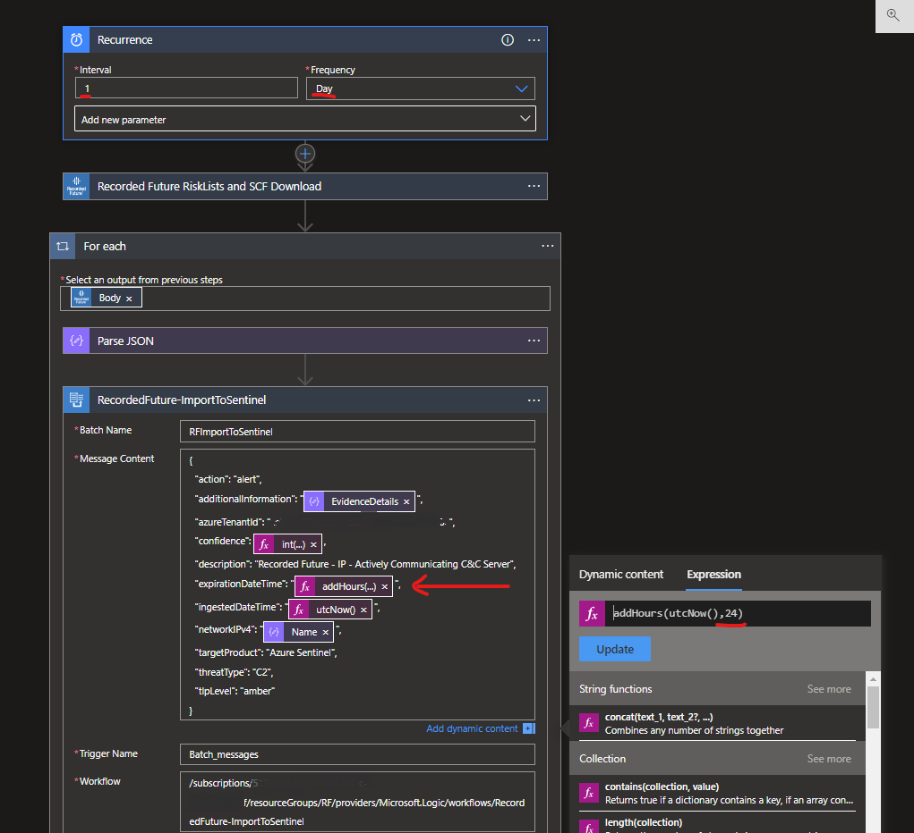
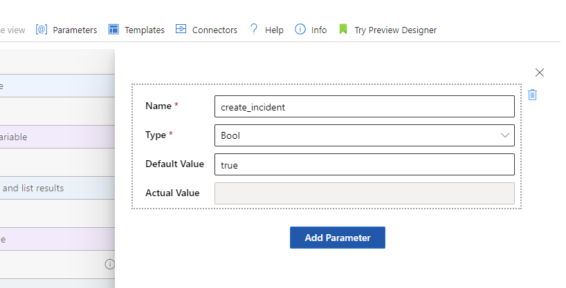

# Recorded Future Intelligence for Microsoft Sentinel
[](https://www.recordedfuture.com/)


# Overview
This guide provides instructions on how to install, update and configure Recorded Future Intelligence for Microsoft Sentinel.

Recorded Future is the world's largest provider of intelligence for enterprise security. By seamlessly combining automated data collection, pervasive analytics, and expert human analysis, Recorded Future delivers timely, accurate, and actionable intelligence.

**Benefits of Recorded Future integrations** 
- Detect indicators of compromise (IOCs) in your environment.
- Triage alerts faster with elite, real-time intelligence.
- Respond quickly with transparency and context around internal telemetry data.
- Maximize your investment in Microsoft Sentinel.

[Learn more about Recorded Future for Microsoft Sentinel](https://www.recordedfuture.com/microsoft-azure-sentinel-integration)


# Key Features
Recorded Future for Microsoft Sentinel offers a range of powerful intelligence capabilities, some of the key features include:
## **IOC Detection (Detect)**

The TI-Processor playbooks pulls risk lists from Recorded Future and writes the contained indicators to the Sentinel ThreatIntelligenceIndicator table via the RecordedFuture-ImportToSentinel playbook. 


Microsoft Sentinel analytic rules correlates threat intelligence indicators with logs provided to Sentinel and creates alerts/incidents for matches found.


## **IOC Enrichment (Respond)**

Automation rules triggers on each incident and enriches incidents with Recorded Future intelligence. 


## **Malware Sandbox Analysis**

Uploads and detonate samples in Recorded Future's Malware Analysis Sandbox. The sandbox provides safe and immediate behavioral analysis, helping contextualize key artifacts in an investigation, leading to faster triage.


## **Import Alerts** (SOC Efficiency)

To increase the visibility and availability of Recorded Future Alerts. Import Recorded Future Alerts and Playbook Alerts from Recorded Future Portal into Sentinel. 

## Risk lists
Risk lists are curated lists that contain Indicators of Compromise (IOCs), such as IP addresses, domains, file hashes, or URLs associated with malicious activity. These lists are generated based on a wide array of Recorded Future intelligence sources, including open web, dark web, and other technical sources.

* [Manage Risk Lists](https://www.recordedfuture.com/support/install-configure-manage-risk-lists)
* [About Risk Lists](https://support.recordedfuture.com/hc/en-us/articles/115000897248-Recorded-Future-Risk-Lists) (requires login)
* [Risk List Download Recommendations](https://support.recordedfuture.com/hc/en-us/articles/115010401968-Risk-List-Download-Recommendations) (requires login)
# Before You Begin

## Roles and Permissions

The following article describes roles and permissions in Microsoft Sentinel [Roles and permissions in Microsoft Sentinel](https://learn.microsoft.com/en-us/azure/sentinel/roles).

To install and manage Playbooks/Logic Apps, the following permissions are required on the resource group [Microsoft Sentinel Contributor](https://learn.microsoft.com/en-us/azure/role-based-access-control/built-in-roles#microsoft-sentinel-contributor) and [Logic App Contributor](https://learn.microsoft.com/en-us/azure/role-based-access-control/built-in-roles#logic-app-contributor).

The **Threat Intelligence Upload Indicators API** in Sentinel must be enabled in order for indicators to be forwarded to Sentinel ThreatIntelligenceIndicator table.


DEPRECATED! The **Threat Intelligence Platforms Data Connector** in Sentinel must be enabled in order for indicators to be forwarded from the Graph Security API to Sentinel. (This connector is being deprecated by Microsoft and future updates of this solution will use the Threat Intelligence Upload Indicators API).


## Connectors Authorization 
Each connector need to be authorized after playbook/logic app installation. Expand all nodes in the logic app after installation and look for blocks marked with a warning sign. Open and authorize all connections.

Recorded Future requires API keys to communicate with our API. To obtain API keys, please visit [Recorded Future Requesting API Tokens](https://support.recordedfuture.com/hc/en-us/articles/4411077373587-Requesting-API-Tokens) (Require Recorded Future Login) and request API token for ```Recorded Future for Microsoft Sentinel``` or/and ```Recorded Future Sandbox for Microsoft Sentinel```.
 \
or 


The Recorded Future solution uses the following connectors:
- **/recordedfuturev2** - [Microsoft power platform connector](https://learn.microsoft.com/en-us/connectors/recordedfuturev2/). 


- **/recordedfuturesandbo** - [Microsoft power platform connector](https://learn.microsoft.com/en-us/connectors/recordedfuturesandbo/).


- **/azuresentinel** - [Documentation on Microsoft power platform connectors](https://learn.microsoft.com/en-us/connectors/azuresentinel/)


- **/microsoftgraphsecurity** - [Documenation on Microsoft power platform connectors](https://learn.microsoft.com/en-us/connectors/microsoftgraphsecurity/). The playbooks using this API is being DEPRECATED and will transition to new playbooks using azuresentinel api.

## Ingestion and Operational costs
Playbook(Logic apps) may result in additional ingestion or operational costs:

1. [Usage metering, billing, and pricing for Azure Logic Apps](https://learn.microsoft.com/en-us/azure/logic-apps/logic-apps-pricing)

1. [Azure Monitor Logs cost calculations and options](https://learn.microsoft.com/en-us/azure/azure-monitor/logs/cost-logs)

Recorded Futures risk lists are generated at different cadences as described in this support article [Risk List Download Recommendations](https://support.recordedfuture.com/hc/en-us/articles/115010401968-Risk-List-Download-Recommendations) (Require Recorded Future Login). It is possible to adjust cadence to decrease cost of data processing.

# Installation

There are two options for installing playbooks and starting automate threat response:

- Installing the solution from [Content Hub](https://portal.azure.com/#view/Microsoft_Azure_Marketplace/GalleryItemDetailsBladeNopdl/dontDiscardJourney~/true/id/recordedfuture1605638642586.recorded_future_sentinel_solution). (Recommended)

- Installing the playbooks one by one by from this Readme further down in this document.

## Content Hub Installation

1. Locate the Recorded Future Solution in the Content Hub.

1. Press **Install** and then **Create** and continue to configure the solution. 

1. If the installation was completed successfully, you will now have Workbook templates, Automation Playbook templates and Analytic Rules templates.

To use the workbooks, playbooks and analytic rules, install them inside of Sentinel by selecting the respective template and install/activate/create. 

## Playbooks one by one installation
To install individual playbooks one by one, use the buttons next to the descriptions of the individual playbooks further down in this document.

> **Due to internal dependencies, please deploy and activate the ThreatIntelligenceImport playbook before any of the IndicatorProcessor/TIProcessor playbooks.**

# Upgrade from previous versions

### From version 2.4
We are deprecating the RecordedFuture-ImportToSentinel and all *-TIProcessor playbooks. You need to install the new IndicatorImport playbooks and configure them to download you selection of risk lists. Investigate the risk lists being downloaded and the cadence and use the same configuration using the TIProcessor playbooks. Use the same description for threat indicators if you have analytic rules set up for alerting. 
### From version 1
If you have a version 1 installation you need to first acquire a V2 APi key from Recorded Future. Install the new all IndicatorImport and enrichment -playbooks. Select a different name than the once already installed and reauthenticate them. Configure the IndicatorImport playbooks to pull your selection of risk lists. After validating that the new playbooks works as expected you can deactivate the V1 versions. 

# Configuration 
## Risk list configuration 
Verify that the **ThreatIntelligenceImport** logic app is installed and active in your environment before installing the TIProcessing risk lists.

From ```Automation -> Playbook Template```  Select any Recorded Future playbook that ends with IndicatorImport, like **RecordedFuture-IP-IndicatorImport**, press create playbook.
Note that it is possible to deploy several instances of the same template by giving them unique names. This is how you can pull several risk lists of the same type.


The parameter PlaybookNameBatching is the name of the ThreatIntelligenceImport playbook that will handle batch processing of indicators into Sentinel. In the last step press **Create and continue to designer**.


In the designer, locate all steps that show a warning and authenticate these steps. Authentication looks different for each connection. More information on this can be found in the chapter above called Connector Authorization.


## Change risk list 
You can change risk list to pull in to your environment. This can be done in the default playbook or you can install several instances of one playbook. 
Example: You would like to use both ```Actively Communicating Validated C&C Server``` and ```Recent Phishing Host``` ip risk lists. 
Select the **RecordedFuture-IP-IndicatorImport** template from ```Automation -> Playbook``` twice and save with different names like ```Recorded Future - Actively Communicating Validated C&C Server - IndicatorImport``` and ```Recorded Future - Phishing Host - IndicatorImport```. 

Change the risk list to download and modify the description in the ```RecordedFuture-Threatlntelligencelmport``` step in the logic app. 


## Configure Cadence of Risk List Ingestion 
Its possible to adjust the cadence of risk list download to reduce traffic and cost. Recorded Future have the following recommendations [Risk-List-Download-Recommendations](https://support.recordedfuture.com/hc/en-us/articles/115010401968-Risk-List-Download-Recommendations) (Require Recorded Future Login).

The first step of all TIProcessing Playbooks is a recurrence step, it is possible to adjust the cadence by modifying the interval and frequency parameters.


If you do so however, it is critical that you also adjust the expirationDateTime parameter in the final block of that logic app to be synchronized with the recurrence timing. Failure to do so can result in either:
* Duplication of indicators.
* Having no active Recorded Future indicators the majority of the time. 

If you are unsure of how to do this, please consult Recorded Future Professional Services.

## Query Risk lists
After successfully running and importing one or more risk lists it is possible to query the imported data in your Log Analytics Workspace. 

Example queries:  
``` sql 
//  List 10 rows from ThreatIntelligenceIndicator log imported from Recorded Future
ThreatIntelligenceIndicator
| where Description contains "Recorded Future"
| take 10

// List 10 rows from ThreatIntelligenceIndicator log imported from the  
// IP - Actively Communicating C&C Server risk list 
ThreatIntelligenceIndicator
|where Description == "Recorded Future - IP - Actively Communicating C&C Server"
| take 10

//  List 10 rows from ThreatIntelligenceIndicator log imported from Recorded Future
ThreatIntelligenceIndicator
|where Description == "Recorded Future - IP - Actively Communicating C&C Server" and AdditionalInformation contains "Cobalt Strike"
| take 10
```


## Activate Analytic Rules for IoC detection 
Automatically enrich IOCs in incidents by following the steps below: 

1. Open Microsoft Sentinel.
2. Go to Automation and select *Create Automation rule*
3. Name the rule
4. Select the following options:
   * Trigger: **When an incident is created**
   * Action: **Run playbook**
   * Playbook (successfully configured): 
     - **RecordedFuture-IOC_Enrichment-IP_Domain_URL_Hash** or
     - **RecordedFuture-Sandbox_Enrichment-Url**
5. Done

The Recorded Future playbook is now configured to run when incidents are triggered, and it will enrich the following IOC types: IP, Domain, URL, or Hash.

# Playbooks
This section lists all available Recorded Future Playbooks. 

## RecordedFuture-ThreatIntelligenceImport
Type: Detection\
Included in Recorded Future Intelligence Solution: Yes\
Requires **/recordedfuturev2** API keys as described in the [Connector authorization](#connector-authorization) section. 

Retrieves Indicators Of Compromise (IoCs) from one of the indicator import logic apps, and store them in the ThreatIntelligenceIndicator table. All IndicatorImport playbooks use this playbook for batching. 

[](https://portal.azure.com/#create/Microsoft.Template/uri/https%3A%2F%2Fraw.githubusercontent.com%2FAzure%2FAzure-Sentinel%2Fmaster%2FSolutions%2FRecorded%2520Future%2FPlaybooks%2FRecordedFuture-ThreatIntelligenceImport%2Fazuredeploy.json)
[](https://portal.azure.us/#create/Microsoft.Template/uri/https%3A%2F%2Fraw.githubusercontent.com%2FAzure%2FAzure-Sentinel%2Fmaster%2FSolutions%2FRecorded%2520Future%2FPlaybooks%2FRecordedFuture-ThreatIntelligenceImport%2Fazuredeploy.json)

## RecordedFuture-Domain-IndicatorImport
Type: Detection\
Included in Recorded Future Intelligence Solution: Yes\
Requires **/recordedfuturev2** API keys as described in the [Connector authorization](#connector-authorization) section. 


Retrieves the [Microsoft Sentinel Domain Default Risk List ](https://support.recordedfuture.com/hc/en-us/articles/115003793388-Domain-Risk-Rules) (requires login), Domain IOC with risk greater than 65 and adds the IOCs to the ThreatIntelligenceIndicator table.

[](https://portal.azure.com/#create/Microsoft.Template/uri/https%3A%2F%2Fraw.githubusercontent.com%2FAzure%2FAzure-Sentinel%2Fmaster%2FSolutions%2FRecorded%2520Future%2FPlaybooks%2FDomain-IndicatorImport%2Fazuredeploy.json)
[](https://portal.azure.us/#create/Microsoft.Template/uri/https%3A%2F%2Fraw.githubusercontent.com%2FAzure%2FAzure-Sentinel%2Fmaster%2FSolutions%2FRecorded%2520Future%2FPlaybooks%2FDomain-IndicatorImport%2Fazuredeploy.json)


## RecordedFuture-Hash-IndicatorImport
Type: Detection\
Included in Recorded Future Intelligence Solution: Yes\
Requires **/recordedfuturev2** API keys as described in the [Connector authorization](#connector-authorization) section. 

Retrieves the [Microsoft Sentinel Hash Observed in Underground Testing Risk List ](https://support.recordedfuture.com/hc/en-us/articles/115000846167-Hash-Risk-Rules) (requires login), Hashes based on the observedMalwareTesting Risk Rule and adds the IOCs to the ThreatIntelligenceIndicator table.

[](https://portal.azure.com/#create/Microsoft.Template/uri/https%3A%2F%2Fraw.githubusercontent.com%2FAzure%2FAzure-Sentinel%2Fmaster%2FSolutions%2FRecorded%2520Future%2FPlaybooks%2FRecordedFuture-Hash-IndicatorImport%2Fazuredeploy.json)
[](https://portal.azure.us/#create/Microsoft.Template/uri/https%3A%2F%2Fraw.githubusercontent.com%2FAzure%2FAzure-Sentinel%2Fmaster%2FSolutions%2FRecorded%2520Future%2FPlaybooks%2FRecordedFuture-Hash-IndicatorImport%2Fazuredeploy.json)

## RecordedFuture-IP-IndicatorImport
Type: Detection\
Included in Recorded Future Intelligence Solution: Yes\
Requires **/recordedfuturev2** API keys as described in the [Connector authorization](#connector-authorization) section. 

Retrieves the [Actively Communicating Validated C&C Server Risk List ](https://support.recordedfuture.com/hc/en-us/articles/115000894448-IP-Address-Risk-Rules) (requires login), Observing C2 communications with infected machines or adversary control by Recorded Future Network Traffic Analysis.

[](https://portal.azure.com/#create/Microsoft.Template/uri/https%3A%2F%2Fraw.githubusercontent.com%2FAzure%2FAzure-Sentinel%2Fmaster%2FSolutions%2FRecorded%2520Future%2FPlaybooks%2FRecordedFuture-IP-IndicatorImport%2Fazuredeploy.json)
[](https://portal.azure.us/#create/Microsoft.Template/uri/https%3A%2F%2Fraw.githubusercontent.com%2FAzure%2FAzure-Sentinel%2Fmaster%2FSolutions%2FRecorded%2520Future%2FPlaybooks%2FRecordedFuture-IP-IndicatorImport%2Fazuredeploy.json)

## RecordedFuture-URL-IndicatorImport
Type: Detection\
Included in Recorded Future Intelligence Solution: Yes\
Requires **/recordedfuturev2** API keys as described in the [Connector authorization](#connector-authorization) section. 

Retrieves the [Microsoft Sentinel URL Recently Reported by Insikt Group Risk List ](https://support.recordedfuture.com/hc/en-us/articles/115000894448-IP-Address-Risk-Rules) (requires login), URLs based on the Recently Reported by Insikt Group rule and adds the IOCs to the ThreatIntelligenceIndicator table.

[](https://portal.azure.com/#create/Microsoft.Template/uri/https%3A%2F%2Fraw.githubusercontent.com%2FAzure%2FAzure-Sentinel%2Fmaster%2FSolutions%2FRecorded%2520Future%2FPlaybooks%2FRecordedFuture-URL-IndicatorImport%2Fazuredeploy.json)
[](https://portal.azure.us/#create/Microsoft.Template/uri/https%3A%2F%2Fraw.githubusercontent.com%2FAzure%2FAzure-Sentinel%2Fmaster%2FSolutions%2FRecorded%2520Future%2FPlaybooks%2FRecordedFuture-URL-IndicatorImport%2Fazuredeploy.json)

## RecordedFuture-Alert-Importer
Type: Alerting\
Included in Recorded Future Intelligence Solution: Yes\
Requires **/recordedfuturev2** API keys as described in the [Connector authorization](#connector-authorization) section. 

Retrieves Alerts and stores them in a custom log in the Log Analytic Workspace. More information on [Alerts](https://support.recordedfuture.com/hc/en-us/articles/115002151327-Setting-up-Event-Alerts) (requires login)

The Alert importer playbook also creates incidents when receiving alerts. Its possible to turn off incident generation by setting the logic app parameter create_incident to false



[](https://portal.azure.com/#create/Microsoft.Template/uri/https%3A%2F%2Fraw.githubusercontent.com%2FAzure%2FAzure-Sentinel%2Fmaster%2FSolutions%2FRecorded%2520Future%2FPlaybooks%2FRecordedFuture-Alert-Importer%2Fazuredeploy.json)
[](https://portal.azure.us/#create/Microsoft.Template/uri/https%3A%2F%2Fraw.githubusercontent.com%2FAzure%2FAzure-Sentinel%2Fmaster%2FSolutions%2FRecorded%2520Future%2FPlaybooks%2FRecordedFuture-Alert-Importer%2Fazuredeploy.json)


## RecordedFuture-Playbook-Alert-Importer
Type: Alerting\
Included in Recorded Future Intelligence Solution: Yes\
Requires **/recordedfuturev2** API keys as described in the [Connector authorization](#connector-authorization) section. 

Retrieves Playbook Alerts and stores them in a custom log in the Log Analytic Workspace. More information on [Playbook Alerts](https://support.recordedfuture.com/hc/en-us/articles/13152506878739-Playbook-Alerting-Rules-) (requires login)

[](https://portal.azure.com/#create/Microsoft.Template/uri/https%3A%2F%2Fraw.githubusercontent.com%2FAzure%2FAzure-Sentinel%2Fmaster%2FSolutions%2FRecorded%2520Future%2FPlaybooks%2FRecordedFuture-Playbook-Alert-Importer%2Fazuredeploy.json)
[](https://portal.azure.us/#create/Microsoft.Template/uri/https%3A%2F%2Fraw.githubusercontent.com%2FAzure%2FAzure-Sentinel%2Fmaster%2FSolutions%2FRecorded%2520Future%2FPlaybooks%2FRecordedFuture-Playbook-Alert-Importer%2Fazuredeploy.json)

__________________________________________________________

## RecordedFuture-Sandbox_Enrichment-Url
Type: Response\
Included in Recorded Future Intelligence Solution: Yes\
Requires **/recordedfuturesanbo** API keys as described in the [Connector authorization](#connector-authorization) section. 

Enables URL submission to Recorded Future's Malware Analysis Sandbox, the playbook will also create a Sentinel incident with the following information from the analysis report:

* Severity Score
* signatures
* A link to the complete analysis report 

File submission requires a storage account.

To set up automatic enrichment, map alerts to a [custom analytic rule](https://learn.microsoft.com/en-us/azure/sentinel/detect-threats-custom#alert-enrichment).


[](https://portal.azure.com/#create/Microsoft.Template/uri/https%3A%2F%2Fraw.githubusercontent.com%2FAzure%2FAzure-Sentinel%2Fmaster%2FSolutions%2FRecorded%2520Future%2FPlaybooks%2FRecordedFuture-Sandbox_Enrichment-Url%2Fazuredeploy.json)
[](https://portal.azure.us/#create/Microsoft.Template/uri/https%3A%2F%2Fraw.githubusercontent.com%2FAzure%2FAzure-Sentinel%2Fmaster%2FSolutions%2FRecorded%2520Future%2FPlaybooks%2FRecordedFuture-Sandbox_Enrichment-Url%2Fazuredeploy.json)

## RecordedFuture-Sandbox_Outlook_Attachment
Type: Response\
Included in Recorded Future Intelligence Solution: No\
Requires **/recordedfuturesanbo** API keys as described in the [Connector authorization](#connector-authorization) section. 

Enables submission of file attachments, from Microsoft Outlook emails, to Recorded to Future's Malware Analysis Sandbox. The playbook also creates a Sentinel incident with a summary of the analysis report. 

The email address that received the attachment will also receive an email with the summary.

**Information in summary**
* Severity Score
* signatures
* A link to the complete analysis report. 

To set up automatic enrichment, map alerts to a [custom analytic rule](https://learn.microsoft.com/en-us/azure/sentinel/detect-threats-custom#alert-enrichment).


[](https://portal.azure.com/#create/Microsoft.Template/uri/https%3A%2F%2Fraw.githubusercontent.com%2FAzure%2FAzure-Sentinel%2Fmaster%2FSolutions%2FRecorded%2520Future%2FPlaybooks%2FRecordedFuture-Sandbox_Outlook_Attachment%2Fazuredeploy.json)
[](https://portal.azure.us/#create/Microsoft.Template/uri/https%3A%2F%2Fraw.githubusercontent.com%2FAzure%2FAzure-Sentinel%2Fmaster%2FSolutions%2FRecorded%2520Future%2FPlaybooks%2FRecordedFuture-Sandbox_Outlook_Attachment%2Fazuredeploy.json)


## RecordedFuture-Sandbox_StorageAccount
Type: Response\
Included in Recorded Future Intelligence Solution: No\
Requires **/recordedfuturesanbo** API keys as described in the [Connector authorization](#connector-authorization) section. 

Enables security and IT teams to submit files to Recorded Future's Malware Analysis Sandbox. The playbook will generate an Sentinel incident, and add a comment with a the following data from the analysis report:

* Severity Score
* signatures
* A link to the complete Sandbox report 

This playbook is for file Submission with a storage account.

To set up automatic enrichment, map alerts to a [custom analytic rule](https://learn.microsoft.com/en-us/azure/sentinel/detect-threats-custom#alert-enrichment).


[](https://portal.azure.com/#create/Microsoft.Template/uri/https%3A%2F%2Fraw.githubusercontent.com%2FAzure%2FAzure-Sentinel%2Fmaster%2FSolutions%2FRecorded%2520Future%2FPlaybooks%2FRecordedFuture-Sandbox_StorageAccount%2Fazuredeploy.json)
[](https://portal.azure.us/#create/Microsoft.Template/uri/https%3A%2F%2Fraw.githubusercontent.com%2FAzure%2FAzure-Sentinel%2Fmaster%2FSolutions%2FRecorded%2520Future%2FPlaybooks%2FRecordedFuture-Sandbox_StorageAccount%2Fazuredeploy.json)


---

## RecordedFuture-IOC_Enrichment-IP_Domain_URL_Hash
Type: Response\
Requires **/recordedfuturev2** API keys as described in the [Connector authorization](#connector-authorization) section. 

Enriches IOCs (IPs, Domains, URLs and hashes) in Sentinel incidents with Recorded Future Intelligence. The Playbook adds the following data for all IOCs an incident: 

* Recorded Future Risk Score
* Triggered Risk Rules 
* Research Links 
* Technical links 
* Previous detections 
* Link to the IOC Intelligence Card in the Recorded Future portal.  
  
Data is added as a comment in the incident.

Enable automatic enrichment by mapping enrichments to alerts using a [custom analytics rule](https://learn.microsoft.com/en-us/azure/sentinel/detect-threats-custom#alert-enrichment)


[](https://portal.azure.com/#create/Microsoft.Template/uri/https%3A%2F%2Fraw.githubusercontent.com%2FAzure%2FAzure-Sentinel%2Fmaster%2FSolutions%2FRecorded%2520Future%2FPlaybooks%2FRecordedFuture-IOC_Enrichment-IP_Domain_URL_Hash%2Fazuredeploy.json)
[](https://portal.azure.us/#create/Microsoft.Template/uri/https%3A%2F%2Fraw.githubusercontent.com%2FAzure%2FAzure-Sentinel%2Fmaster%2FSolutions%2FRecorded%2520Future%2FPlaybooks%2FRecordedFuture-IOC_Enrichment-IP_Domain_URL_Hash%2Fazuredeploy.json)

### Automate Incident Enrichment
After one of the enrichment playbooks is installed and all connections are configured. Create an automation rule to automate the enrichment process. This will automate  enrichment of Recorded Future intelligence to known entities in all incidents. 

<br/>

In Sentinel, go to Automation and create **Automation rule**. Give the new rule a name, select the trigger **When incident is created**, select the action **Run playbook** and finally select **RecordedFuture-IOC_Enrichment-IP_Domain_URL_Hash** or **RecordedFuture-Sandbox_Enrichment-Url** as the playbook. 

<br/>

This will trigger the Recorded Future playbook to run when any incident is created. Recorded future will then enrich the incident if it contains entities of types IP, Domain, Url or FileHash. 

### Recorded Future Intelligence Cloud Configuration
The Recorded Future Intelligence Cloud aggregates data related to Sigma Rules and other indicators, driving collective insights to better identify threats. Anonymized, unattributable data is collected for analytical purposes to identify trends and insights with the Intelligence Cloud. The **RecordedFuture-IOC_Enrichment-IP_Domain_URL_Hash** playbook gives end users the ability to contribute collective insights to the Intelligence Cloud.
[Click here to learn more](https://support.recordedfuture.com/hc/en-us/articles/11633413141779) (Require Recorded Future Login)


# DEPRECATED Playbooks
These playbooks will be removed in future version on Recorder Future Solution. 
## RecordedFuture-ImportToSentinel
[DEPRECATED]: Use the new RecordedFuture-ThreatIntelligenceImport playbook.
Type: Detection
Included in Recorded Future Intelligence Solution: Yes

Retrieves all Risk Lists (IOCs), and adds them to the ThreatIntelligenceIndicator table. All TIProcessor playbooks use this playbook.

[](https://portal.azure.com/#create/Microsoft.Template/uri/https%3A%2F%2Fraw.githubusercontent.com%2FAzure%2FAzure-Sentinel%2Fmaster%2FSolutions%2FRecorded%2520Future%2FPlaybooks%2FRecordedFuture-ImportToSentinel%2Fazuredeploy.json)
[](https://portal.azure.us/#create/Microsoft.Template/uri/https%3A%2F%2Fraw.githubusercontent.com%2FAzure%2FAzure-Sentinel%2Fmaster%2FSolutions%2FRecorded%2520Future%2FPlaybooks%2FRecordedFuture-ImportToSentinel%2Fazuredeploy.json)

## RecordedFuture-IP-Actively_Comm_C2_Server-TIProcessor
[DEPRECATED]: Use the new RecordedFuture-ThreatIntelligenceImport playbook.
Type: Detection
Included in Recorded Future Intelligence Solution: Yes

Retrieves the [ Risk List - Actively Communicating C&C IPs](https://support.recordedfuture.com/hc/en-us/articles/115000894448-IP-Address-Risk-Rules) (requires login),  and adds the IOCs to the ThreatIntelligenceIndicator table.

[](https://portal.azure.com/#create/Microsoft.Template/uri/https%3A%2F%2Fraw.githubusercontent.com%2FAzure%2FAzure-Sentinel%2Fmaster%2FSolutions%2FRecorded%2520Future%2FPlaybooks%2FRecordedFuture-IP-Actively_Comm_C2_Server-IndicatorProcessor%2Fazuredeploy.json)
[](https://portal.azure.us/#create/Microsoft.Template/uri/https%3A%2F%2Fraw.githubusercontent.com%2FAzure%2FAzure-Sentinel%2Fmaster%2FSolutions%2FRecorded%2520Future%2FPlaybooks%2FRecordedFuture-IP-Actively_Comm_C2_Server-IndicatorProcessor%2Fazuredeploy.json)

## RecordedFuture-DOMAIN-C2_DNS_Name-TIProcessor
[DEPRECATED]: Use the new RecordedFuture-ThreatIntelligenceImport playbook.
Type: Detection 
Included in Recorded Future Intelligence Solution: Yes

Retrieves the [Risk List - C&C DNS Name Domain](https://support.recordedfuture.com/hc/en-us/articles/115003793388-Domain-Risk-Rules) (requires login), and adds the IOCs to the ThreatIntelligenceIndicator table.

[](https://portal.azure.com/#create/Microsoft.Template/uri/https%3A%2F%2Fraw.githubusercontent.com%2FAzure%2FAzure-Sentinel%2Fmaster%2FSolutions%2FRecorded%2520Future%2FPlaybooks%2FRecordedFuture-DOMAIN-C2_DNS_Name-IndicatorProcessor%2Fazuredeploy.json)
[](https://portal.azure.us/#create/Microsoft.Template/uri/https%3A%2F%2Fraw.githubusercontent.com%2FAzure%2FAzure-Sentinel%2Fmaster%2FSolutions%2FRecorded%2520Future%2FPlaybooks%2FRecordedFuture-DOMAIN-C2_DNS_Name-IndicatorProcessor%2Fazuredeploy.json)

## RecordedFuture-URL-Recent_Rep_by_Insikt-TIProcessor
[DEPRECATED]: Use the new RecordedFuture-ThreatIntelligenceImport playbook.
Type: Detection 
Included in Recorded Future Intelligence Solution: Yes

Retrieves the [ Risk List - Recently Reported by Insikt Group URL](https://support.recordedfuture.com/hc/en-us/articles/115010052768-URL-Risk-Rules) (requires login) and adds the IOCs to the ThreatIntelligenceIndicator table.

[](https://portal.azure.com/#create/Microsoft.Template/uri/https%3A%2F%2Fraw.githubusercontent.com%2FAzure%2FAzure-Sentinel%2Fmaster%2FSolutions%2FRecorded%2520Future%2FPlaybooks%2FRecordedFuture-URL-Recent_Rep_by_Insikt_Group-IndicatorProcessor%2Fazuredeploy.json)
[](https://portal.azure.us/#create/Microsoft.Template/uri/https%3A%2F%2Fraw.githubusercontent.com%2FAzure%2FAzure-Sentinel%2Fmaster%2FSolutions%2FRecorded%2520Future%2FPlaybooks%2FRecordedFuture-URL-Recent_Rep_by_Insikt_Group-IndicatorProcessor%2Fazuredeploy.json)

## RecordedFuture-HASH-Obs_in_Underground-TIProcessor
[DEPRECATED]: Use the new RecordedFuture-ThreatIntelligenceImport playbook.
Type: Detection 
Included in Recorded Future Intelligence Solution: Yes

Retrieves the[ Risk List - Observed in Underground Virus Testing Sites Hash](https://support.recordedfuture.com/hc/en-us/articles/115000846167-Hash-Risk-Rules) (requires login), and adds the IOCs to the ThreatIntelligenceIndicator table.

[](https://portal.azure.com/#create/Microsoft.Template/uri/https%3A%2F%2Fraw.githubusercontent.com%2FAzure%2FAzure-Sentinel%2Fmaster%2FSolutions%2FRecorded%2520Future%2FPlaybooks%2FRecordedFuture-HASH-Observed_in_Underground_Virus_Test_Sites-IndicatorProcessor%2Fazuredeploy.json)
[](https://portal.azure.us/#create/Microsoft.Template/uri/https%3A%2F%2Fraw.githubusercontent.com%2FAzure%2FAzure-Sentinel%2Fmaster%2FSolutions%2FRecorded%2520Future%2FPlaybooks%2FRecordedFuture-HASH-Observed_in_Underground_Virus_Test_Sites-IndicatorProcessor%2Fazuredeploy.json)

## RecordedFuture-Ukraine-IndicatorProcessor
[DEPRECATED]: Use the new RecordedFuture-ThreatIntelligenceImport playbook.
Type: Detection
Included in Recorded Future Intelligence Solution: Yes

Retrieves the [Risk List - Ukraine Threat List of Related IOCs](https://support.recordedfuture.com/hc/en-us/articles/4484981411475-Resource-Center-on-the-Ukraine-Conflict) (requires login), and adds the IOCs to the ThreatIntelligenceIndicator table.

[](https://portal.azure.com/#create/Microsoft.Template/uri/https%3A%2F%2Fraw.githubusercontent.com%2FAzure%2FAzure-Sentinel%2Fmaster%2FSolutions%2FRecorded%20Future%2FPlaybooks%2FRecordedFuture-Ukraine-IndicatorProcessor%2Fazuredeploy.json)
[](https://portal.azure.us/#create/Microsoft.Template/uri/https%3A%2F%2Fraw.githubusercontent.com%2FAzure%2FAzure-Sentinel%2Fmaster%2FSolutions%2FRecorded%20Future%2FPlaybooks%2FRecordedFuture-Ukraine-IndicatorProcessor%2Fazuredeploy.json)


# Known Issues 
## Version 2.5
Sentinel playbook upgrade experience can result in the following error: ```Cannot read properties of null (reading 'parameters')```


A workaround is to reinstall and overwrite the playbooks from the template in Playbook Template tab and not using the upgrade wizard. Before overwriting an active playbook make note of the risk list downloaded, the description, cadence of downloading. 

