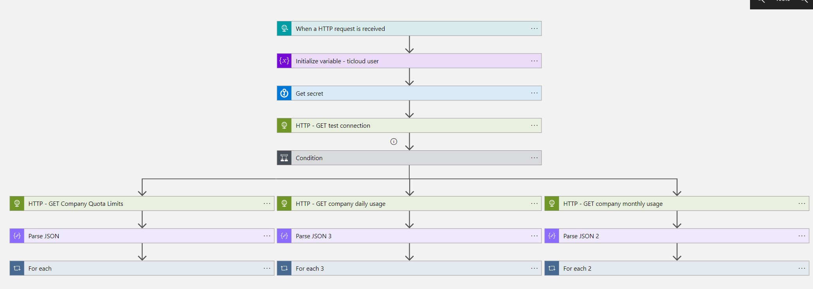

# ReversingLabs-CheckQuota

Author: Aaron Hoffmann (ReversingLabs)

This playbook provides API quota details from the ReversingLabs TitaniumCloud API. This playbook is designed to be used with the ReversingLabs-CapabilitiesOverview workbook as part of the ReversingLabs content pack solution for Microsoft Sentinel.

## Additional resources
This template deploys an Azure Key Vault in order to store credentials used by the playbook. The template will also enable a managed identity for the playbook, and assign the managed identity the Key Vault Secrets User role scoped to the deployed Key Vault.

## Deploy to Azure
Use the buttons below to start the deployment process.

## Prerequisites

You'll need the following:
* A ReversingLabs TitaniumCloud subscription
* A ReversingLabs TitaniumCloud username
* A ReversingLabs TitaniumCloud password

## Post-deployment

After deploying the template, you'll want to update the playbook connections with your TitaniumCloud API username and password.

## Screenshots

