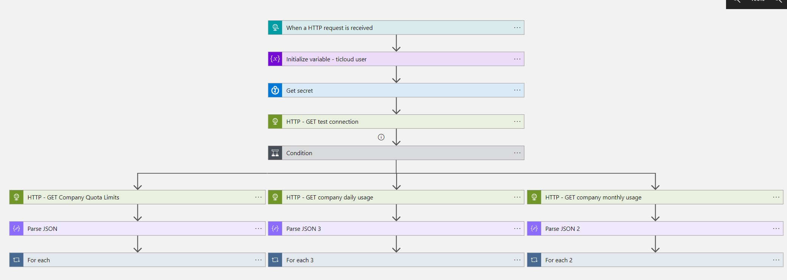

# ReversingLabs-CheckQuota

Author: Aaron Hoffmann (ReversingLabs)
## Summary
This playbook provides API quota details from the ReversingLabs TitaniumCloud API. This playbook is designed to be used with the ReversingLabs-CapabilitiesOverview workbook as part of the ReversingLabs content pack solution for Microsoft Sentinel.

## Prerequisites
You'll need the following:
* A ReversingLabs TitaniumCloud subscription
* A ReversingLabs TitaniumCloud username
* A ReversingLabs TitaniumCloud password

## Deployment instructions
1. Deploy the playbook by clicking on "Deploy to Azure" button. This will take you to deploying an ARM Template wizard.

## Post-deployment
a. Authorize connections (Perform this action if needed)
Once deployment is complete, you will need to authorize each connection.

1. Click the Microsoft Sentinel connection resource
2. Click edit API connection
3. Click Authorize
4. Sign in
5. Click Save

## Additional resources
This template deploys an Azure Key Vault in order to store credentials used by the playbook. The template will also enable a managed identity for the playbook, and assign the managed identity the Key Vault Secrets User role scoped to the deployed Key Vault.

## Screenshots

## References
- [ReversingLabs content pack installation guide](https://reversinglabs-marketplace.azureedge.net/help/ReversingLabsSentinelContentHubInstall.pdf)
- [Video - How to install and configure the ReversingLabs content pack](https://www.youtube.com/watch?v=gLjMDz618O0)