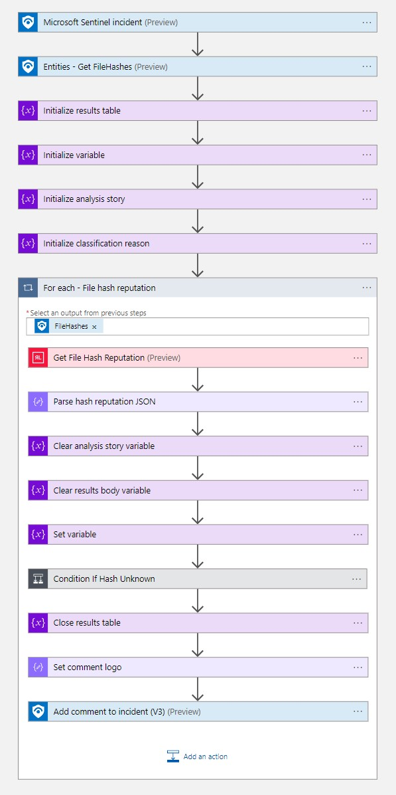

# ReversingLabs-EnrichFileHash

Author: Aaron Hoffmann (ReversingLabs)

This playbook enriches file hash entities with information from the ReversingLabs TitaniumCloud API.

## Prerequisites

You'll need the following:
* A ReversingLabs TitaniumCloud subscription
* A ReversingLabs TitaniumCloud username
* A ReversingLabs TitaniumCloud password

## Post-deployment

After deploying the template, you'll want to update the playbook connections with your TitaniumCloud API username and password.

## Screenshots

