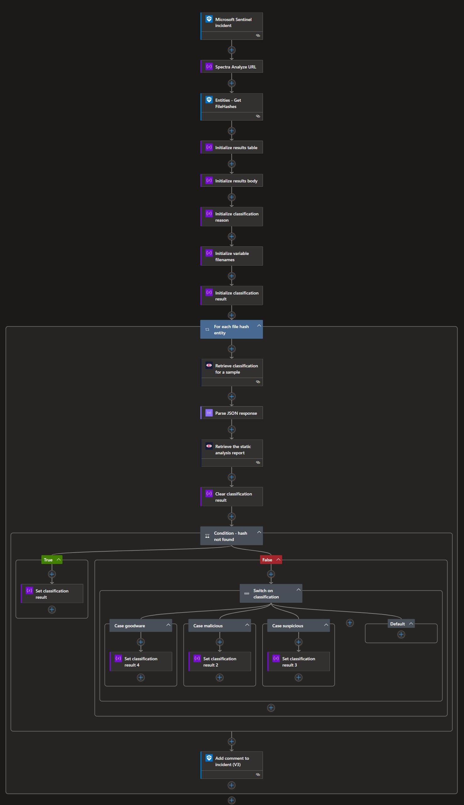

# SpectraAnalyze-EnrichFileHash

Author: Aaron Hoffmann (ReversingLabs)

This playbook enriches file hash entities with information from a ReversingLabs Spectra Analyze (formerly A1000) appliance.

## Prerequisites

You'll need the following:
* A ReversingLabs Spectra Analyze Appliance URL
* A Spectra Analyze API Token

## Post-deployment

After deploying the template, you'll want to update the playbook connections with your Spectra Analyze API token.

## Screenshots

## References

- [ReversingLabs content pack installation guide](https://reversinglabs-marketplace.azureedge.net/help/ReversingLabsSentinelContentHubInstall.pdf)
- [Video - How to install and configure the ReversingLabs content pack](https://www.youtube.com/watch?v=gLjMDz618O0)