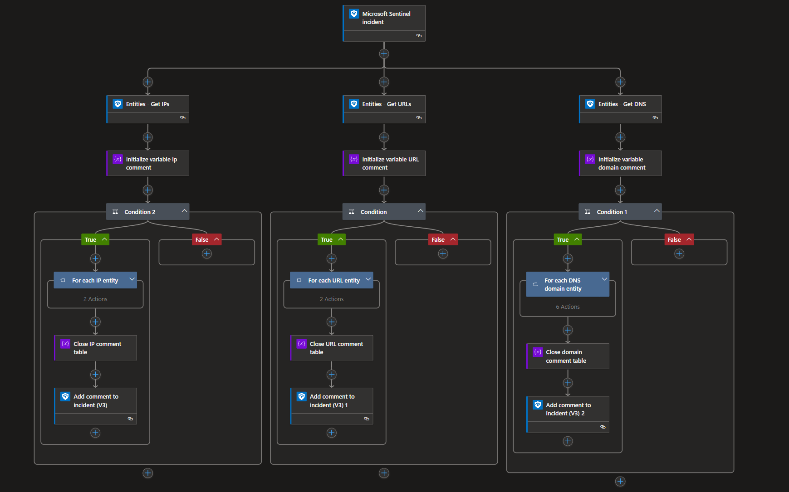

# SpectraAnalyze-EnrichNetworkEntities

Author: Aaron Hoffmann (ReversingLabs)

## Summary
This playbook enriches network entities (IP addresses, URLs, and domains) with information from a ReversingLabs Spectra Analyze (formerly A1000) appliance.

## Prerequisites

You'll need the following:
* A ReversingLabs Spectra Analyze host URL
* A ReversingLabs Spectra Analyze API token

## Deployment instructions
1. Deploy the playbook by clicking on "Deploy to Azure" button. This will take you to deploying an ARM Template wizard.

## Post-deployment

After deploying the template, you'll want to update the playbook connections with your Spectra Analyze API token.

## Screenshots

## References

- [ReversingLabs content pack installation guide](https://reversinglabs-marketplace.azureedge.net/help/ReversingLabsSentinelContentHubInstall.pdf)
- [Video - How to install and configure the ReversingLabs content pack](https://www.youtube.com/watch?v=gLjMDz618O0)