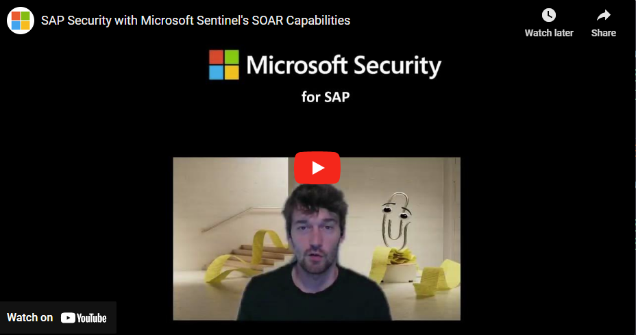

# SAP automation scenarios

This repos contains SAP automation scenarios using Logic Apps (Standard). These playbooks allow [enterprise features](https://learn.microsoft.com/azure/logic-apps/single-tenant-overview-compare#resource-types-and-environments) such as private VNet injection, tenant isolation and more.

For scenarios using Logic Apps (Consumption) use the Microsoft Sentinel UI experience.

Find out more from our blog series [here](https://blogs.sap.com/2023/05/22/from-zero-to-hero-security-coverage-with-microsoft-sentinel-for-your-critical-sap-security-signals-blog-series/).

## Pre-Configured SAP Playbooks

| Playbook | Description |
| --- | --- |
| [Lock SAP User from Teams - Basic](./Basic-SAPLockUser-STD/) | Basic playbook with minimum integration effort for simple SAP user blocking on ERP via SOAP service |
| [Remediate SAP Sentinel Collector Agent attack](./SAPCollectorRemediate-STD/) | Sophisticated scenario distinguishing between SAP maintenance events and malicious deactivation of the audit log ingestion into Sentinel using [Azure Center for SAP Solutions (ACSS)](https://learn.microsoft.com/azure/sap/center-sap-solutions/overview) health APIs |

> **Note**
> Find the convenient "Deploy to Azure button" on the individual scenarios page from above table.

## Step-by-Step Installation

Find the the installation guide [here](./INSTALLATION.md).

## CI/CD

[DevOps deployment for single-tenant Azure Logic Apps](https://learn.microsoft.com/azure/logic-apps/devops-deployment-single-tenant-azure-logic-apps)

[Deploying Logic App Standard resource using Bicep templates and DevOps pipeline](https://techcommunity.microsoft.com/t5/integrations-on-azure-blog/deploying-logic-app-standard-resource-using-bicep-templates-and/ba-p/3760070)

## Troubleshooting hints

- Navigate to the code view and try to save from there to circumvent any UI glitches on the Designer
- Reduce complexity of your workflow and reduce the problem surface while investigating errors
- For better isolation and overall maintainability split your workflow into multiple

## What's next?

Further simplification of the onboarding process with more templating and scripting.

## Additional resources

[Export Logic Apps (Consumption) to Logic Apps (Standard)](https://learn.microsoft.com/azure/logic-apps/export-from-consumption-to-standard-logic-app)

## Contributing 👩🏼‍🤝‍👨🏽

This project welcomes contributions and suggestions. Please use GitHub Issues to report errors or request new features.
