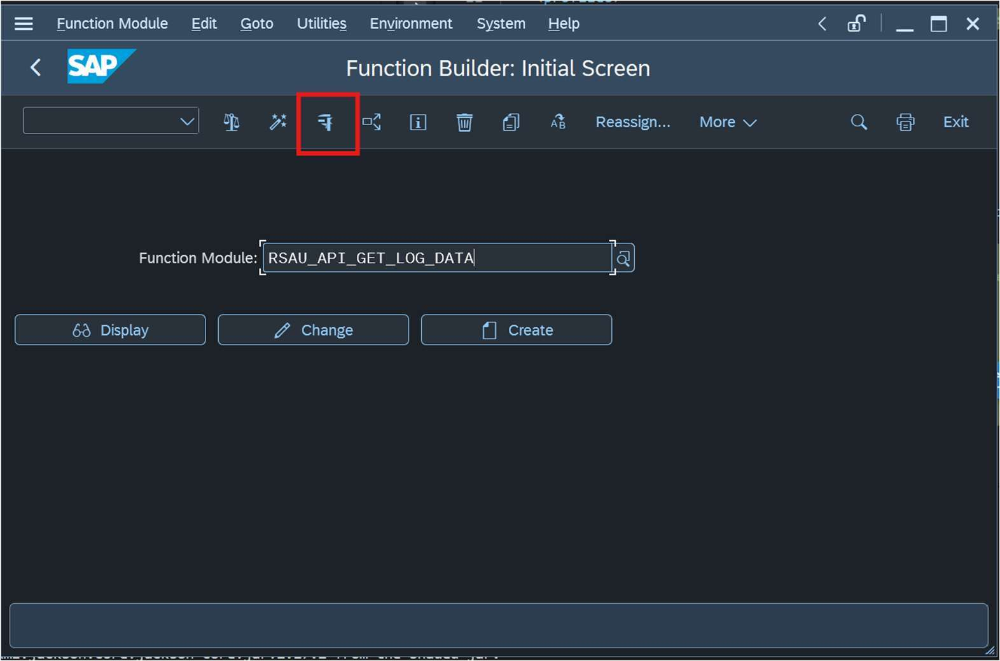
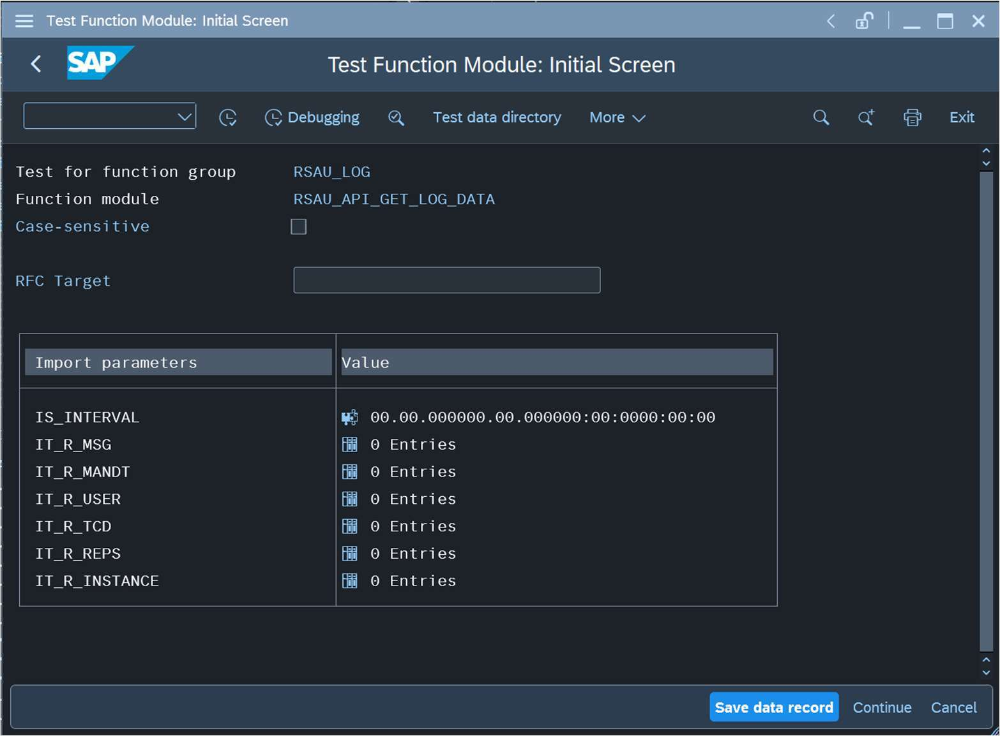
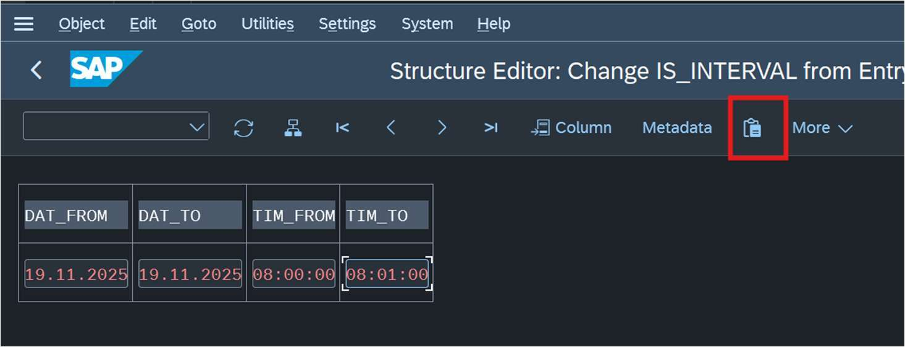
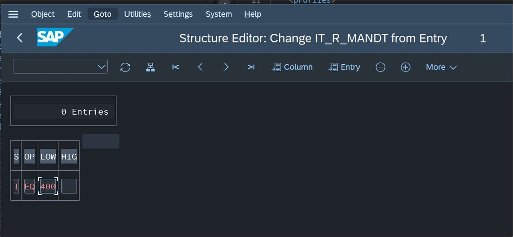
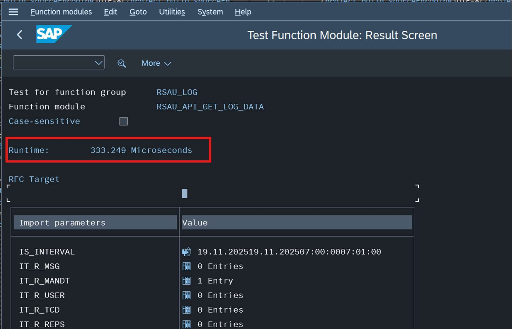
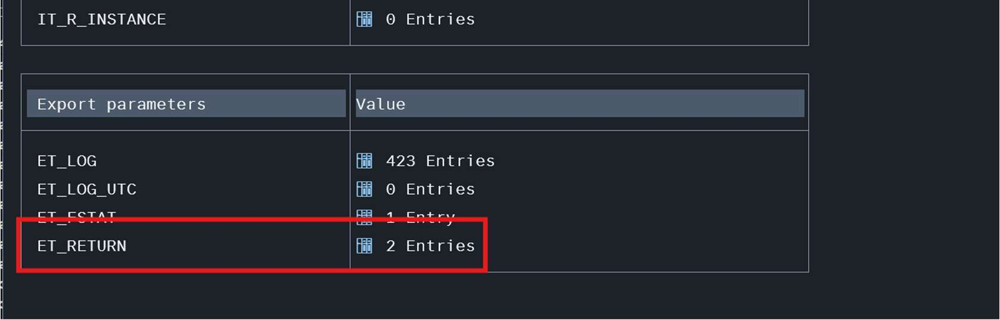

# SAP Security Audit Log Smoke Test — Simulate RFC Call via SAP GUI

This guide describes a quick, manual smoke test you can run **directly on the SAP backend** to confirm that the Security Audit Log RFC used by the agentless SAP data connector is working correctly — before raising a support ticket with Microsoft and/or SAP.

## Purpose

The agentless SAP connector (SAP Integration Suite / SAPCC connector) reads Security Audit Log data from the SAP backend via the `RSAU_API_GET_LOG_DATA` **remote-enabled** function module (RFC). If audit log data (`ABAPAuditLog`) is missing or delayed in Microsoft Sentinel, the fastest way to isolate whether the issue is on the SAP side or the connector side is to call this function module manually using SAP GUI transaction code `SE37`. If the manual call also returns no data (or errors), the issue is on the SAP side (e.g., Security Audit Log not active, no events in the time window, authorization issue, bugs in support package of the SAP Basis release) and should be investigated with SAP first. If the manual call succeeds and returns records, but data still doesn't appear in Sentinel, the issue is more likely in the connector/pipeline.

## Prerequisites

- SAP GUI access to the relevant SAP system with an account that has developer/admin authorization to run `SE37` and test function modules.
- Knowledge of the SAP client (mandant) number used by the connector.

## Steps

### 1. Open the function module in SE37

On SAPGUI, run transaction `SE37` and enter `RSAU_API_GET_LOG_DATA` as the
function module. Click **Execute** (the Test/Execute icon highlighted below).

This opens the **Test Function Module: Initial Screen**, listing the import parameters
(`IS_INTERVAL`, `IT_R_MSG`, `IT_R_MANDT`, `IT_R_USER`, `IT_R_TCD`, `IT_R_REPS`,
`IT_R_INSTANCE`):

### 2. Set the time window (IS_INTERVAL)

Click on the value of `IS_INTERVAL` to edit the time window of the audit log query.
Enter a narrow window to mimic the connectors behavior and avoid too large data set selections (e.g., 1 minute) in the `DAT_FROM` / `DAT_TO` / `TIM_FROM` /
`TIM_TO` fields, then click the **Insert Date** (copy) button to confirm the entry.

> [!NOTE]
> The required date format on the input field may vary based on your language settings.

### 3. Filter by SAP client (IT_R_MANDT)

Back on the function module screen, edit the value of `IT_R_MANDT` to filter by your SAP
client: `S = I`, `OP = EQ`, `LOW = <your client>` (e.g., `001`). Click the exit/back
button to save the entry.

### 4. Execute and review results

Click **Execute** to run the audit log query. Record the **runtime** and the **number of
records returned** (`ET_LOG` entry count) — these confirm whether the SAP backend can
generate and return audit log data for the requested window.

> [!IMPORTANT]
> A runtime of more than 3 minutes for a single minute time window indicate performance issues on the SAP backend. Consult the [performance guide](https://learn.microsoft.com/azure/sentinel/sap/sap-deploy-troubleshoot#long-message-processing-times-or-message-volume-anomalies-on-sap-cloud-integration) for troubleshooting steps. Consult SAP's notes for optimized audit log retrieval.
> - 3726943 - RSAU_API_GET_LOG_DATA | Dataselection only from Filesystem details
> - 3407647 - RSAU_READ_LOG | Optimization of reading audit log files

## Before opening a support ticket

Use the results of this smoke test as evidence when engaging support:

- [ ] Security Audit Log is active and required message classes are being recorded on the SAP system for the tested time window (confirm via `RSAU_CONFIG` / `SM19` if `ET_LOG` returns 0 entries).
- [ ] `IT_R_MANDT` client filter matches the client configured in the connector/destination.
- [ ] Note the runtime and record count (`ET_LOG` entries) returned by the RFC call.
- [ ] Check `ET_RETURN` for any warning/error messages from the function module.
- [ ] If records **are** returned here but do **not** appear in Sentinel's `ABAPAuditLog` table for the same time window, the issue is likely in the connector/pipeline
- [ ] If records are **not** returned here (and Security Audit Log is confirmed active), the issue is on the SAP backend side — investigate with your **SAP** Basis/Security team first. Start with SAP notes listed on the [prerequisites page on Microsoft Learn](https://learn.microsoft.com/azure/sentinel/sap/prerequisites-for-deploying-sap-continuous-threat-monitoring#sap-prerequisites-for-the-agentless-data-connector).

## Related

- [IntegrationSuite README](README.md) — connector onboarding scripts and architecture.
