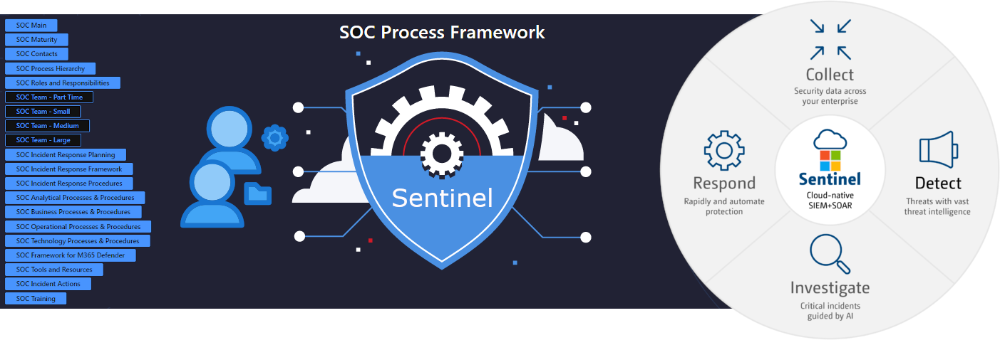

# SOC Process Framework Solution for Microsoft Sentinel
## Author: Rin Ure

 

## Table of Contents

1. [Overview](#overview)
1. [Workbooks](#workbooks)
1. [Watchlists](#watchlists)
1. [Playbooks](#playbooks)
1. [Post Deployment Steps](#postdeployment)

<a name="overview">

## Overview
This Solution contains all resources for the SOC Process Framework Microsoft Sentinel Solution.
The SOC Process Framework Solution is built in order to easily integrate with Microsoft Sentinel and build a standard SOC Process and Procedure Framework within your Organization.

By deploying this solution, you'll be able to monitor progress within your SOC Operations and update the SOC CMMI Assessment Score.
This solution consists of the following resources:
- Integrated workbooks interconnected into a single workbook for single pane of glass operation.
- One Playbook for pushing SOC Actions to your Incidents.
- Multiple Watchlists helping you maintain and organize your SOC efforts, including IR Planning, SOC CMMI Assessment Score, and many more.

<a name="workbooks">

## Workbooks
The workbooks contained in this solution have visualizations about the SOC Progress, Procedures, and Activity and provides an overview of the overall SOC Maturity.
These workbooks and their dependances are deployed for you through this solution.

<a name="watchlists">

## Watchlists
The watchlists contained within this solution have information that pertain to Incident Response Planning, the SOC Maturity (CMMI) Scoring, Recommended SOC Actions, and more...
All of these watchlists give the customer ease of access to updating pertanant information regarding their SOC Operations and more.

<a name="playbooks">

## Playbooks
Currently the only Playbook in this solution is the Get-SOCActions Playbook for delivering custom Analyst Actions to take per Incident. This allows Organizations the ability to create/add their own scripted actions they want an Analyst to take. After deploying this Solution, please see the Post-Deployment Instructions before running the Playbook.

<a name="postdeployment">

### Post-Deployment Instructions
After deploying this Solution and its associated playbook, you must authorize the connections leveraged within the Playbook before running.

1. Visit the playbook resource.
2. Under "Development Tools" (located on the left), click "API Connections".
3. Ensure each connection has been authorized.

**Note: If you've deployed the [SOC Process Framework Playbook](https://raw.githubusercontent.com/Azure/Azure-Sentinel/master/Solutions/SOC Process Framework/Playbooks/Get-SOCActions/azuredeploy.json) playbook, you will only need to authorize the Microsoft Sentinel connection.**