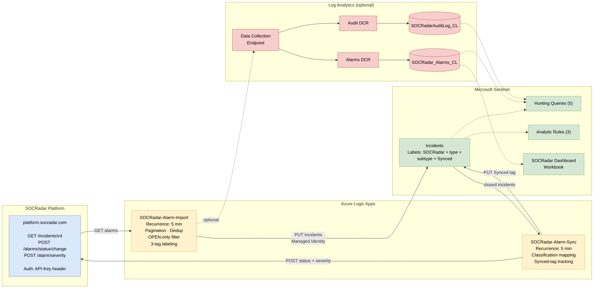

# SOCRadar Intelligence for Microsoft Sentinel

## Overview

The SOCRadar solution for Microsoft Sentinel provides bidirectional integration between SOCRadar XTI Platform and Microsoft Sentinel. Import SOCRadar alarms as Microsoft Sentinel incidents and sync closed incidents back to SOCRadar with classification mapping.

## Architecture

## Key Features

**Alarm Import**
- Automatically imports SOCRadar alarms as Microsoft Sentinel incidents
- Paginated fetching with duplicate prevention
- Severity and status mapping
- Tags for categorization (SOCRadar, alarm type, sub type)
- Optional closed alarm import with classification

**Bidirectional Sync**
- Closed incidents in Microsoft Sentinel update alarm status in SOCRadar
- Classification mapping: TruePositive to Resolved, FalsePositive to False Positive, BenignPositive to Mitigated

**Analytics**
- SOCRadar Dashboard workbook with severity, status, and timeline charts
- 5 hunting queries for alarm analysis and correlation
- Optional audit logging for operational monitoring

## Prerequisites

- Microsoft Sentinel workspace
- SOCRadar XTI Platform API Key ([socradar.io](https://socradar.io))
- SOCRadar Company ID

## Installation

Install the SOCRadar solution from the Microsoft Sentinel **Content Hub**.

1. In Microsoft Sentinel, go to **Content Hub**
2. Search for **SOCRadar**
3. Select the solution and click **Install**
4. Configure the required parameters (API Key, Company ID, Workspace Name)

## Playbooks

| Playbook | Description |
|----------|-------------|
| [SOCRadar-Alarm-Import](Playbooks/SOCRadar-Alarm-Import) | Imports SOCRadar alarms as Microsoft Sentinel incidents |
| [SOCRadar-Alarm-Sync](Playbooks/SOCRadar-Alarm-Sync) | Syncs closed Microsoft Sentinel incidents back to SOCRadar |

Both playbooks use Managed Identity for authentication. Logic Apps start 3 minutes after deployment to allow Azure role propagation.

## About SOCRadar

SOCRadar is an Extended Threat Intelligence (XTI) platform that provides actionable threat intelligence, digital risk protection, and external attack surface management.

Learn more at [socradar.io](https://socradar.io)

## Support

- **Public Documentation:** [Microsoft Sentinel Integration — One-Click Deployment Guide](https://github.com/Radargoger/azure-one-click-documentations/blob/main/azureincidents.md)
- **Detailed Documentation (SOCRadar customers):** [Microsoft Azure Sentinel Integration (Bi-Directional)](https://help.socradar.io/hc/en-us/articles/41316851769745-Microsoft-Azure-Sentinel-Integration-Bi-Directional)
- **Support:** integration@socradar.io
