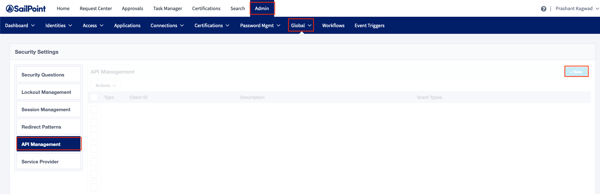
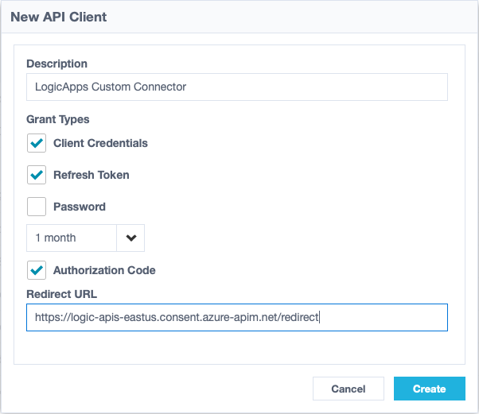
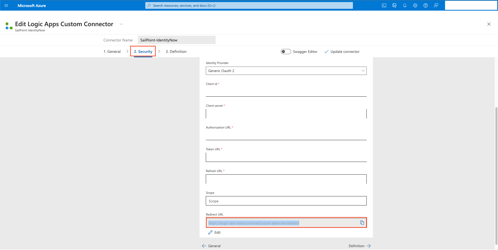
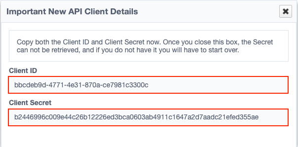

# SailPoint IdentityNow Logic Apps Custom Connector

 

## Table of Contents

1. [Overview](#overview)
2. [Prerequisites](#prerequisites)
3. [Deployment](#deployment)

# Overview
Digital transformation has opened up opportunities for greater agility and growth in today’s modern enterprises. But it’s also introducing challenges. Digital transformation has introduced an explosion of cloud, applications, data, and users to manage. Being able to effectively control ‘who can have access to what’ is the key and if not done properly can lead to potential risk to your business.

To address this potential risk, organizations are embracing the power and ease of SailPoint Identity Security. This innovative identity platform takes the complexity out of identity; making it intuitive for IT staff to configure and manage and enabling business users with the access they need to get their work done.

The SailPoint IdentityNow custom connector enables Microsoft Sentinel customers to utilize the deep, enriched contextual data and governance capabilities of the SailPoint Identity Security to better drive identity-aware security practices.

# Prerequisites

### Authentication
The SailPoint IdentityNow custom connector supports **OAuth 2.0 Authentication**. In order to authenticate using OAuth you would need Client Id & Secret from IdentityNow.
Use the following steps to generate **Client Id** & **Client Secret** from your IdentityNow tenant (you would need an admin access to perform the following steps).

1. Login into you IdentityNow tenant. Navigate to **Admin** > **Global** > **API Management**. Once here, click on **+New** button at the top right corner of the page to create a new client.
 

 

2. Add a description that can be used to later identify the client. Check the following:
**Client Credentials, Refresh Token & Authorization Code**
 

 

3. You can choose how long the **Refresh Token** can last & add a **Redirect URL**.
Example for **Redirect URL** : https://logic-apis-eastus.consent.azure-apim.net/redirect which is available on the **Security** page of the custom connector configuratino on the Azure portal.
 

 

4. Once you have completed the above steps click **Create**. This will generate the **Client Id** & **Client Secret** required for the connector to fetch the OAuth Token. Please note once you close the dialog box, the **Client Secret** cannot be retrived. You will have to create a new client.
 

 

# Deployment instructions
Custom connector should be deployed in the Resource Group where all the resources utilizing the connector functionality are located.
 

### Connector Details
1. Deploy the Custom Connector by clicking on "Deploy to Azure" button. This will take you to deplyoing an ARM Template wizard.
2. Fill in the required paramteres:
    * IdentityNow Connector Name: Please enter the custom connector (ex : SailPoint IdentityNow Connector)
    * IdentityNow Service Url: SailPoint IdentityNow Base URL (ex : https://{tenant-id}.api.identitynow.com). Just the tenant-id.

