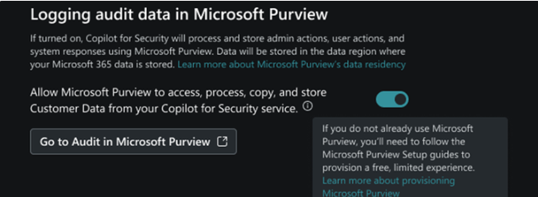
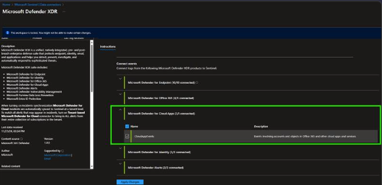

# SecurityCopilot Audit Events (Preview)

## Overview

This solution helps users gain deeper insights into their Security Copilot usage and take proactive measures to mitigate risks by streaming Security Copilot admin and user activity events into Microsoft Sentinel. It also provides proactive insights through Microsoft Sentinel workbooks and leverages Microsoft Sentinel detection rules to notify you about security and operational events.

# Prerequisites  
### Enable the audit log capability in Security Copilot  
During the first run experience, a Security Administrator is given the option of opting into allowing Microsoft Purview to access, process, copy and store admin actions, user actions, and Copilot responses. For more information, see Get started with Security Copilot.  

Security Administrators can also access this option through the Owner settings page.  

Use the following steps to update the audit log settings:  

1. Sign in to Microsoft Security Copilot (https://securitycopilot.microsoft.com).  
2. Select the home menu icon.  
3. Navigate to the Owner settings > Logging audit data in Microsoft Purview.  
  

### Enable Microsoft Defender for Cloud Apps logs via Microsoft Defender XDR Data connector  
To integrate with Microsoft Defender XDR make sure you have:  
1. Sentinel Log Analytics Workspace: read and write permissions.  
2. Connector Access Control: the user applying changes to the connector must be a member of the Microsoft Entra ID associated with the tenant that the workspace belongs to.  
3. Tenant Permissions: 'Global Administrator' or 'Security Administrator' on the workspace's tenant.  
4. License: M365 E5, M365 A5 or any other Microsoft Defender XDR eligible license.  

   

## Automated Installation

Installing the 1Password Solution for Microsoft Sentinel is easy and can be completed in only a few minutes. 
Just click the button below to get started with the deployment wizard.  

## Manual Installation using the ARM template

Deployment steps

 

## Manual Installation using the ARM template

1. Install the data connector using the ARM template or use this link to skip the steps below