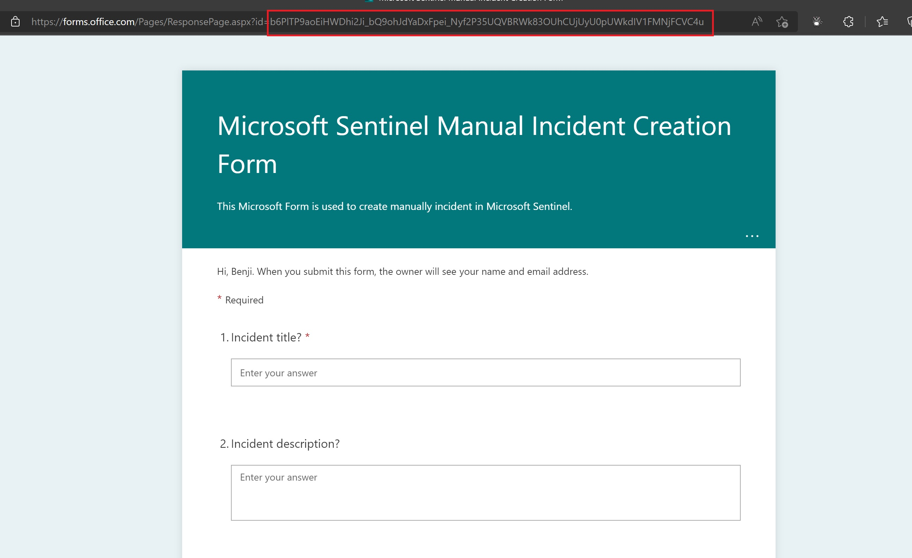
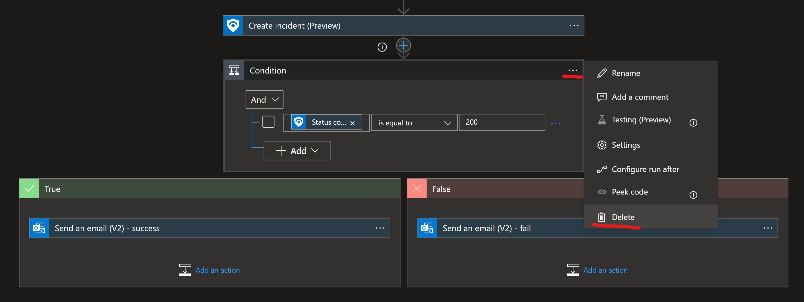
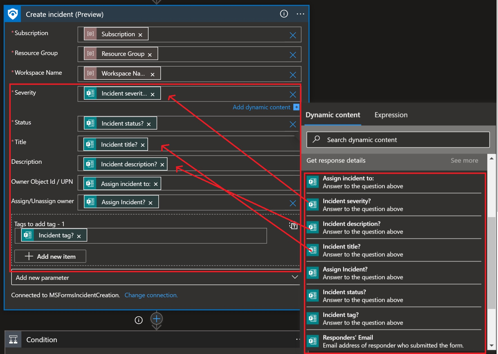
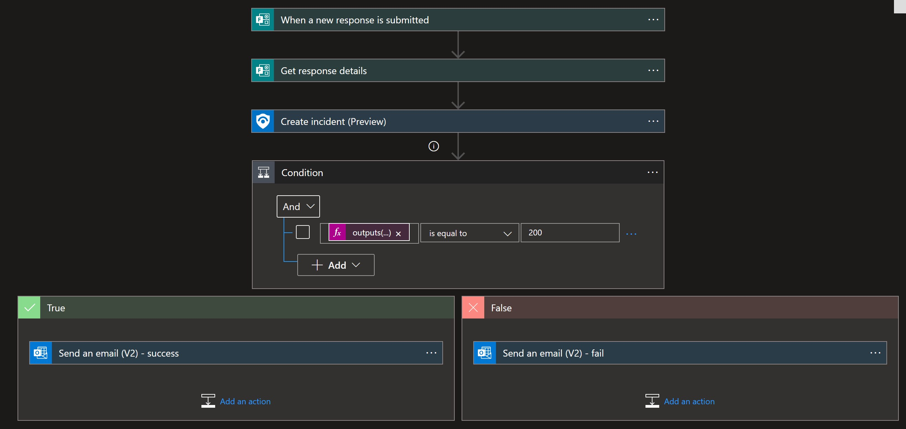
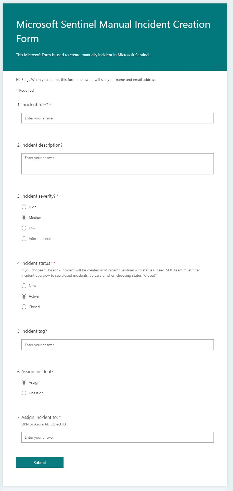
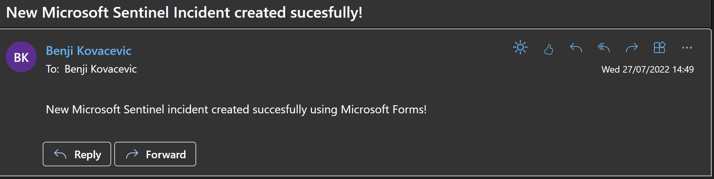
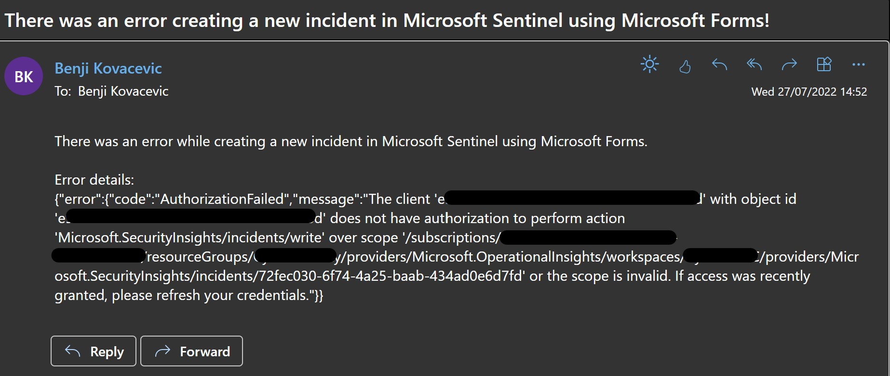

# CreateIncident-MicrosoftForms
author: Benjamin Kovacevic

This playbook will create a new Microsoft Incident when Microsoft Forms response is submitted. 

# Prerequisites
1. Create Microsoft Forms from template - https://forms.office.com/Pages/ShareFormPage.aspx?id=b6PlTP9aoEiHWDhi2Ji_bQ9ohJdYaDxFpei_Nyf2P35UQVBRWk83OUhCUjUyU0pUWkdIV1FMNjFCVC4u&sharetoken=7MfhwUMCnEB9pBTvSX7w
2. After the template deployment, save Microsoft Forms ID as it will be needed to deploy the playbook. It is possible to choose Form ID after the playbook is deployed as well using Logic App Designer. 

3. Configure who can fill the template - the suggestion is either specific people from the organization or the whole organization - https://support.microsoft.com/en-us/topic/choose-who-can-fill-out-a-form-or-quiz-c90c641e-6f88-45c5-9cb9-aca2b4083949
4. Prepare Subscription ID, Resource Group name, and Log Analytics Workspace name as it is needed for template deployment.

# Quick Deployment

  

# Post-deployment
1. Assign Microsoft Sentinel Responder role to the managed identity. To do so, choose Identity blade under Settings of the Logic App.
2. If Microsoft Forms ID wasn't entered while deploying, open Logic App Designer and choose Microsoft Forms from the drop-down menu
3. If notification about successful or unsuccessful incident creation is not needed, please delete the "Condition" step 
 
4. Authorize Microsoft Forms, Office 365 Outlook connector, and Conversion Service connector (HTML to text). Note: If in step 3, email notification is deleted, there will be no Office 365 Outlook connector.

# Note for Microsoft Forms changes
If there are made any changes to the Microsoft Forms template (questions changed or translated to the local language), there is a need to adjust the playbooks template by mapping correct values in Logic App Designer: 
  

When editing, important information is that certain fields accept only certain values: 
1. Severity - Informational/Low/Medium/High
2. Status - New/Active/Closed
3. Owner Object Id / UPN - only Azure AD object ID or user's UPN
4. Assign/Unassign Owner - Assign/Unassign

# Screenshots

**Playbook**  
 

**Microsoft Forms template** 
 

**Microsoft Sentinel Incident** 
 

**Email notification** 
  
 
