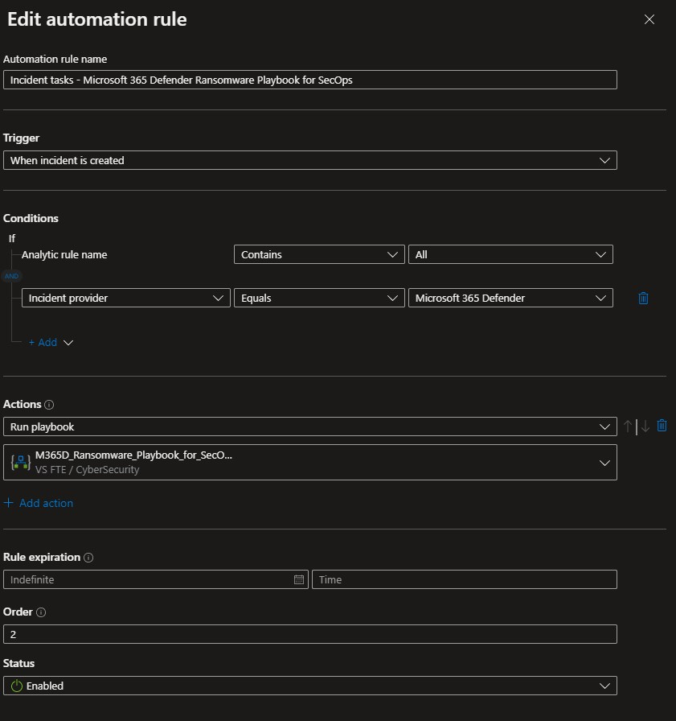
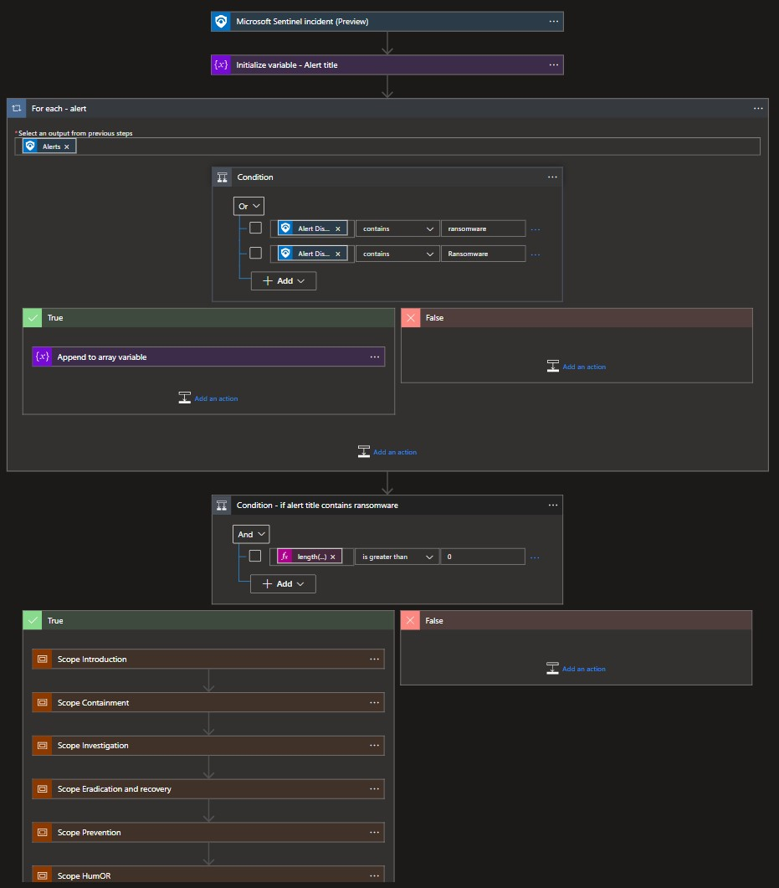
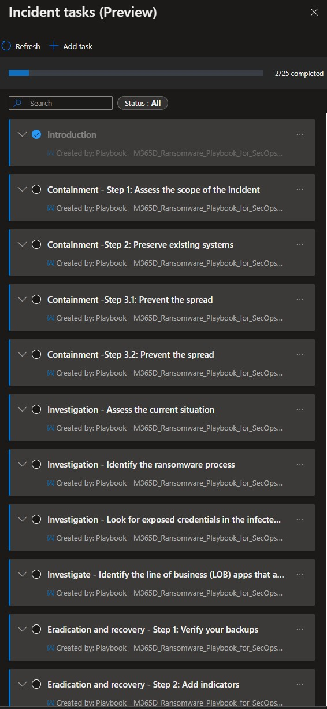

# Defender_XDR_Ransomware_Playbook_for_SecOps-Tasks
author: Benji Kovacevic

This playbook add Incident Tasks based on Microsoft Defender XDR Ransomware Playbook for SecOps. This playbook will walk the analyst through four stages of responding to a ransomware incident: containment, investigation, eradication and recovery, and prevention. The step-by-step instructions will help you take the required remedial action to protect information and minimize further risks.

# Quick Deployment

  

# Post-deployment
1. Assign Microsoft Sentinel Responder role to the managed identity. To do so, choose Identity blade under Settings of the Logic App.
2. Assign playbook to the automation rule. - https://learn.microsoft.com/azure/sentinel/tutorial-respond-threats-playbook?tabs=LAC 
Conditions 
    Incident provider > Equals > Microsoft Defender XDR 
      
    
## Playbook will run if the alert has any of these keywords: 
    1. Ransomware
    2. ransomware

# Screenshots

**Playbook**  
 

**Microsoft Sentinel Incident Tasks** 

