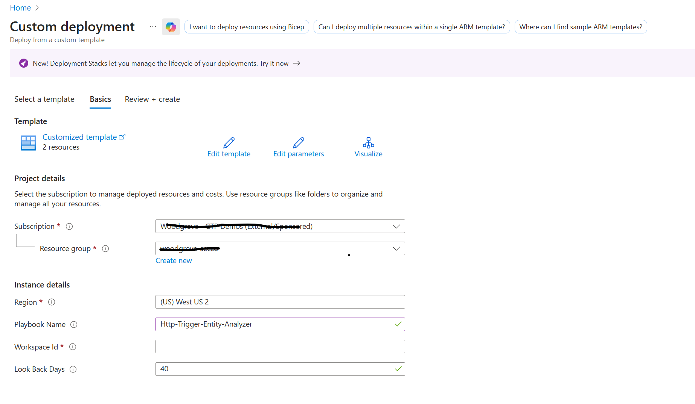
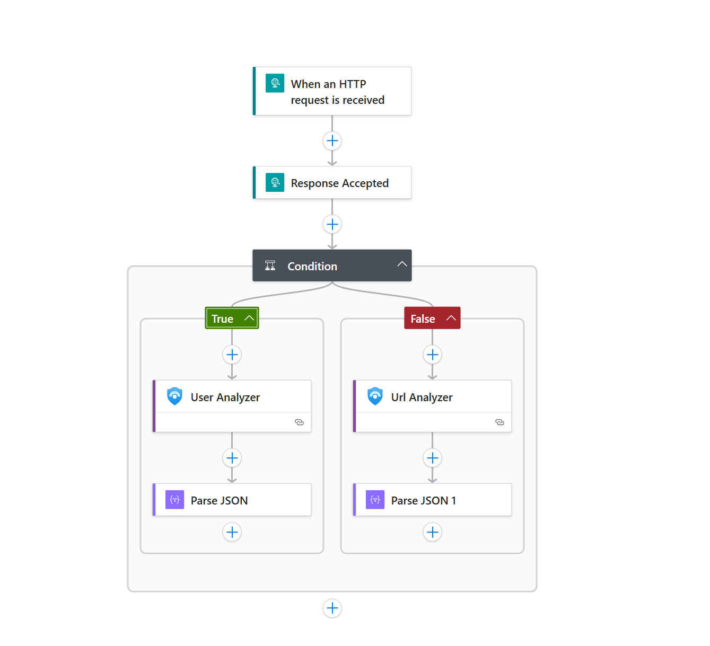

# Entity Analyzer - HTTP Trigger Playbook

Activating the 'Deploy' button initiates the deployment of an Azure Logic App integrated with Microsoft Sentinel MCP Actions, utilizing an HTTP request trigger.
The Logic App is configured to run when an HTTP POST request is received with entity information. This Logic App automatically analyzes URL and User entities and provides detailed security insights including classification, analysis results, and recommendations for each entity type.

The playbook automatically triggers when:
- An HTTP POST request is received with entity information
- External systems need to analyze URLs or User accounts
- Integration with custom applications or workflows is required
- On-demand entity analysis is needed via API calls

After the analysis is complete, the MCP Entity Analyzer conducts a comprehensive investigation of the entity and returns results asynchronously:
- **Initial Response (202 Accepted)**: Immediate acknowledgment with runId for tracking
- **Background Processing**: Analysis continues without timeout constraints
- **URL Analysis**: Security classification, threat intelligence, and URL reputation analysis
- **User Analysis**: Behavioral analysis, risk assessment, and user activity patterns
- **Classification**: Security classification for each entity
- **Analysis Results**: Detailed security analysis findings
- **Recommendations**: Security recommendations based on the analysis
- **Disclaimer**: AI-generated analysis disclaimer

### Prerequisites

Prior to beginning the installation process, it's crucial to confirm that you have met the following prerequisites:
- The user deploying this Logic App needs to have a **Contributor Role**
- The user has permissions to access **Microsoft Sentinel** workspace
- **Microsoft Sentinel data connector lake must be enabled** in your workspace for entity data collection
- The **SentinelMCP connector** is available in your environment
- You need to provide a valid **Sentinel workspace ID** during deployment
- Authentication support for the Entity Analyzer connection includes:
  - **Entra ID Authentication** (OAuth)
  - **Service Principal** (Application ID and Secret)
  - **Managed Identity** (System-assigned or User-assigned)

### Deployment Files

This playbook includes two deployment files:

#### 1. azuredeploy.json
The main ARM template file that defines the Azure resources to be deployed:
- **Logic App Workflow**: The main playbook with HTTP trigger and conditional logic
- **API Connection**: SentinelMCP connection for Microsoft Sentinel MCP integration
- **Workflow Definition**: Complete Logic App structure with triggers, actions, and conditions

#### 2. azuredeploy.parameters.json
The parameters file that contains the configuration values for deployment. This file should be customized before deployment:

**Parameters explained:**
- **PlaybookName**: 
  - **Description**: The name that will be assigned to your Logic App in Azure
  - **Default Value**: "Http-Trigger-Entity-Analyzer"
  - **Type**: String
  - **Usage**: This name will appear in your Azure Portal and be used to identify the Logic App
  
- **workspaceId**: 
  - **Description**: Your Microsoft Sentinel workspace ID (Log Analytics Workspace ID)
  - **Default Value**: `<Your-Sentinel-Workspace-ID>` (must be replaced)
  - **Type**: String
  - **Required**: Yes
  - **Usage**: Used to query Sentinel data for entity analysis
  - **How to find**: Azure Portal → Microsoft Sentinel → Settings → Workspace settings → Copy the Workspace ID
  
- **lookBackDays**: 
  - **Description**: The number of days to look back when analyzing entity data
  - **Default Value**: 40
  - **Type**: Integer
  - **Usage**: Determines the time range for historical data analysis (e.g., user sign-in logs, URL access patterns)
  - **Recommendation**: 30-90 days for comprehensive analysis, adjust based on your data retention policy

### Parameters

During deployment, you'll need to provide:
- **PlaybookName**: Name for the Logic App (default: "Http-Trigger-Entity-Analyzer")
- **workspaceId**: Your Azure Sentinel workspace ID (required)
- **lookBackDays**: Number of days to look back for entity analysis (default: 40 days)

### Deployment 

**Option 1: Deploy via Azure Portal (Recommended)**

To deploy the Entity Analyzer HTTP Trigger Logic App using the Deploy to Azure button:
1. Press on the Deploy button below
2. Select your subscription and resource group (use the same tenant where Microsoft Sentinel is configured)
3. Provide your Sentinel workspace ID
4. Configure the lookBackDays parameter if needed (default is 40 days)


[](https://portal.azure.com/#create/Microsoft.Template/uri/https%3A%2F%2Fraw.githubusercontent.com%2FAzure%2FAzure-Sentinel%2Fmaster%2FSolutions%2FSentinelSOARessentials%2FPlaybooks%2FHttp-Trigger-Entity-Analyzer%2Fazuredeploy.json)
[](https://portal.azure.us/#create/Microsoft.Template/uri/https%3A%2F%2Fraw.githubusercontent.com%2FAzure%2FAzure-Sentinel%2Fmaster%2FSolutions%2FSentinelSOARessentials%2FPlaybooks%2FHttp-Trigger-Entity-Analyzer%2Fazuredeploy.json)



**Option 2: Deploy via PowerShell**

1. Update the `azuredeploy.parameters.json` file with your values:
   - Replace `<Your-Sentinel-Workspace-ID>` with your actual Workspace ID
   - Adjust `PlaybookName` if you want a different name
   - Modify `lookBackDays` if needed

2. Run the following PowerShell commands:

```powershell
# Connect to Azure
Connect-AzAccount

# Set your variables
$resourceGroupName = "your-resource-group-name"
$location = "westus2"  # or your preferred location

# Deploy the template
New-AzResourceGroupDeployment `
    -ResourceGroupName $resourceGroupName `
    -TemplateFile ".\azuredeploy.json" `
    -TemplateParameterFile ".\azuredeploy.parameters.json" `
    -Verbose
```

**Option 3: Deploy via Azure CLI**

1. Update the `azuredeploy.parameters.json` file with your values

2. Run the following commands:

```bash
# Login to Azure
az login

# Deploy the template
az deployment group create \
    --resource-group your-resource-group-name \
    --template-file azuredeploy.json \
    --parameters azuredeploy.parameters.json
```

### Post Deployment

After successful deployment:
- The Logic App will be automatically enabled and ready to use
- **Authenticate the connections**: Go to the Logic App → API connections and authenticate:
  - **SentinelMCP connection**: Authenticate with Microsoft Sentinel MCP permissions
  - **Entity Analyzer connection**: Choose one of the supported authentication methods:
    - **Entra ID Auth**: Sign in with your Entra ID credentials
    - **Service Principal**: Provide Application (Client) ID and Secret
    - **Managed Identity**: Configure system-assigned or user-assigned managed identity
- **Get the HTTP endpoint URL**: 
  1. Open the Logic App in Azure Portal
  2. Go to "Logic app designer"
  3. Click on the HTTP trigger
  4. Copy the "HTTP POST URL" - this is your API endpoint
- The playbook will trigger when POST requests are sent to the HTTP endpoint
- **View the endpoint in deployment output**: The Logic App callback URL is available in the deployment outputs

### How It Works



1. **Trigger**: The Logic App triggers when an HTTP POST request is received
2. **Immediate Response**: Returns a 202 Accepted response with a runId for tracking
3. **Asynchronous Processing**: 
   - Analysis continues in the background without timeout constraints
   - **Condition**: Checks the entity type from the request
   - **User Analysis** (True branch): If Type is "User", analyzes user behavior and risk
   - **URL Analysis** (False branch): If Type is not "User", analyzes URL security and reputation
4. **Result Retrieval**: Check results via Azure Portal run history using the runId

### API Request Format

Send a POST request to your Logic App endpoint with the following JSON body:

**For User Analysis:**
```json
{
  "Type": "User",
  "Value": "Your User Object Id"
}
```

**For URL Analysis:**
```json
{
  "Type": "Url",
  "Value": "https://example.com"
}
```

### API Response

**Immediate Response (202 Accepted):**
```json
{
  "status": "Accepted",
  "message": "Entity analysis started. Processing in background.",
  "runId": "08584416635090057123230409437CU07",
  "entityType": "User",
  "entityValue": "59d9ec06-a7e9-49fa-aba4-f94adee23cab"
}
```

**Response Headers:**
- `Status Code`: 202 Accepted
- `Retry-After`: 10 seconds

### Retrieving Results

To view the analysis results after receiving the 202 response:

**Option 1: Azure Portal (Recommended)**
1. Go to your Logic App in Azure Portal
2. Click **"Run history"** in the left menu
3. Find the run using the `runId` from the response
4. View the action outputs to see the full analysis results

**Option 2: Azure Management API**
```powershell
az rest --method get --url "https://management.azure.com/subscriptions/{subscriptionId}/resourceGroups/{resourceGroupName}/providers/Microsoft.Logic/workflows/{workflowName}/runs/{runId}?api-version=2016-06-01"
```

### Sample Analysis Output

**URL Analysis:**
```json
{
  "id": "analysis-id",
  "status": "Completed",
  "classification": "Malicious",
  "analysis": "The URL exhibits characteristics of a phishing site...",
  "recommendation": "Block this URL and investigate affected users...",
  "disclaimer": "This is an AI-generated analysis...",
  "dataSourceList": ["Threat Intelligence", "URL Reputation"],
  "properties": {
    "entityType": "Url"
  }
}
```

**User Analysis:**
```json
{
  "id": "analysis-id",
  "status": "Completed",
  "classification": "High Risk",
  "analysis": "User shows abnormal login patterns...",
  "recommendation": "Investigate recent user activities and consider MFA enforcement...",
  "disclaimer": "This is an AI-generated analysis...",
  "dataSourceList": ["Sign-in Logs", "Audit Logs"],
  "properties": {
    "entityType": "User"
  }
}
```

### Use Cases

This playbook is ideal for:
- **API Integration**: Integrate entity analysis into custom applications and workflows
- **SOAR Platforms**: Connect with third-party SOAR solutions
- **Automated Scanning**: Batch analysis of URLs from threat feeds
- **User Risk Assessment**: On-demand user behavior analysis
- **External Tools Integration**: Connect with ticketing systems, chatbots, or custom dashboards
- **Webhook Receivers**: Process entities from external security tools


### Performance Notes

- The playbook returns immediately (202 Accepted) to avoid timeout issues
- Analysis processing time depends on the lookBackDays parameter and data volume
- Typical analysis completion: 2-5 minutes for comprehensive analysis
- Use the runId to track analysis progress in Azure Portal


### Security Considerations

- **Endpoint Security**: The HTTP trigger URL contains a SAS token for authentication
- **Keep the URL secure**: Treat it like an API key - don't expose it publicly
- **Regenerate if compromised**: You can regenerate the trigger URL in the Logic App designer
- **Network restrictions**: Consider using Azure networking features to restrict access
- **Input validation**: The Logic App validates the request schema automatically