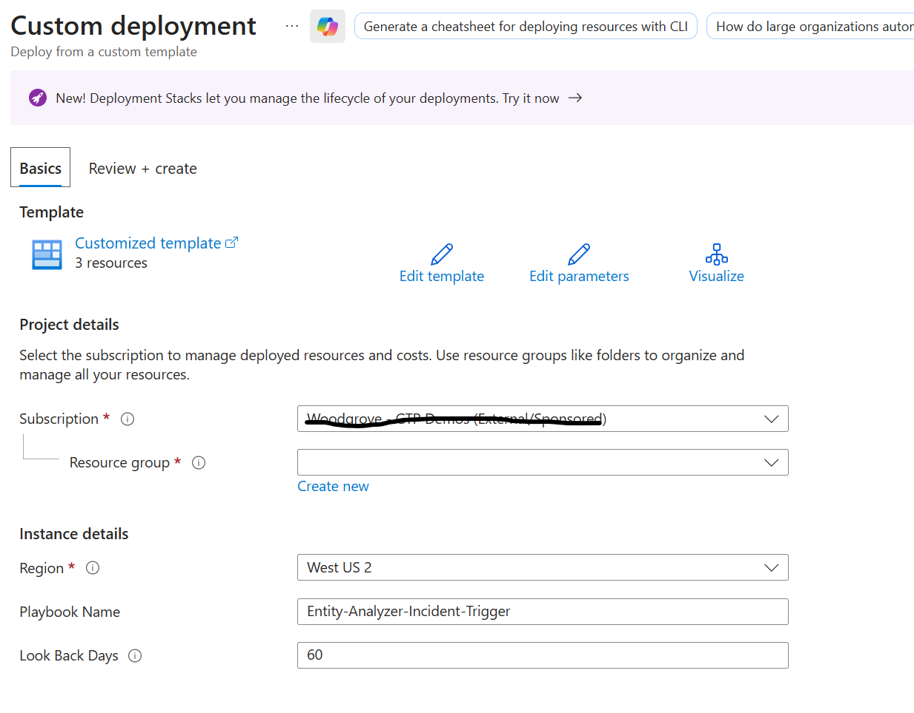
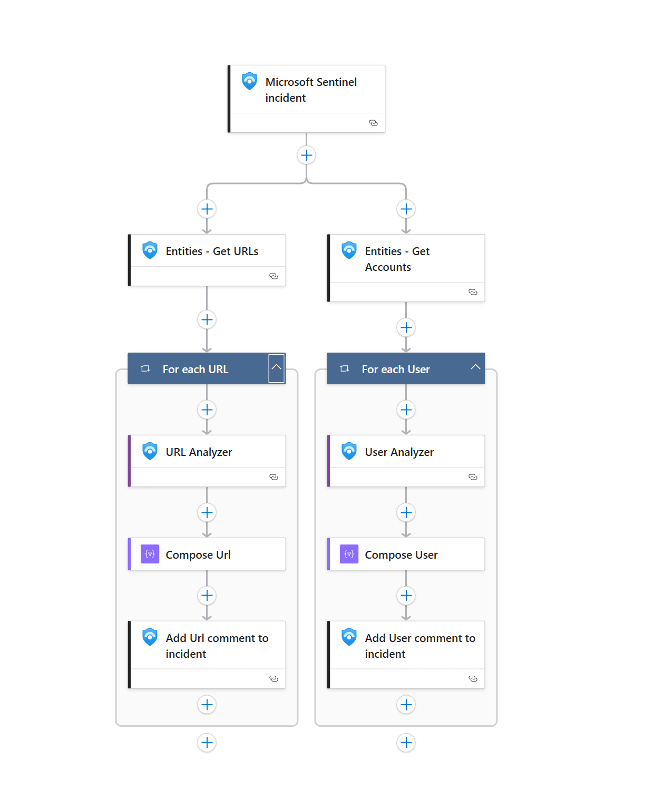

# Multi-Entity Analyzer - Microsoft Sentinel Playbook

Activating the 'Deploy' button initiates the deployment of an Azure Logic App integrated with Microsoft Sentinel MCP Actions, utilizing a Microsoft Sentinel incident trigger.
The Logic App is configured to run when a new incident is created in Sentinel. This Logic App automatically analyzes all URL and User entities within the incident and provides detailed security insights including classification, analysis results, and recommendations for each entity type.



The playbook automatically triggers when:
- A new incident is created in Microsoft Sentinel
- The incident contains URL entities that need security analysis
- The incident contains User/Account entities that require behavioral analysis
- Security analysts need comprehensive automated analysis of multiple entity types

After the analysis is complete, the MCP Entity Analyzer conducts a comprehensive investigation of each entity type and automatically adds detailed comments to the incident with:
- **URL Analysis**: Security classification, threat intelligence, and URL reputation analysis
- **User Analysis**: Behavioral analysis, risk assessment, and user activity patterns
- **Classification**: Security classification for each entity
- **Analysis Results**: Detailed security analysis findings for each entity
- **Recommendations**: Security recommendations based on the analysis
- **Disclaimer**: AI-generated analysis disclaimer

### Prerequisites

Prior to beginning the installation process, it's crucial to confirm that you have met the following prerequisites:
- The user deploying this Logic App needs to have a **Contributor Role**
- The user has permissions to access **Microsoft Sentinel** workspace
- The **SentinelMCP connector** is available in your environment
- The Logic App will automatically use the workspace ID from the incident trigger

### Parameters

During deployment, you'll need to provide:
- **PlaybookName**: Name for the Logic App (default: "Entity-Analyzer-Incident-Trigger")
- **lookBackDays**: Number of days to look back for entity analysis (default: 60 days)

### Deployment 

To deploy the Multi-Entity Analyzer Logic App:
1. Press on the Deploy button below
2. Select your subscription and resource group (use the same tenant where Microsoft Sentinel is configured)
3. Configure the lookBackDays parameter if needed (default is 60 days)
4. The workspace ID will be automatically retrieved from the incident


[](https://portal.azure.com/#create/Microsoft.Template/uri/https%3A%2F%2Fraw.githubusercontent.com%2FAzure%2FAzure-Sentinel%2Fmaster%2FSolutions%2FSentinelSOARessentials%2FPlaybooks%2FIncident-Trigger-Entity-Analyzer%2Fazuredeploy.json)
[](https://portal.azure.us/#create/Microsoft.Template/uri/https%3A%2F%2Fraw.githubusercontent.com%2FAzure%2FAzure-Sentinel%2Fmaster%2FSolutions%2FSentinelSOARessentials%2FPlaybooks%2FIncident-Trigger-Entity-Analyzer%2Fazuredeploy.json)


### Post Deployment

After successful deployment:
- The Logic App will be automatically enabled and ready to use
- **Authenticate the connections**: Go to the Logic App → API connections and authenticate:
  - **Microsoft Sentinel connection**: Authenticate with a user that has Sentinel permissions
  - **SentinelMCP connection**: Authenticate with Microsoft Sentinel MCP permissions
- The playbook will automatically trigger when new incidents are created
- **Manual execution**: You can also run this playbook manually from the incident page
- **Automation Rule**: Consider creating an automation rule to run this playbook automatically on specific incident types



### How It Works

1. **Trigger**: The Logic App triggers when a new incident is created in Microsoft Sentinel
2. **Entity Extraction**: The playbook extracts all URL and User entities from the incident
3. **Parallel Analysis**: 
   - **URLs**: Each URL is analyzed for security threats, reputation, and classification
   - **Users**: Each user account is analyzed for behavioral patterns and risk assessment
4. **Processing**: The analysis results are formatted with emojis and proper formatting
5. **Output**: Separate detailed comments are added to the incident for each analyzed entity:
   - One comment per URL entity analyzed
   - One comment per User entity analyzed

### Sample Output

The playbook generates formatted comments in the incident for each entity type:

**URL Analysis Output:**
```
🔗 URL Analysis for: https://example.com

🏷️ Classification
Malicious/Suspicious/Benign

🔍 Analysis Result
Detailed security findings and threat intelligence

✅ Recommendation
Security recommendations and next steps

⚠️ Disclaimer
🤖 AI-generated analysis notice
```

**User Analysis Output:**
```
👤 User Analysis for: john.doe@company.com

🏷️ Classification
High Risk/Medium Risk/Low Risk

🔍 Analysis Result
Behavioral analysis and activity patterns

✅ Recommendation
User security recommendations

⚠️ Disclaimer
🤖 AI-generated analysis notice
```

### Use Cases

This playbook is ideal for:
- **Automated Incident Enrichment**: Automatically analyze all entities when incidents are created
- **Phishing Investigations**: Analyze suspicious URLs and affected users simultaneously
- **Insider Threat Detection**: Comprehensive user behavior analysis
- **Malware Investigations**: URL reputation analysis combined with user impact assessment
- **Security Operations Center (SOC)**: Reduce manual analysis time and improve response speed

### Automation Integration

- **Manual Execution**: Run from the incident page when needed
- **Automation Rules**: Create rules to trigger automatically based on:
  - Incident severity levels
  - Specific incident types (phishing, malware, etc.)
  - Entity count thresholds
  - Specific alert sources

### Troubleshooting

- Ensure both API connections are properly authenticated
- Verify the SentinelMCP connector is available in your region
- Check that Microsoft Sentinel MCP is enabled and accessible
- Review the Logic App run history for any failed executions
- Verify the incident contains valid URL or User entities
- Confirm the lookBackDays parameter matches your data retention policy